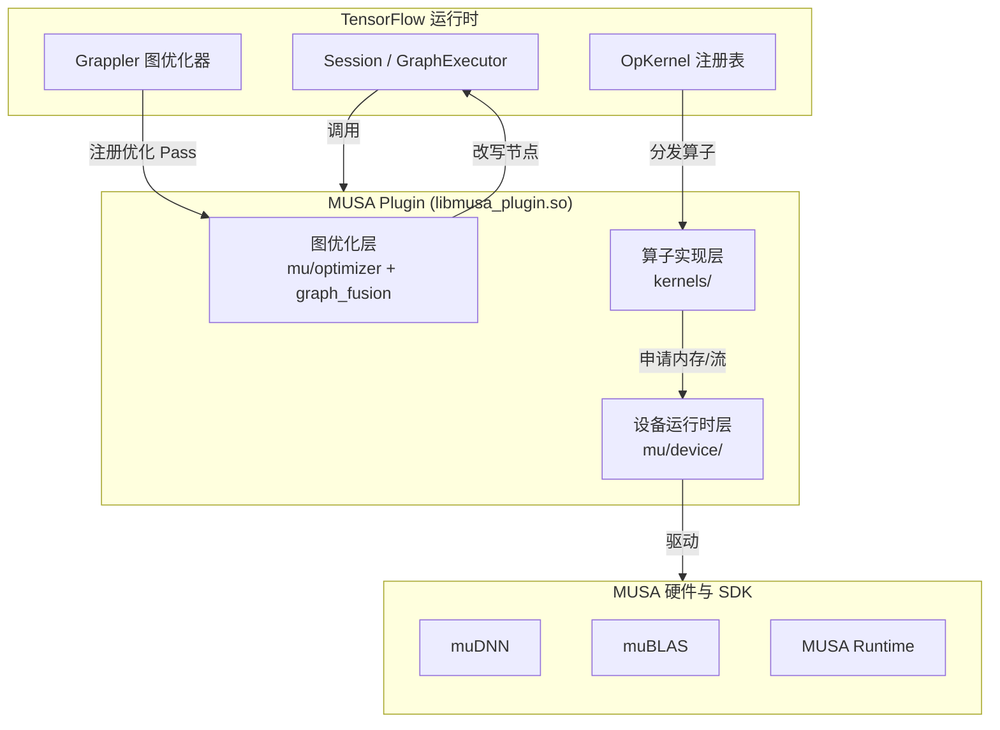

本文档面向初次接触 TensorFlow MUSA Extension 的开发者，帮助你建立对项目的整体认知：它是什么、为什么以这种方式组织、以及各模块之间如何协作。理解这些宏观概念后，再深入具体源码会更加顺畅。

Sources: [README.md](README.md#L1-L34)

## 项目定位：TensorFlow 的 MUSA 硬件插件

TensorFlow MUSA Extension 并非 TensorFlow 源码的分支，而是一个**独立的动态链接库插件**（`libmusa_plugin.so`）。它通过 TensorFlow 公开的插件化接口，将摩尔线程（Moore Threads）MUSA GPU 的计算能力注入到标准 TensorFlow 运行时中。这种设计意味着你无需修改 TensorFlow 源码或重新编译 TensorFlow，只需在 Python 中执行 `tf.load_library("./build/libmusa_plugin.so")`，即可让现有的 TensorFlow 脚本透明地运行在 MUSA GPU 上。插件的加载过程会自动完成设备发现、算子注册和图优化器挂载，对用户代码完全无侵入。

Sources: [README.md](README.md#L56-L69), [device_register.cc](musa_ext/mu/device_register.cc#L82-L106)

## 架构总览：三层协作模型

整个插件从逻辑上可分为三个紧密协作的层次：**设备运行时层**负责与硬件和 TensorFlow 核心对接；**算子实现层**提供具体计算逻辑；**图优化层**则在执行前对计算图进行变换和融合。这三个层次分别对应了 TensorFlow 对外暴露的三类插件接口：Stream Executor C API、OpKernel C API 和 Grappler Custom Graph Optimizer 接口。

下图展示了插件在 TensorFlow 运行时中的位置以及内部三层架构：



**设备运行时层**（`musa_ext/mu/device/`）是整个插件的地基。它通过 `MusaDeviceFactory` 向 TensorFlow 注册名为 `"MUSA"` 的设备类型，并为每个物理 GPU 创建对应的 `MusaDevice` 实例。该层封装了 MUSA 流（stream）管理、内存分配器（BFCAllocator 风格）、事件同步机制以及 `muDNN`/`muBLAS` 句柄的生命周期管理，使得上层算子可以像使用标准 GPU 设备一样进行操作。

Sources: [device_register.cc](musa_ext/mu/device_register.cc#L21-L85), [musa_device.h](musa_ext/mu/device/musa_device.h#L83-L127)

**算子实现层**（`musa_ext/kernels/`）包含约 150 余个算子的实现，采用 `.cc` + `.mu` 的双文件模式。`.cc` 文件中是标准的 TensorFlow `OpKernel` 子类，负责输入校验、输出形状推断以及调用 `.mu` 内核或 muDNN 原语；`.mu` 文件则使用 MUSA 编译器 `mcc` 编译为设备目标码，直接在 GPU 上执行高性能计算。这种分层让不熟悉 GPU 编程的开发者也能先读懂 `.cc` 中的主机侧逻辑，再逐步深入到 `.mu` 的核函数实现。

Sources: [utils_op.h](musa_ext/kernels/utils_op.h#L88-L96), [musa_add_op.cc](musa_ext/kernels/math/musa_add_op.cc#L13-L220)

**图优化层**（`musa_ext/mu/optimizer/` 与 `musa_ext/mu/graph_fusion/`）挂载到 TensorFlow 的 Grappler 框架中，在图执行前对静态计算图进行改写。它既包含 Layout 转换、自动混合精度（AMP）等通用优化，也包含十余种面向 MUSA 硬件特性的算子融合模式，例如 `LayerNorm + GELU` 融合、`MatMul + BiasAdd` 融合等。融合后的复合算子会映射到 `kernels/` 中专门实现的融合内核，从而显著减少内核启动开销和访存带宽压力。

Sources: [musa_graph_optimizer.cc](musa_ext/mu/optimizer/musa_graph_optimizer.cc#L42-L130)

## 项目目录结构解析

以下是核心源码与测试的目录布局，建议结合上文的架构分层对应阅读：

```
tensorflow_musa_extension/
├── CMakeLists.txt              # CMake 构建配置
├── build.sh                    # 一键构建脚本
├── musa_ext/                   # 核心源码
│   ├── kernels/                # 算子实现层
│   │   ├── array/              # 数组操作算子
│   │   ├── control_flow/       # 控制流算子
│   │   ├── io/                 # IO 相关算子
│   │   ├── math/               # 数学运算算子
│   │   ├── nn/                 # 神经网络算子
│   │   ├── random/             # 随机数算子
│   │   ├── state/              # 状态/变量算子
│   │   ├── string/             # 字符串算子
│   │   ├── training/           # 训练优化器算子
│   │   ├── utils_op.h          # 算子公共基类与工具宏
│   │   └── utils_op.cc
│   ├── mu/                     # MUSA 设备与优化器
│   │   ├── device/             # 设备运行时层
│   │   ├── device_register.*   # 设备注册入口
│   │   ├── kernel_register.*   # 算子注册入口
│   │   ├── graph_fusion/       # 融合模式实现
│   │   └── optimizer/          # Grappler 优化器入口
│   └── utils/                  # 公共工具
├── test/                       # 测试套件
│   ├── musa_test_utils.py      # 测试基类（自动加载插件）
│   ├── test_runner.py          # 测试运行器
│   ├── ops/                    # 单算子功能测试
│   └── fusion/                 # 端到端融合测试
└── docs/                       # 调试与诊断文档
    └── DEBUG_GUIDE.md
```

Sources: [README.md](README.md#L16-L34)

## 核心组件职责对照

为便于快速索引，下表汇总了各核心文件/目录的职责：

| 组件路径 | 所属层次 | 核心职责 |
|---------|---------|---------|
| `musa_ext/mu/device_register.cc` | 设备运行时层 | 向 TensorFlow 注册 `"MUSA"` 设备工厂，实现插件加载时的初始化与卸载时的清理 |
| `musa_ext/mu/kernel_register.cc` | 算子实现层 | 收集所有 `MUSA_KERNEL_REGISTER` 宏注册的算子入口，在 `TF_InitKernel()` 时统一注册到 TensorFlow |
| `musa_ext/mu/device/` | 设备运行时层 | 流管理、内存分配（BFCAllocator）、事件同步、muDNN/muBLAS 句柄、遥测系统 |
| `musa_ext/kernels/` | 算子实现层 | 各算子的 `OpKernel` 实现与 `.mu` 设备内核，按功能分为 9 个子目录 |
| `musa_ext/mu/optimizer/` | 图优化层 | Grappler 自定义优化器主入口，协调 AMP、Layout 优化及 MUSA 专属图改写 |
| `musa_ext/mu/graph_fusion/` | 图优化层 | 十余种算子融合模式的匹配逻辑与图替换实现 |
| `test/musa_test_utils.py` | 测试保障层 | 提供 `MUSATestCase` 基类，自动完成 `libmusa_plugin.so` 加载并支持 CPU/MUSA 结果对比 |
| `test/test_runner.py` | 测试保障层 | 彩色进度条测试运行器，支持算子测试、融合测试的单文件/批量执行 |

Sources: [kernel_register.h](musa_ext/mu/kernel_register.h#L51-L56), [musa_test_utils.py](test/musa_test_utils.py#L36-L95), [test_runner.py](test/test_runner.py#L75-L123)

## 构建产物与集成方式

插件采用 CMake 构建系统，通过 `build.sh` 一键编译。构建产物为单个共享库 `build/libmusa_plugin.so`，其内部包含三个独立注册的入口点：

1. **Stream Executor 插件入口**（`SE_InitPlugin`）：由 TensorFlow 在查询平台时加载，负责创建 MUSA StreamExecutor 实例。
2. **OpKernel 插件入口**（`TF_InitKernel`）：由 TensorFlow 在加载 `.so` 时调用，批量注册所有 MUSA 算子内核。
3. **Grappler 优化器注册**：通过 `CustomGraphOptimizerRegistry` 自动注册，无需显式入口函数。

这种“单文件、多入口”的设计简化了部署流程，开发者只需确保 `.so` 文件路径正确，一次加载即可激活全部功能。

Sources: [CMakeLists.txt](CMakeLists.txt#L153-L174), [build.sh](build.sh#L15-L82)

## 阅读路径建议

作为初学者，建议按照以下顺序深入本项目，对应 Wiki 目录如下：

1. 先完成环境准备与首次编译：[环境依赖与前置准备](3-huan-jing-yi-lai-yu-qian-zhi-zhun-bei) → [构建系统与编译流程](4-gou-jian-xi-tong-yu-bian-yi-liu-cheng)
2. 理解设备如何接入 TensorFlow：[Stream Executor 与设备注册机制](5-stream-executor-yu-she-bei-zhu-ce-ji-zhi)
3. 学习算子注册的整体流程：[Kernel 注册与算子分发流程](7-kernel-zhu-ce-yu-suan-zi-fen-fa-liu-cheng)
4. 挑选一个简单算子（如 `Add`）精读源码：[基础数学与数组算子](8-ji-chu-shu-xue-yu-shu-zu-suan-zi)
5. 了解图优化如何提升性能：[Grappler 图优化器架构](13-grappler-tu-you-hua-qi-jia-gou) → [算子融合模式详解](14-suan-zi-rong-he-mo-shi-xiang-jie)
6. 运行测试并学习调试工具：[测试框架与工具类](20-ce-shi-kuang-jia-yu-gong-ju-lei) → [调试环境变量速查](19-diao-shi-huan-jing-bian-liang-su-cha)