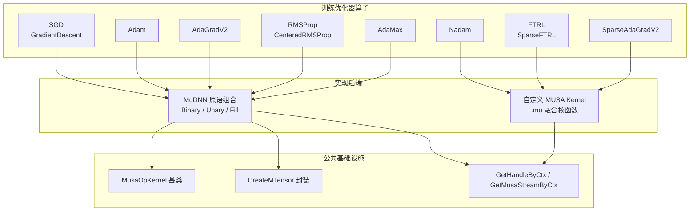
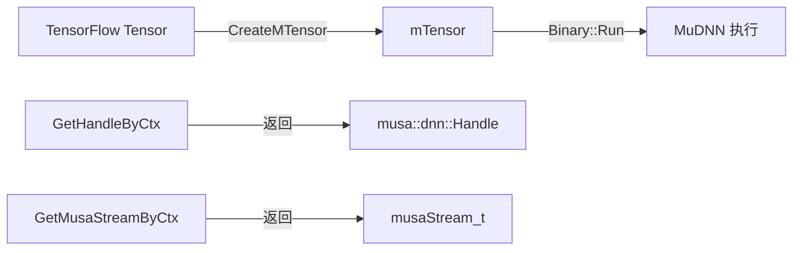

训练优化器算子是深度学习框架在反向传播阶段对模型参数执行更新的核心算子集合。在 TensorFlow MUSA 插件中，这些算子通过两种互补的技术路径实现：**MuDNN 原语组合**与**自定义 MUSA Kernel 融合**。本文档面向已有 TensorFlow 算子开发经验的中级开发者，系统阐述训练优化器算子的架构设计、实现模式、精度控制策略以及测试方法论，帮助读者理解如何在 MUSA 硬件上高效、正确地实现参数更新逻辑。

Sources: [musa_applyadam_op.cc](musa_ext/kernels/training/musa_applyadam_op.cc#L1-L572), [musa_apply_ftrl_kernel.mu](musa_ext/kernels/training/musa_apply_ftrl_kernel.mu#L1-L194)

## 算子全景与架构定位

本项目当前共实现了 **8 类训练优化器**、覆盖 **14 个 TensorFlow 算子**，分为密集更新（dense）与稀疏更新（sparse）两种场景。所有算子均注册到 `DEVICE_MTGPU`（即 MUSA 设备），并同时支持 Resource Variable（推荐）与 Ref Variable（兼容）两种变量形态。下图展示了训练优化器算子在整个 MUSA 插件中的层级位置及其与周边模块的依赖关系。



从架构上看，SGD、Adam、AdaGrad、RMSProp 与 AdaMax 选择 **MuDNN 原语组合**路径，将数学公式拆解为若干独立的 `musa::dnn::Binary`（加减乘除）、`musa::dnn::Unary`（SQRT、ABS）和 `musa::dnn::Fill`（标量广播）操作，按顺序提交到 MuDNN Handle 执行。Nadam、FTRL 以及稀疏 AdaGrad 则采用 **自定义 MUSA Kernel** 路径，将整个参数更新公式融合为单个 GPU Grid-Stride 核函数，以减少中间内存分配与 Kernel Launch 开销。

Sources: [musa_applyadam_op.cc](musa_ext/kernels/training/musa_applyadam_op.cc#L1-L572), [musa_resource_apply_nadam_kernel.mu](musa_ext/kernels/training/musa_resource_apply_nadam_kernel.mu#L1-L109)

## 实现策略对比：MuDNN 原语 vs 自定义 Kernel

两种实现策略各有其适用边界与权衡取舍。MuDNN 路径复用成熟的深度学习原语库，开发周期短且兼容性好，但会产生大量临时张量分配与同步点；自定义 Kernel 路径则通过手写的 `.mu` 文件直接操作 MUSA 线程模型，实现算子融合与精度精细控制，适合公式复杂或需要稀疏索引的场景。

| 维度 | MuDNN 原语组合 | 自定义 MUSA Kernel |
|---|---|---|
| **代表算子** | Adam、AdaGrad、RMSProp、SGD、AdaMax | Nadam、FTRL、SparseAdaGradV2、SparseFTRL |
| **开发效率** | 高，直接调用 Binary/Unary/Fill | 低，需手写 CUDA-like 核函数 |
| **内存开销** | 高，每步产生 3~10 个临时 Tensor | 低，仅输入输出张量 |
| **Kernel Launch** | 多次（每步公式一个 Launch） | 单次（整个更新一核到底） |
| **精度控制** | 受限于 MuDNN 内部实现 | 完全可控，可在核内使用 float32 累加 |
| **稀疏索引** | 难以直接表达 | 天然支持，通过 indices 数组直接寻址 |
| **数据类型支持** | float、double、half、bfloat16、int32、int64 | float、half、bfloat16、double |

**Adam** 是 MuDNN 原语路径的典型代表。其更新公式包含 6 个主要步骤，每一步都对应一个独立的 MuDNN 操作：先分别对一阶矩 `m` 和二阶矩 `v` 做指数移动平均，再计算偏差修正学习率 `alpha`，最后执行除法、乘法和减法完成参数更新。整个过程在 `musa_applyadam_op.cc` 中通过 `std::list<Tensor> temp_storage` 管理临时张量生命周期，并在末尾调用 `musaStreamSynchronize` 确保所有异步操作完成。

Sources: [musa_applyadam_op.cc](musa_ext/kernels/training/musa_applyadam_op.cc#L156-L380)

**Nadam** 则是自定义 Kernel 路径的典范。其核函数 `ResourceApplyNadamKernel` 被定义在 `musa_resource_apply_nadam_kernel.mu` 中，每个线程按 `blockIdx.x * blockDim.x + threadIdx.x` 的 Grid-Stride 模式遍历张量元素，在寄存器内完成从 `LoadFloat` 到 `StoreFloat` 的完整更新闭环。由于所有计算都在单个核函数内完成，避免了 Adam 实现中频繁的全局内存往返与临时张量分配。

Sources: [musa_resource_apply_nadam_kernel.mu](musa_ext/kernels/training/musa_resource_apply_nadam_kernel.mu#L32-L83)

## 算子实现目录与数学公式

下表汇总了当前项目中所有训练优化器算子的实现文件、更新公式、支持的数据类型以及变量形态。

| 算子名称 | 实现文件 | 核心更新公式 | 支持类型 | 变量形态 |
|---|---|---|---|---|
| **ResourceApplyGradientDescent** | [musa_applygradientdescent_op.cc](musa_ext/kernels/training/musa_applygradientdescent_op.cc) | `var = var - lr * grad` | float, half, bfloat16 | Resource + Ref |
| **ResourceApplyAdam** | [musa_applyadam_op.cc](musa_ext/kernels/training/musa_applyadam_op.cc) | `m = β₁·m + (1-β₁)·g`<br>`v = β₂·v + (1-β₂)·g²`<br>`var = var - α·m/(√v+ε)` | float, double, half, bfloat16, int32, int64 | Resource + Ref |
| **ResourceApplyAdagradV2** | [musa_applyadagrad_op.cc](musa_ext/kernels/training/musa_applyadagrad_op.cc) | `accum = accum + g²`<br>`var = var - lr·g/(√accum+ε)` | float, double, half, bfloat16 | Resource |
| **ResourceApplyRMSProp** | [musa_applyrmsprop_op.cc](musa_ext/kernels/training/musa_applyrmsprop_op.cc) | `ms = ρ·ms + (1-ρ)·g²`<br>`mom = momentum·mom + lr·g/√(ms+ε)`<br>`var = var - mom` | float, double, half, bfloat16, int32, int64 | Resource + Ref |
| **ResourceApplyCenteredRMSProp** | [musa_applyrmsprop_op.cc](musa_ext/kernels/training/musa_applyrmsprop_op.cc#L445-L887) | `mg = ρ·mg + (1-ρ)·g`<br>`ms = ρ·ms + (1-ρ)·g²`<br>`mom = momentum·mom + lr·g/√(ms-mg²+ε)`<br>`var = var - mom` | float, double, half, bfloat16, int32, int64 | Resource + Ref |
| **ResourceApplyAdaMax** | [musa_applyadamax_op.cc](musa_ext/kernels/training/musa_applyadamax_op.cc) | `m = β₁·m + (1-β₁)·g`<br>`v = max(β₂·v, \|g\|)`<br>`var = var - lr·m/(v+ε)` | float, double, half, bfloat16, int32, int64 | Resource + Ref |
| **ResourceApplyNadam** | [musa_resource_apply_nadam_op.cc](musa_ext/kernels/training/musa_resource_apply_nadam_op.cc) + [musa_resource_apply_nadam_kernel.mu](musa_ext/kernels/training/musa_resource_apply_nadam_kernel.mu) | `m = β₁·m + (1-β₁)·g`<br>`v = β₂·v + (1-β₂)·g²`<br>`m̂ = (β₁·m + (1-β₁)·g)/(1-β₁ᵗ)`<br>`v̂ = v/(1-β₂ᵗ)`<br>`var = var - lr·m̂/(√v̂+ε)` | float, double, half, bfloat16 | Resource |
| **ResourceApplyFtrl** | [musa_apply_ftrl_op.cc](musa_ext/kernels/training/musa_apply_ftrl_op.cc) + [musa_apply_ftrl_kernel.mu](musa_ext/kernels/training/musa_apply_ftrl_kernel.mu) | FTRL-Proximal 原始论文公式 | float, half, bfloat16 | Resource + Ref |
| **ResourceSparseApplyFtrl** | [musa_apply_ftrl_op.cc](musa_ext/kernels/training/musa_apply_ftrl_op.cc#L150-L301) + [musa_apply_ftrl_kernel.mu](musa_ext/kernels/training/musa_apply_ftrl_kernel.mu#L88-L141) | 稀疏版 FTRL，仅更新 `indices` 指定行 | float, half, bfloat16 | Resource + Ref |
| **ResourceSparseApplyAdagradV2** | [musa_resource_sparse_apply_ada_grad_op.cc](musa_ext/kernels/training/musa_resource_sparse_apply_ada_grad_op.cc) + [musa_resource_sparse_apply_ada_grad_kernel.mu](musa_ext/kernels/training/musa_resource_sparse_apply_ada_grad_kernel.mu) | 稀疏版 AdaGrad，仅更新 `indices` 指定行 | float, half, bfloat16 | Resource |

Sources: [musa_applyadam_op.cc](musa_ext/kernels/training/musa_applyadam_op.cc#L460-L572), [musa_applyrmsprop_op.cc](musa_ext/kernels/training/musa_applyrmsprop_op.cc#L1-L887), [musa_apply_ftrl_op.cc](musa_ext/kernels/training/musa_apply_ftrl_op.cc#L1-L301)

## 公共基础设施与编码模式

所有训练优化器算子共享同一套基础设施，理解这些公共模式是进行二次开发的前提。

### MusaOpKernel 基类与 Tensor 封装

每个优化器算子都继承自 `MusaOpKernel`，后者在构造时通过 `GetMusaFormat` 获取张量格式（通常是 NCHW 或 NHWC），并将其保存到成员变量 `format_` 中。算子通过 `CreateMTensor` 将 TensorFlow 的 `Tensor` 对象封装为 MuDNN 的 `mTensor` 对象，从而与 MuDNN 原语对接。



Sources: [utils_op.h](musa_ext/kernels/utils_op.h#L95-L143)

### 资源变量查找与互斥锁排序

对于 Resource Variable 版本，算子首先需要调用 `LookupResource` 根据输入的 `resource` handle 查找 `Var` 对象。当算子涉及多个变量（如 Adam 的 `var`、`m`、`v`）时，必须按照 **mutex 指针地址的全序关系**加锁，以防止多线程场景下的死锁。`MutexUnlocker` 是一个轻量的 RAII 包装器，在析构时自动释放锁。

```cpp
std::vector<mutex*> mutexes;
add_mutex(var->mu());
add_mutex(m->mu());
add_mutex(v->mu());
std::sort(mutexes.begin(), mutexes.end());
for (mutex* mu : mutexes) { mu->lock(); }
std::vector<MutexUnlocker> locks;
for (mutex* mu : mutexes) { locks.emplace_back(mu); }
```

Sources: [musa_applyadam_op.cc](musa_ext/kernels/training/musa_applyadam_op.cc#L69-L95)

### Copy-on-Read 与数据一致性

TensorFlow 的 Resource Variable 支持 Copy-on-Read 语义：当某个张量被多个引用共享时，写操作需要先复制一份独占副本。`PrepareTensorForMusaUpdate` 函数负责检查变量的引用计数和 Copy-on-Read 标志，必要时通过 `musaMemcpyAsync` 在设备端创建可安全修改的副本。所有密集更新的 MuDNN 路径算子都会在 Compute 开始时调用此辅助函数。

Sources: [musa_applyadam_op.cc](musa_ext/kernels/training/musa_applyadam_op.cc#L33-L52)

## 精度控制与低精度训练

训练优化器算子对数值精度极为敏感，尤其是涉及到平方、开方和除法的 AdaGrad、RMSProp、Adam 系列。本项目在低精度类型（`Eigen::half`、`bfloat16`）的处理上采用了两种互补策略。

### MuDNN 路径的标量填充精度

在 MuDNN 路径中，超参数（如学习率 `lr`、衰减系数 `beta1`）需要从 Host 内存广播为 Device 张量。`fill_scalar` Lambda 使用 `musa::dnn::Fill` 原语完成广播。对于 Adam 的 `ResourceApplyAdam`，`fill_scalar` 内部调用 `MusaFillCall`，该函数将标量值以 `double` 类型传入 `SetValue`，从而保证 `float64` 场景的精度不被截断；而 `ApplyAdam`（非 Resource 版本）则使用 `static_cast<float>`，这也是其未注册 `double` 类型的原因之一。

Sources: [musa_applyadam_op.cc](musa_ext/kernels/training/musa_applyadam_op.cc#L140-L150), [musa_applyadam_op.cc](musa_ext/kernels/training/musa_applyadam_op.cc#L400-L410)

### 自定义 Kernel 路径的寄存器内累加

在 `.mu` 自定义核函数中，无论存储类型是 `float`、`half` 还是 `bfloat16`，所有中间计算都在 `float`（或 `double`）寄存器中完成。以 Nadam 核函数为例，它通过一对 `LoadFloat` / `StoreFloat` 内联函数将低精度数据加载为 `float`，完成全套 Adam 变体计算后再写回原始精度。这种模式有效抑制了混合精度训练中的梯度下溢和更新抖动。

```cpp
float grad_val = LoadFloat(&grad[tid]);
float m_val    = LoadFloat(&m[tid]);
// ... 全部在 float 寄存器中计算
StoreFloat(&var[tid], var_val);
```

FTRL 与 Sparse AdaGrad 的 `.mu` 实现也遵循同一套 `LoadFloat` / `StoreFloat` 模板特化范式，通过 `__half2float` / `__float2half` 以及 `uint16_t` 位运算分别处理 `half` 与 `bfloat16`。

Sources: [musa_resource_apply_nadam_kernel.mu](musa_ext/kernels/training/musa_resource_apply_nadam_kernel.mu#L18-L52), [musa_apply_ftrl_kernel.mu](musa_ext/kernels/training/musa_apply_ftrl_kernel.mu#L18-L52)

## 稀疏更新算子的索引策略

稀疏训练场景（如大规模 Embedding 表训练）只更新部分参数行，而非全量张量。`ResourceSparseApplyAdagradV2` 与 `ResourceSparseApplyFtrl` 通过 `indices` 数组指定待更新的行索引。其自定义核函数采用二维线程映射：`tid / inner_size` 决定处理哪一个索引，`tid % inner_size` 决定处理该行内的哪一个元素。核函数内部通过 `var_offset = idx * inner_size + inner_idx` 将逻辑索引映射到物理内存地址。

```cpp
const int64_t inner_idx   = tid % inner_size;
const int64_t indices_idx = tid / inner_size;
const IndexT  idx         = indices[indices_idx];
const int64_t var_offset  = (int64_t)idx * inner_size + inner_idx;
```

目前稀疏算子的实现未对重复索引做原子累加处理，注释中明确说明出于简化考虑暂时忽略该边界情况。如果在实际训练中出现重复索引，调用方应确保梯度已在外部完成聚合。

Sources: [musa_resource_sparse_apply_ada_grad_kernel.mu](musa_ext/kernels/training/musa_resource_sparse_apply_ada_grad_kernel.mu#L42-L62), [musa_resource_sparse_apply_ada_grad_op.cc](musa_ext/kernels/training/musa_resource_sparse_apply_ada_grad_op.cc#L95-L102)

## 测试框架与数值验证

训练优化器算子的测试策略以 **CPU 参考值对比**为核心，覆盖多数据类型、多张量形状以及多步迭代场景。所有测试文件位于 `test/ops/` 目录下，统一继承 `MUSATestCase`（或 `tf.test.TestCase`），在 graph mode 下分别向 `/CPU:0` 和 `/device:MUSA:0` 提交相同输入，然后使用 `assertAllClose` 比较输出。

### 测试结构模式

典型的优化器测试遵循以下固定模式：

1. **NumPy 基准实现**：在 Python 侧用 NumPy 重写完整更新公式，作为黄金参考。
2. **Graph 构建**：为 CPU 和 MUSA 分别创建独立的 `tf.Graph`，使用 `tf.device` 限定设备。
3. **超参数 Host 放置**：标量超参数（`lr`、`epsilon`、`beta1` 等）显式放置到 `/CPU:0`，避免不必要的 Device-to-Host 拷贝。
4. **数值容差分级**：
   - `float32` / `float64`：`rtol=1e-5, atol=1e-8`
   - `float16` / `bfloat16`：`rtol=1e-2, atol=1e-2`
   - `float64`：`rtol=1e-10, atol=1e-12`

### 关键测试用例

| 测试文件 | 验证重点 |
|---|---|
| [apply_gradient_descent_op_test.py](test/ops/apply_gradient_descent_op_test.py) | SGD 基础更新、`use_locking`、1D/2D 张量 |
| [apply_adagrad_op_test.py](test/ops/apply_adagrad_op_test.py) | AdaGradV2 多 dtype、大规模张量、零学习率边界 |
| [apply_rmsprop_op_test.py](test/ops/apply_rmsprop_op_test.py) | RMSProp 与 CenteredRMSProp 多步迭代、2D/大尺度 |
| [apply_adamax_op_test.py](test/ops/apply_adamax_op_test.py) | AdaMax 多 dtype、内存探测、隔离进程执行 |
| [resource_apply_nadam_op_test.py](test/ops/resource_apply_nadam_op_test.py) | Nadam 自定义 Kernel、float16/double 精度 |
| [resource_apply_ftrl_op_test.py](test/ops/resource_apply_ftrl_op_test.py) | FTRL dense + sparse、 shrinkage 变体 |

Sources: [apply_adagrad_op_test.py](test/ops/apply_adagrad_op_test.py#L1-L338), [apply_rmsprop_op_test.py](test/ops/apply_rmsprop_op_test.py#L1-L351), [resource_apply_nadam_op_test.py](test/ops/resource_apply_nadam_op_test.py#L1-L130)

## 开发注意事项与常见陷阱

在新增或修改训练优化器算子时，需特别注意以下几点：

**避免 muDNN double 类型限制**：`musa::dnn::Binary` 的 MUL、SUB、DIV 等模式在部分 MuDNN 版本中不支持 `DOUBLE` 类型。`ApplyGradientDescent` 的注释明确指出了这一点，并主动跳过 `double` 注册，让 TensorFlow 回退到 CPU 实现。如果你的算子需要支持 `float64`，建议优先考虑自定义 Kernel 路径。

**偏差修正的除零保护**：Adam 与 Nadam 在初始迭代时 `beta1_power ≈ 1.0`，直接使用 `1 - beta1_power` 做除法会导致数值爆炸。代码中通过 `std::abs(one_minus_beta1_power) < 1e-10` 检测该边界，并回退到使用原始学习率 `lr` 作为 `alpha_val`。

**临时张量生命周期管理**：MuDNN 路径使用 `std::list<Tensor> temp_storage` 保存中间结果。由于 `mTensor` 只是对底层 `Tensor` 的视图，必须保证 `Tensor` 对象在 `musaStreamSynchronize` 之前不被释放。`std::list` 的节点稳定性恰好满足这一需求。

**同步策略**：所有训练算子都在 `Compute` 末尾显式调用 `musaStreamSynchronize`。这是因为优化器更新通常是训练迭代中的最后一步，后续计算（如下一轮前向传播）依赖更新后的参数值，隐式同步不足以保证数据可见性。

Sources: [musa_applygradientdescent_op.cc](musa_ext/kernels/training/musa_applygradientdescent_op.cc#L1-L247), [musa_applyadam_op.cc](musa_ext/kernels/training/musa_applyadam_op.cc#L136-L145), [musa_applyrmsprop_op.cc](musa_ext/kernels/training/musa_applyrmsprop_op.cc#L340-L350)

## 延伸阅读

训练优化器算子是 MUSA 插件算子实现体系的重要分支。如果你希望深入理解其底层的 Kernel 注册与分发机制，建议阅读 [Kernel 注册与算子分发流程](7-kernel-zhu-ce-yu-suan-zi-fen-fa-liu-cheng)；若计划实现全新的自定义优化器，[自定义 MUSA Kernel 开发指南](12-zi-ding-yi-musa-kernel-kai-fa-zhi-nan) 提供了 `.mu` 文件编写、模板特化以及注册宏的完整规范。对于关注端到端性能的用户，[算子融合模式详解](14-suan-zi-rong-he-mo-shi-xiang-jie) 解释了 Grappler 如何在图级别将优化器相关的 element-wise 操作进一步融合为更高效的子图。