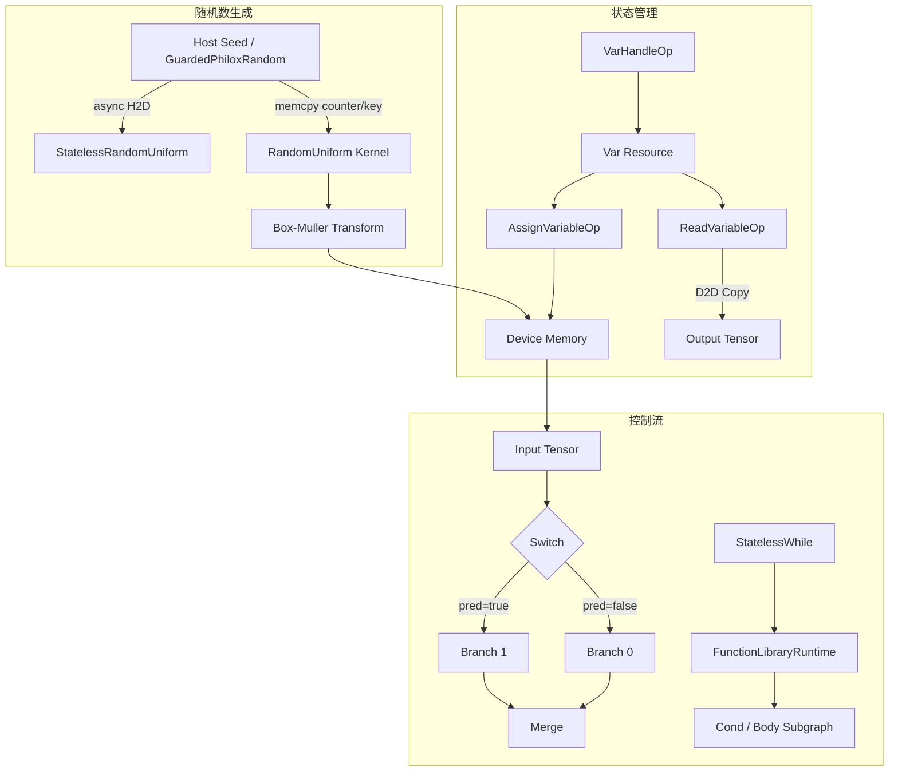

本文档深入解析 TensorFlow MUSA Extension 中三类特殊算子的实现体系：**随机数生成算子**、**状态管理算子**与**控制流算子**。与常规 element-wise 或矩阵运算不同，这三类算子涉及跨迭代的状态维护、设备端随机数序列生成，以及图执行路径的动态选择，是理解 MUSA 后端完整执行模型的关键组成部分。

Sources: [musa_random_ops.cc](musa_ext/kernels/random/musa_random_ops.cc#L1-L275), [musa_resource_variable_op.cc](musa_ext/kernels/state/musa_resource_variable_op.cc#L1-L293), [musa_stateless_while_op.cc](musa_ext/kernels/control_flow/musa_stateless_while_op.cc#L1-L178)

## 随机数生成算子

MUSA 后端实现了完整的随机数生成家族，涵盖均匀分布、正态分布、截断正态分布及整数均匀分布。所有实现均基于 **Philox4×32-10** 计数器模式伪随机数生成器，以保证与 CUDA 后端在相同种子下具备比特级一致的输出能力。

### 双轨架构：有状态与无状态

项目采用**双轨并行**的随机数生成架构，分别对应 TensorFlow 的 `Random*` 与 `StatelessRandom*` 两类 API。

**有状态随机算子**（如 `RandomUniform`、`RandomStandardNormal`）在设备端通过 `GuardedPhiloxRandom` 维护线程安全的种子状态。`Compute` 阶段调用 `ReserveSamples32` 原子性地预留计数器区间，随后将 `PhiloxRandom` 的 key/counter 通过 `std::memcpy` 注入 MUSA Kernel 的 `MusaPhiloxState` 结构，直接在 GPU 上并行生成随机数。该路径完全规避了主机端生成与 H2D 传输开销，适合大批量、高并发的训练场景。

Sources: [musa_random_ops.cc](musa_ext/kernels/random/musa_random_ops.cc#L92-L132), [musa_guarded_philox_random.h](musa_ext/utils/musa_guarded_philox_random.h#L162-L199)

**无状态随机算子**（如 `StatelessRandomUniform`）则采用**主机生成 + 异步拷贝**策略。由于无状态算子每次调用都接受显式种子，不需要维护跨调用的生成器状态，实现上选择在 CPU 端通过 `PhiloxRandom` 顺序生成完整张量，再调用 `MusaMemcpyAsyncH2D` 将结果异步拷贝至 MUSA 设备内存。一个关键的性能优化在于：**显式的 `musaStreamSynchronize` 被移除**，因为 TensorFlow 的流依赖跟踪与回调机制已经能够保证必要的同步点，避免额外的主机阻塞可带来 **30%–60%** 的随机算子吞吐提升。

Sources: [musa_random_op.cc](musa_ext/kernels/random/musa_random_op.cc#L68-L122)

### 设备端 Philox 与分布变换

MUSA Kernel 文件 `musa_random_kernels.mu` 内嵌了完整的 Philox10 轮迭代实现。每个线程通过 `skip_philox` 根据自身全局 ID 跳过对应数量的计数器状态，确保各线程区间无重叠。对于正态分布，Kernel 内部采用 **Box-Muller 变换** 将均匀分布转换为高斯分布：每两个 `uint32` 通过 `radius = sqrt(-2*log(u1))` 与 `theta = 2*pi*u2` 映射为一对独立正态变量。

Sources: [musa_random_kernels.mu](musa_ext/kernels/random/musa_random_kernels.mu#L29-L70), [musa_random_kernels.mu](musa_ext/kernels/random/musa_random_kernels.mu#L125-L152)

### 通用正态核与混合精度支持

`musa_normal_kernel.mu` 提供了更通用的 `PhiloxNormalKernel` 模板，支持 `NormalDistribution` 与 `TruncatedNormalDistribution` 两种分布策略。通过 `StoreFloat` 的一系列模板特化，该 Kernel 统一支持 `float`、`double`、`Eigen::half` 以及 `bfloat16` 四种精度输出。其中 `bfloat16` 通过提取 float32 的高 16 位进行存储，`half` 则直接调用 `__double2half` 完成转换。

Sources: [musa_normal_kernel.mu](musa_ext/kernels/random/musa_normal_kernel.mu#L16-L36), [musa_normal_kernel.mu](musa_ext/kernels/random/musa_normal_kernel.mu#L38-L77)

### 随机算子类型覆盖矩阵

| 算子名称 | 数据类型 | 生成位置 | 核心文件 |
|---|---|---|---|
| `RandomUniform` | float, double | GPU Kernel | [musa_random_ops.cc](musa_ext/kernels/random/musa_random_ops.cc#L95-L132) |
| `RandomUniformInt` | int32, int64 | GPU Kernel | [musa_random_ops.cc](musa_ext/kernels/random/musa_random_ops.cc#L137-L187) |
| `RandomStandardNormal` | float, double | GPU Kernel | [musa_random_ops.cc](musa_ext/kernels/random/musa_random_ops.cc#L192-L236) |
| `StatelessRandomUniform` | float, double | CPU → H2D | [musa_random_op.cc](musa_ext/kernels/random/musa_random_op.cc#L64-L123) |
| `TruncatedNormal` | float, double, half, bfloat16 | GPU Kernel | [musa_normal_kernel.mu](musa_ext/kernels/random/musa_normal_kernel.mu#L93-L105) |

## 状态管理算子

状态管理算子负责维护 TensorFlow 图中可变张量的生命周期，分为 **RefVariable（传统引用变量）** 与 **ResourceVariable（资源变量）** 两套体系。MUSA 后端对两者均提供了完整支持。

### RefVariable 体系

`VariableV2` 算子通过 `OpKernelContext::resource_manager()` 查找或创建 `Var` 资源，并在首次执行时根据 `shape` 属性分配存储张量。其输出为**引用张量**（ref tensor），下游的 `Assign` 与 `AssignAdd` 算子直接对该引用所指向的设备内存进行原地修改。

`Assign` 算子的实现体现了严格的形状校验语义：当 `validate_shape=true` 时，要求 ref 与 value 的形状完全一致；若 ref 尚未初始化或允许变形状，则通过 `allocate_temp` 与 `replace_ref_input` 重新分配底层存储，最终调用 `LaunchAssignCopy` 在设备端执行逐元素拷贝。

Sources: [musa_variable_v2_op.cc](musa_ext/kernels/state/musa_variable_v2_op.cc#L17-L87), [musa_assign_op.cc](musa_ext/kernels/state/musa_assign_op.cc#L17-L72)

`AssignAdd` 被设计为**内存受限型轻量算子**，显式覆写了 `IsExpensive()` 返回 `false`，以允许 TensorFlow 执行器进行内联调度。其设备端 Kernel 针对 `float`、`double`、`half`、`bfloat16`、`int32`、`int64` 六种类型分别实例化，`bfloat16` 版本在 Kernel 内部先转换为 float32 完成加法，再回写为 bfloat16，避免低精度累加误差。

Sources: [musa_assign_add_op.cc](musa_ext/kernels/state/musa_assign_add_op.cc#L41-L56), [musa_assign_add_kernel.mu](musa_ext/kernels/state/musa_assign_add_kernel.mu#L44-L53)

### ResourceVariable 体系

ResourceVariable 是现代 TensorFlow 的默认变量机制，通过不透明句柄（`ResourceHandle`）访问。MUSA 后端实现了该体系的四个核心算子：

- **`VarHandleOp`**：创建或复用 `Var` 资源，输出资源句柄张量。若 `shared_name` 为空，则以算子节点名作为唯一标识，确保每个实例拥有独立变量。
- **`AssignVariableOp`**：支持 `copy_on_read_mode` 场景下的写时复制语义。当变量处于只读复制模式时，先通过 `CopyTensorWithDeviceContext` 在设备端异步拷贝 value，再替换底层张量，避免破坏共享内存视图。
- **`ReadVariableOp`**：始终执行**深拷贝**后输出。该设计对 Eager Execution 语义至关重要，保证 `read_value()` 返回的是读取时刻的静态快照，而非随后续 Assign 操作变化的活引用。
- **`VarIsInitializedOp`** / **`DestroyResourceOp`**：变量状态查询与资源清理。

Sources: [musa_resource_variable_op.cc](musa_ext/kernels/state/musa_resource_variable_op.cc#L42-L215), [musa_resource_variable_op.cc](musa_ext/kernels/state/musa_resource_variable_op.cc#L225-L289)

## 控制流算子

MUSA 后端支持两类控制流范式：**经典数据流控制流**（Switch/Merge）与**函数式控制流**（StatelessWhile），并配套提供了函数参数传递算子（`_Arg` / `_Retval`）。

### Switch 与 Merge：数据流控制流

`Switch` 算子根据标量布尔谓词 `pred` 将输入张量路由至两个输出端口之一：`pred=false` 时数据走端口 0，`pred=true` 时走端口 1。实现上支持**引用转发**（`forward_ref_input_to_ref_output`），当输入为 ref 类型时，不会触发额外的设备内存拷贝，仅传递引用句柄。`Merge` 算子则从多个输入中选择**第一个有效**（`has_input` 为 true）的张量输出，同时可选地输出 `value_index` 以标识活跃分支序号，该序号在反向传播梯度汇合时具有关键作用。

Sources: [musa_switch_op.cc](musa_ext/kernels/control_flow/musa_switch_op.cc#L7-L29), [musa_merge_op.cc](musa_ext/kernels/control_flow/musa_merge_op.cc#L7-L38)

### StatelessWhile：函数式循环

`StatelessWhile` 通过 `FunctionLibraryRuntime` 在运行时实例化 `cond` 与 `body` 两个函数句柄，并以同步方式迭代执行。每次循环中，先调用 `cond` 函数判断标量布尔返回值；若为真，则调用 `body` 函数更新循环变量。为防止无限循环，实现中硬编码了 **100,000 次** 最大迭代上限。

值得注意的是，MUSA 后端的 `StatelessWhile` 并不在 GPU 上编译执行循环体，而是依赖 TensorFlow 的函数运行时调度：循环体内部的子算子各自根据其注册的设备选择 MUSA 或 CPU 执行。这种设计避免了对任意子图进行 GPU 内核编译的复杂性，同时保证了与现有算子生态的兼容性。

Sources: [musa_stateless_while_op.cc](musa_ext/kernels/control_flow/musa_stateless_while_op.cc#L43-L165)

### 函数参数传递：_Arg 与 _Retval

`_Arg` 与 `_Retval` 算子是函数调用的“胶水层”。`_Arg` 从当前 `CallFrame` 中按索引提取输入张量，`_Retval` 则将计算结果写回 `CallFrame` 的返回槽位。MUSA 后端支持常规数值类型以及 `ResourceHandle` 类型，后者通过 `HostMemory` 约束确保资源句柄始终驻留主机侧。

Sources: [musa_arg_op.cc](musa_ext/kernels/control_flow/musa_arg_op.cc#L9-L51)

## 架构关系与执行数据流

下图展示了随机、状态与控制流三类算子在 MUSA 后端中的交互关系。随机算子通过流式异步拷贝或设备端 Kernel 直接填充张量；状态算子通过 `Var` 资源维护跨步的可变内存；控制流算子则决定张量在不同分支间的路由与循环迭代。

## 测试覆盖与验证策略

项目为这三类算子提供了完整的功能测试矩阵，覆盖不同数据类型、张量形状及与 CPU 的行为一致性对比。

| 测试文件 | 验证范围 |
|---|---|
| [random_op_test.py](test/ops/random_op_test.py | RandomUniform、RandomNormal、RandomUniformInt、StatelessRandomUniform 的数值范围、形状正确性、随机性及 FP16 支持 |
| [assign_op_test.py](test/ops/assign_op_test.py) | Assign 的 1D/2D/空张量、多精度（float32/16/bfloat16/float64）及 CPU-MUSA 一致性 |
| [variable_op_test.py](test/ops/variable_op_test.py) | VariableV2 + Assign + Read 的端到端正确性，覆盖 int32/int64 及空形状 |
| [switch_op_test.py](test/ops/switch_op_test.py) | Switch 的真/假分支路由、标量谓词校验、多类型一致性 |
| [merge_op_test.py](test/ops/merge_op_test.py) | Merge 与 Switch 的组合行为、多输入选择、value_index 正确性 |
| [stateless_while_op_test.py](test/ops/stateless_while_op_test.py) | 基础累加、张量输入、最大迭代限制、零次循环、多输入及 CPU-MUSA 数值一致性 |

## 精度与性能考量

在随机数生成与状态更新路径中，存在若干值得开发者关注的工程权衡。`StatelessRandomUniform` 的主机端生成路径虽然避免了设备端 Kernel 启动开销，但对于超大张量，H2D 传输带宽可能成为瓶颈；有状态的设备端 Kernel 路径则更适合高频调用。`AssignAdd` 的 `bfloat16` Kernel 采用 float32 中间精度累加，这是低精度训练场景下保持数值稳定性的典型做法。`ReadVariableOp` 的强制深拷贝在 Eager 模式下保障了语义正确性，但在图模式的确定性只读场景中，若对延迟极度敏感，可结合 `tf.function` 与编译优化进一步分析是否存在冗余拷贝。

如需深入理解 Kernel 注册与算子分发流程，可继续阅读 [Kernel 注册与算子分发流程](7-kernel-zhu-ce-yu-suan-zi-fen-fa-liu-cheng)；若关注自定义设备端 Kernel 的开发细节，请参阅 [自定义 MUSA Kernel 开发指南](12-zi-ding-yi-musa-kernel-kai-fa-zhi-nan)。