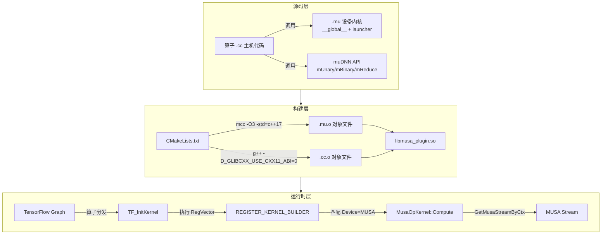

本文面向需要在 TensorFlow MUSA 插件中实现新算子或优化现有算子的高级开发者，系统阐述从架构设计到代码落地、从编译构建到测试验证的完整开发链路。MUSA Kernel 开发本质上存在两种互补范式：一是基于 muDNN 高级 API 的快速封装模式，适用于标准数学、卷积、归约等操作；二是手写 MUSA Kernel（`.mu`）的底层优化模式，适用于存在特殊访存模式、广播语义或融合需求的自定义场景。理解这两种范式的边界与衔接方式，是高效扩展本插件算子覆盖面的关键前提。

Sources: [utils_op.h](musa_ext/kernels/utils_op.h#L1-L143)

## 架构总览与开发流程

在动手编码之前，需要建立对插件 Kernel 层整体架构的认知。所有算子实现分布在 `musa_ext/kernels/` 下，按功能域划分为 `math`、`nn`、`array`、`random`、`state`、`training` 等子目录。每个算子通常由 **C++ 主机代码（`.cc`）** 和可选的 **MUSA 设备代码（`.mu`）** 组成，最终通过 CMake 统一编译为 `libmusa_plugin.so`。TensorFlow 在运行时通过 Stream Executor 插件机制加载该动态库，并调用 `TF_InitKernel()` 完成所有 Kernel 的延迟注册。

下图展示了从源码到运行时调用的完整链路：



在运行时层面，本插件采用 **静态注册表 + 统一初始化** 的设计：`MUSA_KERNEL_REGISTER` 宏将每个编译单元的注册函数指针收集到全局 `RegVector` 中，当 TensorFlow 加载插件并调用 `TF_InitKernel()` 时，再按序执行这些注册函数，从而将 Kernel 与 `Device("MUSA")` 绑定。这种设计避免了静态初始化顺序问题，同时与 TensorFlow 原生的 `REGISTER_KERNEL_BUILDER` 宏无缝衔接。

Sources: [kernel_register.h](musa_ext/mu/kernel_register.h#L1-L58), [kernel_register.cc](musa_ext/mu/kernel_register.cc#L1-L27), [device_register.cc](musa_ext/mu/device_register.cc#L1-L108)

## 开发模式对比：muDNN 封装 vs 自定义 Kernel

面对一个新算子需求，首要决策是选择哪种实现范式。下表从开发效率、性能上限、适用场景等维度给出对比：

| 维度 | muDNN 封装模式 | 自定义 MUSA Kernel 模式 |
|---|---|---|
| **文件组成** | 仅 `.cc` | `.h`（接口声明）+ `.mu`（设备代码）+ `.cc`（主机代码） |
| **核心 API** | `musa::dnn::Unary`、`Binary`、`Reduce`、`MatMul` 等 | `__global__` kernel + `musaStream_t` |
| **开发效率** | 高，通常 30~60 行完成 | 中低，需处理线程格点、广播、对齐、数据类型特化 |
| **性能上限** | 受限于 muDNN 通用实现 | 可针对特定访存模式（如向量化、融合）做极致优化 |
| **广播支持** | muDNN 自动处理或 `SetNdInfo` 配置 stride | 需手动实现 broadcast stride 计算或专用 fast path |
| **典型场景** | ReLU、Softmax、BatchNorm、MatMul | Add 的向量化 fast path、Gather 的带宽优化、自定义融合算子 |
| **调试手段** | `MTOP_CHECK_OK` 宏检查 muDNN 状态 | `musaGetLastError()` 检查启动错误 + 计时宏分阶段剖析 |

对于绝大多数标准深度学习算子，优先使用 muDNN 封装模式；仅在观察到性能瓶颈（如小张量广播开销过大、muDNN 不支持特定融合语义）或需要定义全新 Op 语义时，才进入自定义 Kernel 模式。本插件中的 `AddV2` 即是一个典型案例：它同时存在自定义 MUSA Kernel 的 fast path（处理同形、标量广播、尾向量广播）和 muDNN `Binary::ADD` fallback path，确保在各种形状组合下都能获得较优性能。

Sources: [musa_relu_op.cc](musa_ext/kernels/nn/musa_relu_op.cc#L1-L60), [musa_add_op.cc](musa_ext/kernels/math/musa_add_op.cc#L1-L373)

## 基础：基于 muDNN 的 Kernel 封装

muDNN 封装模式是入门 MUSA Kernel 开发的最佳起点。其实现流程高度标准化：继承 `MusaOpKernel` 基类、在 `Compute()` 中将 `Tensor` 封装为 `mTensor`、调用 muDNN 算子对象执行、最后做状态检查。

### MusaOpKernel 基类与工具函数

`utils_op.h` 中定义的 `MusaOpKernel` 是所有 MUSA 算子的统一基类，它在构造阶段自动读取并缓存 `data_format` 属性（`NCHW` 或 `NHWC`），并通过 `mFormat` 成员提供给子类使用。此外，`GetHandleByCtx()` 提供了线程安全的 muDNN Handle 获取（内部使用 `CachedMusaSetDevice` 避免重复调用 `musaSetDevice`），`GetMusaStreamByCtx()` 则暴露底层 MUSA Stream 用于自定义 Kernel 启动。

`CreateMTensor()` 是连接 TensorFlow 与 muDNN 的关键桥梁，它有两个重载：带 `mFormat` 参数的版本用于卷积/图像类算子（rank≥4 时生效），无格式参数的版本用于通用算子。该函数直接从 TensorFlow Tensor 的元数据中复用形状存储，避免小算子场景下的不必要内存拷贝。

Sources: [utils_op.h](musa_ext/kernels/utils_op.h#L88-L143), [utils_op.cc](musa_ext/kernels/utils_op.cc#L66-L112)

### 以 ReLU 为例的完整实现

ReLU 的实现展示了 muDNN 封装模式的最小可行代码。其核心逻辑仅涉及输入校验、输出分配、muDNN `Unary` 算子配置与执行：

```cpp
template <typename T>
class MusaReluOp : public MusaOpKernel {
 public:
  using MusaOpKernel::MusaOpKernel;
  bool IsExpensive() override { return false; }

  void Compute(OpKernelContext* ctx) override {
    const Tensor& input = ctx->input(0);
    Tensor* output = nullptr;
    OP_REQUIRES_OK(ctx, ctx->allocate_output(0, input.shape(), &output));
    if (input.NumElements() == 0) return;

    auto& handle = GetHandleByCtx(ctx);
    mTensor t_input = CreateMTensor(input, format_);
    mTensor t_output = CreateMTensor(*output, format_);

    mUnary op;
    op.SetMode(::musa::dnn::Unary::Mode::RELU);
    auto status = op.Run(handle, t_output, t_input);

    OP_REQUIRES(ctx, status == ::musa::dnn::Status::SUCCESS,
                errors::Internal("MUSA muDNN Unary ReLU execution failed."));
  }
};

REGISTER_KERNEL_BUILDER(Name("Relu").Device("MUSA").TypeConstraint<float>("T"),
                        MusaReluOp<float>);
```

上述代码中值得注意的细节包括：一是重写了 `IsExpensive()` 返回 `false`，提示 TensorFlow 调度器该算子计算开销低，有利于内联调度减少调度延迟；二是通过 `OP_REQUIRES_OK` 和 `OP_REQUIRES` 进行错误处理，符合 TensorFlow 的 Status 驱动编程规范；三是显式处理了 `NumElements() == 0` 的空张量场景，避免向 muDNN 提交无意义的工作。

Sources: [musa_relu_op.cc](musa_ext/kernels/nn/musa_relu_op.cc#L1-L60)

### 归约算子与 MemoryMaintainer

对于 `Sum`、`Mean`、`Max` 等归约算子，muDNN 的 `Reduce` 对象通常需要额外的临时工作内存。`musa_reduce_functor.h` 中封装了 `ReduceFunctor::Compute`，它利用 TensorFlow 的 `Allocator` 分配设备内存，并通过 `std::unique_ptr` 自定义 deleter 确保内存正确释放，最终包装为 muDNN 的 `MemoryMaintainer` 传入 `Reduce::Run`。此外，针对 `bfloat16` 类型，该文件还提供了特化版本：先将输入 `Cast` 到 `fp32` 执行归约，再将结果 `Cast` 回 `bf16`，以规避 muDNN 在 `bf16` 归约上的精度限制。

Sources: [musa_reduce_functor.h](musa_ext/kernels/math/musa_reduce_functor.h#L1-L71)

## 进阶：自定义 MUSA Kernel 开发

当 muDNN 无法满足性能或语义需求时，就需要进入自定义 MUSA Kernel 开发。本节以 `AddV2` 和 `MusaShiftedAffineMap` 为例，系统讲解文件组织、Kernel 设计、广播处理、Op 注册与类型系统。

### 文件组织规范

一个完整的自定义 Kernel 通常由三个文件构成：

| 文件 | 职责 | 编译方式 |
|---|---|---|
| `musa_xxx_kernel.h` | 声明 `extern "C"` launcher 函数及 kernel 参数结构体 | g++ 预编译头 |
| `musa_xxx_kernel.mu` | 定义 `__global__` kernel 和 launcher 包装函数 | `mcc -O3 -std=c++17` |
| `musa_xxx_op.cc` | 定义 `OpKernel` 子类、Compute 逻辑、注册宏 | g++ 编译 |

以 `ShiftedAffineMap` 为例，其头文件声明了广播形状参数结构和两类 launcher：`LaunchShiftedAffineMapKernel`（通用广播路径）和 `LaunchShiftedAffineMapContiguous`（同形 fast path）。这种分离使得 `.cc` 主机代码无需关心设备端的线程格点细节，只需根据张量形状决策调用哪条路径。

Sources: [musa_shifted_affine_map_kernel.h](musa_ext/kernels/math/musa_shifted_affine_map_kernel.h#L1-L39)

### Kernel 设计与向量化优化

在 `musa_add_kernel.mu` 中，可以观察到生产级自定义 Kernel 的典型优化模式。对于 `float` 类型的同形相加，当数据量较大且指针 16 字节对齐时，launcher 会优先使用 `float4` 向量化 kernel，将四个 `float` 合并为一个向量加载/存储，从而提升内存带宽利用率；剩余不足 4 的尾数则启动一个标量 kernel 处理。此外，针对标量广播（如 `[N, C] + [1]`）和尾向量广播（如 `[N, C] + [C]`）也分别提供了专用 kernel，避免通过通用广播逻辑引入额外索引计算开销。

```cpp
// 向量化 kernel 示例（摘自 Add）
__global__ void AddContiguousKernelFloat4(
    const float4* lhs, const float4* rhs, float4* output, int64_t vec_size) {
  const int64_t idx = blockIdx.x * blockDim.x + threadIdx.x;
  if (idx < vec_size) {
    const float4 l = lhs[idx];
    const float4 r = rhs[idx];
    float4 out;
    out.x = l.x + r.x;
    out.y = l.y + r.y;
    out.z = l.z + r.z;
    out.w = l.w + r.w;
    output[idx] = out;
  }
}
```

`__global__` kernel 与主机代码之间的接口约定是 `extern "C"` launcher 函数，这样可以避免 C++ 符号修饰带来的链接问题。launcher 内部负责计算 grid/block 尺寸、做前置校验（如 `size <= 0` 直接返回）、处理向量化分块与尾段，最终通过 `<<<grid, block, 0, stream>>>` 启动 kernel。

Sources: [musa_add_kernel.mu](musa_ext/kernels/math/musa_add_kernel.mu#L1-L160)

### 自定义 Op 注册与 Shape 推断

当算子是插件独有的自定义语义（而非 TensorFlow 内置算子的 MUSA 后端实现）时，需要同时使用 `REGISTER_OP` 和 `REGISTER_KERNEL_BUILDER`。`MusaShiftedAffineMap` 即属此类，它计算 `output = mask * data_left + sliced_var_right` 的逐元素融合表达式。

`REGISTER_OP` 需要明确定义输入、输出、类型约束及 Shape 推断函数。在 Shape 推断中，需手动实现多输入广播语义：从最低维开始逐维比较，若一方为 1 则取另一方，否则执行 `Merge` 校验兼容性。Shape 推断的准确性直接影响 Graph 阶段的张量布局优化，因此必须与 Compute 中的广播逻辑严格一致。

```cpp
REGISTER_OP("MusaShiftedAffineMap")
    .Input("data_left: T")
    .Input("mask: T")
    .Input("sliced_var_right: T")
    .Output("output: T")
    .Attr("T: {float, double, half, bfloat16}")
    .SetShapeFn([](shape_inference::InferenceContext* c) { ... });
```

Sources: [musa_shifted_affine_map_op.cc](musa_ext/kernels/math/musa_shifted_affine_map_op.cc#L104-L290)

### 广播处理与 Fast Path 策略

自定义 Kernel 的广播处理通常采用 **分层降级** 策略。在 `MusaShiftedAffineMapOp::Compute` 中，首先检查所有输入是否为完全相同的形状：若是，则走 `LaunchShiftedAffineMapContiguous` 的 1D fast path，无需任何 stride 计算；若否，则进入通用广播路径，由 `BuildBroadcastStrides` 将 TensorFlow 的广播语义转化为 kernel 参数中的 stride 数组。

`BuildBroadcastStrides` 的核心逻辑是：对输入张量的每一维，若在该维上尺寸为 1 而输出尺寸大于 1，则 stride 置 0（表示广播复用），否则置入稠密 stride 值。kernel 内部通过 `remaining % shape.dims[dim]` 计算输出坐标，再乘以对应 stride 得到各输入的偏移地址。这种设计将广播逻辑从主机端下沉到设备端，减少了主机端索引计算的负担，同时保持了通用性。

类似的分层策略在 `AddV2` 中也有体现：`TryLaunchAddFastPath` 依次尝试同形相加、标量广播、尾向量广播三种快捷路径，全部失败后才回退到 muDNN 的通用 `Binary::ADD`。这种“专用 path + 通用 fallback”的双重结构是自定义 Kernel 开发中平衡性能与代码复杂度的经典模式。

Sources: [musa_shifted_affine_map_op.cc](musa_ext/kernels/math/musa_shifted_affine_map_op.cc#L170-L270), [musa_add_op.cc](musa_ext/kernels/math/musa_add_op.cc#L153-L352)

## 构建系统与编译约束

CMakeLists.txt 定义了本插件的完整构建规则，自定义 Kernel 开发者需要理解其中与 `.mu` 编译相关的关键配置。CMake 通过 `file(GLOB_RECURSE MU_SOURCES)` 自动收集所有 `.mu` 文件，然后为每个文件生成 `add_custom_command`，调用 `mcc` 编译为对象文件：

```cmake
set(MCC_COMMON_FLAGS -O3 -fPIC -std=c++17 -DEIGEN_DONT_VECTORIZE ...)
add_custom_command(
    OUTPUT ${obj_file}
    COMMAND ${MCC_EXECUTABLE} -c ${mu_full_path} -o ${obj_file} ${MCC_COMMON_FLAGS}
    DEPENDS ${mu_full_path}
    COMMENT "Compiling MUSA kernel: ${filename}")
```

需要特别关注的编译约束有三点：一是 **ABI 一致性**，CMake 会强制清理 TensorFlow 返回的编译标志中的 `_GLIBCXX_USE_CXX11_ABI` 定义，并统一设为 `0`，以匹配 pip 安装的 TensorFlow  wheel；二是 **NDEBUG 必须启用**，因为 TensorFlow wheel 以 release 模式编译，若插件未定义 `NDEBUG`，会导致 `RefCounted` 等内联结构的析构语义不一致，引发虚假 abort；三是 `.mu` 文件使用 C++17 标准编译，因为 mcc 编译时引入的 TensorFlow 头文件需要 C++17 特性支持。

通过 `option(MUSA_KERNEL_DEBUG "Enable MUSA kernel compute timing instrumentation" OFF)` 可在编译时开启 Kernel 调试计时，但生产环境应保持关闭以避免 musaEvent 开销。

Sources: [CMakeLists.txt](CMakeLists.txt#L1-L193)

## 调试与性能剖析

`utils/logging.h` 提供了一套基于 musaEvent 的细粒度计时系统，开发者可在 `Compute()` 中通过宏插入计时桩，无需修改函数签名或引入全局变量。

### 核心计时宏

| 宏 | 功能 | 适用场景 |
|---|---|---|
| `MUSA_KERNEL_TIMING_GUARD(ctx)` | 自动以当前 Op 名创建计时作用域 | 算子入口，自动覆盖整个 Compute |
| `MUSA_KERNEL_TRACE_START("stage")` | 标记阶段开始 | 广播计算、内存分配、kernel 启动 |
| `MUSA_KERNEL_TRACE_END("stage")` | 标记阶段结束，与 START 配对 | 与 START 同名 |
| `MUSA_KERNEL_TIMING_GUARD_WITH_NAME(ctx, "CustomName")` | 自定义计时名称 | 多个模板实例需要区分时 |

这些宏在 `MUSA_KERNEL_DEBUG` 未定义时会被替换为空 `do {} while (false)`，因此生产编译中零开销。开启调试后，环境变量控制输出粒度：`MUSA_TIMING_KERNEL_LEVEL=1` 仅输出总计时，`=2` 输出分阶段明细；`MUSA_TIMING_KERNEL_NAME=AddV2` 可过滤只追踪特定算子；`MUSA_TIMING_KERNEL_STATS=1` 在进程退出时打印各算子的统计汇总（count、total、avg、min、max）。

以 `AddV2` 中的使用为例，计时桩被插入在 BCast 形状推导、输出分配、Tensor 封装、Kernel 执行四个阶段，使开发者能够精确判断性能瓶颈是在主机端调度还是设备端计算：

```cpp
MUSA_KERNEL_TRACE_START("BCast");
// ... 广播形状计算 ...
MUSA_KERNEL_TRACE_END("BCast");
MUSA_KERNEL_TRACE_START("Kernel");
auto status = op.Run(handle, t_out, t0, t1);
MUSA_KERNEL_TRACE_END("Kernel");
```

Sources: [logging.h](musa_ext/utils/logging.h#L1-L804), [musa_add_op.cc](musa_ext/kernels/math/musa_add_op.cc#L283-L352)

## 测试与验证

自定义 Kernel 的可靠性依赖于系统性的测试覆盖。本插件的测试体系位于 `test/` 目录，采用 Python + TensorFlow 的测试框架。对于标准算子（已有 TensorFlow CPU 实现），通过 `MUSATestCase._compare_cpu_musa_results()` 在相同随机输入下对比 CPU 与 MUSA 的输出，验证数值一致性；对于自定义 Op（如 `MusaShiftedAffineMap`），则通过 `tf.load_op_library()` 加载插件，再与 NumPy 参考实现对比。

### 测试基类与插件加载

`musa_test_utils.py` 中的 `MUSATestCase` 在模块导入时自动调用 `load_musa_plugin()`，该函数会按优先级搜索 `build/libmusa_plugin.so` 并调用 `tf.load_library()` 注册所有算子。`setUpClass` 还会检查 `tf.config.list_physical_devices('MUSA')`，若无可用设备则跳过整个测试类，保证测试在无硬件环境下也能优雅降级。

### 数值对比策略

由于 `float16` 和 `bfloat16` 精度有限，对比时需要先将其 `cast` 到 `float32` 再调用 `assertAllClose`。`MUSATestCase` 提供了增强版的 `assertAllClose`，在失败时仅输出前 5 个不匹配元素的索引与差值，避免大规模张量差异导致的日志爆炸。自定义算子测试还应覆盖广播场景、空张量、多数据类型组合，例如 `ShiftedAffineMapOpTest` 就包含了 `float32` 多轴广播、`float64` 精度验证、`float16/bfloat16` 低精度容忍以及零元素张量边界测试。

Sources: [musa_test_utils.py](test/musa_test_utils.py#L1-L191), [shifted_affine_map_op_test.py](test/ops/shifted_affine_map_op_test.py#L1-L192), [add_op_test.py](test/ops/add_op_test.py#L1-L98)

## 最佳实践与常见陷阱

基于本插件现有代码库的演进经验，总结以下开发准则：

**优先使用 muDNN，谨慎引入自定义 Kernel**。muDNN 在标准形状上通常已经过深度优化，自定义 Kernel 的收益往往只体现在特定广播模式或融合语义下。若确需自定义，务必保留 muDNN fallback path，防止未覆盖的形状组合导致功能回退。

**严格处理空张量与零元素场景**。在 `Compute()` 顶部检查 `NumElements() == 0` 并直接返回，可避免向 muDNN 或自定义 kernel launcher 提交无效工作，消除潜在的段错误或 musaError。

**保持 Shape 推断与 Compute 逻辑的一致性**。对于自定义 Op，`SetShapeFn` 中的广播规则必须与 `Compute()` 中的 `BCast` 或手动广播 stride 计算完全对齐，否则会在 Graph 优化阶段产生形状不匹配错误。

**注意 `extern "C"` 与模板显式实例化**。`.mu` 中的 launcher 若使用模板，需在文件末尾对实际用到的类型做显式实例化（如 `template void LaunchXxx<float>(...)`），否则链接阶段会因符号未定义而失败。同时，launcher 必须使用 `extern "C"` 包裹，以屏蔽 C++ 符号修饰。

**避免在热路径中重复查询设备属性**。`GetHandleByCtx` 内部已使用 `thread_local` 缓存当前设备 ID，避免每次算子调用都执行 `musaSetDevice`。开发者应复用该工具函数，而非自行管理设备上下文。

**测试覆盖至少包含同形、广播、空张量、边界值四种情况**。对于数值算子，还应覆盖 `float16` 和 `bfloat16` 的低精度路径，因为这两种类型在自定义 Kernel 中常需要特殊的 load/store 转换（如 `__half2float`、bf16 的移位还原）。

Sources: [musa_add_kernel.mu](musa_ext/kernels/math/musa_add_kernel.mu#L1-L160), [musa_shifted_affine_map_kernel.mu](musa_ext/kernels/math/musa_shifted_affine_map_kernel.mu#L1-L176)

## 延伸阅读与下一步

掌握本文内容后，建议根据实际算子类型深入阅读对应章节的源码实现：若开发神经网络相关算子（如 LayerNorm、GELU），可参考 [神经网络算子](9-shen-jing-wang-luo-suan-zi)；若涉及训练优化器（如 Adam、RMSprop），请参阅 [训练优化器算子](10-xun-lian-you-hua-qi-suan-zi)。对于已实现的自定义 Kernel，若希望进一步通过 Grappler 图优化器将其与其他算子融合，可查阅 [算子融合模式详解](14-suan-zi-rong-he-mo-shi-xiang-jie)。若需要对本节开发的 Kernel 进行精细化性能剖析，[Kernel 计时与性能剖析](16-kernel-ji-shi-yu-xing-neng-pou-xi) 提供了更深入的 musaEvent 使用与 roofline 分析指南。