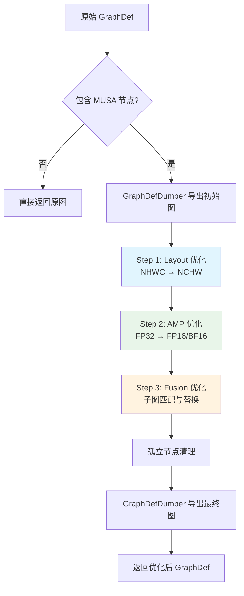
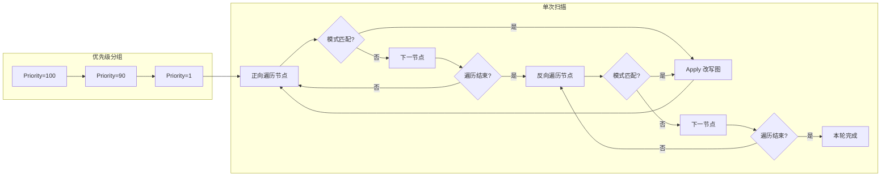

TensorFlow MUSA Extension 的 Grappler 图优化器是插件化接入 TensorFlow 运行时图优化管线的核心组件。它以 `CustomGraphOptimizer` 子类的形式注册到 Grappler 框架，在图执行前对计算图执行设备专属的**布局转换**、**自动混合精度**与**算子融合**三重优化。本文面向高级开发者，系统剖析其整体架构、内部数据流、扩展机制及调试手段。

## 整体架构与角色定位

MUSA Grappler 优化器并非独立运行，而是作为 TensorFlow Grappler 优化管线中的一个**自定义图优化器插件**存在。它通过 `REGISTER_GRAPH_OPTIMIZER_AS` 宏向 TensorFlow 的 `CustomGraphOptimizerRegistry` 注册，名称标识为 `musa_graph_optimizer`。当会话构建或图导入时，Grappler 自动调用其 `Optimize` 方法，传入原始 `GraphDef`，插件返回改写后的计算图。

整个优化管线采用**严格的三阶段串行执行模型**：先进行数据格式转换（Layout），再进行数值精度转换（AMP），最后执行子图模式匹配与融合（Fusion）。这种顺序确保了布局敏感算子在正确的数据格式下被识别，且融合模式在最终精度形态下完成匹配。

Sources: [musa_graph_optimizer.cc](musa_ext/mu/optimizer/musa_graph_optimizer.cc#L382-L444)

## 三态配置系统与协调策略

优化器内部维护一份 `MusaOptimizerConfigs` 配置结构，采用**三态枚举（TriState）**控制各子优化器的行为：`kDefault` 表示遵循 TensorFlow 全局配置，`kOff` 强制关闭，`kOn` 强制开启。该设计用于精细控制与 TensorFlow 原生优化器（如 `arithmetic_optimization`、`constant_folding`、`remapping` 等）的交互边界，避免重复优化或冲突改写引发 OOM 与非法内存访问。

配置可通过两种方式覆盖：一是初始化时读取的环境变量，如 `MUSA_AUTO_MIXED_PRECISION=1` 开启 AMP、`MUSA_AMP_MODE=BF16` 切换目标精度、`MUSA_DISABLE_GRAPPLER=1` 一键关闭所有优化；二是通过 `RewriterConfig_CustomGraphOptimizer` 的参数映射传入，支持 `aggressive_mode`、`precision_mode`、`disable_layout_optimizer`、`disable_amp` 等键值对。

| 配置项 | 环境变量 | 默认值 | 说明 |
|--------|----------|--------|------|
| `auto_mixed_precision` | `MUSA_AUTO_MIXED_PRECISION` | `kOff` | AMP 总开关 |
| `target_dtype` | `MUSA_AMP_MODE` | `DT_HALF` | FP16 或 BF16 |
| `layout_optimizer` | — | `kOff` | NHWC→NCHW 布局转换 |
| `remapping` | — | `kDefault` | 算子融合开关 |
| `aggressive_mode` | — | `false` | AMP 激进模式（条件算子强制转低精度） |

Sources: [musa_graph_optimizer.cc](musa_ext/mu/optimizer/musa_graph_optimizer.cc#L33-L83), [musa_graph_optimizer.cc](musa_ext/mu/optimizer/musa_graph_optimizer.cc#L321-L380)

## 融合模式管理体系

融合优化是整个架构中最具扩展性的部分。它采用**注册表 + 策略模式**的设计，将每一种融合子图识别与改写逻辑封装为独立的 `FusionPattern` 子类，通过全局单例 `FusionPatternManager` 统一管理。

### 核心抽象与注册机制

`FusionPattern` 定义了五个纯虚接口：`Match` 负责从指定起始节点向后（或向前）遍历并识别子图模式；`Apply` 负责将匹配到的子图替换为融合算子；`GetPriority` 返回优先级整数，数值越大越优先执行；`IsKernelAvailable` 检查后端是否实现了对应的融合 Kernel；`GetName` 返回可读名称。所有具体融合类（如 `MusaGeluFusion`、`MusaLayerNormFusion`）均继承此接口。

`FusionPatternManager` 以单例形式维护已注册的模式列表，并按优先级降序排列。它提供启用/禁用单个模式的能力，也支持在测试场景中清空全部模式。`FusionKernelRegistry` 则独立维护 Kernel 可用性查询表，支持静态标记（`MarkKernelAsImplemented`）或动态回调（`RegisterKernel`）两种方式。

为了消除显式注册代码，`REGISTER_FUSION_PATTERN` 与 `REGISTER_FUSION_KERNEL` 宏利用 C++ 的静态初始化机制，在共享库加载时自动将模式实例和 Kernel 检查函数注入对应注册表。当前项目已包含 15 种融合模式，覆盖从大模型核心算子（GELU、LayerNorm）到推荐系统常见模式（ShiftedAffineMap、TokenMixer）的广泛场景。

Sources: [fusion_pattern_manager.h](musa_ext/mu/graph_fusion/fusion_pattern_manager.h#L53-L175), [fusion_pattern_manager.cc](musa_ext/mu/graph_fusion/fusion_pattern_manager.cc#L83-L120)

### 融合执行引擎

`OptimizeFusion` 方法是融合优化的核心调度器。它首先按优先级将模式分组，然后对每一优先级执行**双向扫描的固定点迭代**：对图中每个节点，先正向扫描（从前到后）尝试匹配该优先级的所有模式，若成功应用则立即中断本轮并重新开始扫描；正向收敛后再反向扫描（从后到前），以捕捉正向遍历时因图结构限制而遗漏的模式。外层循环持续执行直到整轮无改动或达到 50 次迭代上限。

这种设计保证了**高优先级模式优先应用**，同时通过反复迭代处理融合后产生的新可融合子图。例如 LayerNorm 融合依赖于底层的 Normalize 先被融合，而固定点迭代恰好支持这种层级依赖。

Sources: [musa_graph_optimizer.cc](musa_ext/mu/optimizer/musa_graph_optimizer.cc#L454-L595)

### 典型融合模式解析

以 `MusaGeluFusion` 为例，它实现了对两种数学等价形式的 GELU 子图识别：基于 `erf` 的精确路径 `0.5 * x * (1 + erf(x / sqrt(2)))`，以及基于 `tanh` 的近似路径 `0.5 * x * (1 + tanh(sqrt(2/pi) * (x + 0.044715 * x^3)))`。`MatchStandardPattern` 和 `MatchApproximatePattern` 两个私有方法分别处理这两条路径，通过常量节点数值匹配（容差 `1e-4`）、算子拓扑验证和输入输出分叉检测，确保只替换安全、无副作用的子图。

`MusaLayerNormFusion` 则展示了**层级前缀约束**的匹配策略：它要求 AddV2、Mul、MusaNormalize 三个节点的命名共享同一层级前缀（如 `layer_norm/add_1`、`layer_norm/mul`、`layer_norm/normalize`），以此避免跨作用域误匹配。匹配成功后，它将 `AddV2(Mul(MusaNormalize, gamma), beta)` 三层子图替换为单个 `MusaLayerNorm` 节点，并提取 gamma、beta 与 epsilon 作为融合算子属性。

Sources: [gelu_fusion.h](musa_ext/mu/graph_fusion/gelu_fusion.h#L1-L72), [gelu_fusion.cc](musa_ext/mu/graph_fusion/gelu_fusion.cc#L1-L200), [layernorm_fusion.cc](musa_ext/mu/graph_fusion/layernorm_fusion.cc#L180-L400)

## 布局优化：NHWC 到 NCHW 的自动转换

MUSA 后端在卷积、池化等算子上对 NCHW 数据格式具有更优的 Kernel 实现。`OptimizeLayout` 方法通过迭代遍历图中所有 MUSA 设备节点，识别**布局敏感算子**（Conv2D、DepthwiseConv2dNative、MaxPool、AvgPool、FusedBatchNorm 等）和**布局无关算子**（Relu、Sigmoid、BiasAdd、Add 等），在两者周围自动插入 `Transpose` 节点完成格式转换。

具体策略为：若布局敏感算子当前为 NHWC，则在其输入前插入 `{0,3,1,2}` 的 pre-transpose，将其 `data_format` 属性改为 `NCHW`，并相应改写 `strides`、`dilations` 等四维属性；同时在其输出后插入 `{0,2,3,1}` 的 post-transpose，并将所有消费者节点的输入重定向到 post-transpose。布局无关算子若检测到上游已是 NCHW 流，则直接接入该流并跳过自身的 transpose，避免冗余的数据搬移。

Sources: [musa_graph_optimizer.cc](musa_ext/mu/optimizer/musa_graph_optimizer.cc#L602-L670)

## 自动混合精度（AMP）优化

AMP 阶段的目标是在保证数值稳定性的前提下，将部分 FP32 算子转换为 FP16 或 BF16，以利用 MUSA Tensor Core 的加速能力。`MusaAmpConfig` 定义了三类算子集合：`fp16_compute_ops`（MatMul、Conv2D、FusedBatchNorm 等，强制转低精度）、`fp32_keep_ops`（Softmax、Exp、Log、Sqrt 等，保持 FP32 防止溢出）以及 `conditional_ops`（Add、BiasAdd 等，视输入精度决定）。

`AnalyzeGraphForAMP` 执行一次全图静态分析，为每个节点生成 `should_convert` 标记。标记规则为：若节点属于 `fp16_compute_ops` 则标记为转；若属于 `fp32_keep_ops` 则否决；若属于 `activation_ops` 且其输入来自 `fp16_compute_ops`，则跟随转；若属于 `conditional_ops`，在非激进模式下需至少有一个低精度输入才跟随转，激进模式下则强制转低精度。

`ConvertNodeToLowPrecision` 对每个被标记的 FP32 节点执行实际改写：修改其 `T` 或 `dtype` 属性为 `DT_HALF`/`DT_BFLOAT16`，为每个非控制边输入插入 `CastF2Lower` 节点（FP32→低精度），并在节点输出后插入 `CastLower2F` 节点（低精度→FP32）以保持下游兼容性。所有消费者边被重定向到输出 Cast 节点。

Sources: [musa_graph_optimizer.cc](musa_ext/mu/optimizer/musa_graph_optimizer.cc#L672-L834)

## 图调试与诊断基础设施

为了支撑复杂的图改写问题定位，项目内建了一套基于环境变量的**分阶段图导出系统**。`GraphDefDumper` 类封装了优化全生命周期的导出点：`DumpInitial`（优化前）、`DumpBeforePass`/`DumpAfterPass`（每阶段前后）、`DumpFinal`（优化后）。导出文件名遵循 `{optimizer_name}_{dump_id}_{stage_description}.pbtxt` 的格式，默认输出到当前目录，可通过 `MUSA_DUMP_GRAPHDEF_DIR` 指定路径。

开启条件由 `MUSA_DUMP_GRAPHDEF` 环境变量控制，设置为 `1`、`true`、`yes` 等真值时生效。导出的 `pbtxt` 文件可直接用 TensorFlow 工具或 Netron 可视化，便于对比 Layout、AMP、Fusion 各阶段前后图结构的差异。`graph_utils.cc` 中实现了 `DumpGraphDef` 的底层序列化与文件写入逻辑，错误时以 `WARNING` 级别回退，不中断优化流程。

Sources: [graph_utils.h](musa_ext/mu/optimizer/graph_utils.h#L1-L70), [graph_utils.cc](musa_ext/mu/optimizer/graph_utils.cc#L1-L146)

## 构建系统集成

所有优化器与融合模式源码通过 `CMakeLists.txt` 的 `GLOB_RECURSE` 规则自动收集，与 Kernel 实现一起编译为 `libmusa_plugin.so`。其中 `musa_ext/mu/optimizer/` 目录下的 `musa_graph_optimizer.cc`、`graph_utils.cc` 以及 `musa_ext/mu/graph_fusion/` 目录下的全部融合模式实现被统一编译进共享库。`REGISTER_GRAPH_OPTIMIZER_AS` 宏依赖的构造函数在动态库加载时自动触发，无需额外的显式注册调用。

编译时需特别注意 ABI 一致性：`CMakeLists.txt` 显式清除了 TensorFlow 编译标志中的 `_GLIBCXX_USE_CXX11_ABI` 定义，并统一回设为 `0`，以匹配 pip 发布的 TensorFlow 二进制Wheel。同时，为避免与以 `NDEBUG` 编译的 TensorFlow 核心在 `RefCounted` 语义上产生分歧，所有构建模式均强制定义 `NDEBUG`。

Sources: [CMakeLists.txt](CMakeLists.txt#L1-L193)

## 扩展新融合模式的开发路径

如需为 MUSA 后端添加新的算子融合模式，标准扩展路径如下：首先，在 `musa_ext/mu/graph_fusion/` 下新建 `{pattern}_fusion.h` 与 `{pattern}_fusion.cc`，继承 `FusionPattern` 并实现 `Match`、`Apply`、`GetPriority`、`IsKernelAvailable`、`GetName` 五个接口。`Match` 方法中应使用 `FusionGraphUtils` 提供的工具函数进行图遍历与节点查找，避免重复实现输入解析逻辑。其次，在 `.cc` 文件末尾使用 `REGISTER_FUSION_PATTERN(YourPatternClass)` 和 `REGISTER_FUSION_KERNEL(YourPatternClass, { return true; })` 完成自动注册。最后，确保对应融合 Kernel 已在 `musa_ext/kernels/` 中实现并通过测试。

关于各已有融合模式的具体数学形式、匹配条件与性能收益，请参阅下一篇文档 [算子融合模式详解](14-suan-zi-rong-he-mo-shi-xiang-jie)。若需了解 AMP 的数值精度策略与调试方法，可跳转至 [自动混合精度](15-zi-dong-hun-he-jing-du)。