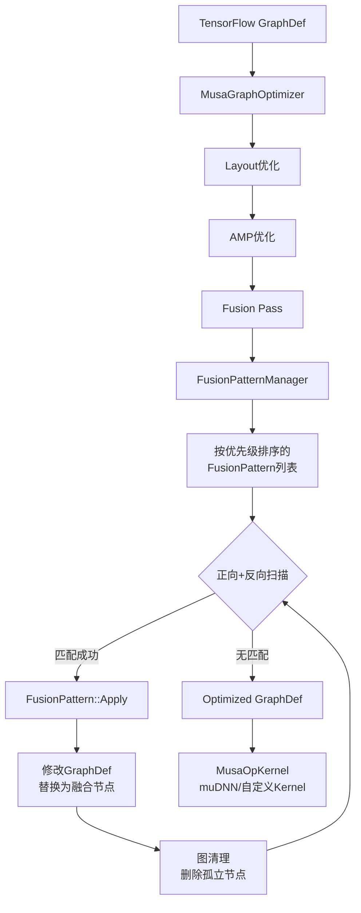

算子融合（Operator Fusion）是 TensorFlow MUSA Extension 性能优化的核心手段之一。其本质是在 Grappler 图优化阶段，将计算图中语义等价的多个原始算子（如 MatMul、BiasAdd、Relu）识别为特定子图模式，并替换为单一融合算子（如 MusaLinearRelu），从而消除中间张量的内存读写、降低内核启动开销，并充分利用 muDNN 等底层库的原子融合能力。本文档面向高级开发者，系统阐述融合框架的架构设计、18 种已实现的融合模式、匹配与变换的安全机制，以及后端 Kernel 的衔接方式。

Sources: [musa_graph_optimizer.cc](musa_ext/mu/optimizer/musa_graph_optimizer.cc#L454-L595)

## 融合系统架构总览

整个融合系统由三层组成：图优化器调度层、模式管理层与后端 Kernel 执行层。MusaGraphOptimizer 作为 Grappler 自定义优化器，在布局优化（Layout）与自动混合精度（AMP）之后执行融合阶段（Fusion Pass）。该阶段通过 FusionPatternManager 获取所有已注册的模式，按优先级分组并进行多轮扫描，直至达到不动点（Fixed Point）。一旦模式匹配成功，其 Apply 方法会修改 GraphDef，将目标子图替换为融合算子节点；后端则通过 REGISTER_KERNEL_BUILDER 将融合算子名映射到 MUSA 设备上的具体实现。

Sources: [musa_graph_optimizer.cc](musa_ext/mu/optimizer/musa_graph_optimizer.cc#L382-L444)

## 核心框架：模式管理与图操作

融合框架的公共基础设施集中在 `fusion_pattern_manager.h` 与对应的实现中，定义了四个核心抽象。第一是 `FusionMatchResult`，它承载一次匹配的结果，包含 `matched_nodes`（所有被匹配的原始节点列表）、`captured_nodes`（具名捕获的关键节点，如 output、input、bias 等）以及 `captured_attrs`（从子图中提取的常量属性，如 epsilon、approximate 等）。第二是 `FusionPattern` 接口，所有具体模式必须实现 `Match`、`Apply`、`GetPriority` 和 `IsKernelAvailable` 四个方法；其中 `GetPriority` 数值越大表示优先级越高，会在同轮扫描中优先尝试。第三是 `FusionPatternManager` 单例，通过 `REGISTER_FUSION_PATTERN` 宏在全局静态初始化阶段收集所有模式，并按优先级降序排列；它还支持按名称启用或禁用特定模式。第四是 `FusionKernelRegistry`，用于在注册期检查对应融合 Kernel 是否可用，避免匹配成功但无后端支持的无效融合。

Sources: [fusion_pattern_manager.h](musa_ext/mu/graph_fusion/fusion_pattern_manager.h#L34-L142)

图操作工具集 `FusionGraphUtils` 提供了模式实现者常用的底层原语，包括 `FindNodeIndex`、`GetNodeByName`、`GetProducerNodeName`（处理控制依赖 `^` 前缀与输出端口 `:` 后缀）、`RedirectInputs`（将引用旧节点的所有输入边重定向到新节点）、`RemoveNode`（通过 Swap+RemoveLast 实现 O(1) 删除）以及 `RemoveNodesIfUnused`（在保护指定节点的前提下，迭代删除无外部引用的节点）。这些工具是确保图变换语义正确性的基石。

Sources: [fusion_pattern_manager.cc](musa_ext/mu/graph_fusion/fusion_pattern_manager.cc#L204-L360)

## 融合模式分类与典型子图

当前代码库在 `musa_ext/mu/graph_fusion` 目录下实现了 18 种融合模式，可划分为四大类别：基础激活融合、线性代数融合、归一化融合以及领域特定融合。下表汇总了各模式的核心信息：

| 融合模式 | 优先级 | 匹配起点 | 原始子图 | 融合后算子 | 典型场景 |
|---------|--------|---------|---------|-----------|---------|
| MatMulBiasAdd | 98 | BiasAdd | MatMul + BiasAdd | MusaMatMulBiasAdd | 全连接层去偏置 |
| LinearRelu | 120 | Relu | MatMul + BiasAdd + Relu | MusaLinearRelu | MLP 前向传播 |
| ConcatMatMul | 60 | MatMul | ConcatV2 + MatMul | MusaConcatMatMul | 特征拼接后投影 |
| GELU | 90 | Mul | 0.5*x*(1+erf(x/sqrt2)) 或 tanh 近似 | MusaGelu | Transformer FFN |
| Clip | 100 | Maximum | Minimum + Maximum | MusaClip | 数值裁剪 |
| Normalize | 105 | RealDiv | Mean→Sub→Square→Mean→Sqrt→Clip→RealDiv | MusaNormalize | 均值方差归一化 |
| LayerNorm | 1 | AddV2 | MusaNormalize + Mul(gamma) + AddV2(beta) | MusaLayerNorm | 标准 LayerNorm |
| TensorDot | 100 | Reshape | Shape/Gather/Prod/Pack/Reshape/MatMul/Reshape | MusaTensorDot | 高维张量缩并 |
| TensorDotBias | 95 | AddV2 | MusaTensorDot + BiasAdd | MusaTensorDotBias | 缩并后加偏置 |
| PReLU | — | — | — | MusaPReLUFusion | 参数化 ReLU |
| ShiftedAffineMap | — | — | — | MusaShiftedAffineMap | 仿射映射 |
| SigmoidCalibration | — | — | — | MusaSigmoidCalibration | 校准 sigmoid |
| RGProjection | — | — | — | MusaRGProjection | 投影算子 |
| TokenMixer | — | — | — | MusaTokenMixer | Token 混合 |
| FusedLayerNormV2 | — | — | — | MusaFusedLayerNormV2 | LayerNorm 变体 |

Sources: [gelu_fusion.h](musa_ext/mu/graph_fusion/gelu_fusion.h#L33-L65), [layernorm_fusion.h](musa_ext/mu/graph_fusion/layernorm_fusion.h#L47-L83), [linear_relu_fusion.h](musa_ext/mu/graph_fusion/linear_relu_fusion.h#L12-L40), [matmul_biasadd_fusion.h](musa_ext/mu/graph_fusion/matmul_biasadd_fusion.h#L14-L42), [normalize_fusion.h](musa_ext/mu/graph_fusion/normalize_fusion.h#L48-L75), [tensordot_fusion.h](musa_ext/mu/graph_fusion/tensordot_fusion.h#L45-L72), [clip_fusion.h](musa_ext/mu/graph_fusion/clip_fusion.h#L27-L47)

### 典型模式详解：GELU 融合

GELU 融合是模式匹配复杂度最高的代表之一。`MusaGeluFusion` 需要同时识别两种数学等价路径：基于 `Erf` 的精确路径 `0.5 * x * (1 + erf(x / sqrt(2)))` 以及基于 `Tanh` 的近似路径 `0.5 * x * (1 + tanh(sqrt(2/pi) * (x + 0.044715 * x^3)))`。匹配器从最终的 `Mul` 节点出发，采用因子分解策略（FactorMatcher），通过 `MatchFromHalfScaledInput`、`MatchFromNestedHalfConst` 和 `MatchFromInputAndHalfFactor` 三种拓扑变体，回溯验证常量系数（0.5、1.0、sqrt(2) 等）与输入张量的对应关系。为提升调试性与可维护性，精确路径与近似路径被拆分为独立的 `MatchStandardPattern` 和 `MatchApproximatePattern`，优先尝试精确路径。

Sources: [gelu_fusion.cc](musa_ext/mu/graph_fusion/gelu_fusion.cc#L551-L598)

### 典型模式详解：LayerNorm 融合

LayerNorm 融合展现了分层递进的融合思想。它并不直接匹配原始 TensorFlow LayerNorm 的冗长子图，而是匹配一个已经由 `MusaNormalizeFusion` 预处理后的三层结构：`AddV2(Mul(MusaNormalize, gamma), beta)`。`MusaLayerNormFusion::MatchFromAddNode` 从 `AddV2` 开始向下追溯，通过节点名称前缀（Prefix）约束确保 `Mul` 与 `MusaNormalize` 属于同一命名空间（如 `layer/truediv`、`layer/mul`、`layer/add_1`），同时验证 gamma 和 beta 是经过 `ExpandDims` 或 `Identity` 链包裹的 `Const`。这种前缀隔离机制有效避免了跨作用域的误匹配。

Sources: [layernorm_fusion.cc](musa_ext/mu/graph_fusion/layernorm_fusion.cc#L198-L437)

### 典型模式详解：Normalize 融合

Normalize 融合匹配一个 9 层原始子图：`Mean_1 → ExpandDims_1 → Sub → Square → Mean_2 → ExpandDims_2 → Sqrt → MusaClip → RealDiv`。`MusaNormalizeFusion::MatchFromRealDivNode` 从终点 `RealDiv` 反向逐层回溯，每一步都校验算子类型与节点名前缀。特别地，它从 `Mean` 节点的第二个输入中提取 `reduction_indices`，并将其作为属性传递给融合后的 `MusaNormalize` 算子，确保语义完全等价。该模式是 LayerNorm 融合的上游依赖，通常在优化器执行顺序中先完成 Normalize 融合，再触发 LayerNorm 融合。

Sources: [normalize_fusion.cc](musa_ext/mu/graph_fusion/normalize_fusion.cc#L263-L399)

## 模式匹配机制详解

融合 Pass 的执行流程体现了迭代不动点与优先级分组的双重策略。在 `MusaGraphOptimizer::OptimizeFusion` 中，首先将所有可用模式按优先级分组（`priority_groups`），然后对每个优先级组执行双向扫描：正向（`reverse=false`）与反向（`reverse=true`）各一次。每次扫描按节点顺序逐一尝试当前组内的所有模式；一旦某个节点被成功匹配并应用，扫描立即中断并重新开始新一轮扫描。这种“贪婪+重启”机制确保新产生的融合节点不会与尚未扫描的节点形成新的可融合子图而被遗漏。

Sources: [musa_graph_optimizer.cc](musa_ext/mu/optimizer/musa_graph_optimizer.cc#L473-L541)

整个融合过程在更高层级上被包裹在一个最多 50 轮迭代的循环中。每轮遍历所有优先级组，只有当所有组都达到不动点（即一轮完整扫描无任何模式被应用）时，整个融合阶段才结束。该上限防止了因图结构异常导致的无限循环。若某模式注册了但 `IsKernelAvailable()` 返回 false，优化器会记录一次 fallback 并跳过该融合，保证图仍可在原始算子上正确执行。

Sources: [musa_graph_optimizer.cc](musa_ext/mu/optimizer/musa_graph_optimizer.cc#L543-L594)

## 图变换与安全策略

融合不仅是子图识别，更涉及对 GraphDef 的安全重写。框架设计了多重安全机制来维护图的语义完整性。

**Fork 检测与共享节点保护**。以 LayerNorm 融合为例，在匹配阶段，算法会检查除输出节点外的所有中间节点（如 `Mul`、`MusaNormalize`）是否被匹配子图之外的其他节点引用。若存在外部引用（Fork），则该子图不可融合，因为删除中间节点会破坏外部消费者的输入。在 Apply 阶段，`MusaLayerNormFusion` 再次通过遍历全图输入边的方式检测共享节点，并将共享节点从待删除列表中移除。

Sources: [layernorm_fusion.cc](musa_ext/mu/graph_fusion/layernorm_fusion.cc#L360-L389), [layernorm_fusion.cc](musa_ext/mu/graph_fusion/layernorm_fusion.cc#L536-L567)

**前缀隔离（Prefix Isolation）**。Normalize 与 LayerNorm 等复杂模式依赖命名前缀来界定子图边界。`FindNormalizePrefix` 从终点节点名中提取最后一个 `/` 之前的前缀（如 `model/layer_norm`），后续所有被匹配的节点必须通过 `BelongsToNormalize` 校验，确保其名称等于前缀或以 `prefix/` 开头。这避免了在大型图中将来自不同层、算子类型恰好相同的节点错误地归入同一子图。

Sources: [normalize_fusion.cc](musa_ext/mu/graph_fusion/normalize_fusion.cc#L202-L228)

**防重命名与防重复融合**。每个 Apply 方法在修改图之前都会检查目标节点是否已被替换为同名融合算子（如 `node.op() == "MusaGelu"`），若已存在则直接返回 OK，避免二次融合。同时，原始输出节点通常被重命名为 `original_name + "_original"`，而新的融合节点接管原名称，从而保持图中所有消费者边无需修改即可正确连接。`_original` 后缀也作为 `HasOriginalSuffix` 的哨兵，阻止优化器对已处理过的残留节点再次发起匹配。

Sources: [gelu_fusion.cc](musa_ext/mu/graph_fusion/gelu_fusion.cc#L647-L653), [linear_relu_fusion.cc](musa_ext/mu/graph_fusion/linear_relu_fusion.cc#L148-L156)

**孤立节点清理**。融合完成后，`RemoveIsolatedNodes` 会迭代删除两类残留：一是融合后不再有消费者的 `Const` 节点（尤其是带有 `/Gelu/` 或 `/LayerNorm/` 名称片段的标量常量）；二是完全断连的节点。该过程同样采用迭代不动点策略，直到没有新的孤立节点产生为止。

Sources: [musa_graph_optimizer.cc](musa_ext/mu/optimizer/musa_graph_optimizer.cc#L255-L306)

## 后端 Kernel 实现衔接

融合算子在前端被定义为新的 Op（如 `MusaGelu`、`MusaLayerNorm`），后端则通过标准的 TensorFlow Kernel 注册机制绑定到 MUSA 设备。以 GELU 为例，`MusaGeluOp` 继承自 `MusaOpKernel`，在 `Compute` 中调用 muDNN 的 `mUnary` 原语，根据 `approximate` 属性选择 `UNARY_MODE::GELU` 或 `UNARY_MODE::GELU_TANH`。LayerNorm 则调用 `musa::dnn::LayerNorm`，通过 `SetEpsilon` 与 `SetAxis` 配置参数，并利用 TensorFlow 的 Allocator 分配临时工作空间（`MemoryMaintainer`）。LinearRelu 展示了混合策略：先用 `mMatMul` 或 `mBatchMatMul` 完成矩阵乘，再通过 `mBinary`（Mode::ADD）执行 BiasAdd，最后以原地（in-place）`mUnary`（Mode::RELU）完成激活，三阶段共享同一个 `mTensor` 输出缓冲区，避免额外的内存拷贝。

Sources: [musa_gelu_op.cc](musa_ext/kernels/nn/musa_gelu_op.cc#L12-L73), [musa_layernorm_op.cc](musa_ext/kernels/nn/musa_layernorm_op.cc#L15-L101), [musa_linear_relu_op.cc](musa_ext/kernels/nn/musa_linear_relu_op.cc#L22-L166)

对于 MatMulBiasAdd，`MusaMatMulBiasAddOp` 直接调用 muDNN 的 `MatMul::RunWithBiasAdd`，将 bias 作为 gamma 参数传入，实现单内核完成乘加。Normalize 融合则采用了自定义 MUSA Kernel 而非 muDNN 原语，`LaunchNormalize` 在 CUDA 层级并行处理 `num_rows x row_size` 的归一化计算，通过 `epsilon` 与 `max_std` 参数控制数值稳定性。

Sources: [musa_matmul_bias_op.cc](musa_ext/kernels/nn/musa_matmul_bias_op.cc#L9-L106), [musa_normalize_fusion_op.cc](musa_ext/kernels/nn/musa_normalize_fusion_op.cc#L52-L108)

## 测试与验证体系

融合正确性通过端到端（End-to-End）测试保障，测试代码位于 `test/fusion/` 目录。每个测试用例遵循统一的验证范式：构造包含目标子图的 GraphDef，启用 `musa_graph_optimizer` 作为唯一优化器，执行 Session.run，然后从三个维度断言结果。第一，数值精度：对比 MUSA 融合执行结果与 CPU 参考实现（或 TensorFlow 标准 API）的输出，使用 `assertAllClose` 控制相对/绝对容差（如 `rtol=1e-5, atol=1e-6`）。第二，图结构验证：通过 `MUSA_DUMP_GRAPHDEF=1` 导出优化后的 GraphDef，检查文本表示中是否包含目标融合算子（如 `op: "MusaGelu"`），并确保只有一个融合节点存在。第三，残留节点清理：验证所有 `_original` 后缀节点已被移除，且原始子图中的中间算子（如 `Erf`、`Tanh`、`Mul`、`AddV2` 等）不再出现在最终图中。

Sources: [gelu_fusion_test.py](test/fusion/gelu_fusion_test.py#L51-L194)

LayerNorm 测试 additionally 验证了前缀隔离与共享节点保护的正确性。它构建包含 Concat、Mean、Sub、Square、Sqrt、Clip、RealDiv 的完整 Normalize 子图，再叠加 gamma/beta 的 Mul/AddV2 层，最终确认优化后的图中同时存在 `MusaNormalize` 与 `MusaLayerNorm` 两个融合节点，且二者通过正确的数据流串联。LinearRelu 测试则包含负向用例：当在 MatMul 与 BiasAdd 之间插入 `Identity` 等 intervening op 时，融合不应发生，图中不应出现 `MusaLinearRelu` 节点。

Sources: [layernorm_fusion_test.py](test/fusion/layernorm_fusion_test.py#L77-L200), [linear_relu_fusion_test.py](test/fusion/linear_relu_fusion_test.py#L43-L131)

## 新增融合模式开发指南

若需为新的计算模式添加融合支持，可遵循以下步骤。第一步，定义模式类：在 `musa_ext/mu/graph_fusion/` 下新建 `xxx_fusion.h` 与 `xxx_fusion.cc`，继承 `FusionPattern` 并实现 `Match`、`Apply`、`GetPriority`、`IsKernelAvailable` 与 `GetName`。Match 方法应从图中的一个特定锚点算子（如 `Relu`、`AddV2`）出发，反向追踪输入边，验证每一步的算子类型与常量属性；Apply 方法则负责创建融合节点、重命名原输出节点、转移输入边并清理无用节点。第二步，注册模式：在 `.cc` 文件末尾使用 `REGISTER_FUSION_PATTERN(YourFusionClass)` 和 `REGISTER_FUSION_KERNEL(YourFusionClass, { return true; })` 完成静态注册。第三步，实现后端 Kernel：在 `musa_ext/kernels/<domain>/musa_xxx_op.cc` 中定义 `REGISTER_OP` 与 `REGISTER_KERNEL_BUILDER`，调用 muDNN 或自定义 MUSA Kernel 完成计算。第四步，编写 E2E 测试：在 `test/fusion/xxx_fusion_test.py` 中构造正向图与负向图，验证数值精度、图结构转换与残留节点清理。

Sources: [fusion_pattern_manager.h](musa_ext/mu/graph_fusion/fusion_pattern_manager.h#L145-L159)

在开发过程中，应特别注意优先级（Priority）的设置。高优先级模式（如 LinearRelu 的 120）会先执行，从而“抢占”低优先级模式可能重叠的子图。例如，若 MatMul+BiasAdd+Relu 存在，LinearRelu（120）应在 MatMulBiasAdd（98）之前被尝试，否则 BiasAdd 可能被过早地与 MatMul 融合，导致后续无法形成完整的 LinearRelu 融合。此外，复杂模式建议采用前缀隔离或 Fork 检测，防止在真实大模型图中出现跨层误匹配。

Sources: [musa_graph_optimizer.cc](musa_ext/mu/optimizer/musa_graph_optimizer.cc#L454-L480)

## 环境变量与控制开关

以下环境变量可用于调试或控制融合行为：

| 环境变量 | 作用 |
|---------|------|
| `MUSA_DISABLE_GELU_FUSION` | 设为 `1` 时，`MusaGeluFusion::IsKernelAvailable` 返回 false，禁用 GELU 融合 |
| `MUSA_ENABLE_LAYERNORM_FUSION_KERNEL` | 控制 LayerNorm 融合 Kernel 的启用状态 |
| `MUSA_DUMP_GRAPHDEF` | 设为 `1` 时，优化器会在各阶段前后导出 GraphDef 的文本表示 |
| `MUSA_DUMP_GRAPHLITE_DIR` | 指定图导出目录 |
| `MUSA_DISABLE_GRAPPLER` | 设为 `1` 时，关闭所有 Grappler 相关优化（包括融合） |
| `MUSA_AUTO_MIXED_PRECISION` | 设为 `1` 时，启用自动混合精度（AMP） |

Sources: [gelu_fusion.cc](musa_ext/mu/graph_fusion/gelu_fusion.cc#L537-L549), [musa_graph_optimizer.cc](musa_ext/mu/optimizer/musa_graph_optimizer.cc#L321-L353)

## 相关阅读与下一步

算子融合是 TensorFlow MUSA Extension 图优化栈的中间层，其上游依赖 Grappler 优化器框架的注册与调度机制，下游则衔接自定义 Kernel 的设备执行。若需深入理解优化器整体架构，请参阅 [Grappler 图优化器架构](13-grappler-tu-you-hua-qi-jia-gou)；若关注后端 Kernel 的开发细节与 muDNN 原语使用，请参阅 [自定义 MUSA Kernel 开发指南](12-zi-ding-yi-musa-kernel-kai-fa-zhi-nan)。对于融合后的端到端测试方法，可参考 [融合端到端测试](22-rong-he-duan-dao-duan-ce-shi)。若需了解训练场景中的自动混合精度如何与算子融合协同工作，请参阅 [自动混合精度](15-zi-dong-hun-he-jing-du)。