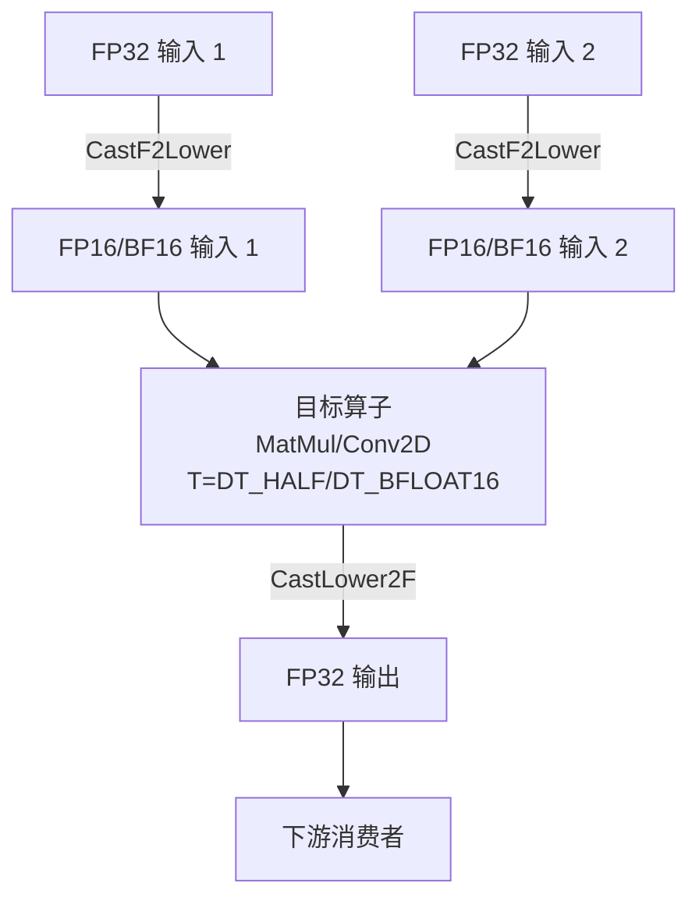

TensorFlow MUSA Extension 的自动混合精度（Automatic Mixed Precision, AMP）是一种图级别优化技术，它通过在计算密集型算子上自动启用 FP16 或 BF16 低精度计算，在不显著影响模型收敛性的前提下，大幅降低显存占用并提升吞吐。与 TensorFlow 原生的 `auto_mixed_precision` Grappler 优化器不同，MUSA AMP 采用独立的图变换实现，专门针对 MUSA 硬件的 muDNN 低精度内核能力进行裁剪，避免与上游优化器产生策略冲突。

Sources: [musa_graph_optimizer.cc](musa_ext/mu/optimizer/musa_graph_optimizer.cc#L90-L131)

## 在图优化流水中的位置

`MusaGraphOptimizer` 将完整的图优化过程组织为三个严格串行的阶段：首先是 **Layout 优化**（NHWC 到 NCHW 的自动转换），其次是 **AMP 优化**（FP32 到低精度的自动转换），最后是 **Fusion 优化**（LayerNorm、GELU 等子图融合）。这一顺序经过精心设计——Layout 优化先于 AMP 执行，确保卷积等布局敏感算子在 NCHW 格式下完成低精度转换；Fusion 优化位于 AMP 之后，使得融合模式匹配可以直接在低精度图上进行，避免了精度切换导致的子图断裂。

Sources: [musa_graph_optimizer.cc](musa_ext/mu/optimizer/musa_graph_optimizer.cc#L382-L444)

## 算子分类策略与决策引擎

MUSA AMP 的核心决策逻辑由 `MusaAmpConfig` 定义，采用基于算子类型的白名单/黑名单/灰名单三层分类体系，配合图拓扑传播完成转换判定。`AnalyzeGraphForAMP` 方法遍历图中所有节点，依据以下优先级规则为每个节点生成 `should_convert` 标记：先检查节点是否属于 `fp16_compute_ops`（强制转换），再检查是否属于 `fp32_keep_ops`（强制保留），最后根据上游拓扑决定 `activation_ops` 和 `conditional_ops` 的传播行为。

| 分类 | 典型算子 | 转换规则 |
|------|---------|---------|
| **强制低精度** | `MatMul`、`Conv2D`、`BatchMatMulV2`、`FusedBatchNorm` | 无条件转换为目标低精度类型 |
| **强制 FP32** | `Softmax`、`Exp`、`Log`、`Sqrt`、`Sum`、`Mean` | 明确禁止转换，保持 FP32 以确保数值稳定性 |
| **条件转换** | `Add`、`BiasAdd`、`BiasAddGrad` | `aggressive_mode` 为 `true` 时全部转换；保守模式下，当至少一个输入来自强制低精度算子时才转换 |
| **激活传播** | `Relu`、`Sigmoid`、`Tanh`、`LeakyRelu` | 若直接输入来自强制低精度算子，则跟随转换为低精度 |

Sources: [musa_graph_optimizer.cc](musa_ext/mu/optimizer/musa_graph_optimizer.cc#L91-L128)

## 图变换机制

`OptimizeAMP` 方法执行两阶段图变换：首先是静态分析阶段 `AnalyzeGraphForAMP`，为每个节点标注转换标记；随后是实际改写阶段 `ConvertNodeToLowPrecision`。改写过程遵循"输入前插 Cast、输出后插 Cast"的原则。具体而言，对于被标记的 FP32 节点，优化器将其 `T` 或 `dtype` 属性修改为 `DT_HALF` 或 `DT_BFLOAT16`；在其每个非控制边输入前插入一个 `Cast(FP32 → target)` 节点；在节点自身输出后插入一个 `Cast(target → FP32)` 节点，并将所有下游消费者的输入边重定向至该输出 Cast。这种设计使得单个算子内部以低精度执行，而与图其余部分的交互仍保持 FP32 语义，最大限度兼容现有训练流程。

Sources: [musa_graph_optimizer.cc](musa_ext/mu/optimizer/musa_graph_optimizer.cc#L672-L834)

## Kernel 低精度支撑体系

图级别的 AMP 决策能否生效，取决于底层 Kernel 是否注册了对应的低精度类型。MUSA Extension 在 `utils_op.cc` 中通过 `GetType` 函数建立了 TensorFlow 数据类型与 muDNN 张量类型之间的完整映射，其中 `DT_HALF` 映射为 `mType::HALF`，`DT_BFLOAT16` 映射为 `mType::BFLOAT16`。所有计算密集型算子（如 `MatMul`、`Conv2D`、`BatchNorm`）均在 OP 注册和 Kernel 注册时显式支持 `half` 与 `bfloat16` 类型约束，确保 AMP 插入的低精度计算节点能够找到对应的设备 Kernel 执行。

Sources: [utils_op.cc](musa_ext/kernels/utils_op.cc#L11-L43)

Sources: [musa_matmul_op.cc](musa_ext/kernels/math/musa_matmul_op.cc#L22-L31)

## 配置与启用方式

默认情况下，MUSA AMP 处于关闭状态，以避免对已有工作负载产生意外影响。用户可通过环境变量或 `RewriterConfig_CustomGraphOptimizer` 参数两种方式启用和精细控制。

| 配置项 | 配置途径 | 默认值 | 说明 |
|--------|---------|--------|------|
| `MUSA_AUTO_MIXED_PRECISION` | 环境变量 | 未设置（关闭） | 设置为 `1` 时启用 AMP |
| `MUSA_AMP_MODE` | 环境变量 | `FP16` | 可选 `FP16` 或 `BF16`，控制目标低精度类型 |
| `aggressive_mode` | RewriterConfig 参数 | `false` | 激进模式：将所有条件转换算子无条件转为低精度 |
| `precision_mode` | RewriterConfig 参数 | `"FP16"` | 字符串参数，可选 `"FP16"` 或 `"BFLOAT16"` |
| `disable_amp` | RewriterConfig 参数 | `false` | 显式禁用 AMP，优先级高于环境变量 |

环境变量的读取发生在 `MusaGraphOptimizer::Init` 阶段，其中 `MUSA_AUTO_MIXED_PRECISION=1` 会将内部配置状态从 `kOff` 切换为 `kOn`，而 `MUSA_AMP_MODE` 则决定 `amp_config_.target_dtype` 是 `DT_HALF` 还是 `DT_BFLOAT16`。

Sources: [musa_graph_optimizer.cc](musa_ext/mu/optimizer/musa_graph_optimizer.cc#L321-L378)

## 调试与验证

当启用 `MUSA_DUMP_GRAPHDEF=1` 时，`GraphDefDumper` 会在 AMP 优化前后分别导出 `musa_optimizer_{id}_before_amp.pbtxt` 与 `musa_optimizer_{id}_after_amp.pbtxt` 文本格式图定义文件，开发者可通过对比两份 GraphDef 精确验证 Cast 节点的插入位置与数据类型变更是否符合预期。此外，设置 `TF_CPP_VMODULE="musa_graph_optimizer=1"` 可查看每个算子的转换决策日志，而 `MUSA_DUMP_GRAPHDEF_DIR` 可自定义 dump 文件的输出目录。

Sources: [graph_utils.h](musa_ext/mu/optimizer/graph_utils.h#L38-L63)

Sources: [musa_graph_optimizer.cc](musa_ext/mu/optimizer/musa_graph_optimizer.cc#L386-L412)

## 与 TensorFlow Grappler 的协调边界

为避免与 TensorFlow 内置优化器产生重复或冲突，`MusaOptimizerConfigs` 显式将 TensorFlow 原生的 `auto_mixed_precision` 和 `layout_optimizer` 标记为 `TriState::kOff`，由 MUSA 扩展完全接管这两项优化。这种隔离策略确保了图变换的顺序可控性，也使得 MUSA 扩展能够根据硬件特性（如 MUSA 对 NCHW 的偏好）自主决定布局与精度的协同策略，而不受上游 TensorFlow 版本迭代的影响。

Sources: [musa_graph_optimizer.cc](musa_ext/mu/optimizer/musa_graph_optimizer.cc#L56-L88)

## 延伸阅读

- 了解图优化器的整体流水与 Grappler 集成机制，请参阅 [Grappler 图优化器架构](13-grappler-tu-you-hua-qi-jia-gou)
- 了解算子融合如何与 AMP 协同工作以进一步压缩计算图，请参阅 [算子融合模式详解](14-suan-zi-rong-he-mo-shi-xiang-jie)
- 了解底层 Kernel 注册与数据类型分发的完整链路，请参阅 [Kernel 注册与算子分发流程](7-kernel-zhu-ce-yu-suan-zi-fen-fa-liu-cheng)