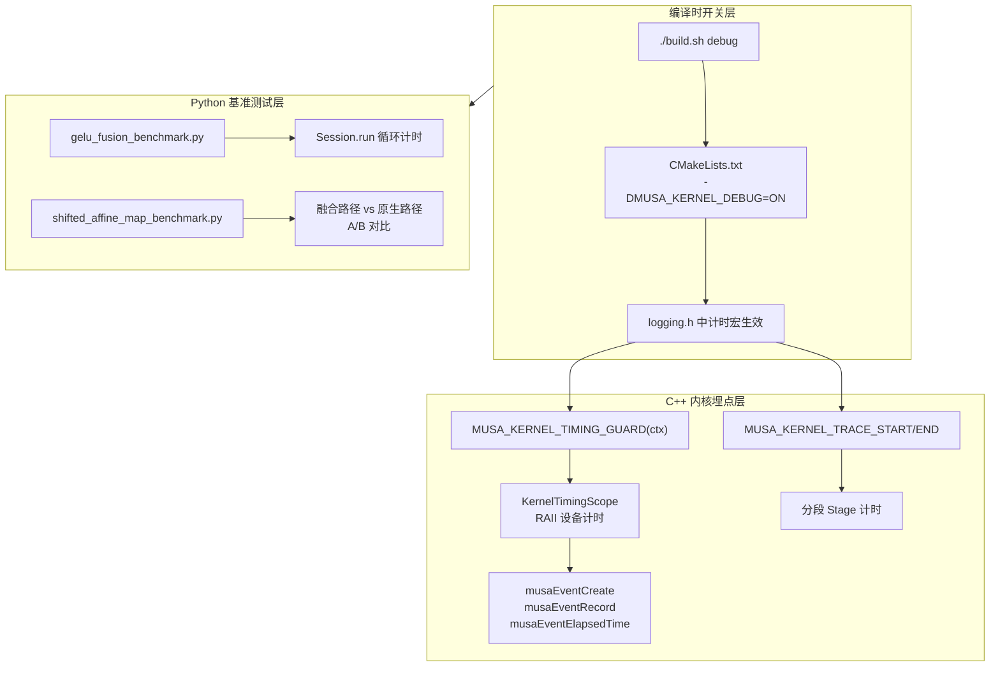
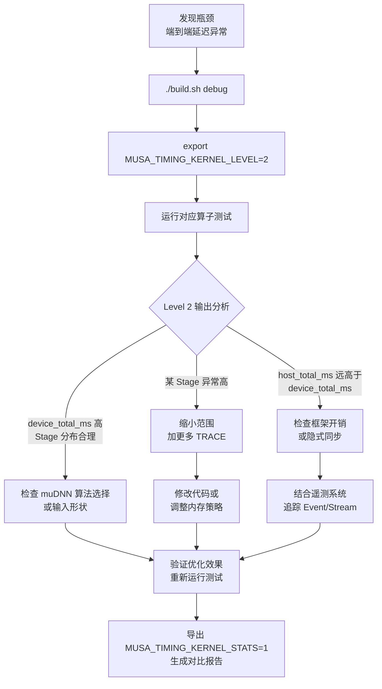

本文档系统阐述 TensorFlow MUSA Extension 中 **Kernel 级计时与性能剖析** 的完整技术体系，涵盖从编译时开关、C++ 内核埋点宏、MUSA Event 设备计时原语，到 Python 层端到端基准测试的完整链路。掌握这套机制后，开发者能够在不修改业务代码的前提下，精准定位算子瓶颈、验证融合收益，并为图优化决策提供量化依据。

Sources: [build.sh](build.sh#L1-L92), [CMakeLists.txt](CMakeLists.txt#L1-L193), [logging.h](musa_ext/utils/logging.h#L1-L804)

---

## 计时体系架构

整个性能剖析体系由三层构成：**编译时开关层**决定计时代码是否编译进产物；**C++ 内核埋点层**通过宏在算子 Compute 函数中注入 `musaEvent` 设备计时；**Python 基准测试层**则在 Session 级别对比融合前后或不同实现路径的端到端耗时。



**关键设计决策**在于，正常生产环境使用的 `MusaEvent` 实现中启用了 `musaEventDisableTiming` 标志，以避免 Event 创建带来的性能损耗；而 `KernelTimingScope` 在 Debug 模式下会单独创建支持计时的 MUSA Event，从而在不污染通用事件管理器的前提下完成高精度设备侧计时。

Sources: [musa_event.h](musa_ext/mu/device/musa_event.h#L22-L26), [logging.h](musa_ext/utils/logging.h#L478-L487)

---

## 编译时开关：Debug 构建

Kernel 计时功能并非在 Release 产物中默认开启，而是通过 `MUSA_KERNEL_DEBUG` 宏在编译期进行条件编译。这不仅避免了生产路径上的 Event 创建开销，也防止了计时日志对正常业务流的干扰。

执行 Debug 构建时，`build.sh` 会将 `CMAKE_BUILD_TYPE` 设为 `Debug`，并同步向 CMake 传递 `-DMUSA_KERNEL_DEBUG=ON`。`CMakeLists.txt` 在检测到该选项后，会在编译标志中追加 `-DMUSA_KERNEL_DEBUG`，使 `logging.h` 中 `#ifdef MUSA_KERNEL_DEBUG` 包裹的完整计时代码块得以生效。需要特别注意的是，为了避免与 pip 安装的 TensorFlow Release  wheel 在 `NDEBUG` 语义上出现 ABI 不兼容，`CMakeLists.txt` 即使在 Debug 构建下也保留了 `-DNDEBUG` 定义，仅通过 `MUSA_KERNEL_DEBUG` 控制插件本地埋点行为。

| 构建模式 | 命令 | `MUSA_KERNEL_DEBUG` | 计时开销 |
|---------|------|---------------------|---------|
| Release | `./build.sh` 或 `./build.sh release` | `OFF` | 零开销（宏被替换为空 `do{}while(false)`） |
| Debug | `./build.sh debug` | `ON` | 每 Kernel 两次 `musaEventCreate/Record` + 一次 `ElapsedTime` |

Sources: [build.sh](build.sh#L31-L42), [CMakeLists.txt](CMakeLists.txt#L13-L71), [logging.h](musa_ext/utils/logging.h#L749-L799)

---

## C++ 内核层计时：RAII 与分段埋点

当 `MUSA_KERNEL_DEBUG` 启用后，`musa_ext/utils/logging.h` 提供了一套完整的宏接口，让算子开发者能够以最小侵入性完成性能埋点。

### 核心宏速查

| 宏 | 作用 | 适用场景 |
|---|---|---|
| `MUSA_KERNEL_TIMING_GUARD(ctx)` | 自动以当前 Op 名称作为 Kernel 名，开启总耗时计时 | 大多数算子的 Compute 函数入口 |
| `MUSA_KERNEL_TIMING_GUARD_WITH_NAME(ctx, name)` | 手动指定 Kernel 名称 | 同一 Compute 函数内包含多个子 Kernel 调用 |
| `MUSA_KERNEL_TRACE_START("StageName")` | 标记某个阶段的设备开始点 | 内存分配、参数配置、Kernel 执行等 |
| `MUSA_KERNEL_TRACE_END("StageName")` | 标记对应阶段的设备结束点 | 与 `START` 成对出现 |
| `MUSA_KERNEL_TRACE("StageName")` | 对单条语句进行瞬时计时（Start+End 紧接） | 极短操作，如一次拷贝 |

以 `MusaGeluOp` 为例，其 Compute 函数中同时使用了总耗时 Guard 与分段 Trace，能够清晰区分内存分配开销与 muDNN Kernel 执行开销：

```cpp
void Compute(OpKernelContext* ctx) override {
    MUSA_KERNEL_TIMING_GUARD_WITH_NAME(ctx, "MusaGelu");

    const Tensor& input = ctx->input(0);
    Tensor* output = nullptr;

    MUSA_KERNEL_TRACE_START("Mem Alloc");
    OP_REQUIRES_OK(ctx, ctx->allocate_output(0, input.shape(), &output));
    MUSA_KERNEL_TRACE_END("Mem Alloc");

    // ... 省略参数配置 ...

    MUSA_KERNEL_TRACE_START("Kernel");
    MTOP_CHECK_OK_RUN(op.Run(handle, mt_output, mt_input), "GELU Forward Run", ctx);
    MUSA_KERNEL_TRACE_END("Kernel");
}
```

在 `MusaConv2DOp` 中，由于存在 NCHW 到 NHWC 的转置回退路径，分段埋点进一步揭示了转置开销与卷积开销的占比：

```cpp
MUSA_KERNEL_TIMING_GUARD(ctx);  // 自动使用 "Conv2D" 作为 Kernel 名

MUSA_KERNEL_TRACE_START("Mem Alloc");
OP_REQUIRES_OK(ctx, ctx->allocate_output(0, output_shape, &output));
MUSA_KERNEL_TRACE_END("Mem Alloc");

if (data_format_ == FORMAT_NHWC) {
    MUSA_KERNEL_TRACE_START("Kernel");
    OP_REQUIRES_OK(ctx, RunMusaConv2D<T>(...));
    MUSA_KERNEL_TRACE_END("Kernel");
    return;
}

// NCHW 回退路径：额外记录两次 Permute
MUSA_KERNEL_TRACE_START("Kernel");
OP_REQUIRES_OK(ctx, PermuteTensorOnMusa(ctx, input, &input_nhwc, ...));
MUSA_KERNEL_TRACE_END("Kernel");
MUSA_KERNEL_TRACE_START("Kernel");
OP_REQUIRES_OK(ctx, RunMusaConv2D<T>(ctx, input_nhwc, ...));
MUSA_KERNEL_TRACE_END("Kernel");
MUSA_KERNEL_TRACE_START("Kernel");
OP_REQUIRES_OK(ctx, PermuteTensorOnMusa(ctx, output_nhwc, output, ...));
MUSA_KERNEL_TRACE_END("Kernel");
```

Sources: [logging.h](musa_ext/utils/logging.h#L725-L748), [musa_gelu_op.cc](musa_ext/kernels/nn/musa_gelu_op.cc#L22-L55), [musa_conv2d_op.cc](musa_ext/kernels/math/musa_conv2d_op.cc#L258-L366)

---

## 计时机制内部原理

`KernelTimingScope` 是计时体系的核心类，其构造函数与析构函数分别对应一次算子调用的起止。它同时维护**主机侧计时**（`std::chrono::steady_clock`）与**设备侧计时**（`musaEvent`），以应对 MUSA 流异步执行带来的测量偏差。

在构造阶段，`KernelTimingScope` 通过 `musaEventCreate` 创建一个设备 Event 并立即 `musaEventRecord` 到当前 Stream，作为设备时间零点；析构时则创建第二个 Event，调用 `musaEventSynchronize` 等待其完成，再通过 `musaEventElapsedTime` 获取精确的毫秒级设备耗时。若设备 Event 因任何原因创建失败，系统会自动降级为使用主机耗时作为 fallback，确保计时链路的健壮性。

对于 Level 2 模式下的分段计时，`TraceStart` 与 `TraceEnd` 同样采用成对 Event 机制。`KernelTimingScope` 内部维护 `stage_start_events_` 映射与 `completed_stage_events_` 队列，支持同一 Kernel 内多个 Stage 的嵌套或交错计时。析构时会进行完整性校验：若检测到 Stage 时间总和超过总设备时间（可能由 Stage 重叠导致），或存在未匹配的 `START` 而无 `END`，则会向 `stderr` 输出 `[MUSA_KERNEL_TIMING_WARNING]` 提示，帮助开发者排查埋点错误。

Sources: [logging.h](musa_ext/utils/logging.h#L238-L308), [logging.h](musa_ext/utils/logging.h#L534-L588), [logging.h](musa_ext/utils/logging.h#L629-L637)

---

## 统计聚合与进程级汇总

除了单次 Kernel 调用的实时输出外，计时系统还支持在进程生命周期内自动聚合统计。`KernelTimingStatsRegistry` 以 `KernelName + InputShape` 为 Key，维护调用次数、总耗时、最小耗时与最大耗时。当进程退出时，`KernelTimingStatsPrinter` 的析构函数会触发 `PrintSummary()`，向 `stderr` 输出一张格式化的汇总表：

```
=================================================================================
MUSA Kernel Debug Statistics
=================================================================================
Kernel Name      Input Shape            Count      Total(ms)    Avg(ms)      Min(ms)      Max(ms)
---------------------------------------------------------------------------------
MusaGelu         [16,32,64]             128        45.632       0.356        0.312        0.891
Conv2D           [8,224,224,3]          64         128.456      2.007        1.982        2.341
=================================================================================
```

这一汇总对于识别长尾延迟和形状相关性能退化尤为有效。例如，若某 Kernel 的 `Max(ms)` 显著高于 `Avg(ms)`，往往意味着存在动态形状导致的算法选择波动，或偶发的流同步等待。

Sources: [logging.h](musa_ext/utils/logging.h#L153-L221), [logging.h](musa_ext/utils/logging.h#L228-L236)

---

## 运行时环境变量控制

所有计时行为均通过环境变量在运行时动态配置，无需重新编译。`KernelTimingConfig` 在首次访问时一次性读取环境变量，后续调用复用静态实例，保证对执行路径的干扰降到最低。

| 变量名 | 作用 | 有效值 | 备注 |
|---|---|---|---|
| `MUSA_TIMING_KERNEL_LEVEL` | 计时详细程度 | `0`=关闭，`1`=仅总耗时，`2`=总耗时+分段 | 同时兼容旧名 `MUSA_KERNEL_LEVEL` |
| `MUSA_TIMING_KERNEL_NAME` | Kernel 过滤 | 子串匹配（大小写不敏感），`ALL` 表示全部 | 同时兼容旧名 `MUSA_KERNEL_NAME` |
| `MUSA_TIMING_KERNEL_STATS` | 启用进程级统计汇总 | `1`=开启，`0`=关闭 | 同时兼容旧名 `MUSA_KERNEL_STATS` |

典型启用组合如下：

```bash
# Level 2 全量计时 + 进程退出统计
export MUSA_TIMING_KERNEL_LEVEL=2
export MUSA_TIMING_KERNEL_NAME=ALL
export MUSA_TIMING_KERNEL_STATS=1
python test_runner.py --single matmul_op_test.py
```

输出将同时包含每次 Kernel 调用的 `[MUSA_KERNEL_TIMING]` 实时行，以及进程结束时的统计表。若仅关注 MatMul 与 Conv2D，可将 `MUSA_TIMING_KERNEL_NAME` 设为 `matmul`，系统会对算子名称做大小写不敏感的子串匹配。

Sources: [logging.h](musa_ext/utils/logging.h#L98-L131), [docs/DEBUG_GUIDE.md](docs/DEBUG_GUIDE.md#L52-L58)

---

## Python 层端到端基准测试

对于图优化与算子融合场景，单次 Kernel 计时往往不足以反映真实收益，因为融合改变的是整个子图的执行路径。为此，项目在 `test/fusion/` 与 `test/ops/` 下提供了独立的 Python 基准测试脚本，采用 Session 级 A/B 对比方法。

`gelu_fusion_benchmark.py` 的工作流尤为典型：它先从整网 dump 的 GraphDef 中提取所有 `MusaGelu` 节点的实际输入形状，再为每种形状构造独立的对比子图，分别在有/无融合开关的环境下执行固定轮数的 `sess.run`，最终输出平均耗时、标准差与吞吐量（elements/s）的 JSON 报告。通过对比两份报告中的 `estimated_total_gelu_ms_per_step`，可以精确量化 GELU 融合在全网中的端到端加速比。

`shifted_affine_map_benchmark.py` 则进一步扩展为三路对比：`primitive_chain`（禁用图优化器的多算子链）、`fused_graph`（启用 musa_graph_optimizer 的自动融合路径）与 `custom_op`（直接调用自定义算子）。三路均经过相同的 warmup 与 measure 迭代，并计算 p50、p90 延迟分位数，确保融合结论在不同数据分布下均具备统计显著性。


Sources: [gelu_fusion_benchmark.py](test/fusion/gelu_fusion_benchmark.py#L342-L382), [shifted_affine_map_benchmark.py](test/ops/shifted_affine_map_benchmark.py#L249-L296)

---

## 输出格式解读

### Level 1 输出（总耗时）

```
[MUSA_KERNEL_TIMING] MusaGelu [16,32,64], host_total_ms=0.512, device_total_ms=0.356
```

- `host_total_ms`：从 Compute 函数入口到析构的完整主机耗时（包含 Python 框架开销、OpKernel 调度、参数校验等）。
- `device_total_ms`：通过 `musaEventElapsedTime` 测量的设备实际执行耗时，更接近真实 Kernel 开销。

两者之差（`host_total_ms - device_total_ms`）通常反映了主机侧的同步等待、内存分配或 TensorFlow 运行时开销。

### Level 2 输出（总耗时 + 分段）

```
[MUSA_KERNEL_TIMING] Conv2D [8,224,224,3], host_total_ms=2.341, device_total_ms=2.007, Mem Alloc=0.023, Kernel=1.982, Other=0.002
```

- 各 Stage 按定义顺序列出，数值为设备时间。
- `Other` 为总设备时间减去所有已知 Stage 之和，代表未显式埋点的内部操作（如隐式同步、格式转换等）。

### 警告输出

```
[MUSA_KERNEL_TIMING_WARNING] Stage sum exceeds total. kernel=Conv2D, stage_sum_ms=2.100, device_total_ms=2.007. This can happen with overlapping stages.
```

当 Stage 时间之和超过总设备时间时，通常意味着 Stage 之间存在 Stream 级并行或重叠执行。此时应重新审视埋点范围，避免将可并行的操作串行化测量。

Sources: [logging.h](musa_ext/utils/logging.h#L643-L691), [logging.h](musa_ext/utils/logging.h#L282-L287)

---

## 进阶：自定义阶段布局

对于结构复杂的大型算子（如多步降采样 Conv 或自定义融合算子），`KernelTimingScope` 支持通过 `KernelTimingLayout` 预定义 Stage 的输出顺序与显示名称，使 Level 2 日志更加可读。

```cpp
#define MY_LAYOUT \
    MUSA_KERNEL_TIMING_LAYOUT( \
        MUSA_KERNEL_TIMING_STAGE("alloc", "Mem Alloc", false), \
        MUSA_KERNEL_TIMING_STAGE("config", "Config", false), \
        MUSA_KERNEL_TIMING_STAGE("compute", "Compute", true), \
        MUSA_KERNEL_TIMING_STAGE("sync", "Sync", false) \
    )

void Compute(OpKernelContext* ctx) override {
    MUSA_KERNEL_TIMING_GUARD_WITH_LAYOUT(ctx, MY_LAYOUT);
    // ...
}
```

`show_zero` 参数控制当某 Stage 耗时低于打印阈值（`0.0005 ms`）时是否显示。在布局中显式声明 Stage 顺序，还能防止不同代码路径导致 Stage 打印顺序不一致的问题，便于横向对比。

Sources: [logging.h](musa_ext/utils/logging.h#L718-L723), [logging.h](musa_ext/utils/logging.h#L598-L606), [logging.h](musa_ext/utils/logging.h#L651-L691)

---

## 与其他调试子系统的协作

Kernel 计时体系并非孤立工作。当计时结果显示某 Kernel 的 `device_total_ms` 异常偏高，但 Stage 分布却无法解释时，通常需要结合以下系统做进一步诊断：

- **[遥测系统与全链路追踪](17-yao-ce-xi-tong-yu-quan-lian-lu-zhui-zong)**：通过 `MUSA_TELEMETRY_ENABLED=1` 获取同一时段内的 Tensor 分配、内存拷贝与 Event 同步事件，验证是否存在隐藏同步点。
- **[内存诊断与脏数据检测](18-nei-cun-zhen-duan-yu-zang-shu-ju-jian-ce)**：若计时波动伴随脏数据警告，可利用遥测的 `BacktraceByAddress` 追溯问题 Tensor 的操作历史。
- **[调试环境变量速查](19-diao-shi-huan-jing-bian-liang-su-cha)**：完整的变量列表与组合配方，覆盖计时、遥测、图优化日志等多个维度。

Sources: [docs/DEBUG_GUIDE.md](docs/DEBUG_GUIDE.md#L207-L299), [musa_telemetry.h](musa_ext/mu/device/musa_telemetry.h#L140-L200)

---

## 典型性能分析工作流

以下是一个从构建到诊断的完整闭环，适用于定位生产环境中发现的算子瓶颈：



通过这一工作流，开发者可以在不侵入生产代码的前提下，完成从宏观延迟到微观 Kernel 执行的逐层下钻分析。