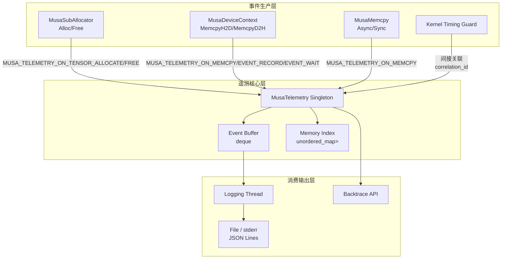
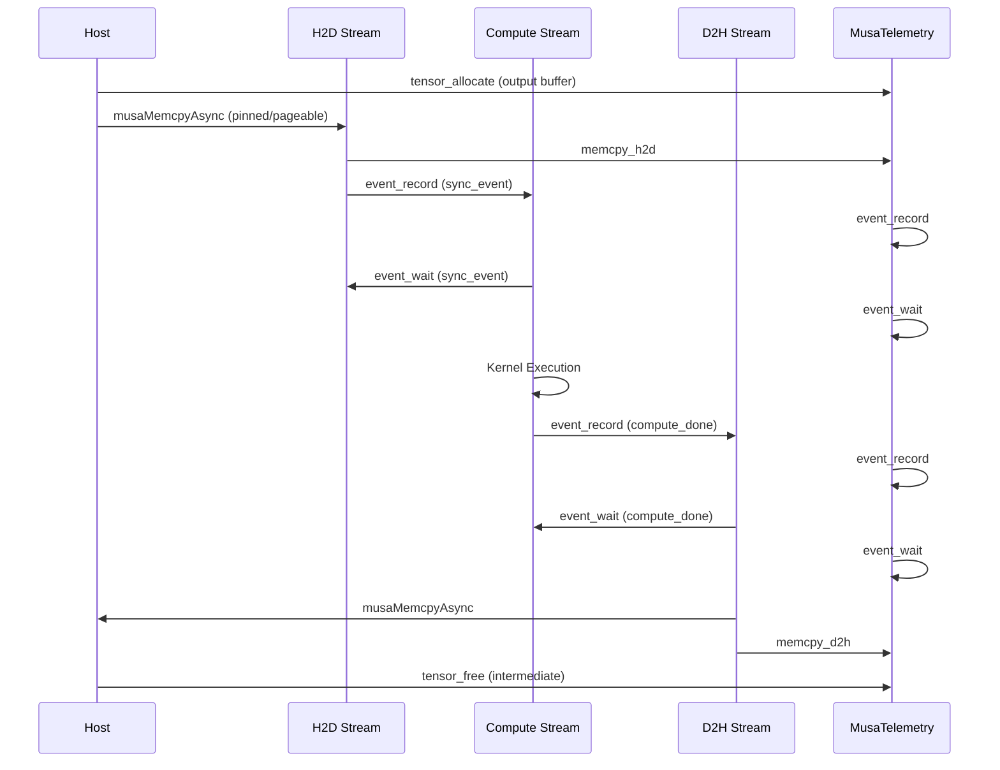

TensorFlow MUSA Extension 的遥测系统（Telemetry）是一套面向生产环境的低开销事件追踪基础设施，它通过在内存分配、数据传输、流同步等关键路径上植入结构化事件记录，实现对 GPU 计算全链路的可观测性。与仅关注 Kernel 执行耗时的性能剖析工具不同，遥测系统的核心价值在于建立**时间—地址—操作**三维关联索引，使得在出现脏数据（NaN）、Use-After-Free（UAF）或跨流竞争条件时，开发者能够执行精确的反向追溯。本页面向高级开发者深入解析遥测系统的架构设计、事件模型、API 语义以及与 Kernel 计时系统的协同使用方式。

Sources: [musa_telemetry.h](musa_ext/mu/device/musa_telemetry.h#L1-L366), [musa_telemetry.cc](musa_ext/mu/device/musa_telemetry.cc#L1-L663), [logging.h](musa_ext/utils/logging.h#L1-L803)

---

## 遥测系统架构设计

遥测系统采用**单例管理器 + 异步日志线程 + 环形内存索引**的三层架构，所有事件采集均为非阻塞操作，对正常计算路径的性能影响被严格限制在纳秒级原子操作与条件判断范围内。



**MusaTelemetry** 以单例模式运行，通过 `__attribute__((constructor))` 在插件动态加载时自动初始化，并在 `__attribute__((destructor))` 时完成优雅关闭。初始化配置完全来自环境变量，由 `TelemetryConfig::FromEnv()` 统一解析，无需修改代码或重新编译即可启用全量追踪。事件缓冲区采用带容量上限的 `std::deque`，当缓冲区满时遵循**最旧丢弃**策略，同时通过原子计数器记录丢弃事件数量，确保在高负载场景下系统不会因内存无限增长而崩溃。

Sources: [musa_telemetry.h](musa_ext/mu/device/musa_telemetry.h#L140-L249), [musa_telemetry.cc](musa_ext/mu/device/musa_telemetry.cc#L222-L308), [device_register.cc](musa_ext/mu/device_register.cc#L87-L106)

---

## 事件类型与数据模型

遥测系统定义了 13 种结构化事件类型，覆盖从显存生命周期到流同步的完整 GPU 操作谱系。每种事件被序列化为 JSON Lines 格式输出，便于使用 `jq`、Python 等工具进行流式解析和聚合分析。

| 事件类型 | 枚举值 | 触发位置 | 核心字段 |
|---|---|---|---|
| `tensor_allocate` | `kTensorAllocate` | `MusaSubAllocator::Alloc` | `memory_addr`, `memory_size`, `tensor_id` |
| `tensor_free` | `kTensorFree` | `MusaSubAllocator::Free` | `memory_addr`, `memory_size`, `tensor_id` |
| `kernel_launch` | `kKernelLaunch` | API 层（预留） | `op_name`, `input_tensor_ids`, `output_tensor_ids` |
| `memcpy_h2d` | `kMemcpyH2D` | `CopyCPUTensorToDevice` | `memory_addr`(dst), `metadata.src_addr` |
| `memcpy_d2h` | `kMemcpyD2H` | `CopyDeviceTensorToCPU` | `memory_addr`(dst), `metadata.src_addr` |
| `memcpy_d2d` | `kMemcpyD2D` | `MusaMemcpyDeviceToDevice` | `memory_addr`(dst), `metadata.src_addr` |
| `event_record` | `kEventRecord` | Stream 同步前 | `event_handle`, `stream_id` |
| `event_wait` | `kEventWait` | Stream 同步时 | `event_handle`, `stream_id`, `source_stream_id` |
| `event_sync` | `kEventSync` | 显式 `musaEventSynchronize` | `event_handle` |
| `stream_sync` | `kStreamSync` | 显式 `musaStreamSynchronize` | `stream_id` |
| `device_sync` | `kDeviceSync` | 显式 `musaDeviceSynchronize` | `device_id` |
| `dirty_data_detected` | `kDirtyDataDetected` | 脏数据检测触发 | `memory_addr`, `metadata.description` |
| `custom` | `kCustom` | `TelemetryScope` 等扩展点 | `op_name`, `metadata.*` |

每条事件均包含 `timestamp_ns`（纳秒精度单调时钟）、`correlation_id`（单调递增全局序号）、`device_id`、`stream_id` 和 `thread_id` 五个通用维度，确保在多设备、多流、多线程并发场景下仍能精确重建时序关系。`stream_id` 通过对 `musaStream_t` 指针做 `reinterpret_cast<uintptr_t>` 得到，其生命周期与底层 Stream 对象一致，可用于跨事件的流关联。

Sources: [musa_telemetry.h](musa_ext/mu/device/musa_telemetry.h#L57-L126), [musa_telemetry.cc](musa_ext/mu/device/musa_telemetry.cc#L111-L220)

---

## 环境变量配置

遥测系统的全部行为由环境变量控制，无需重新编译。下表汇总了遥测专用变量以及常与遥测配合使用的 Kernel 计时变量。

### 遥测系统变量

| 变量名 | 说明 | 默认值 | 典型值 |
|---|---|---|---|
| `MUSA_TELEMETRY_ENABLED` | 启用遥测系统 | `false` | `1` |
| `MUSA_TELEMETRY_LOG_PATH` | 日志输出文件路径 | `stderr` | `/tmp/musa_telemetry.json` |
| `MUSA_TELEMETRY_BUFFER_SIZE` | 事件缓冲区大小 | `10000` | `50000` |
| `MUSA_TELEMETRY_FLUSH_MS` | 日志线程刷新间隔（毫秒） | `100` | `50` |
| `MUSA_TELEMETRY_STACK_TRACE` | 记录事件时附加堆栈追踪 | `false` | `1` |

### Kernel 计时变量（Debug 构建生效）

| 变量名 | 说明 | 默认值 | 典型值 |
|---|---|---|---|
| `MUSA_TIMING_KERNEL_LEVEL` | `0`=关闭，`1`=总耗时，`2`=总耗时+分段耗时 | `0` | `2` |
| `MUSA_TIMING_KERNEL_NAME` | 仅追踪名称匹配的 Kernel（大小写不敏感子串，`ALL` 表示全部） | `ALL` | `MatMul` |
| `MUSA_TIMING_KERNEL_STATS` | 进程退出时打印耗时统计汇总 | `0` | `1` |

需要特别注意的是，Kernel 计时宏仅在 `MUSA_KERNEL_DEBUG` 编译宏启用时才有实际语义（Debug 构建通过 `build.sh debug` 自动开启）；在非 Debug 构建中，所有计时宏会被编译为空操作，完全消除运行时开销。遥测系统则不受构建模式限制，Release 构建下同样可以通过环境变量启用。

Sources: [musa_telemetry.h](musa_ext/mu/device/musa_telemetry.h#L42-L55), [musa_telemetry.cc](musa_ext/mu/device/musa_telemetry.cc#L76-L109), [logging.h](musa_ext/utils/logging.h#L98-L131)

---

## 全链路追踪的数据流

理解遥测事件在实际数据路径中的产生时机，是有效利用该系统进行故障定位的前提。以下以一次典型的 **CPU→GPU 数据拷贝 → Kernel 计算 → GPU→CPU 结果回传** 流程为例，展示遥测事件的产生序列。



在这个序列中，**Event 同步链** 的追踪尤为关键。`event_record` 与 `event_wait` 通过共同的 `event_handle` 关联，而 `source_stream_id` 与 `stream_id` 字段则明确记录了依赖方向。当脏数据被检测到时，通过 `event_handle` 可以在时间线上定位到是哪个 Stream 的哪个操作未正确等待前置事件，从而快速定位跨流同步缺陷。

实际代码中，这些事件的埋点分布在 `MusaDeviceContext::CopyCPUTensorToDevice` 和 `CopyDeviceTensorToCPU` 中。例如，在 H2D 拷贝路径上，当 `sync_dst_compute=true` 时，系统先在计算流上记录 `event_record`，再通知 H2D 流执行 `event_wait`，两个操作之间通过 `MUSA_TELEMETRY_ON_EVENT_RECORD` 和 `MUSA_TELEMETRY_ON_EVENT_WAIT` 宏产生配对遥测事件。

Sources: [musa_device.cc](musa_ext/mu/device/musa_device.cc#L49-L198), [musa_device.cc](musa_ext/mu/device/musa_device.cc#L200-L320)

---

## 反向追溯 API

遥测系统不仅提供前向事件日志，还维护了一个**内存操作索引**（Memory Index），用于支持高效的反向追溯查询。索引以 4KB 页面对齐地址为键，每个页面保留最近 100 条内存相关操作记录，在有限内存开销下提供足够的诊断深度。

### 按地址追溯

当脏数据检测报出具体内存地址时，可通过 `BacktraceByAddress` 查询该地址所在页面最近的 N 次操作，返回结果按时间倒序排列（最近的操作在前）。

```cpp
auto records = MusaTelemetry::Instance().BacktraceByAddress(addr, 10);
for (const auto& r : records) {
  LOG(INFO) << "Op: " << r.op_name
            << " Time: " << r.timestamp_ns
            << " Stream: " << r.stream_id;
}
```

### 按时间范围追溯

`BacktraceByTime(start_ns, end_ns)` 用于在已知脏数据产生大致时间窗口的场景下，枚举该窗口内所有页面的内存操作。返回结果全局按时间倒序排序。

### 按 Tensor ID 追溯

每个 Tensor 在分配时会被分配唯一的 `tensor_id`（由原子计数器 `tensor_id_counter_` 生成）。`BacktraceByTensorId(tensor_id, count)` 遍历全部内存索引，筛选出与该 Tensor 相关的所有操作记录。这一 API 在追踪 Tensor 生命周期（例如判断某个中间 Tensor 是否在非法释放后被复用）时非常有用。

这三个 API 均受 `IsEnabled()` 保护：当遥测未启用时直接返回空向量，避免在诊断代码中引入额外的分支复杂度。索引更新操作 `UpdateMemoryIndex` 在 `RecordEvent` 的临界区外异步执行，但本身受独立的 `index_mutex_` 保护，确保查询与更新的线程安全。

Sources: [musa_telemetry.h](musa_ext/mu/device/musa_telemetry.h#L179-L188), [musa_telemetry.cc](musa_ext/mu/device/musa_telemetry.cc#L420-L498), [musa_telemetry.cc](musa_ext/mu/device/musa_telemetry.cc#L586-L622)

---

## 与 Kernel 计时系统的协同

遥测系统记录**发生了什么**（事件语义），而 Kernel 计时系统记录**花了多少时间**（性能语义）。两者在 Debug 构建下可以协同工作，形成从宏观事件流到底层性能热点的完整诊断视图。

### Kernel 计时 Guard 的使用模式

在算子实现中，通常使用 `MUSA_KERNEL_TIMING_GUARD(ctx)` 作为作用域入口，它会在 `KernelTimingScope` 构造时启动总计时器（通过 `musaEventRecord` 记录到目标 Stream），在析构时自动同步并输出 Host 总耗时与 Device 总耗时。

```cpp
void Compute(OpKernelContext* ctx) override {
  MUSA_KERNEL_TIMING_GUARD(ctx);  // 自动以 op 名称为标识
  // ... 算子逻辑 ...
}
```

对于复杂算子，可以使用分段计时精细定位瓶颈：

```cpp
MUSA_KERNEL_TRACE_START("Mem Alloc");
Tensor* out = nullptr;
OP_REQUIRES_OK(ctx, ctx->allocate_output(0, shape, &out));
MUSA_KERNEL_TRACE_END("Mem Alloc");

MUSA_KERNEL_TRACE_START("Kernel");
op.Run(handle, out, in0, in1);
MUSA_KERNEL_TRACE_END("Kernel");
```

当 `MUSA_TIMING_KERNEL_LEVEL=2` 时，Level 1 的输出（总耗时）会与 Level 2 的分段耗时在同一条日志中合并输出。若某段耗时为 0（低于 0.0005ms 阈值），默认会被省略以保持日志可读性；若需在调试中保留零值段，可在 `KernelTimingStageSpec` 中设置 `show_zero=true`。

### 统计汇总

设置 `MUSA_TIMING_KERNEL_STATS=1` 后，`KernelTimingStatsRegistry` 会在进程退出时（通过静态析构触发 `KernelTimingStatsPrinter`）打印所有被追踪 Kernel 的调用次数、总耗时、平均耗时、最小和最大耗时的汇总表格，按总耗时降序排列，便于快速识别性能热点。

Sources: [logging.h](musa_ext/utils/logging.h#L238-L308), [logging.h](musa_ext/utils/logging.h#L153-L236), [musa_add_op.cc](musa_ext/kernels/math/musa_add_op.cc#L283-L352)

---

## 诊断实战：脏数据反向追溯

脏数据（如 NaN、Inf）是深度学习训练中最难定位的问题之一，因为其产生点与报错点往往存在时间和空间上的远距离传播。遥测系统的典型诊断流程如下：

**步骤一：启用遥测并复现问题**

```bash
export MUSA_TELEMETRY_ENABLED=1
export MUSA_TELEMETRY_LOG_PATH=/tmp/musa_telemetry.json
export MUSA_TELEMETRY_BUFFER_SIZE=50000
python train.py  # 复现脏数据问题
```

**步骤二：定位脏数据检测事件**

遥测系统在检测到脏数据时会立即执行 `FlushEvents()`，确保该事件被持久化到日志中，同时向 stderr 输出高可见度的错误行。

```bash
grep "dirty_data_detected" /tmp/musa_telemetry.json
```

典型输出：
```json
{"timestamp_ns":279876543212000,"event_type":"dirty_data_detected","correlation_id":100,"device_id":0,"memory_addr":"0x7f1234560000","memory_size":2048,"op_name":"DirtyDataDetected","metadata":{"description":"NaN detected in MatMul output tensor"}}
```

**步骤三：按地址追溯操作历史**

提取问题地址 `0x7f1234560000`，查询该地址所在页面最近的 10 次操作：

```python
import json

target_addr = "0x7f1234560000"
with open("/tmp/musa_telemetry.json") as f:
    for line in f:
        event = json.loads(line)
        if event.get("memory_addr") == target_addr:
            print(json.dumps(event, indent=2))
```

分析时应重点关注三类模式：
1. **tensor_allocate → tensor_free → kernel_launch**：表明可能存在 Use-After-Free，Kernel 写入了已释放的内存。
2. **memcpy_h2d 与 kernel_launch 的 Stream 不一致**：表明数据拷贝与计算之间存在跨流竞争，同步事件可能缺失。
3. **event_wait 缺失**：若 kernel_launch 前没有对应的 event_wait，则其读取的输入 Tensor 可能尚未完成上游写入。

Sources: [musa_telemetry.cc](musa_ext/mu/device/musa_telemetry.cc#L401-L418), [docs/DEBUG_GUIDE.md](docs/DEBUG_GUIDE.md#L271-L284)

---

## 内存诊断与遥测的联动

遥测系统与 [内存诊断与脏数据检测](18-nei-cun-zhen-duan-yu-zang-shu-ju-jian-ce) 页面介绍的 `MemoryForensicsTracker` 存在互补关系。`MemoryForensicsTracker` 专注于**分配历史**和**魔法数字检测**（Magic Number），在 Debug 构建下通过 `MusaSubAllocator` 的 `Alloc/Free` 钩子填充 `0xABABABAB`（分配）和 `0xCDCDCDCD`（释放）模式；而遥测系统则专注于**时间线事件**和**跨操作关联**。

两者的联动点体现在 `MusaSubAllocator` 的分配路径上：每次 `musaMalloc` 成功后，系统先调用 `MemoryForensicsTracker::RecordAllocation` 记录分配历史并获取 `tensor_id`，再调用 `MUSA_TELEMETRY_ON_TENSOR_ALLOCATE` 产生遥测事件。这意味着同一个物理地址在 `MemoryForensicsTracker` 的分配历史与遥测系统的操作索引中均留有记录，开发者可以在两个维度上交叉验证。

当 `MemoryColoringConfig` 检测到 Use-After-Free 时，它会向 stderr 输出警告并更新统计计数器；如果此时遥测系统也已启用，开发者可以进一步通过 `BacktraceByAddress` 获取该地址最近的操作序列，将静态的分配历史扩展为动态的全链路时间线。

Sources: [musa_allocator.h](musa_ext/mu/device/musa_allocator.h#L308-L400), [musa_allocator.h](musa_ext/mu/device/musa_allocator.h#L121-L297)

---

## 性能影响与生产环境使用建议

遥测系统在设计时将性能影响作为首要约束。在禁用状态下（默认），所有 `MUSA_TELEMETRY_*` 宏通过 `IsEnabled()` 进行零开销短路，不会触发任何原子操作或内存访问。在启用状态下，核心路径上的开销分解如下：

| 操作 | 开销量级 | 说明 |
|---|---|---|
| `IsEnabled()` 检查 | 原子读操作（纳秒级） | `std::atomic<bool>` 的 `load` |
| `RecordEvent()` 入队 | 互斥锁 + deque push_back（微秒级） | 短暂持有 `event_mutex_` |
| `UpdateMemoryIndex()` | 独立互斥锁 + unordered_map 查找（微秒级） | 与事件缓冲区解耦 |
| 日志线程刷新 | 批量 IO（毫秒级，后台执行） | 每 `flush_interval_ms` 触发一次 |

**生产环境建议**：
1. **问题复现阶段**启用遥测，使用较大的缓冲区（如 `50000`）和适中的刷新间隔（如 `100ms`），避免事件丢弃。
2. **常规训练阶段**关闭遥测，仅保留 `MUSA_TIMING_KERNEL_LEVEL=1` 进行轻量级性能监控。
3. 当怀疑存在**跨流同步缺陷**时，优先关注 `event_record` 与 `event_wait` 的配对完整性，可通过 `grep` 快速统计两者数量是否均衡。
4. 若遥测日志体积过大，可定向过滤特定 Kernel 或 Stream，使用 `jq` 等工具进行流式压缩归档。

Sources: [musa_telemetry.cc](musa_ext/mu/device/musa_telemetry.cc#L288-L311), [musa_telemetry.cc](musa_ext/mu/device/musa_telemetry.cc#L544-L584)

---

## 相关页面

- 若需要了解 Kernel 计时宏的详细使用方法和性能剖析技巧，请参阅 [Kernel 计时与性能剖析](16-kernel-ji-shi-yu-xing-neng-pou-xi)。
- 若需要深入理解内存染色（Memory Coloring）、Use-After-Free 检测原理及魔法数字机制，请参阅 [内存诊断与脏数据检测](18-nei-cun-zhen-duan-yu-zang-shu-ju-jian-ce)。
- 若需要查看所有调试环境变量的快速参考，请参阅 [调试环境变量速查](19-diao-shi-huan-jing-bian-liang-su-cha)。