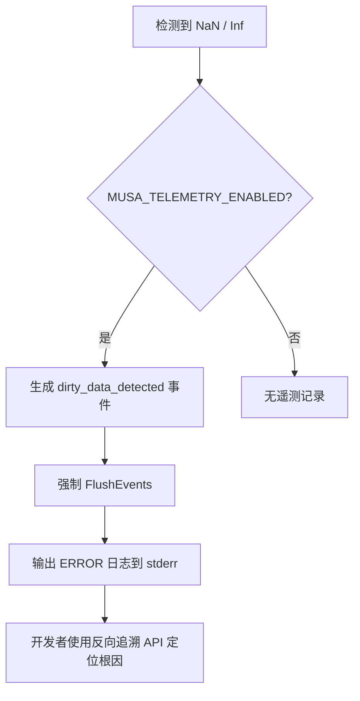

TensorFlow MUSA Extension 的内存诊断体系围绕三个互补层级构建：**内存染色（Memory Coloring）**在设备内存层面标记未初始化和已释放区域，**内存取证追踪器（Memory Forensics Tracker）**在分配器层面记录全生命周期历史并检测 Use-After-Free（UAF），**遥测系统（MusaTelemetry）**则在运行时层面建立时间—地址—操作三维索引以实现脏数据反向追溯。这三层机制共同覆盖了从预防、检测到根因定位的完整闭环，使高级开发者能够在不修改业务代码的前提下，仅通过环境变量和运行时 API 即可对 GPU 内存异常进行系统性排查。

## 内存染色与未初始化检测

内存染色机制通过 `MusaSubAllocator` 在每次 `musaMalloc` 和 `musaFree` 时注入魔数填充，从而在硬件层面暴露两类最常见的内存错误：未初始化读取与 Use-After-Free。系统在分配成功后会调用 `ApplyMemoryColoring`，以字节值 `0xAB` 填满整块设备内存；在释放前则调用 `ApplyFreePattern`，以字节值 `0xCD` 覆盖原内存区域。由于 musaMemset 以字节为单位执行，最终呈现的四字节魔数分别为 `0xABABABAB`（分配态）与 `0xCDCDCDCD`（释放态）。当 Kernel 读取到这些特征值时，即可高度怀疑存在未初始化访问或指针悬空问题。该功能默认受编译宏 `TF_MUSA_MEMORY_COLORING` 控制，也可在运行时通过 `MemoryColoringConfig` 单例动态启用。

Sources: [musa_allocator.h](musa_ext/mu/device/musa_allocator.h#L31-L76), [musa_allocator.h](musa_ext/mu/device/musa_allocator.h#L424-L439)

| 魔数字节 | 四字节模式 | 触发时机 | 诊断意义 |
|---|---|---|---|
| `0xAB` | `0xABABABAB` | 分配后填充 | 检测到该值说明 Kernel 可能读取了未初始化内存 |
| `0xCD` | `0xCDCDCDCD` | 释放后填充 | 检测到该值说明存在 Use-After-Free |

在释放路径上，`VerifyMemoryColoring` 会执行一次采样回读（默认最多 4096 字节），若发现已释放魔数 `0xCDCDCDCD` 仍出现在"待释放"内存中，则立即上报 UAF 并触发 `MemoryForensicsTracker::RecordCorruption`。这种在释放前进行的被动采样检查，避免了全量回读带来的性能开销，同时保留了关键检测能力。

Sources: [musa_allocator.h](musa_ext/mu/device/musa_allocator.h#L441-L471)

## 内存取证追踪器

`MemoryForensicsTracker` 是一个进程级单例，独立于遥测系统运行，专门维护两张核心表：`active_allocations_` 记录当前仍有效的地址映射，`allocation_history_` 则保留每个物理地址的完整分配—释放历史链。每次 `musaMalloc` 成功后，`RecordAllocation` 会生成唯一的 `alloc_id`，并将包含时间戳、设备 ID、Stream 哈希的 `AllocationRecord` 写入两张表；`RecordFree` 则会将对应记录标记为非活跃，并更新统计计数。如果在 `Free` 时遇到未在 `active_allocations_` 中登记的地址，系统会立即输出 WARNING 并累加 `stats_.uaf_detected`，从而捕获双重释放或悬垂指针解引用。

Sources: [musa_allocator.h](musa_ext/mu/device/musa_allocator.h#L120-L160), [musa_allocator.h](musa_ext/mu/device/musa_allocator.h#L162-L203)

取证追踪器还提供了结构化报表生成能力。通过 `GenerateReport(void* ptr)`，开发者可以获取指定地址的 Markdown 格式历史表，包含每次分配/释放的时间戳、操作类型、大小、设备号及活跃状态；配合 `GetMemoryStats()` 则可查看进程级的总分配次数、活跃字节数、UAF 与损坏检测计数。这些 API 在调试会话或 CI 失败复现场景中尤为实用，能够将偶发的内存异常转化为可归档、可对比的量化数据。

Sources: [musa_allocator.h](musa_ext/mu/device/musa_allocator.h#L249-L279), [musa_allocator.h](musa_ext/mu/device/musa_allocator.h#L508-L516)

## 遥测驱动的脏数据诊断

虽然内存染色和取证追踪器擅长捕获显式的内存破坏，但深度学习训练中的"脏数据"往往表现为更隐蔽的 NaN 传播或数值漂移，其根因通常是跨流同步缺失、Event 过早销毁或 Kernel 越界写。针对这类问题，遥测系统通过 `MusaTelemetry::OnDirtyDataDetected` 提供了显式埋点接口，并在内部维护了一套以页对齐地址为键的内存操作索引 `memory_index_`。

当业务代码或调试工具检测到可疑数值（如 NaN、Inf）时，可调用宏 `MUSA_TELEMETRY_ON_DIRTY_DATA(addr, size, device_id, desc)`。该宏在遥测启用时会立即执行两件事：首先，生成一条 `dirty_data_detected` 类型的 JSON 事件并强制刷新到日志，确保脏数据信号不因缓冲区延迟而丢失；其次，向 stderr 输出高可见度的 `DIRTY DATA DETECTED` 错误行，包含物理地址、大小与描述信息。

Sources: [musa_telemetry.h](musa_ext/mu/device/musa_telemetry.h#L328-L334), [musa_telemetry.cc](musa_ext/mu/device/musa_telemetry.cc#L401-L418)



## 内存操作索引与反向追溯

`MusaTelemetry` 在 `RecordEvent` 的异步路径上同步调用 `UpdateMemoryIndex`，将每条内存相关事件（分配、释放、Kernel 启动、各类 Memcpy）按页对齐地址归档到 `memory_index_` 中。每个页面对应一个 `std::deque<MemoryOpRecord>`，上限保留最近 100 条操作，以控制索引内存的无限增长。这一设计使得遥测系统能够在不扫描全量事件缓冲区的情况下，以 O(1) 的地址哈希查询复杂度快速定位某块内存的历史操作。

Sources: [musa_telemetry.cc](musa_ext/mu/device/musa_telemetry.cc#L288-L311), [musa_telemetry.cc](musa_ext/mu/device/musa_telemetry.cc#L586-L622)

基于该索引，系统暴露了三维反向追溯 API：

| API | 语义 | 适用场景 |
|---|---|---|
| `BacktraceByAddress(addr, count)` | 返回指定地址所在页最近 N 次操作 | 已知脏数据物理地址，需回溯最近写者 |
| `BacktraceByTime(start_ns, end_ns)` | 返回时间窗口内所有内存操作 | 已知脏数据出现时间戳，需关联同窗口内其他操作 |
| `BacktraceByTensorId(tensor_id, count)` | 返回指定 Tensor 的最近 N 次操作 | 已知问题 Tensor，需追踪其跨算子流转 |

三个 API 返回的 `MemoryOpRecord` 均按时间逆序排列（最近的操作在前），字段包含时间戳、操作类型、内存地址、Tensor ID、Stream ID 及算子名。在 Python 侧或 C++ 调试器中，开发者可直接将遥测日志与反向追溯结果交叉比对，快速锁定导致数值异常的算子或拷贝步骤。

Sources: [musa_telemetry.h](musa_ext/mu/device/musa_telemetry.h#L179-L188), [musa_telemetry.cc](musa_ext/mu/device/musa_telemetry.cc#L420-L498)

## 跨流同步与脏数据根因

在 TensorFlow MUSA Extension 的设备上下文实现中，一个高频的脏数据来源是跨流 Event 同步的时序错误。以 `CopyDeviceTensorToCPU` 为例：计算流完成 Kernel 执行后需向 D2H 拷贝流发信号，标准做法是 `musaEventRecord` 后立即 `musaStreamWaitEvent`，但 `musaStreamWaitEvent` 是异步入队的——如果调用者在等待命令真正执行前就销毁了 Event，目标流可能直接跳过等待，导致拷贝操作与上游计算重叠，产生竞争条件（race condition）和脏数据。

代码中的修复策略是：当 `event_mgr_` 可用时，通过 `ThenExecute` 将 `musaEventDestroy` 延迟到 D2H 流实际完成该等待命令之后执行；仅在 `event_mgr_` 不可用时，才回退到保守的 `musaStreamSynchronize`。遥测系统在该路径上通过 `MUSA_TELEMETRY_ON_EVENT_RECORD` 和 `MUSA_TELEMETRY_ON_EVENT_WAIT` 生成配对事件，使得事后分析可以验证 Event 生命周期与 Stream 等待命令之间是否存在异常间隙。

Sources: [musa_device.cc](musa_ext/mu/device/musa_device.cc#L72-L95), [musa_device.cc](musa_ext/mu/device/musa_device.cc#L232-L256)

## 启用诊断功能

内存诊断与脏数据检测的全部能力均可通过环境变量和编译开关启用，无需修改业务算子代码。

| 环境变量 / 编译开关 | 作用域 | 默认值 | 说明 |
|---|---|---|---|
| `TF_MUSA_MEMORY_COLORING` | 编译期 | 未定义 | 定义后默认开启内存染色与取证追踪 |
| `MUSA_TELEMETRY_ENABLED` | 运行时 | `false` | 启用遥测事件记录与脏数据检测 |
| `MUSA_TELEMETRY_LOG_PATH` | 运行时 | `stderr` | 遥测日志输出路径，建议使用 JSON Lines 文件 |
| `MUSA_TELEMETRY_BUFFER_SIZE` | 运行时 | `10000` | 事件缓冲区上限，超限时丢弃最旧事件 |
| `MUSA_TELEMETRY_FLUSH_MS` | 运行时 | `100` | 日志线程刷新间隔，脏数据事件会强制立即刷新 |
| `MUSA_TELEMETRY_STACK_TRACE` | 运行时 | `false` | 是否在事件元数据中包含堆栈追踪 |

在分配器层面，`MemoryColoringConfig` 提供了三组运行时开关：`enabled()` 控制分配/释放时的魔数填充，`track_history()` 控制 `MemoryForensicsTracker` 的历史记录，`verify_on_free()` 控制释放前的采样验证。这三者在编译期启用 `TF_MUSA_MEMORY_COLORING` 时全部默认开启，但也可在运行时通过 `EnableMemoryColoring(false)` 等辅助函数局部关闭，以在生产环境中平衡诊断开销与性能。

Sources: [musa_telemetry.h](musa_ext/mu/device/musa_telemetry.h#L41-L55), [musa_allocator.h](musa_ext/mu/device/musa_allocator.h#L47-L76)

## 实战诊断流程

当模型训练或算子测试中出现 NaN 或数值异常时，推荐按以下步骤执行内存诊断：

**步骤一：复现并启用遥测**。在复现命令前导出环境变量，确保捕获完整的事件序列：

```bash
export MUSA_TELEMETRY_ENABLED=1
export MUSA_TELEMETRY_LOG_PATH=/tmp/musa_telemetry.json
export MUSA_TELEMETRY_BUFFER_SIZE=50000
```

**步骤二：定位脏数据事件**。运行测试后，在日志中检索脏数据标记：

```bash
grep "dirty_data_detected" /tmp/musa_telemetry.json
```

若遥测中未显式调用 `MUSA_TELEMETRY_ON_DIRTY_DATA`，也可通过内存染色机制间接发现——当 Kernel 输出包含大量 `0xABABABAB` 或 `0xCDCDCDCD` 时，说明存在未初始化读取或 UAF。

**步骤三：地址反向追溯**。提取问题地址后，使用遥测索引回溯最近操作。若使用 C++ 调试器附加到进程，可直接调用：

```cpp
auto records = MusaTelemetry::Instance().BacktraceByAddress(addr, 20);
```

**步骤四：交叉验证 Event 同步**。在追溯结果中关注 `event_record` 与 `event_wait` 的配对关系，检查问题地址所在 Tensor 是否在未经正确同步的情况下被跨流拷贝或复用。遥测日志中的 `source_stream_id` 与 `stream_id` 字段可帮助确认同步方向是否正确。

**步骤五：生成取证报告**。若怀疑是分配器层面的 UAF 或双重释放，调用取证 API 获取详细历史：

```cpp
LOG(INFO) << GetMemoryForensicsReport(ptr);
LOG(INFO) << GetMemoryStats().uaf_detected;
```

Sources: [docs/DEBUG_GUIDE.md](docs/DEBUG_GUIDE.md#L155-L175), [musa_allocator.h](musa_ext/mu/device/musa_allocator.h#L508-L516)

## 性能开销与生产建议

在默认禁用状态下，所有遥测宏通过 `IsEnabled()` 短路，不产生任何原子操作或内存访问，属于零开销抽象。在启用状态下，单次 `RecordEvent` 的开销主要包括一次互斥锁竞争、一次 `deque` 入队以及一次条件变量通知；内存索引更新则在同一临界区内完成，但仅对内存相关事件触发，且每页面最多保留 100 条记录。内存染色机制在分配路径上额外引入一次 `musaMemset`，释放路径上可能引入一次 4KB 量级的 `musaMemcpy` 回读，对大规模训练而言影响可控，但在极致性能场景下建议仅在小批量复现阶段启用。

若需进一步降低遥测对热路径的影响，可在编译时定义 `MUSA_DISABLE_TRACE_LOGGING`，这将使所有 `MUSA_TELEMETRY_*` 宏退化为空语句，彻底移除运行期分支。取证追踪器的历史记录同样可通过 `EnableMemoryHistoryTracking(false)` 在运行时关闭，仅保留染色填充本身。

Sources: [musa_telemetry.h](musa_ext/mu/device/musa_telemetry.h#L345-L361), [musa_allocator.h](musa_ext/mu/device/musa_allocator.h#L492-L502)

## 与上下游工具的协同

内存诊断并非孤立工作。在排查数值异常时，建议将本页工具与以下系统联动使用：

- **[Kernel 计时与性能剖析](16-kernel-ji-shi-yu-xing-neng-pou-xi)**：通过 `MUSA_TIMING_KERNEL_LEVEL=2` 获取问题算子的分段耗时，判断是否存在因同步缺失导致的异常短耗时（例如拷贝在未等待计算完成时就开始）。
- **[遥测系统与全链路追踪](17-yao-ce-xi-tong-yu-quan-lian-lu-zhui-zong)**：获取更完整的事件模型解读、缓冲区管理细节与 JSON Lines 日志分析技巧。
- **[调试环境变量速查](19-diao-shi-huan-jing-bian-liang-su-cha)**：作为所有调试开关的集中索引页，便于快速查阅未在本页列出的其他诊断选项。