TensorFlow MUSA Extension 的运行时行为大量依赖环境变量进行开关控制与行为微调。对于中级开发者而言，在诊断性能瓶颈、定位脏数据、验证图优化或隔离特定设备行为时，频繁翻阅源码来确认变量名和取值语义是低效的。本文档作为一份**运行时调控手册**，将所有散布在 C++ Kernel、Grappler 优化器、Python 测试框架以及遥测子系统中的环境变量聚合为一张可检索的速查表，并针对典型调试场景给出可直接复制执行的组合命令。阅读前若对 Kernel 计时、遥测系统或图优化器内部机制尚不熟悉，建议先浏览 [Kernel 计时与性能剖析](16-kernel-ji-shi-yu-xing-neng-pou-xi)、[遥测系统与全链路追踪](17-yao-ce-xi-tong-yu-quan-lian-lu-zhui-zong) 以及 [Grappler 图优化器架构](13-grappler-tu-you-hua-qi-jia-gou) 等前置章节。

Sources: [docs/DEBUG_GUIDE.md](docs/DEBUG_GUIDE.md#L1-L4), [musa_ext/utils/logging.h](musa_ext/utils/logging.h#L98-L120), [musa_ext/mu/device/musa_telemetry.cc](musa_ext/mu/device/musa_telemetry.cc#L78-L109)

---

## 按场景速查总表

下表按**调试场景**将所有环境变量划分为六大类，涵盖性能剖析、图诊断、脏数据追溯、内存安全、测试执行与日志降噪。对于每个变量，表格给出推荐取值、生效层级以及是否需要 Debug 构建（`-DMUSA_KERNEL_DEBUG=ON`）。

| 场景分类 | 变量名 | 推荐取值 | 生效层级 | 需 Debug 构建 |
|:---|:---|:---|:---|:---|
| **Kernel 计时** | `MUSA_TIMING_KERNEL_LEVEL` | `1`（仅总耗时）或 `2`（总耗时+分段） | C++ Kernel | ✅ 是 |
| | `MUSA_TIMING_KERNEL_NAME` | `ALL` 或子串如 `MatMul` | C++ Kernel | ✅ 是 |
| | `MUSA_TIMING_KERNEL_STATS` | `1`（进程退出打印汇总） | C++ Kernel | ✅ 是 |
| **图优化诊断** | `MUSA_DUMP_GRAPHDEF` | `1` / `true` / `yes` | C++ Grappler | ❌ 否 |
| | `MUSA_DUMP_GRAPHDEF_DIR` | `/tmp/graphs` | C++ Grappler | ❌ 否 |
| | `MUSA_DISABLE_GRAPPLER` | `1` | C++ Grappler | ❌ 否 |
| **算子行为控制** | `MUSA_ENABLE_TF32` | `1`（MatMul/Conv 等启用 TF32） | C++ Kernel | ❌ 否 |
| | `MUSA_AUTO_MIXED_PRECISION` | `1` | C++ Grappler | ❌ 否 |
| | `MUSA_AMP_MODE` | `FP16` 或 `BF16` | C++ Grappler | ❌ 否 |
| | `MUSA_DISABLE_GELU_FUSION` | `1` / `true` / `on` | C++ Fusion | ❌ 否 |
| | `MUSA_ADDV2_ENABLE_BCAST_VIEW_OPT` | `0` 或 `false`（显式禁用） | C++ Kernel | ❌ 否 |
| | `MUSA_ADDV2_ENABLE_CUSTOM_KERNEL` | `0` 或 `false`（显式禁用） | C++ Kernel | ❌ 否 |
| **遥测与诊断** | `MUSA_TELEMETRY_ENABLED` | `1` / `true` | C++ Runtime | ❌ 否 |
| | `MUSA_TELEMETRY_LOG_PATH` | `/tmp/telemetry.json` | C++ Runtime | ❌ 否 |
| | `MUSA_TELEMETRY_BUFFER_SIZE` | `50000` | C++ Runtime | ❌ 否 |
| | `MUSA_TELEMETRY_FLUSH_MS` | `50` | C++ Runtime | ❌ 否 |
| | `MUSA_TELEMETRY_STACK_TRACE` | `1` / `true` | C++ Runtime | ❌ 否 |
| **测试与设备** | `MUSA_VISIBLE_DEVICES` | `0` 或 `0,1` | C++ Runtime / Python | ❌ 否 |
| | `MUSA_TEST_DEVICE` / `TF_MUSA_TEST_DEVICE` | `0`, `1`, ... | Python Test | ❌ 否 |
| | `MUSA_RUN_LARGE_TESTS` | `1`（任意非空值） | Python Test | ❌ 否 |
| | `MUSA_RUN_PERF_TESTS` | `1`（任意非空值） | Python Test | ❌ 否 |
| | `MUSA_PLUGIN_PATH` | `/path/to/libmusa_plugin.so` | Python Benchmark | ❌ 否 |
| **日志降噪** | `TF_CPP_MIN_LOG_LEVEL` | `0`=INFO, `1`=WARNING, `2`=ERROR | TensorFlow | ❌ 否 |
| | `TF_CPP_VMODULE` | `musa_graph_optimizer=1,fusion_pattern_manager=1` | TensorFlow | ❌ 否 |

上表中部分变量存在向后兼容的简写别名。例如 `MUSA_KERNEL_LEVEL` 等价于 `MUSA_TIMING_KERNEL_LEVEL`，`MUSA_KERNEL_NAME` 等价于 `MUSA_TIMING_KERNEL_NAME`，`MUSA_KERNEL_STATS` 等价于 `MUSA_TIMING_KERNEL_STATS`。系统会优先读取带 `TIMING` 前缀的完整名称，若未设置再回退到短别名。这种设计允许在频繁切换调试场景时减少输入长度。

Sources: [musa_ext/utils/logging.h](musa_ext/utils/logging.h#L98-L120), [musa_ext/mu/optimizer/graph_utils.cc](musa_ext/mu/optimizer/graph_utils.cc#L35-L52), [musa_ext/mu/optimizer/musa_graph_optimizer.cc](musa_ext/mu/optimizer/musa_graph_optimizer.cc#L321-L353), [test/ops/apply_adamax_op_test.py](test/ops/apply_adamax_op_test.py#L93-L94), [test/test_runner.py](test/test_runner.py#L26)

---

## 调试场景决策图

面对一个具体的异常或性能问题，选择正确的环境变量组合往往比逐个尝试更高效。下图展示了一条从**问题现象**到**推荐环境变量集合**的决策路径。

```mermaid
flowchart TD
    A[遇到运行问题] --> B{问题类型?}
    B -->|性能低于预期| C[Kernel 计时]
    B -->|图优化结果不符预期| D[图 Dump & Grappler 日志]
    B -->|输出含 NaN / 脏数据| E[遥测全链路追踪]
    B -->|内存异常 / Use-After-Free| F[遥测 + 内存染色]
    B -->|特定算子行为异常| G[算子开关变量]
    B -->|日志过多难以定位| H[TF_CPP 日志控制]

    C --> C1[export MUSA_TIMING_KERNEL_LEVEL=2]
    C --> C2[export MUSA_TIMING_KERNEL_NAME=ALL]
    C --> C3[export MUSA_TIMING_KERNEL_STATS=1]

    D --> D1[export MUSA_DUMP_GRAPHDEF=1]
    D --> D2[export TF_CPP_VMODULE='musa_graph_optimizer=1']
    D --> D3[export MUSA_DISABLE_GRAPPLER=1<br/>用于对照实验]

    E --> E1[export MUSA_TELEMETRY_ENABLED=1]
    E --> E2[export MUSA_TELEMETRY_LOG_PATH=/tmp/telemetry.json]
    E --> E3[grep dirty_data_detected /tmp/telemetry.json]

    F --> F1[Debug 构建: ./build.sh debug]
    F --> F2[export MUSA_TELEMETRY_ENABLED=1]
    F --> F3[检查 0xCDCDCDCD 模式]

    G --> G1[export MUSA_ENABLE_TF32=0<br/>排除精度问题]
    G --> G2[export MUSA_DISABLE_GELU_FUSION=1<br/>禁用特定融合]
    G --> G3[export MUSA_ADDV2_ENABLE_CUSTOM_KERNEL=0<br/>回退到默认实现]

    H --> H1[export TF_CPP_MIN_LOG_LEVEL=2]
    H --> H2[export TF_CPP_VMODULE='musa_graph_optimizer=1']
```



上述决策树中的每个分支在下文均有更详细的取值语义说明与命令示例。

Sources: [docs/DEBUG_GUIDE.md](docs/DEBUG_GUIDE.md#L241-L299)

---

## Kernel 性能调试变量

Kernel 计时子系统仅在 Debug 构建下编译生效（由 `build.sh debug` 开启 `-DMUSA_KERNEL_DEBUG=ON`）。其配置通过三个环境变量注入，读取逻辑集中在 `GetKernelTimingConfig()` 中一次性完成，随后在整个进程生命周期内保持静态。`MUSA_TIMING_KERNEL_LEVEL` 控制输出粒度：`0` 完全关闭计时；`1` 仅打印每个 Kernel 的总耗时；`2` 额外展开代码中通过 `MUSA_KERNEL_TRACE_START/END` 埋点的分段耗时。若只需要关注特定算子，可设置 `MUSA_TIMING_KERNEL_NAME` 进行大小写不敏感的子串过滤，例如设为 `MatMul` 时，所有名称中包含该子串的 Kernel 都会被记录，而其余 Kernel 保持静默。当 `MUSA_TIMING_KERNEL_STATS` 设为 `1` 时，进程退出前会自动汇总每个被跟踪 Kernel 的调用次数、总耗时与平均耗时，便于快速识别热点。

Sources: [musa_ext/utils/logging.h](musa_ext/utils/logging.h#L98-L131), [build.sh](build.sh#L22-L40)

## 图优化与算子行为控制变量

图优化层的变量主要用于观察、干预或关闭 Grappler 优化器的行为。`MUSA_DUMP_GRAPHDEF` 和 `MUSA_DUMP_GRAPHDEF_DIR` 是一对协同变量：当前者被设为 `1`、`true`、`TRUE` 或 `yes` 中的任意一个时，Grappler 优化器会在每个优化阶段前后将当前图结构序列化为 `.pbtxt` 文本文件，输出目录由后者指定，缺省值为当前工作目录。文件名遵循 `{optimizer_name}_{dump_id}_{stage}.pbtxt` 的格式，可直接用文本编辑器或 Netron 打开分析。`MUSA_DISABLE_GRAPPLER` 是一个总开关，设为 `1` 后会将常量折叠、算子重映射、算术优化与形状优化全部关闭，常用于验证某个 Bug 是否由图优化引入。

Sources: [musa_ext/mu/optimizer/graph_utils.cc](musa_ext/mu/optimizer/graph_utils.cc#L35-L52), [musa_ext/mu/optimizer/graph_utils.cc](musa_ext/mu/optimizer/graph_utils.cc#L109-L141), [musa_ext/mu/optimizer/musa_graph_optimizer.cc](musa_ext/mu/optimizer/musa_graph_optimizer.cc#L344-L353)

在算子行为层面，`MUSA_ENABLE_TF32` 控制 MatMul、Conv2D、TensorDot 等计算密集型算子是否启用 TF32 精度加速。不同算子对该变量的默认回退策略存在差异，部分实现默认开启，部分默认关闭，因此建议在需要确定性精度的场景中始终显式赋值。`MUSA_AUTO_MIXED_PRECISION` 与 `MUSA_AMP_MODE` 用于自动混合精度（AMP），前者开启 AMP 功能，后者在 `FP16` 与 `BF16` 之间选择目标数据类型，其生效位置在 `MusaGraphOptimizer::Init()` 中。对于算子融合，`MUSA_DISABLE_GELU_FUSION` 采用真值判断函数 `IsTruthyEnvVar`，仅当值为 `1`、`true`、`yes` 或 `on` 时才禁用 Gelu 融合，这在融合结果与预期不符时可用于快速对照实验。AddV2 算子则提供两个独立开关：`MUSA_ADDV2_ENABLE_BCAST_VIEW_OPT` 控制广播视图优化路径，`MUSA_ADDV2_ENABLE_CUSTOM_KERNEL` 控制自定义 Kernel 快速路径，二者在未设置或为空时均默认启用，只有显式写入 `0`、`false`、`OFF` 或 `no` 时才关闭。

Sources: [musa_ext/kernels/math/musa_conv2d_op.cc](musa_ext/kernels/math/musa_conv2d_op.cc#L28-L38), [musa_ext/kernels/math/musa_matmul_op.cc](musa_ext/kernels/math/musa_matmul_op.cc#L51-L58), [musa_ext/mu/optimizer/musa_graph_optimizer.cc](musa_ext/mu/optimizer/musa_graph_optimizer.cc#L323-L342), [musa_ext/mu/graph_fusion/gelu_fusion.cc](musa_ext/mu/graph_fusion/gelu_fusion.cc#L42-L51), [musa_ext/mu/graph_fusion/gelu_fusion.cc](musa_ext/mu/graph_fusion/gelu_fusion.cc#L537-L549), [musa_ext/kernels/math/musa_add_op.cc](musa_ext/kernels/math/musa_add_op.cc#L36-L45), [musa_ext/kernels/math/musa_add_op.cc](musa_ext/kernels/math/musa_add_op.cc#L114-L123)

## 遥测与脏数据诊断变量

遥测系统的全部配置在插件加载时通过 `TelemetryConfig::FromEnv()` 从环境变量中一次性解析。`MUSA_TELEMETRY_ENABLED` 是主开关，接受 `1` 或 `true`；`MUSA_TELEMETRY_LOG_PATH` 指定 JSON Lines 格式的输出文件，若留空则输出到 `stderr`；`MUSA_TELEMETRY_BUFFER_SIZE` 控制环形缓冲区大小，默认 `10000` 条事件，在高频 Kernel 发射场景下建议提升至 `50000` 以避免事件丢弃；`MUSA_TELEMETRY_FLUSH_MS` 设置后台刷新间隔，默认 `100` 毫秒，脏数据诊断时可调至 `50` 毫秒以降低丢失风险；`MUSA_TELEMETRY_STACK_TRACE` 设为 `1` 后会在每条事件中附加简化调用栈，对定位异常触发源有显著帮助，但会带来额外的运行时开销。

Sources: [musa_ext/mu/device/musa_telemetry.cc](musa_ext/mu/device/musa_telemetry.cc#L78-L109), [musa_ext/mu/device_register.cc](musa_ext/mu/device_register.cc#L88-L97)

遥测系统记录的事件类型包括 `tensor_allocate`、`tensor_free`、`kernel_launch`、`memcpy_h2d/d2h/d2d`、`event_record`、`event_wait` 以及 `dirty_data_detected`。当检测到脏数据（如 NaN）时，遥测日志会输出包含问题内存地址、大小与描述信息的专项记录，开发者可结合 `BacktraceByAddress`、`BacktraceByTensorId` 或 `BacktraceByTime` API 进行反向追溯。关于遥测事件格式与追溯 API 的详细说明，请参阅 [遥测系统与全链路追踪](17-yao-ce-xi-tong-yu-quan-lian-lu-zhui-zong)。此外，若项目以 Debug 模式编译并开启 `-DTF_MUSA_MEMORY_COLORING=1`，内存染色功能会在分配时填充 `0xAB` 模式、释放时填充 `0xCD` 模式，配合遥测的地址追踪能力可有效定位 Use-After-Free 与内存越界问题。

Sources: [musa_ext/mu/device/musa_allocator.h](musa_ext/mu/device/musa_allocator.h#L31-L76), [docs/DEBUG_GUIDE.md](docs/DEBUG_GUIDE.md#L303-L328)

## 测试执行与设备控制变量

测试框架与设备管理层的环境变量主要用于 CI 流水线或本地多卡调试中的测试范围控制与设备隔离。`MUSA_VISIBLE_DEVICES` 在设备初始化阶段被读取并记录到日志上下文，行为与 CUDA 的同名变量类似，可限制进程可见的物理设备列表。`MUSA_TEST_DEVICE` 与 `TF_MUSA_TEST_DEVICE` 供 Python 测试用例读取，用于指定逻辑设备索引，当测试脚本需要针对特定卡执行显式设备放置时，这两个变量提供了统一的覆盖入口，其中 `MUSA_TEST_DEVICE` 优先级高于 `TF_MUSA_TEST_DEVICE`。`MUSA_RUN_LARGE_TESTS` 与 `MUSA_RUN_PERF_TESTS` 则用于条件跳过：当变量未设置时，部分大特征维度或性能基准测试会自动跳过，避免在资源受限的开发机上长时间运行。

Sources: [musa_ext/utils/logging.h](musa_ext/utils/logging.h#L449-L452), [test/ops/apply_adamax_op_test.py](test/ops/apply_adamax_op_test.py#L93-L110), [test/fusion/linear_relu_fusion_test.py](test/fusion/linear_relu_fusion_test.py#L262-L264), [test/fusion/layernorm_fusion_test.py](test/fusion/layernorm_fusion_test.py#L42-L43)

在融合算子的基准测试脚本中，`MUSA_PLUGIN_PATH` 用于指定自定义插件库的搜索路径。`load_musa_plugin()` 函数会依次检查函数参数、环境变量、默认安装路径以及构建目录下的 `libmusa_plugin.so`，开发者可通过该变量在无需修改脚本的情况下指向本地编译的插件副本。

Sources: [test/fusion/gelu_fusion_benchmark.py](test/fusion/gelu_fusion_benchmark.py#L172-L188)

## TensorFlow 日志控制变量

虽然 `TF_CPP_MIN_LOG_LEVEL` 与 `TF_CPP_VMODULE` 属于 TensorFlow 原生机制，但在 MUSA 扩展的调试 workflow 中它们是最常用的降噪与定向增强工具。`TF_CPP_MIN_LOG_LEVEL` 采用四级制：`0` 输出 INFO 及以上级别；`1` 仅输出 WARNING 及以上；`2` 仅输出 ERROR 及以上；`3` 仅保留 FATAL。项目自带的 `test_runner.py` 在启动时将其硬编码为 `2`，以减少常规测试中的 C++ 日志噪音，但在排查 Grappler 优化器或算子注册问题时，需要手动覆盖为 `0` 或 `1`。`TF_CPP_VMODULE` 提供了更精细的模块级控制，其语法为逗号分隔的 `file_pattern=level` 对，例如 `musa_graph_optimizer=1,fusion_pattern_manager=1` 会仅对上述两个源文件的 VLOG(1) 日志放行，而不会影响全局日志级别。这对于深入分析 [算子融合模式详解](14-suan-zi-rong-he-mo-shi-xiang-jie) 或 [Grappler 图优化器架构](13-grappler-tu-you-hua-qi-jia-gou) 的行为尤为关键。

Sources: [test/test_runner.py](test/test_runner.py#L25-L26), [docs/DEBUG_GUIDE.md](docs/DEBUG_GUIDE.md#L220-L229)

---

## 典型调试场景组合

以下命令组合按实际调试场景组织，可直接复制到终端执行。每条组合均遵循“先配置环境变量，再执行目标程序”的顺序。

### 场景一：Kernel 热点定位

```bash
# 1. 确保 Debug 构建已就绪
./build.sh debug

# 2. 启用全量 Kernel 计时与退出统计
export MUSA_TIMING_KERNEL_LEVEL=2
export MUSA_TIMING_KERNEL_NAME=ALL
export MUSA_TIMING_KERNEL_STATS=1

# 3. 运行目标测试并保留日志
python test/test_runner.py --single matmul_op_test.py 2>&1 | tee /tmp/matmul_timing.log
```

Sources: [docs/DEBUG_GUIDE.md](docs/DEBUG_GUIDE.md#L62-L75)

### 场景二：图优化差异对比

```bash
# 开启 GraphDef dump，观察优化前后图结构变化
export MUSA_DUMP_GRAPHDEF=1
export MUSA_DUMP_GRAPHDEF_DIR=/tmp/musa_graphs

# 同时开启 Grappler 详细日志
export TF_CPP_VMODULE="musa_graph_optimizer=1,fusion_pattern_manager=1"
export TF_CPP_MIN_LOG_LEVEL=0

python test/test_runner.py --single layernorm_op_test.py

# 对比优化前后的 pbtxt 文件
ls /tmp/musa_graphs/
```

Sources: [musa_ext/mu/optimizer/graph_utils.cc](musa_ext/mu/optimizer/graph_utils.cc#L54-L99), [docs/DEBUG_GUIDE.md](docs/DEBUG_GUIDE.md#L254-L269)

### 场景三：Gelu 融合异常隔离

```bash
# 禁用 Gelu 融合，观察是否回退到原生子图执行后问题消失
export MUSA_DISABLE_GELU_FUSION=1

# 同时关闭其他优化以排除干扰
export MUSA_DISABLE_GRAPPLER=1

python test/fusion/gelu_fusion_test.py
```

Sources: [musa_ext/mu/graph_fusion/gelu_fusion.cc](musa_ext/mu/graph_fusion/gelu_fusion.cc#L537-L549)

### 场景四：脏数据全链路追溯

```bash
# 启用遥测并提升缓冲区与刷新频率
export MUSA_TELEMETRY_ENABLED=1
export MUSA_TELEMETRY_LOG_PATH=/tmp/musa_telemetry.json
export MUSA_TELEMETRY_BUFFER_SIZE=50000
export MUSA_TELEMETRY_FLUSH_MS=50
export MUSA_TELEMETRY_STACK_TRACE=1

# 运行整网或目标测试
python your_training_script.py 2>&1 | tee /tmp/run.log

# 事后检索脏数据事件
grep "dirty_data_detected" /tmp/musa_telemetry.json

# 基于地址反向追踪最近 20 次操作（需配合 C++ API 或离线脚本分析）
```

Sources: [musa_ext/mu/device/musa_telemetry.cc](musa_ext/mu/device/musa_telemetry.cc#L78-L109), [docs/DEBUG_GUIDE.md](docs/DEBUG_GUIDE.md#L151-L178)

### 场景五：多卡测试设备隔离

```bash
# 仅暴露第 0 号设备给测试进程
export MUSA_VISIBLE_DEVICES=0

# 指定测试框架将变量放置到逻辑设备 0
export MUSA_TEST_DEVICE=0

python test/ops/apply_adamax_op_test.py
```

Sources: [musa_ext/utils/logging.h](musa_ext/utils/logging.h#L449-L452), [test/ops/apply_adamax_op_test.py](test/ops/apply_adamax_op_test.py#L93-L110)

---

## 作用域与优先级说明

理解环境变量的**读取时机**与**作用域边界**对于避免“设置了变量但无效果”的困惑至关重要。MUSA 扩展中的环境变量遵循三条基本规则。第一，**绝大多数变量在进程启动时一次性读取并缓存**，例如遥测配置在 `OnMusaPluginLoad()` 构造函数中解析，Kernel 计时配置通过函数局部静态变量惰性初始化，此后即使中途修改环境变量，已缓存的值也不会刷新，必须通过重启进程才能生效。第二，**存在编译时与运行时的分层**：内存染色功能由编译宏 `-DTF_MUSA_MEMORY_COLORING=1` 控制，无法通过运行时环境变量开启或关闭，这是常见的误操作来源。第三，**同名变量在 Python 层与 C++ 层的覆盖顺序以 `os.environ` 为先**：若 Python 脚本在 `import tensorflow` 之前修改了环境变量（如 `test_runner.py` 强制设置 `TF_CPP_MIN_LOG_LEVEL=2`），则 C++ 扩展后续读取到的正是该值。

Sources: [musa_ext/mu/device_register.cc](musa_ext/mu/device_register.cc#L88-L97), [musa_ext/utils/logging.h](musa_ext/utils/logging.h#L98-L120), [musa_ext/mu/device/musa_allocator.h](musa_ext/mu/device/musa_allocator.h#L31-L36), [test/test_runner.py](test/test_runner.py#L25-L28)

下表总结了常见变量的读取时机与是否支持热更新，供快速参考。

| 变量名 | 读取时机 | 支持热更新 | 备注 |
|:---|:---|:---|:---|
| `MUSA_TIMING_KERNEL_*` | 首次调用 `GetKernelTimingConfig()` 时 | ❌ 否 | 静态缓存，进程内恒定 |
| `MUSA_TELEMETRY_*` | `OnMusaPluginLoad()` 构造函数中 | ❌ 否 | 遥测初始化后配置固定 |
| `MUSA_DUMP_GRAPHDEF` / `MUSA_DUMP_GRAPHDEF_DIR` | 每次 `DumpGraphDef()` 调用前 | ✅ 是 | 每次均调用 `std::getenv` |
| `MUSA_AUTO_MIXED_PRECISION` / `MUSA_AMP_MODE` | `MusaGraphOptimizer::Init()` 中 | ❌ 否 | 每个优化器实例初始化一次 |
| `MUSA_ENABLE_TF32` | 对应 OpKernel 构造函数中 | ❌ 否 | 静态全局变量缓存 |
| `MUSA_ADDV2_ENABLE_*` | `AddV2` Kernel 构造函数中 | ❌ 否 | 静态全局变量缓存 |
| `MUSA_DISABLE_GELU_FUSION` | `MusaGeluFusion` 首次调用 `IsKernelAvailable()` 时 | ❌ 否 | `kernel_checked_` 标志保证单次读取 |
| `TF_CPP_MIN_LOG_LEVEL` / `TF_CPP_VMODULE` | TensorFlow 日志系统实时读取 | ✅ 是 | TensorFlow 原生支持动态调整 |

Sources: [musa_ext/utils/logging.h](musa_ext/utils/logging.h#L98-L120), [musa_ext/mu/optimizer/graph_utils.cc](musa_ext/mu/optimizer/graph_utils.cc#L47-L52), [musa_ext/mu/optimizer/musa_graph_optimizer.cc](musa_ext/mu/optimizer/musa_graph_optimizer.cc#L321-L329), [musa_ext/kernels/math/musa_matmul_op.cc](musa_ext/kernels/math/musa_matmul_op.cc#L51-L58), [musa_ext/mu/graph_fusion/gelu_fusion.cc](musa_ext/mu/graph_fusion/gelu_fusion.cc#L537-L549)

---

## 快速复位命令

在长时间调试后，环境变量可能在当前 shell 会话中积累大量覆盖，导致后续测试行为异常。以下命令可一键清除本文档涉及的所有 MUSA 调试变量，恢复干净状态。

```bash
unset MUSA_TIMING_KERNEL_LEVEL MUSA_TIMING_KERNEL_NAME MUSA_TIMING_KERNEL_STATS
unset MUSA_KERNEL_LEVEL MUSA_KERNEL_NAME MUSA_KERNEL_STATS
unset MUSA_DUMP_GRAPHDEF MUSA_DUMP_GRAPHDEF_DIR
unset MUSA_TELEMETRY_ENABLED MUSA_TELEMETRY_LOG_PATH
unset MUSA_TELEMETRY_BUFFER_SIZE MUSA_TELEMETRY_FLUSH_MS MUSA_TELEMETRY_STACK_TRACE
unset MUSA_ENABLE_TF32 MUSA_AUTO_MIXED_PRECISION MUSA_AMP_MODE
unset MUSA_DISABLE_GRAPPLER MUSA_DISABLE_GELU_FUSION
unset MUSA_ADDV2_ENABLE_BCAST_VIEW_OPT MUSA_ADDV2_ENABLE_CUSTOM_KERNEL
unset MUSA_VISIBLE_DEVICES MUSA_TEST_DEVICE TF_MUSA_TEST_DEVICE
unset MUSA_RUN_LARGE_TESTS MUSA_RUN_PERF_TESTS MUSA_PLUGIN_PATH
unset TF_CPP_MIN_LOG_LEVEL TF_CPP_VMODULE
```