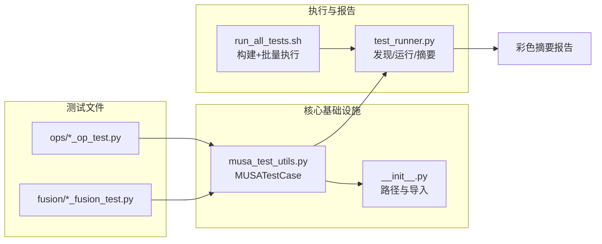

本文档介绍 TensorFlow MUSA Extension 的测试基础设施，涵盖从基础工具类到测试运行器的完整架构。测试体系采用三层设计：**测试基类**提供跨设备结果比对与插件自动加载能力，**测试运行器**负责用例发现与增强式报告输出，**Shell 封装脚本**则整合编译与执行流程。理解这三层协作方式，是编写可靠算子测试和快速定位回归问题的关键前提。

## 测试架构全景

测试框架围绕 `unittest` 标准库与 TensorFlow 的测试基类进行扩展，核心组件及其职责如下：

| 组件 | 文件 | 职责 |
|------|------|------|
| 测试基类 | `musa_test_utils.py` | 插件自动加载、MUSA 设备检测、CPU/MUSA 结果一致性比对、自定义断言 |
| 包初始化 | `__init__.py` | Python 路径注入、公共工具导出 |
| 测试运行器 | `test_runner.py` | 用例发现、进度条实时渲染、彩色摘要报告、多模式输出控制 |
| 批量脚本 | `run_all_tests.sh` | 自动触发构建、调用运行器执行全量测试 |

下图展示了从测试文件到执行输出的完整数据流。测试文件统一继承 `MUSATestCase`，运行器通过 glob 模式发现用例，最终生成包含通过率、耗时和失败明细的格式化摘要。



Sources: [musa_test_utils.py](test/musa_test_utils.py#L1-L191), [test_runner.py](test/test_runner.py#L1-L579), [__init__.py](test/__init__.py#L1-L28), [run_all_tests.sh](test/run_all_tests.sh#L1-L32)

## MUSATestCase 基类

`MUSATestCase` 是所有 MUSA 算子测试的统一基类，它继承自 `tf.test.TestCase`，并在模块导入时自动完成 **MUSA 插件加载** 与 **设备可用性校验**。

### 插件加载与路径解析

`load_musa_plugin()` 在模块首次导入时执行，按优先级在以下位置搜索 `libmusa_plugin.so`：当前测试目录的上级 `build/`、项目根目录的 `build/` 以及工作目录的 `build/`。若均未找到，则抛出包含完整搜索路径的 `FileNotFoundError`。这种设计确保无论开发者从项目根目录还是 `test/` 子目录执行测试，插件都能被正确加载。

Sources: [musa_test_utils.py](test/musa_test_utils.py#L36-L74)

### 设备可用性检查

`setUpClass` 类方法在测试类执行前检测是否存在可用的 MUSA 物理设备。若不存在，则通过 `unittest.SkipTest` 跳过整个测试类，避免在无硬件环境中产生大量无意义的失败记录。

Sources: [musa_test_utils.py](test/musa_test_utils.py#L87-L94)

### CPU 与 MUSA 结果比对

`_compare_cpu_musa_results` 是算子功能测试的核心方法。它在 `/CPU:0` 与 `/device:MUSA:0` 上分别执行同一操作函数，并自动处理低精度类型的对比逻辑：当数据类型为 `float16` 或 `bfloat16` 时，会先将结果 cast 到 `float32` 再执行 `assertAllClose`，从而避免低精度直接对比带来的伪失败。

Sources: [musa_test_utils.py](test/musa_test_utils.py#L102-L127)

### 增强型 assertAllClose

基类重写了 `assertAllClose`，提供**受限的差异化输出**。当数组不一致时，不会打印全部差异元素，而是仅展示前 `max_diffs_to_show` 个（默认 5 个）不匹配点，同时附带总元素数、不匹配数量、最大差异和平均差异。对于 `bfloat16` 类型，该方法也做了兼容转换，确保 numpy 能够正常参与比对。

Sources: [musa_test_utils.py](test/musa_test_utils.py#L129-L190)

## 测试运行器详解

`test_runner.py` 是一个独立的增强型测试运行器，不依赖 `pytest` 或 `tf.test.main()`，直接基于 Python 标准库 `unittest` 扩展。其设计目标是在持续集成与本地开发场景中，提供低噪声、高信息密度的执行反馈。

### 三种输出模式

运行器支持三种互斥的运行模式，通过命令行参数控制：

| 模式 | 参数 | 行为 |
|------|------|------|
| 静默模式 | `--quiet` / `-q` | 仅显示实时进度条与最终摘要，隐藏单个用例详情 |
| 详情模式 | `--detail` / `-d` | 显示进度条、每个用例的执行结果及完整摘要 |
| 普通模式 | 无参数 | 显示进度条与最终摘要（默认行为，与 `--quiet` 接近但保留更多结构化信息） |

在详情模式下，运行器还会输出 Unicode 框线表头与带颜色图标的全部用例清单；静默模式则只保留通过/失败/错误/跳过计数，适合 CI 日志场景。

Sources: [test_runner.py](test/test_runner.py#L490-L530), [test_runner.py](test/test_runner.py#L355-L393)

### 实时进度条与统计

`ProgressBar` 类在终端中实时渲染进度条，使用 `█` 与 `░` 组成视觉条带，并同步显示当前用例名、已执行数/总数、四种状态的累计数量、每秒执行速率及剩余时间估算。该进度条与 `CustomTestResult` 深度集成，在每个用例结束时根据成功、失败、错误、跳过状态更新对应计数。

Sources: [test_runner.py](test/test_runner.py#L75-L122), [test_runner.py](test/test_runner.py#L127-L202)

### 格式化摘要报告

测试结束后，运行器调用 `create_pretty_summary` 生成基于 `PrettyTable` 的统计摘要。摘要包含总用例数、通过数、失败数、错误数、跳过数、通过率与总耗时。若存在失败或错误，会额外输出一张**失败用例明细表**，列出状态图标与模块.类.方法格式的完整用例名。详情模式下还会追加**全部用例结果表**，方便逐条审计。

Sources: [test_runner.py](test/test_runner.py#L233-L349)

### 用例发现策略

`discover_and_run_tests` 函数默认从 `ops/` 目录下查找匹配 `*_op_test.py` 的文件，通过 `importlib` 动态导入并加载测试套件。运行器也支持数组形式的复合模式，例如融合测试同时匹配 `*_fusion_test.py` 与 `*_e2e_test.py`。当使用 `--single` 指定单个文件时，运行器会跳过发现逻辑，直接加载目标模块。

Sources: [test_runner.py](test/test_runner.py#L434-L484)

## 测试编写模式

### 算子功能测试

算子测试文件统一继承 `MUSATestCase`，遵循“生成随机输入 → CPU 执行 → MUSA 执行 → 结果比对”的标准流程。以 `add_op_test.py` 为例，其内部封装了 `_test_add` 辅助方法，遍历 `float32`、`float16`、`bfloat16` 等数据类型，并针对不同广播模式构造测试点。对于低精度类型，测试会自动放宽相对容差 `rtol` 与绝对容差 `atol` 到 `1e-2`。

Sources: [ops/add_op_test.py](test/ops/add_op_test.py#L1-L98), [ops/matmul_op_test.py](test/ops/matmul_op_test.py#L1-L106)

### 融合端到端测试

融合测试位于 `test/fusion/` 目录，其目标不仅是验证数值正确性，还需**验证图优化后是否生成了预期的融合算子节点**。以 `gelu_fusion_test.py` 为例，测试手动构造原始 GELU 子图，启用 `musa_graph_optimizer` 后执行 Session，并读取 `after_fusion` 的 GraphDef dump。测试断言图中存在 `MusaGelu` 节点、不存在残留的 `Tanh`/`Erf` 等原始算子，且 `approximate` 属性与预期一致。

Sources: [fusion/gelu_fusion_test.py](test/fusion/gelu_fusion_test.py#L1-L200)

### 异常处理与跳过机制

部分测试需要处理已知的边缘情况。例如 `max_op_test.py` 在遇到 `Multiple OpKernel registrations match NodeDef` 错误时，会识别错误信息并调用 `self.skipTest`，将当前用例标记为跳过而非失败，从而避免重复注册导致的误报干扰回归判断。

Sources: [max_op_test.py](test/max_op_test.py#L27-L52)

## 常用命令速查

以下命令覆盖日常开发中最常见的测试执行场景：

```bash
# 1. 运行全部算子测试（推荐日常验证）
cd test
python test_runner.py --quiet

# 2. 运行单个算子测试文件
python test_runner.py --single matmul_op_test.py

# 3. 运行全部融合测试
python test_runner.py --fusion

# 4. 运行单个融合测试文件
python test_runner.py --single fusion/gelu_fusion_test.py

# 5. 详情模式输出全部结果（适合调试）
python test_runner.py --detail

# 6. 按模式筛选梯度相关测试
python test_runner.py --pattern "*_grad*_op_test.py"

# 7. 一键编译并运行全部测试
bash run_all_tests.sh
```

Sources: [test_runner.py](test/test_runner.py#L493-L505), [run_all_tests.sh](test/run_all_tests.sh#L17-L31)

## 与 CI 的集成

`.github/workflows/pr-validation.yml` 中的 CI 流水线在 MUSA GPU 自托管 Runner 上执行验证，测试阶段会调用构建产物并收集日志到 `/home/runner/ci_logs`。虽然流水线自身不直接调用 `test_runner.py`，但其验证逻辑依赖相同的插件加载路径与测试结构。本地通过 `run_all_tests.sh` 或 `test_runner.py` 验证通过的用例，在 CI 环境中具备一致的执行语义。

Sources: [.github/workflows/pr-validation.yml](.github/workflows/pr-validation.yml#L1-L200)

## 调试联动

测试框架与项目的调试基础设施深度联动。在 Debug 构建（`./build.sh debug`）下执行测试时，可通过环境变量启用 Kernel 计时与遥测追踪：

```bash
# 启用 Kernel 分段计时
export MUSA_TIMING_KERNEL_LEVEL=2
export MUSA_TIMING_KERNEL_NAME=MatMul
python test_runner.py --single matmul_op_test.py

# 启用全链路遥测
export MUSA_TELEMETRY_ENABLED=1
export MUSA_TELEMETRY_LOG_PATH=/tmp/musa_telemetry.json
python test_runner.py
```

更多调试环境变量与遥测事件格式，请参阅 [调试环境变量速查](19-diao-shi-huan-jing-bian-liang-su-cha) 与 [遥测系统与全链路追踪](17-yao-ce-xi-tong-yu-quan-lian-lu-zhui-zong)。

Sources: [docs/DEBUG_GUIDE.md](docs/DEBUG_GUIDE.md#L1-L80)

---

掌握了测试框架的三层结构后，下一步可深入阅读 [算子功能测试](21-suan-zi-gong-neng-ce-shi) 以了解各类型算子的测试用例设计规范，或前往 [融合端到端测试](22-rong-he-duan-dao-duan-ce-shi) 学习如何验证图优化后的融合正确性。