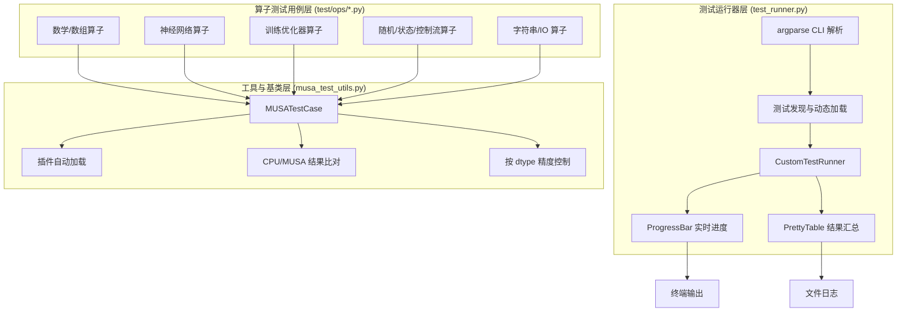

算子功能测试是 TensorFlow MUSA 扩展质量保障体系的核心防线，其根本目标是验证每一个在 MUSA 设备上注册的 Kernel 都能在与 CPU 参考实现语义等价的前提下正确执行。本页面向具备中级 TensorFlow 开发经验的读者，系统阐述测试框架的架构设计、基类能力、典型测试模式以及运行与扩展方法。阅读前建议先了解 [Kernel 注册与算子分发流程](7-kernel-zhu-ce-yu-suan-zi-fen-fa-liu-cheng)，以便理解测试为何采用「CPU 参考 vs MUSA 实现」的双轨比对策略。

Sources: [musa_test_utils.py](test/musa_test_utils.py#L1-L191), [test_runner.py](test/test_runner.py#L1-L579)

## 测试框架总体架构

整个算子功能测试体系由三层构成：**测试基类与工具层**提供跨设备比对与插件加载能力，**算子测试用例层**覆盖 120 余个独立算子，**测试运行器层**负责批量发现、进度可视化和结果汇总。三层之间通过标准的 Python `unittest` 协议衔接，同时针对 MUSA 场景做了大量定制化增强，包括彩色进度条、PrettyTable 汇总表、双输出日志以及设备缺失自动跳过机制。



框架启动时，`musa_test_utils` 会优先加载 `libmusa_plugin.so`，随后 `test_runner.py` 通过 `importlib` 动态导入 `test/ops/` 目录下所有符合命名模式 `*_op_test.py` 的模块，构建 `unittest.TestSuite` 并执行。这种设计允许开发者在不修改运行器代码的情况下，仅通过新增文件即可扩展测试覆盖范围。

Sources: [test_runner.py](test/test_runner.py#L434-L484), [musa_test_utils.py](test/musa_test_utils.py#L36-L74), [__init__.py](test/__init__.py#L1-L28)

## 测试基类 MUSATestCase

所有算子测试都继承自 `MUSATestCase`，它派生自 `tf.test.TestCase`，并在类加载阶段完成两项关键初始化：一是调用 `load_musa_plugin()` 加载 MUSA 插件动态库，该函数会按优先级依次检索 `test/../build/libmusa_plugin.so`、`../build/libmusa_plugin.so` 以及当前工作目录下的构建产物；二是在 `setUpClass` 中检查物理设备列表，若不存在 MUSA 设备则抛出 `unittest.SkipTest`，确保测试在无硬件环境中优雅跳过而非硬失败。

`MUSATestCase` 最核心的方法是 `_compare_cpu_musa_results`。该方法接收一个算子函数 `op_func`、输入张量列表 `input_tensors` 以及目标数据类型 `dtype`，自动在 `/CPU:0` 与 `/device:MUSA:0` 上分别执行同一操作，最后调用增强版 `assertAllClose` 进行数值比对。针对 `float16` 与 `bfloat16` 这类低精度类型，框架会先将两边结果统一 `cast` 到 `float32` 再比较，避免低精度表示差异导致的假阳性失败。

Sources: [musa_test_utils.py](test/musa_test_utils.py#L84-L128)

### 精度控制策略

由于 MUSA 后端在 `float32` 卷积和矩阵乘法中默认启用 TF32 加速，严格逐位比对往往不可行。因此框架在 `assertAllClose` 中引入了分级容差机制，并在各算子测试内部通过 `rtol` 与 `atol` 参数进一步微调。下表展示了不同数据类型与算子类别的典型容差配置：

| 数据类型 | 典型算子类别 | rtol | atol | 说明 |
|---------|------------|------|------|------|
| float32 | 逐元素数学 (Add, ReLU) | 1e-5 | 1e-8 | 默认严格比对 |
| float32 | MatMul / Conv2D | 1e-3 ~ 1e-4 | 1e-3 ~ 1e-5 | TF32 加速导致轻微偏差 |
| float16 | 通用 | 1e-2 | 1e-2 | 低精度固有误差 |
| bfloat16 | 通用 | 1e-2 | 1e-2 | 需先 cast 到 float32 再比对 |
| int32/int64 | 整数算子 | 0 | 0 | 要求逐元素精确相等 |

当比对失败时，自定义的 `assertAllClose` 不会打印整个张量，而是仅输出形状、总元素数、不匹配元素数、最大差值、平均差值以及前 5 个差异位置的索引与数值，从而将错误信息控制在可阅读范围内。

Sources: [musa_test_utils.py](test/musa_test_utils.py#L129-L191), [conv2d_op_test.py](test/ops/conv2d_op_test.py#L12-L17), [matmul_op_test.py](test/ops/matmul_op_test.py#L27-L60)

## 测试目录与覆盖范围

当前 `test/ops/` 目录下包含 124 个测试文件，按算子功能可划分为五大类别。这种组织方式并非严格的物理子目录拆分，而是通过文件命名前缀与内容主题自然形成的逻辑分组。对于控制流、状态机和资源型算子（如 `StatelessWhile`、`ResourceApplyAdagradV2`），由于涉及 V1 Graph 与会话机制，其测试模式与常规 Eager 算子存在显著差异，需要显式构造 `tf.Graph()` 与 `tf.compat.v1.Session()`。

| 类别 | 示例文件 | 测试重点 |
|------|---------|---------|
| 基础数学与数组 | `add_op_test.py`, `abs_op_test.py`, `einsum_op_test.py` | 广播、形状变换、Einstein 求和约定 |
| 神经网络核心 | `conv2d_op_test.py`, `matmul_op_test.py`, `softmax_op_test.py` | NCHW/NHWC、步长、空洞卷积、TF32 容差 |
| 训练优化器 | `apply_adagrad_op_test.py`, `apply_rmsprop_op_test.py` | 资源变量更新、use_locking、零学习率边界 |
| 随机与状态 | `random_op_test.py`, `stateless_while_op_test.py` | 种子独立性、值域约束、循环次数边界 |
| 类型与转换 | `cast_op_test.py`, `as_string_op_test.py` | 跨类型精度保持、字符串格式化一致性 |

以 `cast_op_test.py` 为例，其通过 `_test_cast(src_dtype, dst_dtype)` 遍历 bool、整数、浮点数之间的多向转换，验证了 MUSA  Cast Kernel 在类型提升与截断行为上与 CPU 参考的一致性。而 `einsum_op_test.py` 则覆盖了矩阵乘、批处理矩阵乘、Ellipsis 广播、隐式输出、对角提取、规约、外积以及三操作数链式收缩等 10 余种方程模式，体现了功能测试对算子完整接口空间的系统性覆盖要求。

Sources: [cast_op_test.py](test/ops/cast_op_test.py#L1-L65), [einsum_op_test.py](test/ops/einsum_op_test.py#L1-L122)

## 典型测试模式详解

### 模式一：双设备数值比对（最常用）

这是绝大多数算子测试采用的模式。测试用例生成随机输入后，分别置于 CPU 与 MUSA 设备执行，再对输出做 all-close 比对。`add_op_test.py` 中的 `_test_add` 是这一模式的精简范例：它为 `shape_x` 与 `shape_y` 生成随机 uniform 数据，构造 `tf.constant`，然后调用 `_compare_cpu_musa_results(tf.add, [x, y], dtype, rtol, atol)` 完成验证。在此基础上，`testAddBroadcastVectorMatrix` 与 `testAddPrunedGraphHotShapes` 分别验证了广播语义与真实业务中常见的高频形状模式。

### 模式二：仅验证 MUSA 设备行为

对于随机数生成算子，由于 CPU 与 MUSA 的种子算法实现不同，直接数值比对没有意义。`random_op_test.py` 转而采用「属性断言」模式：在 MUSA 设备上执行 `tf.random.uniform` 后，仅检查返回张量的形状、数据类型以及值域边界（如 `np.all(val >= 0)` 且 `np.all(val < 1.0)`）。同时通过两次独立调用验证随机性（`np.array_equal(u1, u2)` 为 `False`）。

### 模式三：错误一致性断言

部分算子在接收到非法输入时应当抛出异常。`einsum_op_test.py` 中的 `_assert_error_consistency` 展示了如何确保 CPU 与 MUSA 在相同非法输入下不仅都报错，而且抛出同一类型的异常。该模式对验证算子前端参数校验逻辑的跨设备一致性至关重要。

### 模式四：V1 Graph 资源变量更新

训练优化器算子（如 `ResourceApplyAdagradV2`）需要修改资源变量状态，无法在 Eager 模式下通过简单函数调用来测试。`apply_adagrad_op_test.py` 使用 `tf.Graph()` 构建计算图，在图中分别放置变量、梯度与学习率，通过 `tf.raw_ops.ResourceApplyAdagradV2` 创建更新操作，再利用 `tf.control_dependencies` 读取更新后的变量值，最终在 `tf.compat.v1.Session` 中执行并比对 CPU 与 MUSA 的更新结果。

Sources: [add_op_test.py](test/ops/add_op_test.py#L1-L98), [random_op_test.py](test/ops/random_op_test.py#L1-L96), [einsum_op_test.py](test/ops/einsum_op_test.py#L106-L116), [apply_adagrad_op_test.py](test/ops/apply_adagrad_op_test.py#L64-L101)

## 运行测试

### 一键全量测试

项目根目录下提供了 `run_all_tests.sh`，它会自动检测 `build/libmusa_plugin.so` 是否存在，若不存在则先调用 `./build.sh` 编译插件，随后以 quiet 模式执行全部算子测试。这是 CI 流水线与日常回归验证的标准入口。

```bash
./test/run_all_tests.sh
```

### 测试运行器 CLI

`test_runner.py` 是更灵活的执行入口，支持模式匹配、单文件执行以及融合测试切换。下表列出常用选项：

| 选项 | 简写 | 作用 | 典型示例 |
|------|------|------|---------|
| `--quiet` | `-q` | 仅显示进度条与最终汇总 | `python test/test_runner.py -q` |
| `--detail` | `-d` | 显示进度条 + 每个测试的独立结果 | `python test/test_runner.py -d` |
| `--single` | — | 运行单个测试文件 | `python test/test_runner.py --single matmul_op_test.py` |
| `--pattern` | — | 按 glob 模式过滤测试文件 | `python test/test_runner.py --pattern "*_grad*_op_test.py"` |
| `--fusion` | `-f` | 运行融合测试目录 | `python test/test_runner.py -f` |
| `--log-file` | — | detail 模式下同时输出到日志文件 | `python test/test_runner.py -d --log-file results.log` |

quiet 模式与 detail 模式并非互斥的布尔开关，而是各自独立的标志位。quiet 模式会抑制 `unittest` 本身的逐条输出，但进度条始终保留，以防止用户在长时间运行中产生「进程卡死」的误判。detail 模式则会额外打印每个测试的通过/失败状态，并在最终汇总中输出完整的测试清单表格。

Sources: [run_all_tests.sh](test/run_all_tests.sh#L1-L32), [test_runner.py](test/test_runner.py#L490-L579)

## 为新增算子编写功能测试

当您在 [自定义 MUSA Kernel 开发指南](12-zi-ding-yi-musa-kernel-kai-fa-zhi-nan) 中完成一个新的算子实现后，应按以下步骤补充对应的功能测试：

1. **创建测试文件**：在 `test/ops/` 下新建 `{op_name}_op_test.py`，继承 `MUSATestCase`。
2. **设计覆盖矩阵**：至少覆盖基本形状、边界形状（如空张量、标量）、广播场景以及该算子支持的主要数据类型（优先 float32、float16、bfloat16）。
3. **选择测试模式**：若为纯数值算子，使用 `_compare_cpu_musa_results`；若涉及资源变量或图级语义，采用 V1 Graph 模式；若 CPU 与 MUSA 语义存在已知差异（如随机数种子算法），改用属性断言。
4. **设定合理容差**：对 float16/bfloat16 统一将 rtol/atol 设为 `1e-2`；对启用 TF32 的矩阵运算适当放宽到 `1e-3`。
5. **本地验证**：先使用 `--single` 运行单文件确保通过，再执行全量回归确认无副作用。

以下是一个新增算子测试的最小可运行模板，展示了从数据生成到跨设备比对的完整链路：

```python
"""Tests for MUSA {OpName} operator."""

import numpy as np
import tensorflow as tf
from musa_test_utils import MUSATestCase

class {OpName}OpTest(MUSATestCase):
    def _test_{op_name}(self, shape, dtype, rtol=1e-5, atol=1e-8):
        np_dtype = np.float32 if dtype == tf.bfloat16 else dtype.as_numpy_dtype
        x_np = np.random.uniform(-1, 1, size=shape).astype(np_dtype)
        x = tf.constant(x_np, dtype=dtype)
        self._compare_cpu_musa_results(tf.nn.{op_name}, [x], dtype, rtol=rtol, atol=atol)

    def test{OpName}Basic(self):
        for dtype in [tf.float32, tf.float16, tf.bfloat16]:
            rtol = 1e-2 if dtype in [tf.float16, tf.bfloat16] else 1e-5
            atol = 1e-2 if dtype in [tf.float16, tf.bfloat16] else 1e-8
            self._test_{op_name}([1024, 1024], dtype, rtol=rtol, atol=atol)
```

Sources: [test_runner.py](test/test_runner.py#L532-L559), [relu_op_test.py](test/ops/relu_op_test.py#L1-L101)

## 常见问题排查

| 现象 | 可能原因 | 排查方法 |
|------|---------|---------|
| `MUSA plugin not found` | 未编译或编译产物路径不符 | 检查 `build/libmusa_plugin.so` 是否存在，或手动指定构建目录 |
| 所有测试被 Skip | 当前环境无 MUSA 物理设备 | 运行 `tf.config.list_physical_devices('MUSA')` 确认设备可见性 |
| float32 Conv2D/MatMul 偶尔失败 | TF32 加速导致精度差异 | 将 rtol 放宽至 `1e-3` ~ `1e-4`，参考已有测试的容差配置 |
| bfloat16 测试报类型错误 | numpy 原生不支持 bfloat16 | 确保测试代码通过 `np.float32` 中间类型生成数据，并在比对前 cast 到 float32 |
| 资源优化器测试在 Eager 下报错 | 使用了 `tf.raw_ops.ResourceApply*` | 切换到 V1 Graph + Session 模式，如 `apply_adagrad_op_test.py` 所示 |
| 测试加载失败 `No module named 'musa_test_utils'` | Python 路径未包含 test 目录 | 通过 `test_runner.py` 运行，它会自动将 `test/ops/` 插入 `sys.path` |

若测试失败仅发生在特定 shape 或数据类型组合上，建议先用 `--single` 隔离该文件，再用 `--detail` 查看完整错误输出。对于数值偏差类失败，可临时在测试代码中打印 `np.max(np.abs(cpu - musa))` 以判断偏差量级是否在合理区间。

Sources: [musa_test_utils.py](test/musa_test_utils.py#L60-L74), [test_runner.py](test/test_runner.py#L449-L470)

## 下一步阅读

完成算子功能测试的掌握后，您可继续了解 [融合端到端测试](22-rong-he-duan-dao-duan-ce-shi)，学习如何验证 Grappler 图优化器将多个算子融合为单一融合 Kernel 后的正确性与性能收益。若需深入调试某一失败算子，请参阅 [Kernel 计时与性能剖析](16-kernel-ji-shi-yu-xing-neng-pou-xi) 与 [调试环境变量速查](19-diao-shi-huan-jing-bian-liang-su-cha)。