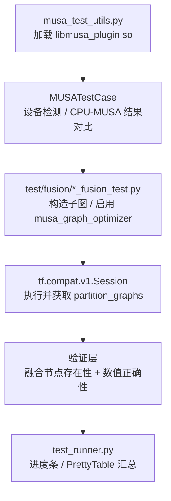

融合端到端测试（Fusion End-to-End Tests）位于 `test/fusion/` 目录，是验证 **MUSA 图优化器** 在真实 TensorFlow 会话中将子图模式正确替换为融合算子的最后一道质量关卡。与单算子功能测试不同，本类测试不直接调用 Kernel，而是通过 `tf.compat.v1.Session` 触发完整的 **Grappler 优化流水线**，在图执行层面同时验证两件事：优化后的计算图中是否出现了预期的融合节点（如 `MusaGelu`、`MusaLinearRelu`），以及融合后的数值结果与 CPU 参考实现之间的误差是否在容限之内。

Sources: [test_runner.py](test/test_runner.py#L490-L579), [musa_test_utils.py](test/musa_test_utils.py#L84-L128)

## 测试架构与基础设施

整个融合测试体系建立在三层基础设施之上：**插件加载层**、**基类抽象层** 与 **自定义执行层**。



**插件加载层** 在导入 `musa_test_utils` 时即通过 `tf.load_library()` 自动加载 `build/libmusa_plugin.so`，并检测物理 MUSA 设备是否存在；若不存在则跳过整个测试类。Sources: [musa_test_utils.py](test/musa_test_utils.py#L36-L82)

**基类抽象层** `MUSATestCase` 继承自 `tf.test.TestCase`，封装了跨设备结果对比方法 `_compare_cpu_musa_results()`，并对低精度类型（`float16`、`bfloat16`）自动升维到 `float32` 进行比较，同时限制了失败时输出的差异元素数量，避免日志爆炸。Sources: [musa_test_utils.py](test/musa_test_utils.py#L102-L190)

**自定义执行层** `test_runner.py` 提供了彩色进度条、基于 `prettytable` 的汇总报告，以及按目录批量发现测试的能力。它支持 `--fusion` 一键运行所有融合测试，也支持 `--single fusion/xxx.py` 精确执行单个文件。Sources: [test_runner.py](test/test_runner.py#L434-L485)

## 核心验证模式

根据融合算子的复杂度和图优化器的接口差异，现有测试用例采用了三种互补的验证策略。

### 模式一：Partition Graph 节点检查

对于 `MusaLinearRelu`、`MusaClip` 这类在分区图（partition graph）中直接可见的融合节点，测试通过 `RunOptions(output_partition_graphs=True)` 获取 `run_metadata.partition_graphs`，遍历节点名断言融合是否发生。

```python
run_options = tf.compat.v1.RunOptions(output_partition_graphs=True)
run_metadata = tf.compat.v1.RunMetadata()
sess.run(output, feed_dict={...}, options=run_options, run_metadata=run_metadata)

has_fused_node = any(
    node.op == "MusaLinearRelu"
    for pg in run_metadata.partition_graphs
    for node in pg.node
)
self.assertTrue(has_fused_node)
```

Sources: [linear_relu_fusion_test.py](test/fusion/linear_relu_fusion_test.py#L95-L130)

### 模式二：GraphDef 落盘解析

`MusaGelu`、`MusaLayerNorm` 等融合结果需要通过环境变量 `MUSA_DUMP_GRAPHDEF=1` 将优化后的图序列化到临时目录，测试再读取 `*_after_fusion.pbtxt` 并解析为 `GraphDef`，同时检查：融合节点存在、属性值正确、原残差节点已被清理。

```python
os.environ["MUSA_DUMP_GRAPHDEF"] = "1"
os.environ["MUSA_DUMP_GRAPHDEF_DIR"] = dump_dir
# ... run session ...
dump_text, graph_def = self._load_after_fusion_dump(dump_dir)
self.assertIn('op: "MusaGelu"', dump_text)
```

Sources: [gelu_fusion_test.py](test/fusion/gelu_fusion_test.py#L54-L68), [layernorm_fusion_test.py](test/fusion/layernorm_fusion_test.py#L80-L90)

### 模式三：预构建 Subgraph PB 加载

`TensorDot` 这类内部包含大量形状计算辅助节点（`Shape → GatherV2 → Prod → Pack → Reshape → Transpose → MatMul → Reshape`）的复杂模式，若直接使用 `tf.tensordot()` 在 `allow_soft_placement` 下会被 TensorFlow 内置的常量折叠 pass 提前简化，导致匹配失败。因此测试加载从真实生产模型提取的 `tensordot_subgraph.pb`，通过 `tf.import_graph_def()` 重建完整子图后再执行优化。

Sources: [tensordot_fusion_test.py](test/fusion/tensordot_fusion_test.py#L15-L39)

## 融合算子分类与测试覆盖

`test/fusion/` 目录共包含 17 个测试文件（含 benchmark），按算子语义可划分为五类。

| 分类 | 测试文件 | 融合目标 | 验证策略 |
|:---|:---|:---|:---|
| **激活与元素级融合** | `gelu_fusion_test.py` | `Erf/Pow/Tanh` 链 → `MusaGelu` | GraphDef 落盘 |
| | `clip_fusion_test.py` | `Minimum→Maximum` / `ClipByValue` → `MusaClip` | Partition Graph |
| | `prelu_fusion_test.py` | `Relu` 负斜率变体 → `MusaPRelu` | Partition Graph |
| | `sigmoid_calibration_fusion_test.py` | Sigmoid 校准子图 → 融合算子 | Partition Graph |
| **线性代数融合** | `linear_relu_fusion_test.py` | `MatMul+BiasAdd+Relu` → `MusaLinearRelu` | Partition Graph |
| | `concat_matmul_fusion_test.py` | `Concat+MatMul` → `MusaConcatMatMul` | Partition Graph |
| | `tensordot_fusion_test.py` | `tf.tensordot` 内部链 → `MusaTensorDot` | Subgraph PB + Partition Graph |
| | `tensordot_bias_fusion_test.py` | `TensorDot+BiasAdd` → `MusaTensorDotBias` | Subgraph PB + Partition Graph |
| **归一化融合** | `layernorm_fusion_test.py` | `Mean/Sub/Sqrt/Div` 链 → `MusaLayerNorm` | GraphDef 落盘 |
| | `fuselayernormv2_fusion_test.py` | LayerNorm V2 变体 → `MusaFusedLayerNormV2` | GraphDef 落盘 |
| | `normalize_fusion_test.py` | Normalize 子图 → `MusaNormalize` | Partition Graph |
| **模型专用融合** | `rgprojection_fusion_test.py` | RGProjection 子图 → `MusaRGProjection` | Partition Graph |
| | `tokenmixer_fusion_test.py` | TokenMixer 子图 → `MusaTokenMixer` | Partition Graph |
| | `shifted_affine_map_fusion_test.py` | Shifted Affine Map → `MusaShiftedAffineMap` | Partition Graph |
| **性能基准** | `gelu_fusion_benchmark.py` | 从真实模型提取 GELU 输入形状并对比融合前后延迟 | 计时 + JSON 输出 |
| | `shifted_affine_map_benchmark.py` | Shifted Affine Map 性能基准 | 计时对比 |

Sources: [fusion 目录结构](test/fusion/)

## 运行方式与命令参考

所有融合测试统一由 `test_runner.py` 调度，支持批量执行、单文件执行与不同详细级别输出。

| 场景 | 命令 | 说明 |
|:---|:---|:---|
| 运行全部融合测试 | `python test/test_runner.py --fusion` | 默认匹配 `*_fusion_test.py` 与 `*_e2e_test.py` |
| 运行单个融合测试 | `python test/test_runner.py --single fusion/gelu_fusion_test.py` | 自动识别 `fusion/` 前缀 |
| 详细模式 | `python test/test_runner.py --fusion --detail` | 显示每条用例结果与完整汇总表 |
| 静默模式 | `python test/test_runner.py --fusion --quiet` | 仅显示进度条与最终统计 |
| 指定日志 | `python test/test_runner.py --fusion --detail --log-file result.log` | 详细输出同时写入文件 |
| 一键执行 | `./test/run_all_tests.sh` | 自动编译插件后运行全部算子测试（不含融合） |

Sources: [test_runner.py](test/test_runner.py#L490-L579), [run_all_tests.sh](test/run_all_tests.sh#L17-L32)

## 典型测试编写模式

一个完整的融合端到端测试通常遵循以下结构：构造子图 → 启用 MUSA 优化器 → 运行会话 → 双重断言（图结构 + 数值）。以下以 `Linear+Relu` 为例展示标准写法。

```python
def create_config_with_musa_optimizer():
    config = config_pb2.ConfigProto()
    config.allow_soft_placement = True
    rewriter_config = config.graph_options.rewrite_options
    custom_optimizer = rewriter_config.custom_optimizers.add()
    custom_optimizer.name = "musa_graph_optimizer"
    rewriter_config.min_graph_nodes = -1
    rewriter_config.optimizers.extend(["musa_graph_optimizer"])
    return config

class LinearReluFusionTest(MUSATestCase):
    def test_linear_relu_fusion_basic(self):
        # 1. 准备随机输入
        x_np = np.random.randn(m, k).astype(np.float32)
        w_np = np.random.randn(k, n).astype(np.float32)
        b_np = np.random.randn(n).astype(np.float32)

        # 2. CPU 参考结果
        with tf.device('/CPU:0'):
            expected = tf.nn.relu(tf.nn.bias_add(tf.matmul(x_tf, w_tf), b_tf))

        # 3. 构造 MUSA 子图
        graph = tf.Graph()
        with graph.as_default(), tf.device('/device:MUSA:0'):
            x = tf.compat.v1.placeholder(tf.float32, shape=[None, k])
            mm = tf.matmul(x, w)
            bias = tf.nn.bias_add(mm, b)
            output = tf.nn.relu(bias)

        # 4. 执行并断言
        config = create_config_with_musa_optimizer()
        with tf.compat.v1.Session(graph=graph, config=config) as sess:
            actual = sess.run(output, feed_dict={x: x_np})
        self.assertAllClose(actual, expected.numpy(), rtol=1e-5, atol=1e-5)
```

对于需要禁用内置 Grappler pass 以避免子图被提前简化的场景（如 LayerNorm、TensorDot），配置中需显式关闭 `constant_folding`、`arithmetic_optimization` 等选项：

```python
rw.constant_folding = rewriter_config_pb2.RewriterConfig.OFF
rw.arithmetic_optimization = rewriter_config_pb2.RewriterConfig.OFF
```

Sources: [linear_relu_fusion_test.py](test/fusion/linear_relu_fusion_test.py#L27-L93), [layernorm_fusion_test.py](test/fusion/layernorm_fusion_test.py#L46-L64)

## 环境变量与调试手段

融合测试的行为可通过一组环境变量进行精细化控制，既用于测试验证，也用于失败时的现场复现。

| 环境变量 | 取值 | 作用 |
|:---|:---|:---|
| `MUSA_DUMP_GRAPHDEF` | `1` | 在图优化前后分别 dump `GraphDef` 到 `MUSA_DUMP_GRAPHDEF_DIR` |
| `MUSA_DUMP_GRAPHDEF_DIR` | 目录路径 | dump 文件输出目录，文件名格式为 `*_before_fusion.pbtxt` / `*_after_fusion.pbtxt` |
| `MUSA_ENABLE_LAYERNORM_FUSION_KERNEL` | `1` / `0` | 开关 LayerNorm 融合 Kernel，关闭后走 fallback 路径 |
| `MUSA_RUN_PERF_TESTS` | `1` | 启用带有 warmup 与多次计时的性能对比用例（如 `test_layernorm_core_perf_compare`） |
| `MUSA_RUN_LARGE_TESTS` | `1` | 启用大 batch / 大特征维度的压力测试 |
| `MUSA_DISABLE_GELU_FUSION` | `1` | 禁用 GELU 融合，用于 benchmark 的 fallback 基线测试 |

当某条融合测试失败时，推荐的排查步骤是：先以 `--detail` 模式单独运行该文件获取完整日志；再设置 `MUSA_DUMP_GRAPHDEV=1` 检查 `*_after_fusion.pbtxt` 中是否包含预期的融合节点；若节点缺失，则可能是内置 Grappler pass 提前改变了图结构，此时可参考 `layernorm_fusion_test.py` 或 `tensordot_fusion_test.py` 中的做法，在 `ConfigProto` 中关闭相关内置优化。

Sources: [gelu_fusion_test.py](test/fusion/gelu_fusion_test.py#L139-L158), [layernorm_fusion_test.py](test/fusion/layernorm_fusion_test.py#L40-L44), [gelu_fusion_benchmark.py](test/fusion/gelu_fusion_benchmark.py#L22-L25)

## 延伸阅读

- 若需了解 C++ 侧融合模式的注册与优先级调度机制，请参阅 [Grappler 图优化器架构](13-grappler-tu-you-hua-qi-jia-gou)。
- 若需了解各融合模式的具体子图匹配规则与属性映射，请参阅 [算子融合模式详解](14-suan-zi-rong-he-mo-shi-xiang-jie)。
- 若需了解单算子级别的功能验证方法，请参阅 [算子功能测试](21-suan-zi-gong-neng-ce-shi)。
- 若需了解测试基类 `MUSATestCase` 与通用工具函数的设计，请参阅 [测试框架与工具类](20-ce-shi-kuang-jia-yu-gong-ju-lei)。