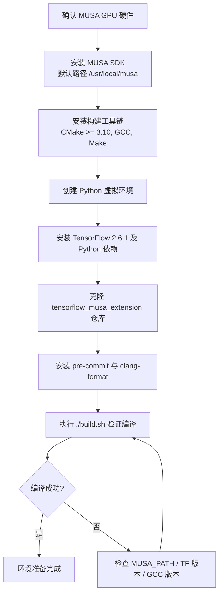

本文档面向初次接触 TensorFlow MUSA Extension 的开发者，系统梳理从硬件到软件工具链的完整前置条件。正确完成环境准备是后续编译、调试和算子开发的基础；任何环节遗漏都可能在构建阶段表现为 ABI 报错、MUSA 设备不可见或测试跳过等问题。阅读完本页后，你将获得一份可逐项勾选的环境就绪清单，并理解每一项依赖背后的工程原因。

Sources: [README.md](README.md#L33-L49)

## 硬件与操作系统前提

TensorFlow MUSA Extension 是专为摩尔线程（Moore Threads）MUSA 架构设计的插件，因此首要前提是具备兼容的 GPU 硬件。与通用 CUDA 开发不同，本项目的运行时、Kernel 编译器（`mcc`）以及底层数学库（`muBLAS`、`muDNN`）均围绕 MUSA 指令集构建，无法在 NVIDIA 或其他厂商 GPU 上运行。在操作系统层面，目前官方 CI 与测试流程均基于 Linux 环境，建议开发者使用兼容的 Linux 发行版作为开发主机。

Sources: [test/musa_test_utils.py](test/musa_test_utils.py#L59-L62)

## 构建工具链

项目采用 CMake 作为元构建系统，并通过 `build.sh` 脚本对编译模式进行封装。在编译主机代码时，CMake 会**强制指定 GCC 作为编译器**，以确保与 TensorFlow pip 发行版的 C++ ABI 严格一致；若系统中存在多个编译器版本，请务必确认默认 `gcc` / `g++` 指向的版本能够支持 C++14 标准。对于 MUSA Kernel 文件（`.mu`），`mcc` 编译器会自动采用 C++17 标准，因此无需额外配置。

| 工具 | 最低版本 | 说明 |
|---|---|---|
| CMake | 3.10 | 控制整个构建流程 |
| GCC / G++ | 支持 C++14 | 强制用于主机代码，保障 ABI 一致 |
| Make | — | 实际执行编译任务 |

Sources: [CMakeLists.txt](CMakeLists.txt#L1-L7)

## MUSA SDK 安装与路径配置

MUSA SDK 是整个插件的基石，包含 Runtime、设备驱动、`mcc` 编译器以及高性能数学库。构建系统默认在 `/usr/local/musa` 下查找 SDK；若实际安装路径不同，可在调用 CMake 时通过 `-DMUSA_PATH` 参数覆盖。CMake 配置阶段会依次校验以下组件：SDK 根目录存在性、`mcc` 可执行文件可用性、以及 `mudnncxx` 或 `mudnn` 库的检索。任一环节失败都会导致 `FATAL_ERROR` 中断配置，因此建议在运行 `build.sh` 之前手动确认 `mcc` 和库文件路径。

```
/usr/local/musa/
├── bin/mcc              # MUSA 内核编译器
├── include/             # MUSA Runtime 与 muDNN 头文件
└── lib64/               # muBLAS、muDNN 等动态库
```

若需自定义路径，示例命令如下：

```bash
cmake .. -DMUSA_PATH=/opt/musa
```

Sources: [CMakeLists.txt](CMakeLists.txt#L12-L30)

## Python 环境与 TensorFlow

本项目以 TensorFlow 2.6.1 作为唯一的 Python 运行时目标版本，且要求精确匹配（`== 2.6.1`）。CMake 在配置阶段会**动态查询当前 Python3 环境中 TensorFlow 的头文件路径、编译标志与链接标志**，并自动将其注入到插件的构建参数中。这一机制意味着：你所使用的 Python 环境必须已经安装好目标版本的 TensorFlow，否则 CMake 将直接报错退出。除 TensorFlow 外，测试框架与日志输出还依赖 `protobuf`、`NumPy` 和 `prettytable`；若计划运行测试，额外安装 `pytest` 将提升调试体验。

| Python 包 | 版本要求 | 用途 |
|---|---|---|
| Python | >= 3.7 | 解释器 |
| TensorFlow | == 2.6.1 | 核心运行时与 C API |
| protobuf | == 3.20.3 | 序列化兼容性 |
| NumPy | >= 1.19.0 | 数值计算与测试断言 |
| prettytable | >= 3.0.0 | 格式化输出 |
| pytest | >= 6.0.0 | 测试执行（可选但推荐） |

建议在编译前通过 `python3 -c "import tensorflow as tf; print(tf.__version__)"` 快速验证 TensorFlow 可用性。

Sources: [README.md](README.md#L42-L49), [CMakeLists.txt](CMakeLists.txt#L32-L45)

## ABI 兼容性与编译标志

由于插件最终链接的是 TensorFlow pip wheel 中的 `libtensorflow_framework.so`，而该 wheel 以 Release 模式构建并启用了 `NDEBUG`，因此本项目在**所有构建模式**（包括 Debug）中都强制保留 `-DNDEBUG` 定义。这一设计是为了避免插件与框架在 `RefCounted` 等内联模板类的语义上出现分歧，防止运行时段错误。CMake 还会清理 TensorFlow 返回的 `_GLIBCXX_USE_CXX11_ABI` 标志，并统一重写为 `0`，以消除新旧标准库 ABI 混用导致的链接失败。初学者无需手动干预这些标志，但应了解其存在意义：它们是插件能与 pip 版 TensorFlow 和平共处的关键保障。

Sources: [CMakeLists.txt](CMakeLists.txt#L47-L68)

## 开发辅助工具

为了保证代码风格一致并降低合入门槛，项目配置了 `pre-commit` 钩子与 `clang-format`。`pre-commit` 会在提交前自动检查合并冲突标记、尾随空格以及 C/C++ 代码格式；`clang-format` 版本建议与配置中声明的 `v18.1.8` 保持一致，避免本地格式化结果与 CI 检查出现差异。安装方式如下：

```bash
pip install pre-commit>=3.0.0
pre-commit install
```

Sources: [.pre-commit-config.yaml](.pre-commit-config.yaml#L1-L36)

## 环境准备流程图

下图展示从零开始准备开发环境的推荐顺序。每一步完成后，建议先验证再进入下一步，以便在问题发生时就地定位。



## 前置条件速查表

在首次执行 `./build.sh` 之前，请对照下表完成最终确认：

| 检查项 | 验证命令 | 期望结果 |
|---|---|---|
| MUSA SDK 路径 | `ls /usr/local/musa/bin/mcc` | 文件存在 |
| CMake 版本 | `cmake --version` | >= 3.10 |
| GCC 版本 | `gcc --version` | 支持 C++14 |
| TensorFlow 版本 | `python3 -c "import tensorflow as tf; print(tf.__version__)"` | 2.6.1 |
| TensorFlow 编译标志 | `python3 -c "import tensorflow as tf; print(tf.sysconfig.get_compile_flags())"` | 无报错 |
| MUSA 设备可见 | `python3 -c "import tensorflow as tf; print(tf.config.list_physical_devices('MUSA'))"` | 列表非空 |

Sources: [build.sh](build.sh#L1-L92)

## 常见准备阶段问题

**Q: CMake 提示找不到 MUDA/muDNN 库？**
A: 首先确认 SDK 是否完整安装；若安装路径非默认，请在执行 `build.sh` 前导出环境变量或在 `cmake` 命令中追加 `-DMUSA_PATH=/your/path`。

**Q: 编译报错涉及 `_GLIBCXX_USE_CXX11_ABI`？**
A: 这通常是因为系统中存在多个 GCC 版本或使用了非 GCC 编译器。CMakeLists.txt 已内置清理与重写逻辑，请确保 `gcc` / `g++` 指向系统主版本即可。

**Q: 测试全部被跳过（SkipTest）？**
A: `musa_test_utils.py` 在加载插件后会检查 `tf.config.list_physical_devices('MUSA')`。若列表为空，说明 MUSA 驱动或 Runtime 未正确加载，请优先排查 SDK 安装与设备权限。

Sources: [test/musa_test_utils.py](test/musa_test_utils.py#L52-L62)

## 下一步

完成环境准备后，请继续阅读以下文档进入实际构建与开发阶段：

- 若希望了解一键编译命令与 Debug/Release 模式差异，请前往 [构建系统与编译流程](4-gou-jian-xi-tong-yu-bian-yi-liu-cheng)。
- 若已完成编译并想快速运行第一个算子测试，请前往 [快速开始](2-kuai-su-kai-shi)。
- 若对设备注册和 Stream Executor 的底层原理感兴趣，可提前浏览 [Stream Executor 与设备注册机制](5-stream-executor-yu-she-bei-zhu-ce-ji-zhi)。