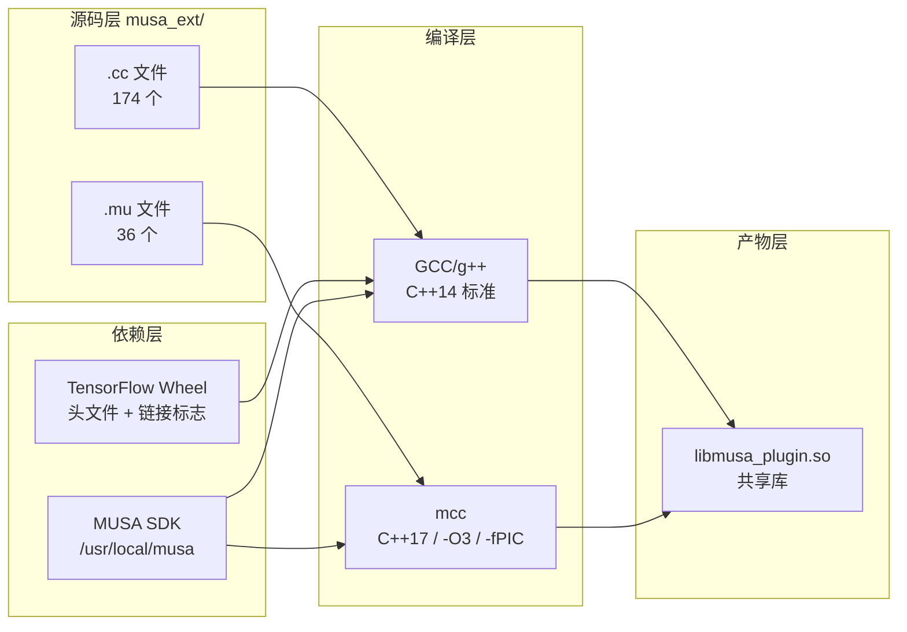
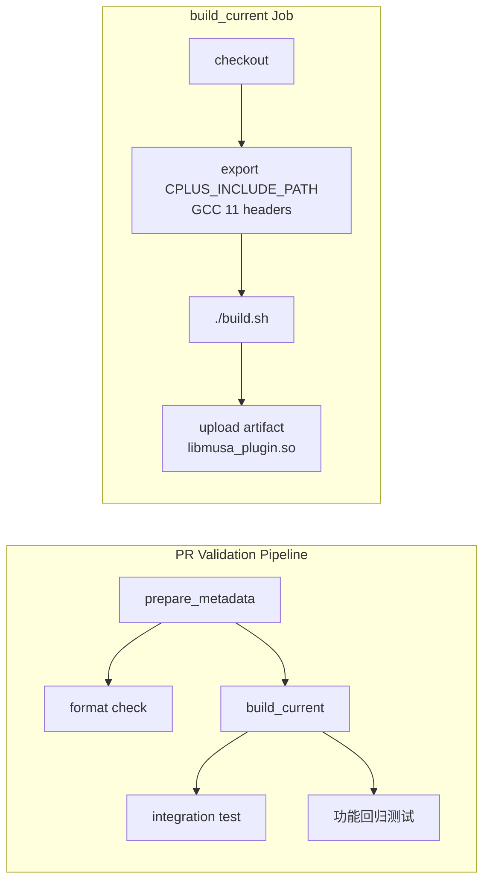

TensorFlow MUSA Extension 采用 **CMake** 作为元构建系统，通过统一的构建入口脚本 `build.sh` 将分布在 `musa_ext/kernels/`（算子实现）、`musa_ext/mu/`（设备与图优化）以及 `musa_ext/utils/`（工具库）中的 174 个 C++ 源文件与 36 个 MUSA 核函数文件编译、链接为单一的动态共享库 `libmusa_plugin.so`。本页面向中级开发者，系统拆解从源码到产物的完整编译路径、关键 CMake 配置语义、双模式构建差异，以及持续集成中的自动化验证链路。

## 构建系统概览

整个构建系统的顶层架构可以用「**双编译器、单产物**」来概括：C++ 主机端代码由系统 GCC/g++ 处理，设备端 `.mu` 核函数由 MUSA 专用编译器 `mcc` 处理，最终通过 CMake 的 `add_library(SHARED)` 统一链接成可被 `tf.load_library()` 动态加载的插件共享库。



Sources: [CMakeLists.txt](CMakeLists.txt#L1-L174), [build.sh](build.sh#L1-L13)

## 源码结构与编译单元

CMake 通过 `file(GLOB_RECURSE)` 自动扫描 `musa_ext/` 下的两类源文件，开发者新增算子时只需按目录规范放置文件即可被自动纳入构建，无需修改构建脚本。

| 文件类型 | 扩展名 | 典型目录 | 编译器 | 说明 |
|---------|--------|---------|--------|------|
| 主机端算子/注册代码 | `.cc` | `musa_ext/kernels/*/` `musa_ext/mu/*/` `musa_ext/utils/` | GCC/g++ (`CMAKE_CXX_COMPILER`) | 实现 OpKernel、设备注册、图优化 Pass |
| 设备端核函数 | `.mu` | `musa_ext/kernels/*/` | `mcc` (`${MUSA_PATH}/bin/mcc`) | MUSA GPU 核函数源码，经 mcc 编译为目标文件后参与最终链接 |
| 公共头文件 | `.h` | 各目录同级 | — | 被 `.cc` 与 `.mu` 共同包含 |

在编译阶段，所有 `.mu` 文件会被 CMake 的 `add_custom_command` 逐条调用 `mcc -c` 编译为 `.mu.o` 目标文件；以文件名 `disabled_` 开头的 `.mu` 文件会被显式排除，便于临时下线特定核函数而不移除源码。

Sources: [CMakeLists.txt](CMakeLists.txt#L108-L151)

## 编译流程详解

开发者只需执行 `./build.sh` 即可触发完整的编译流水线。脚本内部通过解析命令行参数区分 **Release** 与 **Debug** 两种模式，随后自动完成清理、配置、编译与验证。

```mermaid
flowchart TD
    Start([执行 build.sh]) --> Parse{解析参数}
    Parse -->|默认 / release| Rel[CMAKE_BUILD_TYPE=Release<br/>MUSA_KERNEL_DEBUG=OFF]
    Parse -->|debug| Deb[CMAKE_BUILD_TYPE=Debug<br/>MUSA_KERNEL_DEBUG=ON]
    Rel --> Clean[rm -rf build<br/>mkdir -p build]
    Deb --> Clean
    Clean --> CMake[cmake .. 生成 Makefile]
    CMake --> Make[make -j$(nproc)<br/>并行编译]
    Make --> Verify{检查<br/>libmusa_plugin.so}
    Verify -->|存在| Done([构建成功])
    Verify -->|不存在| Err([exit 1 失败])
```

Sources: [build.sh](build.sh#L16-L82)

## CMake 核心配置解析

`CMakeLists.txt` 并非简单的规则堆砌，而是围绕 **ABI 一致性**、**多编译器协同** 与 **运行时库发现** 三个核心问题展开设计。下表提炼了对开发者调试构建问题最关键的配置项。

| 配置域 | 关键代码/变量 | 设计意图 |
|--------|--------------|---------|
| 编译器强制 | `CMAKE_C_COMPILER gcc` / `CMAKE_CXX_COMPILER g++` | 强制对齐 TensorFlow pip 包所使用的 GCC ABI，避免 Clang 等工具链引入符号不兼容。 |
| C++ 标准 | `CMAKE_CXX_STANDARD 14` | 主机端代码使用 C++14；`.mu` 文件因包含 TensorFlow 头文件需 C++17，故在 `mcc` 侧单独指定 `-std=c++17`。 |
| MUSA SDK 路径 | `MUSA_PATH "/usr/local/musa"` | 可缓存修改；脚本会自动验证路径存在性，并查找 `mcc`、`musa`、`mublas`、`mudnn`/`mudnncxx`。 |
| TensorFlow 集成 | `tf.sysconfig.get_include()` / `get_compile_flags()` / `get_link_flags()` | 通过 Python 运行时自省获取当前环境的 TF 编译参数，确保插件与所安装的 TF wheel 严格同构。 |
| ABI 清洗 | 移除 `_GLIBCXX_USE_CXX11_ABI=0/1` 后重设为 `0` | 消除 pip 包编译标志中可能存在的 ABI 冲突，统一使用旧 ABI 以兼容 TensorFlow 2.6.1 预编译包。 |
| NDEBUG 强制 | 始终追加 `-DNDEBUG` | 因为 pip TensorFlow 以 Release 模式构建，若插件保留断言宏会导致 `RefCounted` 析构语义不一致，引发虚假的引用计数崩溃。 |
| 调试开关 | `MUSA_KERNEL_DEBUG` (CMake `option`) | 唯一受控的插件侧调试通道；开启后注入 `MUSA_KERNEL_DEBUG` 宏，用于 Kernel 计时（不影响 NDEBUG）。 |
| RPATH 设置 | `INSTALL_RPATH "${TF_LIB_DIR};${MUSA_PATH}/lib;..."` | 保证运行时无需 `LD_LIBRARY_PATH` 即可定位 `libtensorflow_framework.so.2` 与 MUSA 驱动库。 |
| 自动扫描 | `file(GLOB_RECURSE CPP_SOURCES ... MU_SOURCES ...)` | 降低新增算子的构建维护成本；源文件按目录约定存放即自动纳入编译。 |

Sources: [CMakeLists.txt](CMakeLists.txt#L1-L175)

## 双模式构建差异

`build.sh` 屏蔽了底层 CMake 的复杂度，向开发者暴露「一行命令切换模式」的接口。两种模式的核心差异体现在优化级别、调试宏注入与运行时可观测性上。

| 维度 | Release 模式（默认） | Debug 模式 |
|------|-------------------|-----------|
| 触发命令 | `./build.sh` 或 `./build.sh release` | `./build.sh debug` |
| `CMAKE_BUILD_TYPE` | `Release` | `Debug` |
| `MUSA_KERNEL_DEBUG` | `OFF` | `ON` |
| 核函数优化 | `-O3`（`mcc` 侧固定） | `-O3`（`mcc` 侧固定） |
| 调试日志宏 | `MUSA_DISABLE_DEBUG_LOGGING` `MUSA_DISABLE_TRACE_LOGGING` `MUSA_DISABLE_AUTO_TRACE` | 注入 `MUSA_KERNEL_DEBUG`；禁用上述三个关闭宏 |
| 运行时影响 | 零调试开销，适合生产部署 | 可通过环境变量（如 `MUSA_TIMING_KERNEL_*`）输出 Kernel 耗时统计，适合性能剖析 |
| NDEBUG | 始终保留 | 始终保留（与 TF wheel 兼容） |

需要特别注意的是，Debug 模式**不会**关闭 `-DNDEBUG`，因为 TensorFlow pip 包本身在 Release 模式下编译；若插件侧开启断言，内联 `DCHECK` 的副作用会导致引用计数语义割裂，从而在 Session 或资源析构时触发虚假的 `abort`。

Sources: [build.sh](build.sh#L19-L52), [CMakeLists.txt](CMakeLists.txt#L56-L71)

## 静态注册与链接机制

本项目采用 TensorFlow 插件架构下的**静态注册**模式：所有算子注册代码通过 `MUSA_KERNEL_REGISTER` 宏将注册函数指针收集到全局 `RegVector` 中，当插件被 `tf.load_library()` 加载时，由 `TF_InitKernel()` 统一回调执行。设备注册与图优化器注册则分别通过 `REGISTER_LOCAL_DEVICE_FACTORY` 与带 `__attribute__((constructor))` 的全局构造函数完成。

这一机制对构建系统的直接影响是：最终产物必须是一个**完整的共享库**（`SHARED`），而非静态库或零散目标文件；否则注册函数的 `.init_array` 段无法在动态加载时被正确解析。CMake 侧通过 `add_library(musa_plugin SHARED ...)` 保证这一点，并通过 `set_target_properties(... SUFFIX ".so")` 锁定输出格式。

Sources: [kernel_register.cc](musa_ext/mu/kernel_register.cc#L8-L26), [device_register.cc](musa_ext/mu/device_register.cc#L87-L106), [CMakeLists.txt](CMakeLists.txt#L154-L174)

## CI/CD 中的自动化构建

代码合入主分支前，GitHub Actions 工作流 `pr-validation.yml` 会在自托管的 `musa-gpu` Runner 上执行「编译 → 产物归档 → 集成测试」的完整验证链。其中的 `build_current` Job 复用与本地完全一致的构建入口，但额外注入了 CI 环境所需的 GCC 11 头文件搜索路径。



在 CI 环境中，`CPLUS_INCLUDE_PATH` 被显式指向 `/usr/include/c++/11`，以解决某些 Runner 上默认 GCC 版本与 TensorFlow 头文件依赖的 C++ 标准库版本错位问题。本地开发时若遇到类似的头文件缺失报错，可参考此做法手动导出该变量。

Sources: [.github/workflows/pr-validation.yml](.github/workflows/pr-validation.yml#L227-L322)

## 代码质量门禁

构建流程并非孤立存在，它与代码风格检查共同组成质量门禁。项目通过 `.pre-commit-config.yaml` 在本地提交前执行 `clang-format` 格式化，并在 CI 的 `format` Job 中以 `--Werror --dry-run` 方式复验。虽然格式检查当前被标记为 non-blocking（不阻塞合入），但一致的代码风格能显著降低多人协作时的 diff 噪音，也避免格式问题在 Review 中分散注意力。

| 检查项 | 工具 | 作用范围 | 阻塞性 |
|--------|------|---------|--------|
| C/C++ 格式化 | `clang-format` (style=file) | `.cc` / `.h` / `.c` | 本地自动修复；CI 告警但不阻塞 |
| 提交信息规范 | `gitlint` | commit message | CI 检查 |
| 合并冲突标记 | `check-merge-conflict` | 全部文本文件 | 阻塞 |
| 尾行空白/换行 | `trailing-whitespace` / `end-of-file-fixer` | 全部文本文件 | 自动修复 |

Sources: [.pre-commit-config.yaml](.pre-commit-config.yaml#L1-L36), [.github/workflows/pr-validation.yml](.github/workflows/pr-validation.yml#L139-L226)

## 常见问题与排查

| 现象 | 根因 | 解决方式 |
|------|------|---------|
| `MUSA_PATH does not exist` | MUSA SDK 未安装或未安装在默认路径 | 安装 SDK 或运行 `cmake -DMUSA_PATH=/your/path ..` |
| `Failed to find mudnncxx or mudnn` | muDNN 库未正确部署 | 检查 `${MUSA_PATH}/lib` 或 `lib64` 下是否存在 `libmudnncxx.so` 或 `libmudnn.so` |
| `Failed to get TensorFlow include path` | Python 环境中未安装 TensorFlow | 确认 `python3 -c "import tensorflow"` 成功，且版本为 2.6.1 |
| 链接报错 `undefined reference to tensorflow::...` | ABI 不匹配或 TF 编译标志未正确传递 | 检查 `TF_COMPILE_FLAGS` 是否包含正确的 `-I` 与 `-L`；确认使用 GCC 而非 Clang |
| 运行时 `free(): invalid pointer` / refcount abort | 插件编译时未定义 `NDEBUG` | 确保 CMake 始终注入 `-DNDEBUG`；不要手动移除该宏 |
| `mcc` 编译 `.mu` 时提示缺少 `arm_neon.h` 相关错误 | `mcc` 的 aarch64 host 预定义触发了 NEON 头文件 | 已在 CMake 中通过 `-U__ARM_NEON -U__ARM_NEON__` 屏蔽；若遇到请更新 CMakeLists.txt 至最新版本 |

Sources: [CMakeLists.txt](CMakeLists.txt#L20-L48), [CMakeLists.txt](CMakeLists.txt#L56-L71), [CMakeLists.txt](CMakeLists.txt#L121-L127)

## 下一步

完成构建后，建议按以下路径深入阅读：

- 若需理解插件如何被 TensorFlow 识别并加载，请参阅 [Stream Executor 与设备注册机制](5-stream-executor-yu-she-bei-zhu-ce-ji-zhi)。
- 若需为 MUSA 新增自定义算子，请参阅 [自定义 MUSA Kernel 开发指南](12-zi-ding-yi-musa-kernel-kai-fa-zhi-nan)。
- 若需运行测试验证构建产物，请参阅 [测试框架与工具类](20-ce-shi-kuang-jia-yu-gong-ju-lei)。
- 若开启 Debug 模式后需要解读 Kernel 计时输出，请参阅 [Kernel 计时与性能剖析](16-kernel-ji-shi-yu-xing-neng-pou-xi)。