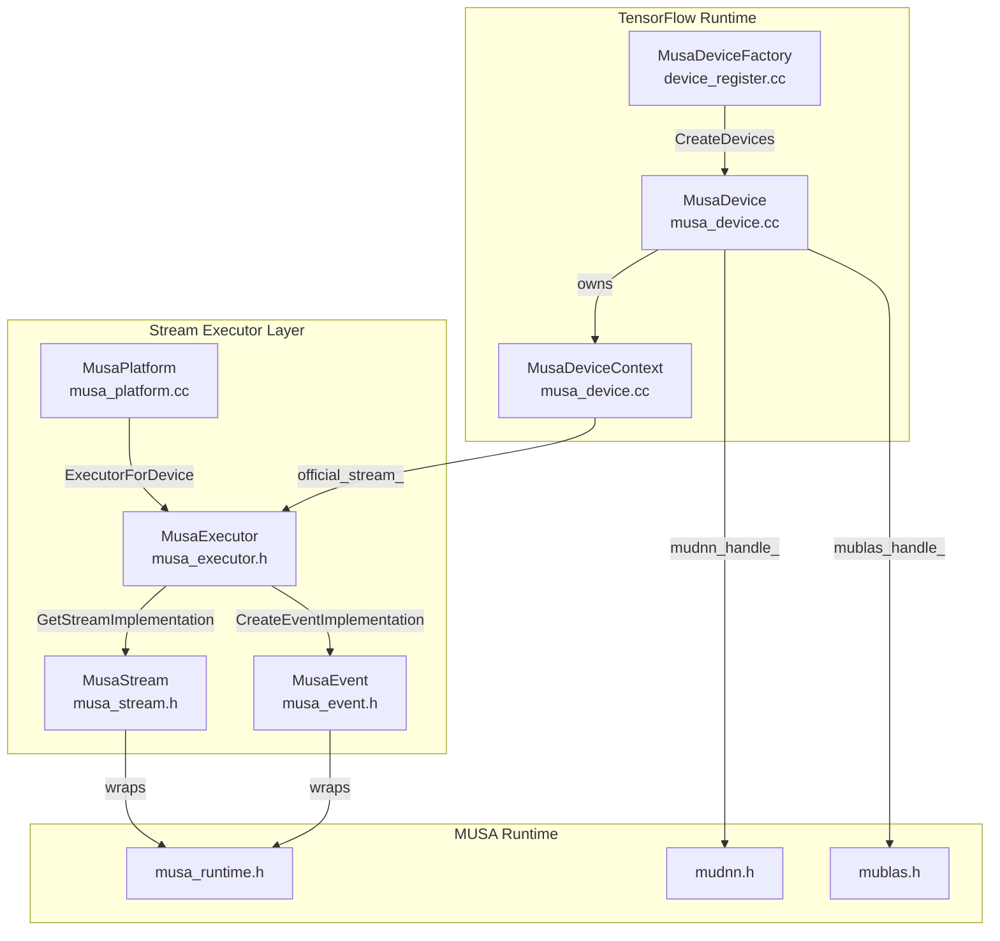

本文档深入解析 TensorFlow MUSA 扩展中 **Stream Executor** 抽象层与 **MUSA 设备注册机制** 的协同工作原理。内容覆盖从底层硬件抽象到 TensorFlow 运行时设备接入的完整链路，重点阐述平台注册、流执行器实例化、设备上下文管理以及异步事件回调等核心子系统的交互模式与关键实现细节。

---

## 架构总览：从硬件抽象到运行时设备

MUSA 扩展采用**双层注册架构**：底层通过 Stream Executor 的 `Platform` 与 `StreamExecutor` 抽象屏蔽 MUSA Runtime 差异，上层通过 TensorFlow 的 `DeviceFactory` 将 MUSA 设备接入图执行运行时。两者之间由 `MusaDevice` 与 `MusaDeviceContext` 完成桥接。

该分层设计的核心优势在于：**Stream Executor 层提供跨平台统一的内存、流、事件语义**，而 `MusaDevice` 则在此基础上叠加 TensorFlow 特有的分配器、设备上下文与库句柄管理。

Sources: [musa_platform.cc](musa_ext/mu/device/musa_platform.cc#L15-L81), [musa_executor.h](musa_ext/mu/device/musa_executor.h#L24-L334), [musa_device.h](musa_ext/mu/device/musa_device.h#L83-L127)

---

## 设备注册机制：Platform 与 DeviceFactory 的双轨协同

### 1. Stream Executor Platform 注册

`MusaPlatform` 在模块初始化阶段通过 `REGISTER_MODULE_INITIALIZER` 宏注册到全局 `MultiPlatformManager`。它负责维护设备描述、按 ordinal 缓存 `StreamExecutor` 实例，并向外界暴露统一的硬件查询接口。

| 职责 | 实现位置 | 关键方法 |
|------|----------|----------|
| 平台标识 | `musa_platform.cc` | `kMusaPlatformId`, `Name()` |
| 可见设备枚举 | `musa_platform.cc` | `VisibleDeviceCount()` |
| Executor 缓存与创建 | `musa_platform.cc` | `GetExecutor()`, `GetUncachedExecutor()` |
| 设备描述构建 | `musa_platform.cc` | `DescriptionForDevice()` |

`ExecutorCache` 确保同一 ordinal 的 `StreamExecutor` 不会被重复构造；`GetUncachedExecutor` 则实际实例化 `MusaExecutor` 并调用其 `Init(device_ordinal, device_options)` 完成初始化。

Sources: [musa_platform.cc](musa_ext/mu/device/musa_platform.cc#L13-L92)

### 2. TensorFlow DeviceFactory 注册

`MusaDeviceFactory` 继承自 `DeviceFactory`，通过 `REGISTER_LOCAL_DEVICE_FACTORY("MUSA", MusaDeviceFactory, 210)` 注册到 TensorFlow 的设备工厂表，优先级为 210。其生命周期方法承担以下职责：

- **`ListPhysicalDevices`**：调用 `musaGetDeviceCount` 枚举物理设备，生成 `/physical_device:MUSA:N` 列表。
- **`CreateDevices`**：为每个设备 ordinal 查询已注册的 `MusaPlatform`，获取 `StreamExecutor`，计算内存上限（当前可用显存的 90%），构造 `DeviceAttributes`，最终实例化 `MusaDevice`。

此处存在一个关键的**内存一致性约束**：`CreateDevices` 中通过 `musaMemGetInfo` 计算 `memory_limit` 并写入 `DeviceAttributes`，该值在 `MusaDevice` 构造函数中被用于配置 `BFCAllocator`。两者必须采用一致的计算公式（均为 `free_memory * 0.9`），否则会导致分配器实际可用空间与运行时记录不符。

Sources: [device_register.cc](musa_ext/mu/device_register.cc#L21-L85)

### 3. C Plugin API 前瞻声明

`device_register.h` 中声明了一套符合 `tensorflow/c/experimental/stream_executor/stream_executor.h` 规范的 C 插件接口（如 `SE_InitPlugin`、`plugin_create_stream_executor` 等），但当前代码库中**尚未提供对应实现**。这意味着当前注册路径完全依赖 C++ 的 `DeviceFactory` 与 `MultiPlatformManager` 机制，而非 TensorFlow 的 C 插件动态加载路径。该头文件的存在表明项目为未来的动态插件化保留了扩展接口。

Sources: [device_register.h](musa_ext/mu/device_register.h#L1-L43)

---

## Stream Executor 核心抽象实现

`MusaExecutor` 是 Stream Executor 接口的 MUSA 后端实现，直接面向 `musa_runtime.h` 操作硬件资源。其设计遵循**“最小够用”原则**：仅实现 TensorFlow 运行时实际调用的子集，未支持的接口（如 `Timer`、`Kernel` 加载）返回空或占位实现。

### 内存管理接口

`MusaExecutor` 提供同步与异步两套内存操作语义：

| 操作类型 | 同步接口 | 异步接口 | 内部转发目标 |
|----------|----------|----------|--------------|
| H2D 拷贝 | `SynchronousMemcpy(H2D)` | `Memcpy(stream, H2D)` | `MusaMemcpyH2D` / `MusaMemcpyAsyncH2D` |
| D2H 拷贝 | `SynchronousMemcpy(D2H)` | `Memcpy(stream, D2H)` | `MusaMemcpyD2H` / `MusaMemcpyAsyncD2H` |
| D2D 拷贝 | `SynchronousMemcpyDeviceToDevice` | `MemcpyDeviceToDevice` | `MusaMemcpyD2D` / `MusaMemcpyAsyncD2D` |
| 内存清零 | `SynchronousMemZero` | `MemZero` | `Memset` |
| 设备内存分配 | `Allocate` | — | `musaMalloc` |
| 设备内存释放 | `Deallocate` | — | `musaFree` |

所有异步接口均通过 `GetMusaStream(stream)` 将 Stream Executor 的抽象 `Stream*` 转换为底层的 `musaStream_t`，再调用 MUSA Runtime API。

Sources: [musa_executor.h](musa_ext/mu/device/musa_executor.h#L60-L181)

### 流与事件同步原语

`MusaStream` 继承自 `internal::StreamInterface`，是对 `musaStream_t` 的轻量级包装，额外提供 `GpuStreamHack` 与 `GpuStreamMemberHack` 以兼容 TensorFlow 内部的流指针透传需求。

`MusaEvent` 继承自 `internal::EventInterface`，使用 `musaEventDisableTiming` 标志创建事件，仅用于同步而非性能计时。`MusaExecutor` 基于该事件实现了：

- **`CreateStreamDependency`**：在 `other` 流上记录事件，令 `dependent` 流等待该事件，从而建立跨流依赖。
- **`RecordEvent` / `WaitForEvent` / `PollForEventStatus`**：完整的事件生命周期管理。

Sources: [musa_stream.h](musa_ext/mu/device/musa_stream.h#L13-L34), [musa_event.h](musa_ext/mu/device/musa_event.h#L12-L45), [musa_executor.h](musa_executor.h#L183-L329)

---

## MUSA 设备运行时：MusaDevice 与 MusaDeviceContext

### 三流架构与上下文隔离

每个 `MusaDevice` 实例维护**三条独立的 MUSA 流**，这一设计解耦了计算、上传与下载的流水线：

| 流名称 | 成员变量 | 用途 |
|--------|----------|------|
| 计算流 | `stream_` | 执行 Kernel 与设备端计算 |
| H2D 流 | `h2d_stream_` | 主机到设备的异步数据拷贝 |
| D2H 流 | `d2h_stream_` | 设备到主机的异步数据拷贝 |

`MusaDeviceContext` 将这三条流与 Stream Executor 的 `official_stream_`（基于计算流构造）封装为统一的 `DeviceContext` 接口，供 TensorFlow 的 Eager/Graph 执行器使用。当执行 `CopyCPUTensorToDevice` 或 `CopyDeviceTensorToCPU` 时，数据拷贝发生在独立的 H2D/D2H 流上，而非计算流，从而允许计算与传输重叠。

Sources: [musa_device.h](musa_ext/mu/device/musa_device.h#L33-L81), [musa_device.cc](musa_ext/mu/device/musa_device.cc#L21-L31)

### 拷贝路径与同步策略

`MusaDeviceContext` 实现了高度优化的双向拷贝逻辑，核心决策如下：

1. **Pinned Memory 检测**：通过 `musaPointerGetAttributes` 判断源/目的内存是否为页锁定内存。若是，直接走 `musaMemcpyAsync` 快速路径。
2. **Bounce Buffer 回退**：对于页able 内存，利用 `GPUPinnedMemoryPool` 分配Pinned中转缓冲区，分阶段完成拷贝（CPU `memcpy` → 异步 GPU 拷贝）。
3. **小拷贝同步优化**：小于 1KB 的传输直接走 `musaMemcpy` 同步路径，避免异步调度开销与潜在驱动稳定性问题。
4. **`sync_dst_compute` 语义**：当该参数为 `true` 时，H2D 拷贝流会通过 `musaStreamWaitEvent` 等待计算流上的同步事件，确保目标张量在 Kernel 读取前已完成上传。

**关键竞态修复**：`CopyCPUTensorToDevice` 与 `CopyDeviceTensorToCPU` 中，用于 `musaStreamWaitEvent` 的临时事件**不能立即销毁**。因为 `musaStreamWaitEvent` 是异步入队操作，若事件在等待命令执行前被销毁，等待将失效，导致脏数据或 NaN。正确做法是通过 `MusaEventMgr::ThenExecute` 将事件销毁延迟到等待流完成该操作之后。

Sources: [musa_device.cc](musa_ext/mu/device/musa_device.cc#L49-L197), [musa_device.cc](musa_ext/mu/device/musa_device.cc#L200-L343)

---

## 异步执行与事件管理：MusaEventMgr

`MusaEventMgr` 是 MUSA 扩展中异步回调通知的核心基础设施，解决了“如何在 GPU 流操作完成后安全触发主机端回调”的问题。

### 工作机制

1. **事件入队**：`ThenExecute(stream, func)` 从 `free_events_` 池获取或新建一个 `musaEvent_t`，在该流上记录事件，并将 `(event, func)` 加入 `used_events_` 队列。
2. **乱序轮询**：`PollLoop` 在独立的后台线程中运行，使用 `musaEventQuery` 检查 `used_events_` 列表中的事件状态。由于采用 `std::list` 而非队列，支持**乱序完成**（Out-of-Order Completion），避免单个慢事件阻塞后续所有回调的头部队列阻塞（Head-of-Line Blocking）。
3. **线程池派发**：已完成的事件对应的回调被移入 `ToFreeVector`，由 `FreeMemory` 方法提交到内部线程池执行。每个回调执行前都会调用 `musaSetDevice(device_id_)` 恢复设备上下文，防止后台线程因丢失设备上下文而导致静默失败。
4. **优雅关闭**：析构时设置 `shutting_down_` 标志，停止轮询线程后，对剩余事件同步执行回调并直接销毁事件，避免底层资源已释放后的无效查询。

Sources: [musa_event_mgr.h](musa_ext/mu/device/musa_event_mgr.h#L46-L117), [musa_event_mgr.cc](musa_ext/mu/device/musa_event_mgr.cc#L23-L318)

---

## 内存分配子系统衔接

`MusaDevice` 的内存子系统与 Stream Executor 层解耦：Stream Executor 的 `Allocate/Deallocate` 仅提供原始设备内存操作，而 `MusaDevice` 在此基础上叠加了 TensorFlow 的 `BFCAllocator` 与 `GPUPinnedMemoryPool`。

| 组件 | 类型 | 作用域 | 关键特性 |
|------|------|--------|----------|
| `BFCAllocator` (MusaSubAllocator) | 设备内存 | `musa_allocator_` | 预分配 `bfc_memory_limit`（可用显存 90%），支持碎片合并与垃圾回收 |
| `BFCAllocator` (MusaHostSubAllocator) | 主机内存 | `musa_host_allocator_` | 256MB 上限，用于主机端 pinned 内存分配 |
| `GPUPinnedMemoryPool` | 页锁定内存池 | `pinned_memory_pool_` | 专用于 bounce buffer，通过事件追踪确保 GPU 异步拷贝完成前不重用地址 |

**显存上限的时序约束**：`MusaDevice` 构造函数中，必须在创建流、MUDNN 或 MUBLAS 句柄**之前**调用 `musaMemGetInfo` 获取空闲显存。因为这些句柄的初始化本身会消耗显存，若在之后获取，会导致 `BFCAllocator` 的容量设定超过实际可用空间。

Sources: [musa_device.cc](musa_ext/mu/device/musa_device.cc#L345-L468), [musa_allocator.h](musa_ext/mu/device/musa_allocator.h#L1-L521), [pinned_memory_pool.h](musa_ext/mu/device/pinned_memory_pool.h#L46-L96)

---

## 生命周期与析构顺序

`MusaDevice` 的析构函数实现了严格的**七步销毁顺序**，以避免 use-after-free 和资源竞争：

1. **释放 `device_context_`**：触发 `~MusaDeviceContext()`，后者调用 `BlockHostUntilDone` 等待所有流操作完成，并销毁 Stream Executor 层面的流对象。
2. **销毁 `event_mgr_`**：轮询线程退出，同步处理剩余回调。
3. **销毁 `mublas_handle_`**：释放 BLAS 库资源。
4. **销毁 `pinned_memory_pool_`**：必须在 `event_mgr_` 之后，因为事件回调中可能引用该池（如 `CopyDeviceTensorToCPU` 的 bounce buffer 归还逻辑）。
5. **销毁 `musa_host_allocator_`**。
6. **销毁 `musa_allocator_`**：释放 BFCAllocator 管理的所有显存块。
7. **销毁底层 MUSA 流**：`d2h_stream_`、`h2d_stream_`、`stream_`。

任何顺序的颠倒都可能导致回调访问已释放内存或流句柄上的悬空操作。

Sources: [musa_device.cc](musa_ext/mu/device/musa_device.cc#L471-L535)

---

## 遥测系统的插件级初始化

除了设备与 Stream Executor 注册外，`device_register.cc` 还通过 `__attribute__((constructor))` 定义了 `OnMusaPluginLoad` 函数。该函数在共享库加载时自动执行，负责从环境变量初始化 `MusaTelemetry` 子系统。遥测系统会在后续的流同步、内存拷贝、事件记录等关键路径上植入探针，为[遥测系统与全链路追踪](17-yao-ce-xi-tong-yu-quan-lian-lu-zhui-zong)提供数据支撑。

Sources: [device_register.cc](musa_ext/mu/device_register.cc#L87-L106), [musa_telemetry.h](musa_ext/mu/device/musa_telemetry.h)

---

## 进阶阅读与关联页面

Stream Executor 与设备注册机制是整个 MUSA 扩展的根基，理解本章内容后，建议按以下顺序深入：

- **[内存管理与分配策略](6-nei-cun-guan-li-yu-fen-pei-ce-lue)**：详细解析 `BFCAllocator`、`MusaSubAllocator` 与 `GPUPinnedMemoryPool` 的协同，以及内存染色（Memory Coloring）与 Use-After-Free 检测机制。
- **[Kernel 注册与算子分发流程](7-kernel-zhu-ce-yu-suan-zi-fen-fa-liu-cheng)**：了解设备就绪后，自定义 MUSA Kernel 如何通过注册表接入 TensorFlow 的算子分发体系。
- **[遥测系统与全链路追踪](17-yao-ce-xi-tong-yu-quan-lian-lu-zhui-zong)**：深入 `MusaTelemetry` 的事件模型、缓冲区管理与性能开销控制。

---

**本章核心结论**：MUSA 扩展通过 **Stream Executor 抽象层 + TensorFlow DeviceFactory 双轨注册**，在保持与上游 TensorFlow 架构兼容的同时，实现了对 MUSA 硬件的完整接入。三流架构、`MusaEventMgr` 的乱序轮询机制、以及严格的显存上限时序约束，共同构成了高吞吐、低延迟的异步设备运行时基础。