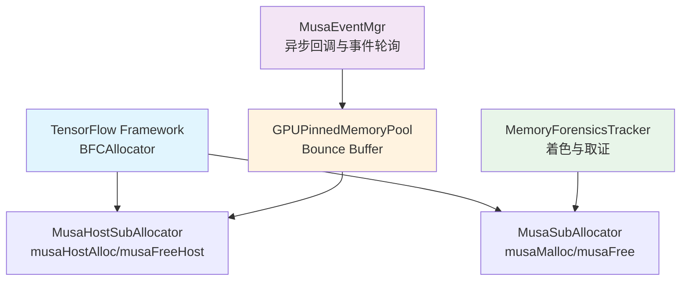

TensorFlow MUSA 扩展的内存子系统并非简单地对 `musaMalloc`/`musaFree` 做一层薄封装，而是在**设备内存池化、主机固定内存异步生命周期、跨流拷贝同步、内存着色取证**四个维度上进行了深度定制。本文从架构分层出发，逐层剖析其分配策略、异步安全机制与调试手段，帮助高级开发者在定位 OOM、脏数据、Use-After-Free 等问题时建立系统性的认知框架。

## 架构总览：四层内存抽象

MUSA 设备的内存管理在逻辑上可划分为四个层次，每一层解决不同粒度的生命周期与一致性问题。



**第一层：框架级池化（BFCAllocator）**。TensorFlow 原生的 `BFCAllocator` 通过 **Best-Fit with Coalescing** 策略管理设备内存，避免频繁向驱动申请/释放带来的碎片与开销。MUSA 插件通过 `MusaSubAllocator` 与 `MusaHostSubAllocator` 将其底层调用桥接到 MUSA Runtime。

**第二层：固定内存池（GPUPinnedMemoryPool）**。专门用于 H2D/D2H 传输中的 bounce buffer。由于 GPU 异步拷贝可能在 `DeallocateRaw` 后仍在进行，该池通过 MUSA Event 追踪流完成状态，确保**地址在 GPU 真正空闲前不会被复用**。

**第三层：事件与回调管理（MusaEventMgr）**。提供跨流异步通知能力，支撑拷贝完成回调、Event 延迟销毁、设备上下文注入等机制，是避免竞态与脏数据的关键基础设施。

**第四层：内存着色与取证（Memory Coloring / Forensics）**。可选的调试层，在分配与释放时填充魔数模式，并维护全局分配历史，用于检测 Use-After-Free（UAF）与内存踩踏。

Sources: [musa_device.h](musa_ext/mu/device/musa_device.h#L113-L127), [musa_allocator.h](musa_ext/mu/device/musa_allocator.h#L120-L298), [pinned_memory_pool.h](musa_ext/mu/device/pinned_memory_pool.h#L46-L96), [musa_event_mgr.h](musa_ext/mu/device/musa_event_mgr.h#L46-L117)

## 设备内存分配器：BFCAllocator + MusaSubAllocator

### 内存上限的精确计算

`MusaDevice` 在构造时有一个关键时序：**必须在创建 MUDNN Handle、MUBLAS Handle 以及任何流之前获取空闲内存**。这是因为 MUDNN 与 MUBLAS 的初始化本身会占用显存，若先初始化库再查空闲内存，`bfc_memory_limit` 会被低估，导致 BFCAllocator 的预留量不足。

```cpp
size_t total_memory = 0, free_memory = 0;
musaMemGetInfo(&free_memory, &total_memory);

size_t bfc_memory_limit = attributes.memory_limit() > 0
                              ? attributes.memory_limit()
                              : static_cast<size_t>(free_memory * 0.9);
```

获取到上限后，`MusaDevice` 以 `allow_growth=false`（预先申请一大块）和 `garbage_collection=true`（允许回收未使用的 Chunk）实例化 `BFCAllocator`。

Sources: [musa_device.cc](musa_ext/mu/device/musa_device.cc#L354-L448)

### MusaSubAllocator 的对齐与溢出防护

`MusaSubAllocator` 继承自 TensorFlow 的 `SubAllocator`，是 `BFCAllocator` 的底层代理。其 `Alloc` 实现体现了两条硬约束：

1. **最小对齐 256 字节**：`musaMalloc` 天然保证 256 字节对齐，但 BFCAllocator 可能请求更大的对齐值。实现中通过向上取整到对齐边界来满足。
2. **溢出检查**：若 `(num_bytes + alignment - 1)` 发生回绕，`alloc_size < num_bytes` 将直接返回 `nullptr`，防止后续分配错误大小的内存。

```cpp
size_t alloc_size = (num_bytes + alignment - 1) & ~(alignment - 1);
if (alloc_size < num_bytes) {
  return nullptr;  // Overflow check
}
```

Sources: [musa_allocator.h](musa_ext/mu/device/musa_allocator.h#L314-L351)

## 主机固定内存池：GPUPinnedMemoryPool

### 问题背景：异步拷贝与地址复用的竞态

标准的 `BFCAllocator` 在 `DeallocateRaw()` 返回后会立即将该地址标记为可复用。然而对于 bounce buffer 场景，CPU 侧可能认为内存已释放，但 GPU 上的异步拷贝仍在读取该地址。若新分配恰好拿到同一地址并写入新数据，将导致**脏数据（NaN 或随机值）**。

### 设计：Event 驱动的延迟回收

`GPUPinnedMemoryPool` 引入了两类队列与一条后台轮询线程：

| 队列 | 职责 | 状态转换 |
|------|------|----------|
| `free_list_` | 已完成 GPU 操作、可安全复用的块 | `pending_frees_` → `free_list_` |
| `pending_frees_` | 已标记释放、等待 GPU Event 完成的块 | `FreeAsync()` → `pending_frees_` |

后台线程以 **100 微秒**为周期调用 `PollPendingFrees()`，通过 `musaEventQuery` 检查事件状态。若事件完成，则销毁事件并将块移入 `free_list_`；若事件未就绪，则跳过；若查询报错，则以防御性策略直接移入 `free_list_` 防止内存泄漏。

`Allocate()` 采用 **Best-Fit** 策略在 `free_list_` 中搜索最小浪费的可用块，而非每次都向驱动申请新内存，从而降低 `musaHostAlloc` 的系统调用开销。

Sources: [pinned_memory_pool.cc](musa_ext/mu/device/pinned_memory_pool.cc#L24-L278)

## 跨流传输策略：三流分离与同步语义

`MusaDeviceContext` 维护三条独立的 MUSA Stream：

| Stream | 用途 | 与计算流的同步关系 |
|--------|------|-------------------|
| `stream_handle_` | 计算内核执行 | 基准流 |
| `h2d_stream_` | Host → Device 拷贝 | 通过 `sync_event` 等待计算流 |
| `d2h_stream_` | Device → Host 拷贝 | 通过 `compute_done_event` 等待计算流 |

### H2D 拷贝的两条路径

**路径 A：Pinned 内存快速路径**。若源地址经 `musaPointerGetAttributes` 确认为 `musaMemoryTypeHost`，直接调用 `musaMemcpyAsync` 走 `h2d_stream_`。

**路径 B：Pageable 内存 bounce buffer 路径**。对于不可页锁定的主机内存，执行三阶段传输：

1. 若数据量 **≤ 1KB**，直接走同步 `musaMemcpy`，避免小量异步传输的驱动开销与不稳定因素。
2. 若数据量 **> 1KB**，从 `GPUPinnedMemoryPool` 分配 bounce buffer。
3. CPU 侧 `std::memcpy` 将页able 数据拷入 pinned bounce buffer。
4. 通过 `musaMemcpyAsync` 将 bounce buffer 异步拷入设备。
5. 调用 `FreeAsync(bounce_buffer, bytes, h2d_stream_)`，确保 bounce buffer 在 GPU 侧真正完成后才回到 `free_list_`。

### sync_dst_compute 与 Event 延迟销毁

`CopyCPUTensorToDevice` 的 `sync_dst_compute` 参数决定了 H2D 拷贝前是否需要等待计算流完成。当该参数为 `true` 时，框架会在计算流上记录 `sync_event`，并让 `h2d_stream_` 等待该事件。

这里存在一个极易忽视的竞态：**`musaStreamWaitEvent` 只是将等待命令入队，函数返回时该命令可能尚未执行**。若在此刻立即 `musaEventDestroy`，等待命令可能被忽略，导致计算内核与 H2D 拷贝并发访问同一块内存，产生脏数据。为此，插件通过 `MusaEventMgr::ThenExecute` 将 Event 的销毁推迟到 `h2d_stream_` 真正完成该等待之后。

```cpp
if (event_mgr_ != nullptr) {
  event_mgr_->ThenExecute(h2d_stream_, [sync_event, device_id]() {
    musaSetDevice(device_id);
    musaEventDestroy(sync_event);
  });
} else {
  musaStreamSynchronize(stream_handle_);
  musaEventDestroy(sync_event);
}
```

Sources: [musa_device.cc](musa_ext/mu/device/musa_device.cc#L49-L198)

## 事件管理器：MusaEventMgr 的乱序完成与线程模型

`MusaEventMgr` 负责将 MUSA 事件转换为可执行的 C++ 回调。其设计核心在于**避免队首阻塞（Head-of-Line Blocking）**。

若使用 `std::queue` 顺序处理事件，当队列前端的事件因某条长耗时内核而未完成时，后续所有已完成的回调都会被延迟。该插件改用 `std::list` 存储 `used_events_`，轮询时遍历全表，**仅处理已就绪的事件并就地删除**，从而支持乱序完成。

### 双线程模型

| 角色 | 实现 | 职责 |
|------|------|------|
| 轮询线程 | 专用 `std::thread` | 持续调用 `musaEventQuery`，识别已完成事件 |
| 回调执行 | 8 线程 `thread::ThreadPool` | 执行用户回调，避免阻塞轮询 |

所有回调在执行前都会注入 `musaSetDevice(device_id_)`，解决后台线程因未绑定设备上下文而导致的静默失败。

### 安全关闭

销毁时，`shutting_down_` 原子标志先被置位，禁止新回调入队。轮询线程退出后，剩余事件不再查询（避免底层资源已销毁导致的 `invalid resource handle` 错误），而是**同步执行**所有积压回调，确保拷贝完成通知、引用计数释放等关键操作不会丢失。

Sources: [musa_event_mgr.h](musa_ext/mu/device/musa_event_mgr.h#L46-L117), [musa_event_mgr.cc](musa_ext/mu/device/musa_event_mgr.cc#L33-L315)

## 内存着色与取证：调试未初始化内存与 UAF

当编译时定义 `-DTF_MUSA_MEMORY_COLORING=1`，或通过运行时 API 动态开启时，`MusaSubAllocator` 会在每次 `Alloc`/`Free` 中插入魔数填充逻辑。

| 阶段 | 魔数 | 用途 |
|------|------|------|
| 分配后 | `0xAB` (`kMusaAllocByte`) | 标记未初始化内存；若内核读取后仍为此模式，说明存在未初始化使用 |
| 释放前验证 | 检查是否混入 `0xCD` | 若发现 `0xCDCDCDCD`，说明存在 Use-After-Free |
| 释放后 | `0xCD` (`kMusaFreeByte`) | 污染已释放内存；若后续分配发现此模式，说明地址被提前复用 |

`MemoryForensicsTracker` 以全局单例形式维护两张哈希表：`allocation_history_`（每个地址的完整历史链）与 `active_allocations_`（当前活跃分配）。当 `track_history` 开启时，它能检测 **Double-Free**（释放未追踪地址）并生成 Markdown 格式的取证报告，包含时间戳、操作类型、大小与设备 ID。

Sources: [musa_allocator.h](musa_ext/mu/device/musa_allocator.h#L30-L298), [musa_allocator.cc](musa_ext/mu/device/musa_allocator.cc#L12-L42)

## 对象销毁顺序的生命周期契约

`MusaDevice` 的析构函数体现了严格的依赖链，任何顺序调整都可能触发 Use-After-Free：

1. **释放 `device_context_`**：阻塞等待所有流操作完成，确保后续不再有新的异步事件产生。
2. **销毁 `event_mgr_`**：同步处理剩余回调，此后不会再有后台线程引用其他成员。
3. **销毁 `mublas_handle_`**。
4. **销毁 `pinned_memory_pool_`**：必须在 `event_mgr_` 之后，因为某些回调（如 D2H 的第二阶段 CPU `memcpy`）内部会调用 `FreeAsync`。
5. **销毁 `musa_host_allocator_`** 与 **`musa_allocator_`**。
6. **销毁三条 stream**。

Sources: [musa_device.cc](musa_ext/mu/device/musa_device.cc#L471#L535)

## 配置选项与运行时开关

| 编译/运行选项 | 作用域 | 说明 |
|---------------|--------|------|
| `-DTF_MUSA_MEMORY_COLORING=1` | 编译期 | 默认开启内存着色与历史追踪 |
| `EnableMemoryDebugging(c, h, v)` | 运行期 | 动态控制着色、历史、验证三开关 |
| `MUSA_KERNEL_DEBUG` (CMake) | 编译期 | 开启 Kernel 计时，与内存系统无关但共享同一调试基础设施 |
| `bfc_memory_limit` | 运行期 | 优先采用 `DeviceAttributes` 中的显式限制，否则自动取空闲内存的 90% |

Sources: [musa_allocator.h](musa_ext/mu/device/musa_allocator.h#L48-L76), [CMakeLists.txt](CMakeLists.txt#L13-L71)

## 与其他章节的关联

内存分配策略与设备运行时、算子分发、调试诊断紧密耦合。若需进一步了解设备如何向 TensorFlow 注册自身并暴露 Allocator 接口，请参阅 [Stream Executor 与设备注册机制](5-stream-executor-yu-she-bei-zhu-ce-ji-zhi)。若关注的是算子 Kernel 内部如何调用 `musaMemcpyAsync` 或自定义内存布局，请转向 [自定义 MUSA Kernel 开发指南](12-zi-ding-yi-musa-kernel-kai-fa-zhi-nan)。当遇到疑似内存踩踏或脏数据问题时，[内存诊断与脏数据检测](18-nei-cun-zhen-duan-yu-zang-shu-ju-jian-ce) 提供了更完整的调试环境变量速查与实战方法。