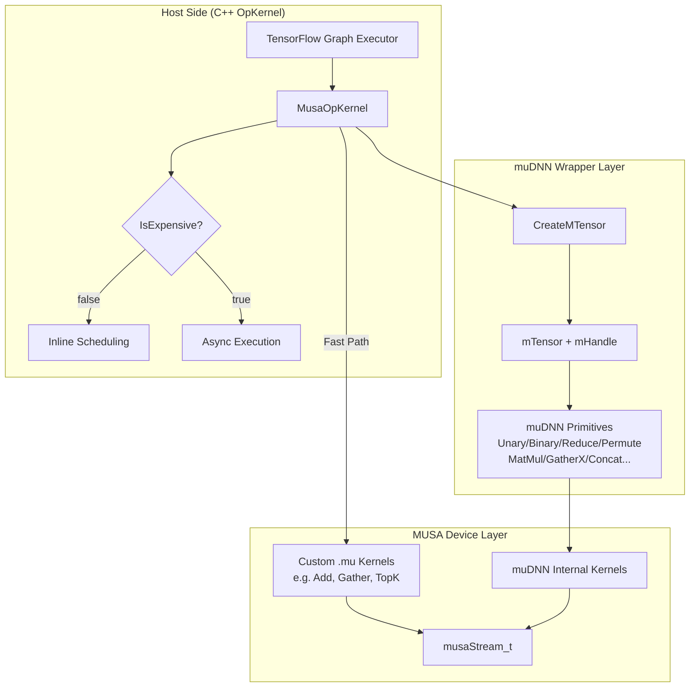

本页聚焦 TensorFlow MUSA 插件中**基础数学算子**（逐元素运算、归约、矩阵乘等）与**数组算子**（变形、切片、聚合、广播等）的实现体系。作为框架中最频繁执行的算子类别，它们构成了神经网络前向/反向计算的“基础设施层”。理解其实现模式，是后续深入神经网络专用算子（如 Conv、LayerNorm）与自定义 Kernel 开发的必要前提。

基础数学与数组算子的源码主要分布在 `musa_ext/kernels/math/`（53 个 `.cc` 文件、16 个 `.mu` 文件）与 `musa_ext/kernels/array/`（42 个 `.cc` 文件、8 个 `.mu` 文件）两个目录下，总计约 14,000 行 C++/MUSA 代码。

Sources: [目录结构](musa_ext/kernels/math/)，[目录结构](musa_ext/kernels/array/)

---

## 架构总览

所有算子共享同一套**三层架构**：顶层的 `MusaOpKernel` 继承自 TensorFlow 的 `OpKernel`，负责输入校验、输出分配与生命周期管理；中间层通过 `CreateMTensor()` 将 `tensorflow::Tensor` 封装为 muDNN 的 `mTensor`，并调用 muDNN 原语完成计算；对于性能敏感的热点路径，则下沉到第三层的自定义 `.mu` Kernel，直接通过 MUSA Runtime 发射线程网格。



这一分层设计的核心优势在于：**以 muDNN 原语保证功能完整性与数值正确性，以自定义 Kernel 快速路径换取极致性能**，同时通过统一的 `MusaOpKernel` 基类收敛设备上下文、数据格式与错误处理逻辑。

Sources: [utils_op.h](musa_ext/kernels/utils_op.h#L69-L143)，[utils_op.cc](musa_ext/kernels/utils_op.cc#L52-L132)

---

## 算子分类体系

| 类别 | 典型算子 | 核心 muDNN 原语 | 计算特征 | 文件示例 |
|:---|:---|:---|:---|:---|
| **一元逐元素** | Abs, Neg, Sign, Sqrt, Exp, Log, Round, Erf, Cast | `mUnary` | 内存带宽受限，计算极轻 | [musa_abs_op.cc](musa_ext/kernels/math/musa_abs_op.cc#L1-L56) |
| **二元逐元素** | Add, Sub, Mul, Div, Pow, Maximum, Minimum, Equal, Greater | `mBinary` | 广播语义复杂，有快速路径 | [musa_add_op.cc](musa_ext/kernels/math/musa_add_op.cc#L1-L373) |
| **归约** | Sum, Mean, Prod, Max, Min, All, ArgMax | `mReduce` | 计算密集，需临时工作区 | [musa_sum_op.cc](musa_ext/kernels/math/musa_sum_op.cc#L1-L167) |
| **矩阵乘法** | MatMul, BatchMatMulV2, Einsum | `mMatMul` / `mBatchMatMul` | 计算密集，支持 TF32 | [musa_matmul_op.cc](musa_ext/kernels/math/musa_matmul_op.cc#L1-L195) |
| **变形与视图** | Reshape, ExpandDims, Squeeze, Identity, StopGradient | 纯元数据操作 | 零拷贝，无设备计算 | [musa_reshape_op.cc](musa_ext/kernels/array/musa_reshape_op.cc#L1-L121) |
| **切片与步进** | Slice, StridedSlice, Split, SplitV | `mPermute` (ConfigDimStrideForSlice) | 内存搬运，可异步 | [musa_slice_op.cc](musa_ext/kernels/array/musa_slice_op.cc#L1-L82) |
| **转置与置换** | Transpose, InvertPermutation | `mPermute` (ConfigDimStride) | 内存重排，非计算密集 | [musa_transpose_op.cc](musa_ext/kernels/array/musa_transpose_op.cc#L1-L113) |
| **聚合与拼接** | Concat, ConcatOffset, Pack | `mConcat` / `musaMemcpyAsync` | 内存带宽受限，单输入可短路 | [musa_concat_op.cc](musa_ext/kernels/array/musa_concat_op.cc#L1-L125) |
| **广播与填充** | BroadcastTo, Fill, ZerosLike | `mBinary` / `mFill` | 常数填充或广播展开 | [musa_broadcast_to_op.cc](musa_ext/kernels/array/musa_broadcast_to_op.cc#L1-L130) |
| **Gather 族** | GatherV2, GatherNd, ResourceGather | `mGatherX` / Custom Kernel | 索引离散访存，有 custom fallback | [musa_gather_op.cc](musa_ext/kernels/array/musa_gather_op.cc#L1-L222) |
| **排序与选择** | TopKV2, Where | Custom Kernel / `mTopK` | 计算复杂，多输出 | [musa_topkv2_op.cc](musa_ext/kernels/math/musa_topkv2_op.cc#L1-L131) |

---

## 核心实现模式

### 模式一：一元/二元逐元素算子（Unary/Binary）

这是最简单也最典型的模式。以 `Abs` 为例，整个 `Compute` 流程仅需四步：取输入、分配输出、配置 `mUnary` 模式为 `ABS`、调用 `Run`。所有逐元素算子都遵循“**单输入单输出、维度不变、无额外状态**”的契约。

对于二元算子（如 `Add`、`Pow`），核心复杂性在于**广播（Broadcast）语义**。插件并未在 Kernel 内手动展开广播，而是依赖 muDNN 的 `mTensor` 视图机制：通过 `SetNdInfo()` 重新描述输入张量的 shape 与 stride，将广播轴的 stride 设为 0，从而让 muDNN 在内部处理重复访存。以 `Pow` 为例，它显式调用 `BCast` 计算输出形状后，将 TF 的广播 reshape 结果设置到 `mTensor` 的 NdInfo 中。

Sources: [musa_abs_op.cc](musa_ext/kernels/math/musa_abs_op.cc#L28-L48)，[musa_pow_op.cc](musa_ext/kernels/math/musa_pow_op.cc#L48-L84)

### 模式二：归约算子（Reduction）

归约算子（`Sum`、`Mean`、`Prod`、`Max` 等）共享同一套 `ReduceFunctor` 模板。与逐元素算子不同，归约需要**临时设备内存（workspace）**供 muDNN 内部使用。插件通过 `MemoryMaintainer` 将 TensorFlow 的 `Allocator` 包装为 muDNN 的分配回调，确保内存统计与对齐策略与 TF 统一。

`Sum` 的实现展示了三个关键优化点：
1. **空张量/零维短路**：若输入元素数为 0，直接返回输入；若归约维度尺寸为 1，通过 `CopyFrom` 做零拷贝视图。
2. **keep_dims 与 muDNN shape 对齐**：TF 的 `keep_dims` 会影响输出 shape，但 muDNN 要求归约轴在内部保持为 1，因此代码中对 `out_reshaped` 做了中间 shape 转换。
3. **BF16 提升**：`ReduceFunctor` 对 `bfloat16` 做了特化，先将输入 cast 到 `fp32` 做归约，再将结果 cast 回 `bf16`，以避免低精度累加误差。

Sources: [musa_sum_op.cc](musa_ext/kernels/math/musa_sum_op.cc#L28-L153)，[musa_reduce_functor.h](musa_ext/kernels/math/musa_reduce_functor.h#L1-L71)

### 模式三：数组变换算子（Array Transform）

数组算子大多不执行数值计算，而是操作**张量元数据或内存布局**。这类算子可进一步细分为两种子模式：

**纯元数据视图**：`Reshape`、`ExpandDims`、`Squeeze`、`Identity` 等算子完全在 Host 侧完成。以 `Reshape` 为例，它解析 `sizes` 输入（支持 `-1` 推断），验证元素总数一致后，直接调用 `Tensor::CopyFrom(input, new_shape)`。该操作仅修改张量描述符，底层 GPU 内存指针不变，实现真正的零拷贝。

**基于 Permute 的切片/转置**：`Slice`、`Split`、`StridedSlice`、`Transpose` 等算子底层复用 muDNN 的 `mPermute` 原语。`Transpose` 通过 `ConfigDimStride` 根据 permutation 配置输入到输出的维度映射；`Slice` 系列则通过 `ConfigDimStrideForSlice` 设置起始偏移与步长。`StridedSlice` 额外处理了 TF 的 `begin_mask`、`end_mask`、`shrink_axis_mask` 等复杂掩码语义，并在 identity 路径下使用 `musaMemcpyAsync` 做异步内存拷贝。

Sources: [musa_reshape_op.cc](musa_ext/kernels/array/musa_reshape_op.cc#L42-L95)，[musa_transpose_functor.h](musa_ext/kernels/array/musa_transpose_functor.h#L1-L30)，[musa_strided_slice_op.cc](musa_ext/kernels/array/musa_strided_slice_op.cc#L42-L148)

### 模式四：矩阵乘法与爱因斯坦求和（MatMul / Einsum）

`MatMul` 与 `BatchMatMulV2` 统一实现在 `MusaMatMulOp` 中。对于 2D 矩阵乘，直接调用 `mMatMul`；对于高维 BatchMatMul，则通过 `MatMulBCast` 处理 batch 维度广播后，将输入 reshape 到 3D（batch, m, k）再调用 `mBatchMatMul`。这里有两个值得注意的设计决策：

- **TF32 精度控制**：构造函数读取环境变量 `MUSA_ENABLE_TF32`，并通过 `handle.SetAllowTF32()` 在运行期动态开启或关闭 TF32 加速。这在追求极致吞吐的训练场景与需要严格数值一致性的调试场景之间提供了开关。
- **Einsum 的分解策略**：`Einsum` 并非直接映射到单个 muDNN 原语，而是通过 `EinsumHelper` 在 Host 侧完成字符串方程解析，将复杂的爱因斯坦求和分解为**转置 → 广播reshape → 矩阵乘 → 归约 → 转置**的组合序列，逐步调用已有的 `TransposeFunctor`、`ReduceFunctor` 与 `BatchMatMul` 完成计算。

Sources: [musa_matmul_op.cc](musa_ext/kernels/math/musa_matmul_op.cc#L47-L173)，[musa_einsum_op.cc](musa_ext/kernels/math/musa_einsum_op.cc#L1-L120)

---

## 关键实现案例剖析

### Add：广播视图优化与自定义 Kernel 快速路径

`Add` 是深度学习框架中调用量最高的算子之一，其实现复杂度也最具代表性。`MusaAddOp` 的 `Compute` 流程如下：

1. **形状推导与广播校验**：使用 TF 的 `BCast` 工具类推导输出形状，校验兼容性。
2. **内存前向（Forward）**：调用 `ctx->forward_input_or_allocate_output({0}, 0, ...)`，在 TF 判定安全时直接复用输入 0 的缓冲区，避免额外分配。
3. **自定义 Kernel 快速路径**：针对 `float` 类型，优先匹配三种常见模式并发射手写 `.mu` Kernel：
   - **同形状相加**：调用向量化 `float4` Kernel，256 线程/块，尾标量回退。
   - **标量广播**：一个操作数为标量，使用 `AddScalarKernelFloat4` 做 4 路广播加法。
   - **尾向量广播**：如 `[N, C] + [C]`，通过 `AddTailVectorKernelFloat` 按模索引直接相加。
4. **muDNN 通用回退**：若快速路径未命中，则回到 `mBinary(ADD)`，并可选启用**广播视图优化**——对小型重复广播输入（`reuse_factor >= 4` 且元素数 `<= 4096`）通过 `ConfigureBroadcastView()` 将广播轴 stride 设为 0，避免物理数据展开。

Sources: [musa_add_op.cc](musa_ext/kernels/math/musa_add_op.cc#L273-L352)，[musa_add_kernel.mu](musa_ext/kernels/math/musa_add_kernel.mu#L1-L160)

### Sum：归约的零拷贝与 workspace 管理

`Sum` 在归约维度尺寸为 1 时（例如对长度为 1 的轴求和），不调用任何设备 Kernel，而是通过 `Tensor::CopyFrom(input, output_shape)` 返回一个调整过 shape 的新张量视图。这利用了 TensorFlow 张量的引用计数机制，在 Host 侧完成，耗时可忽略不计。

当真正需要设备计算时，`Sum` 通过 `ReduceFunctor::Compute` 统一调用 `mReduce(ADD)`。这里 `MemoryMaintainer` 的引入至关重要：它将 TF 的 `AllocatorAttributes` 对齐到 muDNN 的 `alloc_func` 回调，确保 workspace 内存与 TF 的 BFCAllocator 统一管理，避免跨分配器碎片。

Sources: [musa_sum_op.cc](musa_ext/kernels/math/musa_sum_op.cc#L89-L113)

### Reshape：Host 侧零拷贝的极致范例

`Reshape` 可能是所有算子中“计算/代码比”最低的一个。它的全部工作发生在 Host 侧：解析 `sizes` 张量（支持 `int32` 与 `int64`），处理 `-1` 占位符推断，验证元素数相等，然后调用 `output.CopyFrom(input, shape)`。由于 `CopyFrom` 不触碰设备内存，该算子无论输入多大，GPU 侧均零开销。

这一模式同样适用于 `ExpandDims`、`Squeeze`、`Identity`、`StopGradient` 等元数据算子。

Sources: [musa_reshape_op.cc](musa_ext/kernels/array/musa_reshape_op.cc#L42-L95)

### GatherV2：muDNN 原语与自定义 Kernel 的混合策略

`GatherV2` 的实现展示了插件在处理**语义复杂、muDNN 支持有限**算子时的策略。其 `Compute` 方法首先完整实现了 TF 的 `batch_dims` 语义——包括负轴归一化、batch 维度大小校验、输出 shape 推导——然后优先调用 `mGatherX`。`mGatherX` 的 `SetAxis` 与 `SetBatchDims` 接口直接对应 TF 的语义。

但 `GatherV2` 的源码目录下同时存在 [musa_gather_kernel.mu](musa_ext/kernels/array/musa_gather_kernel.mu)，提供了独立的 `GatherV2Kernel`、`GatherNDKernel` 与 `ResourceGatherKernel`。这些手写 Kernel 针对离散索引访存做了线程布局优化（将 `batch_size * indices_size * inner_size` 展平为一维线程网格），并在 GPU 侧完成边界裁剪（`clamp`）。这种“**先提供 muDNN 通用路径保证正确性，再补充 custom Kernel 换取特定场景性能**”的双轨策略，是插件开发中的常见范式。

Sources: [musa_gather_op.cc](musa_ext/kernels/array/musa_gather_op.cc#L55-L195)，[musa_gather_kernel.mu](musa_ext/kernels/array/musa_gather_kernel.mu#L1-L200)

---

## 数据类型覆盖与注册机制

所有算子通过 TensorFlow 的 `REGISTER_KERNEL_BUILDER` 宏向设备 `"MUSA"` 注册。为避免重复代码，每个文件通常定义一个局部注册宏（如 `REGISTER_MUSA_ABS`），然后在文件末尾批量展开到支持的类型。

基础数学与数组算子普遍支持以下数据类型组合：

| 数据类型 | 一元/二元 | 归约 | MatMul | 数组变换 | Gather |
|:---|:---:|:---:|:---:|:---:|:---:|
| `float` (FP32) | ✓ | ✓ | ✓ | ✓ | ✓ |
| `double` (FP64) | ✓ | ✓ | ✓ | ✓ | ✓ |
| `Eigen::half` (FP16) | ✓ | ✓ | ✓ | ✓ | ✓ |
| `bfloat16` (BF16) | ✓ | ✓ | ✓ | ✓ | ✓ |
| `int32` | ✓ | ✓ | — | ✓ | ✓ |
| `int64` | ✓ | ✓ | — | ✓ | ✓ |
| `bool` | ✓ | ✓ | — | ✓ | ✓ |

`Cast` 算子是类型覆盖最密的特例，它在 `musa_cast_op.cc` 中注册了 `bool/int32/int64/half/bfloat16/float/double` 共 7 种类型相互之间的 49 种组合（含同类型身份转换），并通过 `is_identity_cast_` 标志在运行期短路同类型转换。

所有注册函数指针被收集到 `RegVector` 中，由 `TF_InitKernel()` 在插件加载时统一回调。这是 TensorFlow 插件机制的标准入口。

Sources: [musa_cast_op.cc](musa_ext/kernels/math/musa_cast_op.cc#L1-L142)，[kernel_register.cc](musa_ext/mu/kernel_register.cc#L1-L27)

---

## 性能优化策略

### 1. IsExpensive 调度提示

`MusaOpKernel` 子类重写 `IsExpensive()` 方法，向 TensorFlow 执行器提示算子的计算密度：
- **返回 `false`**（如 `Abs`、`Add`、`Transpose`、`Concat`）：表示轻量算子，执行器倾向于内联调度，降低调度开销。
- **返回 `true`**（如 `Sum`、`MatMul`、`TopKV2`、`GatherV2`）：表示计算密集型或内存随机访问型算子，执行器可能采用异步路径，以便与其他操作重叠。

Sources: [musa_abs_op.cc](musa_ext/kernels/math/musa_abs_op.cc#L23-L25)，[musa_sum_op.cc](musa_ext/kernels/math/musa_sum_op.cc#L31-L35)

### 2. 零拷贝与内存复用

插件在多个算子中实现了零拷贝或内存前向：
- **身份转换**：`Cast` 的同类型转换、`Reshape` 的视图重解释。
- **输入前向**：`Add` 在形状兼容时通过 `forward_input_or_allocate_output` 复用输入 0 的缓冲区。
- **单输入短路**：`Concat` 在仅有一个非空输入时直接 `musaMemcpyAsync`；若该输入本身就是唯一输入，逻辑上可进一步省略拷贝（当前实现已覆盖）。
- **Identity 短路**：`StridedSlice` 检测到 identity slice 时，`musaMemcpyAsync` 异步搬运。

Sources: [musa_cast_op.cc](musa_ext/kernels/math/musa_cast_op.cc#L36-L45)，[musa_add_op.cc](musa_ext/kernels/math/musa_add_op.cc#L308-L312)

### 3. 环境变量开关

| 环境变量 | 作用域 | 说明 |
|:---|:---|:---|
| `MUSA_ENABLE_TF32` | `MatMul` / `BatchMatMul` | 非零时允许 TF32 累加，提升吞吐 |
| `MUSA_ADDV2_ENABLE_CUSTOM_KERNEL` | `Add` | 控制是否启用 custom `float` Kernel 快速路径（默认开启） |
| `MUSA_ADDV2_ENABLE_BCAST_VIEW_OPT` | `Add` | 控制是否启用 stride-0 广播视图优化（默认开启） |

Sources: [musa_matmul_op.cc](musa_ext/kernels/math/musa_matmul_op.cc#L55-L65)，[musa_add_op.cc](musa_ext/kernels/math/musa_add_op.cc#L80-L94)

---

## 调试与观测

当编译时启用 `MUSA_KERNEL_DEBUG`（CMake 选项，默认 `OFF`），插件会在 Add 等算子的 `Compute` 方法中插入 `MUSA_KERNEL_TIMING_GUARD` 与 `MUSA_KERNEL_TRACE_START/END` 宏，对**广播推导、内存分配、Tensor 封装、Kernel 执行**四个阶段进行纳秒级计时。计时结果可通过环境变量过滤：

- `MUSA_TIMING_KERNEL_LEVEL=1`：启用追踪
- `MUSA_TIMING_KERNEL_NAME=Add`：仅追踪指定算子
- `MUSA_TIMING_KERNEL_STATS=1`：退出时打印各算子的最小/最大/平均耗时统计

生产环境编译默认定义 `NDEBUG` 与 `MUSA_DISABLE_TRACE_LOGGING`，确保零性能损耗。

Sources: [logging.h](musa_ext/utils/logging.h#L1-L200)，[CMakeLists.txt](CMakeLists.txt#L35-L65)

---

## 测试验证

基础数学与数组算子的功能测试位于 `test/ops/` 目录，采用统一的 `MUSATestCase` 基类。测试模式通常为：**在 CPU 上计算参考结果 → 在 MUSA 上计算实际结果 → 对比数值误差**。以 `Add` 的测试为例，它覆盖了同形状、向量-矩阵广播、行列广播、标量广播等典型模式，并对 `float16` 与 `bfloat16` 放宽了容差（`rtol=1e-2`）。

```python
# test/ops/add_op_test.py 节选
def _test_add(self, shape_x, shape_y, dtype, rtol=1e-5, atol=1e-8):
    x_np = np.random.uniform(-1, 1, size=shape_x).astype(np_dtype)
    y_np = np.random.uniform(-1, 1, size=shape_y).astype(np_dtype)
    self._compare_cpu_musa_results(tf.add, [x, y], dtype, rtol=rtol, atol=atol)
```

所有测试通过 `test/run_all_tests.sh` 批量执行，是 CI 流程中 `pr-validation.yml` 的核心环节。

Sources: [test/ops/add_op_test.py](test/ops/add_op_test.py#L1-L60)

---

## 总结与延伸阅读

基础数学与数组算子是 MUSA 插件中**代码量最大、调用频率最高、优化空间最丰富**的算子类别。它们共同遵循“`MusaOpKernel` 基类 + `muDNN` 原语 + 可选 custom Kernel 快速路径”的三层架构，并在广播、归约、零拷贝、类型提升等细节上做了大量工程优化。掌握本章节的实现模式后，建议按以下路径继续深入：

- 了解设备上下文与 Kernel 注册的全局机制：[Stream Executor 与设备注册机制](5-stream-executor-yu-she-bei-zhu-ce-ji-zhi)
- 深入神经网络专用算子的实现：[神经网络算子](9-shen-jing-wang-luo-suan-zi)
- 学习如何从零手写 MUSA Kernel 并集成到插件中：[自定义 MUSA Kernel 开发指南](12-zi-ding-yi-musa-kernel-kai-fa-zhi-nan)
- 探索图层面的算子融合与性能优化：[算子融合模式详解](14-suan-zi-rong-he-mo-shi-xiang-jie)