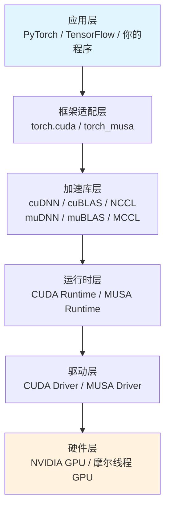

本文档是《GPU计算生态完全指南》的起点，面向具备基础C/C++知识的初级开发者，目标是帮助你建立对GPU计算生态的**全局认知**。我们不会在这里深入任何单一技术细节，而是回答一个核心问题：当你想让GPU帮你加速计算时，为什么面前会出现CUDA Toolkit、cuDNN、MUSA、mcc等一大堆陌生名词？这些组件之间是什么关系？你应该按什么顺序学习它们？理解这些问题，是避免在后续学习中迷失方向的关键。

Sources: [GPU计算生态完全指南.md](GPU计算生态完全指南.md#L1-L8)

## 从一个简单愿望说起

想象你的老板对你说："去写个程序，让GPU帮我们加速计算！"你可能会想，我学过C++，写个函数让GPU执行不就行了？但现实很快会让你意识到，GPU并不是一台等待你直接调用的独立计算机。你不能像调用普通C++函数那样直接让GPU执行代码，因为GPU有自己的指令集、自己的内存空间、自己的线程调度模型。要让GPU为你工作，你需要一整套"生态系统"——从硬件芯片到操作系统驱动，从编译器到数学库，从运行时管理到深度学习框架适配。这套生态包含多个层级，每个层级都有自己的工具、API和概念，这正是初学者感到困惑的根源。

Sources: [GPU计算生态完全指南.md](GPU计算生态完全指南.md#L25-L43)

## GPU生态的五层架构

整个GPU计算生态可以清晰地划分为五个层级，**从上到下层层依赖**，上层通过下层提供的接口间接使用硬件能力，而不需要关心底层细节。这种分层设计让不同水平的开发者都能在适合自己的层级上工作。

| 层级 | 核心作用 | 典型组件 | 类比理解 |
|------|---------|---------|---------|
| **应用层** | 开发者直接面对的编程界面 | PyTorch、TensorFlow、你的CUDA/MUSA程序 | 点餐系统：顾客只需要看菜单点菜 |
| **框架适配层** | 将框架调用转换为底层库调用 | `torch.cuda`、torch_musa后端 | 后厨调度员：把订单分配给不同班组 |
| **加速库层** | 提供高度优化的常用算子 | cuDNN/muDNN（深度学习）、cuBLAS/muBLAS（线性代数）、NCCL/MCCL（多卡通信） | 预制菜供应商：提供已经优化好的标准菜品 |
| **运行时层** | 管理设备、内存、Kernel启动、错误处理 | CUDA Runtime、MUSA Runtime | 厨师团队：管理食材分配、火候控制、出菜顺序 |
| **驱动层** | 操作系统与硬件之间的翻译官 | CUDA Driver、MUSA Driver | 水电燃气管道：让厨房设备能被控制系统调用 |
| **硬件层** | 真正执行计算的地方 | NVIDIA GPU（GeForce/RTX/A100）、摩尔线程GPU（MTT S80/S3000/S4000） | 厨房设备：炉灶、烤箱、冰箱 |

**关键洞察**：没有硬件一切都是空谈；没有驱动硬件就是废铁；没有运行时内存和数据不会自己管理；没有加速库你就要从零手写每个算子；没有框架你就要直接操作底层API完成复杂任务。这套分层逻辑在CUDA和MUSA中是完全相通的。

Sources: [GPU计算生态完全指南.md](GPU计算生态完全指南.md#L1472-L1541)

## 两大平行生态：CUDA与MUSA

当前市场上存在两个主要的GPU计算生态，它们的关系类似于麦当劳与肯德基——都是快餐连锁（GPU并行计算平台），都有汉堡（SIMT编程模型），但具体配方（API实现细节）和供应链（硬件架构）各不相同。

| 维度 | NVIDIA CUDA | 摩尔线程 MUSA |
|------|-------------|---------------|
| **定位** | 国际主流生态，历史最悠久 | 国产GPU生态，兼容CUDA设计 |
| **市场份额** | 最大，几乎所有深度学习框架原生支持 | 针对国产GPU硬件优化，持续扩展 |
| **编程模型** | SIMT（单指令多线程），Kernel + 线程网格 | 与CUDA相同，保持高度兼容 |
| **API风格** | `cudaMalloc`、`cudaMemcpy`、`__global__` | `musaMalloc`、`musaMemcpy`、`__global__`（仅前缀替换） |
| **编译器** | nvcc | mcc |
| **核心设计目标** | 最大化NVIDIA硬件性能 | 让CUDA代码能够平滑迁移到国产GPU |

MUSA的核心设计哲学是**兼容**。这意味着如果你已经理解了CUDA的编程模型、内存管理方式和Kernel编写方法，学习MUSA的成本极低——主要工作就是将代码中的`cuda`前缀替换为`musa`，将编译器从`nvcc`切换为`mcc`。这种兼容性策略让国产GPU生态能够快速承接已有的CUDA代码资产和开发者知识体系。

Sources: [GPU计算生态完全指南.md](GPU计算生态完全指南.md#L67-L81)
Sources: [GPU计算生态完全指南.md](GPU计算生态完全指南.md#L866-L918)

## 本文覆盖范围与学习路径

本文档系列将按以下逻辑带你深入GPU计算生态：**先建立全局认知，再深入各层细节，最后通过代码对比感受两个生态的异同**。我们不只讲概念，每个关键知识点都配有完整可编译的代码示例，你可以复制、修改、运行它们，在实践中建立直觉。

整个系列的知识地图如下：

| 阶段 | 目标 | 对应章节 |
|------|------|---------|
| **建立认知** | 理解生态全貌、层级依赖、CUDA与MUSA的定位 | [概览](1-gai-lan)、[GPU计算生态全景图](3-gpuji-suan-sheng-tai-quan-jing-tu)、[餐厅类比](4-can-ting-lei-bi-li-jie-gpusheng-tai-ceng-ci)、[GPU与CPU的核心差异](5-gpuyu-cpude-he-xin-chai-yi) |
| **生态详解** | 逐层深入CUDA和MUSA的硬件、驱动、运行时、编译器、数学库、深度学习库 | [CUDA硬件架构](7-cudaying-jian-jia-gou-he-xin-smyu-nei-cun-ceng-ci)至[muDNN、muBLAS与MCCL](15-mudnn-mublasyu-mccl) |
| **依赖与架构** | 搞清组件依赖关系、Toolkit与SDK的区别、算子三层实现、版本匹配策略 | [GPU生态层级依赖关系图](17-gpusheng-tai-ceng-ji-yi-lai-guan-xi-tu)至[版本匹配与安装策略](20-ban-ben-pi-pei-yu-an-zhuang-ce-lue) |
| **代码实践** | 通过向量加法、矩阵乘法、卷积网络的完整代码对比，掌握迁移能力 | [基础向量加法](21-ji-chu-xiang-liang-jia-fa-cudayu-musadui-bi)至[CUDA到MUSA迁移策略](24-cudadao-musaqian-yi-ce-lue-yu-gong-ju) |

**给初学者的建议**：不要试图一次性理解所有内容。先读完"Get Started"部分的五篇文章建立全局认知，然后进入"Deep Dive"选择自己感兴趣的层级深入研究，最后在"代码对比与迁移实践"部分动手运行示例代码。GPU计算生态看似庞大，但其核心逻辑始终围绕着**硬件→驱动→运行时→库→应用**这五层展开，抓住这条主线，你就能在任何GPU生态中快速定位自己的位置。

Sources: [GPU计算生态完全指南.md](GPU计算生态完全指南.md#L83-L91)
Sources: [GPU计算生态完全指南.md](GPU计算生态完全指南.md#L2107-L2141)

## 下一步

如果你已经准备好开始这段旅程，建议按以下顺序阅读：

1. **[快速入门](2-kuai-su-ru-men)** — 了解学习本系列需要准备的环境和前置知识
2. **[GPU计算生态全景图](3-gpuji-suan-sheng-tai-quan-jing-tu)** — 更详细地展开五层架构，建立完整认知框架
3. **[餐厅类比：理解GPU生态层次](4-can-ting-lei-bi-li-jie-gpusheng-tai-ceng-ci)** — 通过生动的类比加深对层级关系的直觉理解
4. **[GPU与CPU的核心差异](5-gpuyu-cpude-he-xin-chai-yi)** — 从硬件设计哲学出发，理解为什么GPU适合并行计算