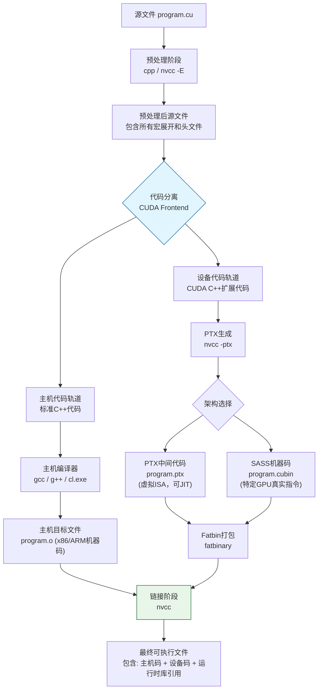
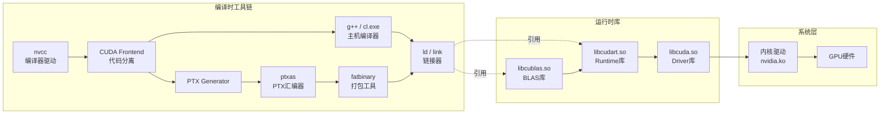

CUDA Toolkit是连接上层算法实现与底层GPU硬件的关键枢纽，它不仅是"一堆工具"的简单集合，更是一套经过精心设计的编译与运行时支撑体系。对于已经掌握CUDA基础语法、写过简单Kernel的开发者而言，真正理解nvcc编译器的内部工作机制——尤其是它如何将同一份`.cu`源文件拆分为CPU代码与GPU代码、又如何通过PTX中间层实现跨代硬件兼容——是跨越初级门槛、进入性能调优与工程化部署阶段的必经之路。本文聚焦于CUDA Toolkit的核心组成与nvcc编译器的深度工作机制，帮助你建立对GPU程序构建流程的系统性认知。

Sources: [GPU计算生态完全指南.md](GPU计算生态完全指南.md#L422-L427)

## CUDA Toolkit的架构定位与组成全景

在NVIDIA GPU计算生态中，CUDA Toolkit扮演着"厨房工具套装"的角色：它向上为cuDNN、cuBLAS等数学库以及PyTorch等深度学习框架提供编译基础设施和运行时接口，向下则通过Runtime库与Driver库最终对接GPU硬件。这种承上启下的位置决定了它的组件必然横跨编译时工具链与运行时库两大领域。

Toolkit的物理目录结构清晰反映了这种分层设计：

```
CUDA Toolkit/
├── bin/                    # 编译时工具
│   ├── nvcc               # CUDA编译器驱动
│   ├── cuda-gdb           # GPU源码级调试器
│   ├── nvprof / nsys      # 性能分析套件
│   └── cuobjdump          # CUDA目标文件反汇编
├── lib64/                  # 运行时与数学库
│   ├── libcudart.so       # CUDA Runtime（必需）
│   ├── libcuda.so         # CUDA Driver接口
│   ├── libcublas.so       # 基础线性代数库
│   ├── libcufft.so        # 快速傅里叶变换
│   └── ...
├── include/               # 头文件
│   ├── cuda_runtime.h     # Runtime API
│   ├── cuda.h             # Driver API
│   └── cublas_v2.h        # 数学库API
└── samples/               # 示例代码（SDK内容）
```

**核心区分**：Toolkit与SDK的本质差异常被初学者混淆。Toolkit是"工具"，包含编译器、运行时库和调试工具，没有它就无法编译和运行CUDA程序；而SDK是"教程"，仅提供示例代码和文档，属于可选但强烈推荐的辅助学习资源。这种区分直接影响你的安装策略——生产环境至少必须安装Toolkit，而SDK仅在需要参考官方示例时才需部署。

Sources: [GPU计算生态完全指南.md](GPU计算生态完全指南.md#L493-L510) · [GPU计算生态完全指南.md](GPU计算生态完全指南.md#L1544-L1565)

## nvcc的双轨编译模型：为什么同一份代码需要两个编译器

nvcc最核心的设计特征在于**双轨编译（Dual-Track Compilation）**。一份`.cu`文件同时包含在CPU上执行的**主机代码（Host Code）**和在GPU上执行的**设备代码（Device Code）**，而CPU与GPU拥有截然不同的指令集架构——x86/ARM与NVIDIA GPU的SASS指令集完全不兼容。这意味着nvcc无法像普通C++编译器那样直接生成单一可执行文件，而必须在编译早期就将源代码"分轨"处理。

这种分离并非简单的文本截取，而是基于代码修饰符的语义级拆分：
- 带有`__global__`、`__device__`、`__constant__`等修饰符的函数及其调用上下文被识别为**设备代码轨道**
- 其余代码（包括`main`函数、主机端内存分配、数据拷贝逻辑）归入**主机代码轨道**

nvcc本身并不直接完成全部编译工作，它更像是一位**编译器编排者（Compiler Driver）**。主机代码被委托给系统原生C++编译器（通常是GCC或Clang）处理，生成x86/ARM目标代码；设备代码则进入NVIDIA专有的编译管线，经CUDA前端处理后生成PTX中间代码，最终由ptxas汇编器转换为特定GPU架构的机器码（SASS）。两个轨道在最后的链接阶段重新汇合，由nvcc将主机目标文件、设备二进制文件以及必要的CUDA运行时库链接成最终可执行文件。

Sources: [GPU计算生态完全指南.md](GPU计算生态完全指南.md#L452-L476)

## 从.cu到可执行文件：四阶段编译流程深度解析

理解nvcc的工作机制，最佳方式是追踪一个`.cu`文件经过的完整生命周期。整个过程可细分为四个逻辑阶段，每个阶段产生特定的中间产物，且前一阶段的输出直接决定后一阶段的输入。



**阶段一：预处理**。nvcc调用底层C预处理器（或自身以`-E`模式运行）处理所有`#include`、`#define`和条件编译指令。这一阶段对主机代码和设备代码一视同仁，因为宏定义和头文件可能被双方共享。

**阶段二：前端分离（CUDA Frontend）**。这是nvcc独有的关键步骤。CUDA前端解析器扫描预处理后的源文件，依据`__global__`、`__device__`等修饰符以及`<<<...>>>`内核启动语法，将代码逻辑切分为两个独立的编译单元。值得注意的是，设备代码中可能包含对主机函数的调用（通过函数指针或虚函数等动态机制），反之亦然，前端需要建立跨轨道的符号映射表以便后续链接。

**阶段三：并行编译**。两个轨道同时进入各自的编译后端：
- 主机轨道：调用系统C++编译器，添加必要的CUDA头文件搜索路径（如`-I/usr/local/cuda/include`），生成标准目标文件（`.o`）。
- 设备轨道：经过CUDA C++前端转换为NVVM IR（NVIDIA基于LLVM的中间表示），随后由PTX生成器输出PTX汇编代码。如果指定了具体的GPU架构（如`-arch=sm_80`），PTX代码会被`ptxas`汇编器进一步编译为SASS二进制（`.cubin`）；如果仅要求PTX（如`-ptx`选项），则在此阶段输出文本形式的PTX文件并停止。

**阶段四：链接与打包**。设备代码不论生成的是纯PTX还是SASS，都会被`fatbinary`工具打包为一种称为**Fatbin**的容器格式。Fatbin可以同时容纳多个架构版本的设备代码（例如同时包含SM 7.0的SASS和SM 8.0的SASS，以及一份通用PTX）。最终，nvcc调用底层链接器（如`ld`），将主机目标文件、Fatbin容器、`libcudart.so`等运行时库链接为可执行文件。

Sources: [GPU计算生态完全指南.md](GPU计算生态完全指南.md#L478-L491)

## PTX、SASS与计算能力：设备代码的生成机制

要真正掌握nvcc的架构控制参数，必须先理解NVIDIA GPU代码的两种本质形态：**PTX（Parallel Thread Execution）**和**SASS（Streaming ASSembler）**。这两者的关系类似于Java字节码与JVM即时编译后的本地机器码，或者LLVM IR与目标架构汇编。

PTX是一种**虚拟ISA（指令集架构）**。它是基于单指令多线程（SIMT）执行模型设计的文本型汇编语言，具有稳定的跨代语义——今天编译出的PTX代码可以在未来新架构的GPU上运行。然而PTX本身不能被GPU直接执行，它必须经过驱动程序或编译器的进一步翻译。

SASS则是**真实机器码**。它是针对特定GPU微架构的二进制指令，直接对应硬件的调度单元、寄存器文件和内存管线。SASS不具备可移植性：为SM 7.0（Volta）生成的SASS无法在SM 8.0（Ampere）上运行，甚至同一代架构的不同 stepping 之间也可能存在细微差异。

**计算能力（Compute Capability）**是NVIDIA用来标识GPU硬件代际的版本号，格式为`major.minor`（如7.0、8.6）。其中Major版本代表架构代际（如7对应Volta、8对应Ampere、9对应Hopper），Minor版本代表同代内的配置差异（如8.6比8.0拥有更多的Tensor Core资源）。nvcc通过`-arch`和`-code`参数控制PTX与SASS的生成策略，而这两个参数的行为差异是中级开发者最容易混淆的知识点之一。

| 编译产物 | 抽象层级 | 可移植性 | 由谁生成 | 由谁消费 |
|---------|---------|---------|---------|---------|
| PTX | 虚拟ISA，文本汇编 | 高（跨代兼容） | nvcc / ptxas | 驱动JIT编译器 / ptxas |
| SASS | 真实机器码，二进制 | 低（架构专属） | ptxas | GPU硬件直接执行 |
| Fatbin | 容器格式，可内含多版本 | 中（包含多架构时高） | fatbinary工具 | CUDA驱动程序加载 |

Sources: [GPU计算生态完全指南.md](GPU计算生态完全指南.md#L483-L490)

## 架构控制参数详解：-arch、-code与-gencode

nvcc提供了多种方式指定目标GPU架构，理解它们的精确语义对于实现**编译时优化**与**运行时兼容性**之间的平衡至关重要。

### -arch：设定PTX的编译基准

`-arch`参数告诉nvcc应该针对哪个计算能力生**成PTX代码**。它接受的值以`sm_XX`形式表示（如`-arch=sm_80`），这里的`sm`代表Streaming Multiprocessor。当指定`-arch=sm_80`时，nvcc会生成针对Compute Capability 8.0优化的PTX指令，并利用该架构支持的完整语言特性（如特定版本的Tensor Core指令或异步拷贝原语）。如果代码中使用了高于指定架构的特性，编译将直接报错。

### -code：控制SASS的生成目标

`-code`参数指定ptxas汇编器应当将PTX翻译为哪个具体架构的**SASS机器码**。例如`-code=sm_80`会生成Ampere架构可直接执行的二进制代码。如果`-code`与`-arch`不同，nvcc会先以`-arch`的基准生**成PTX，再由ptxas将其降级或升级编译为目标`-code`架构的SASS——但这只有在两者属于兼容的架构家族时才可能成功。

### -gencode：多架构发布的关键工具

生产环境中通常需要一份二进制程序能够在多种GPU型号上运行，这时`-gencode`参数成为首选。它允许你在单次编译中指定**多组**架构组合，每组格式为`arch=compute_XX,code=sm_YY`。nvcc会为每组生成对应的PTX和/或SASS，最终全部打包进Fatbin。

```bash
# 同时生成SM 7.0的SASS、SM 8.0的SASS，以及一份Compute 8.0基准的PTX（用于未来架构JIT）
nvcc -gencode arch=compute_70,code=sm_70 \
     -gencode arch=compute_80,code=sm_80 \
     -gencode arch=compute_80,code=compute_80 \
     -o program program.cu
```

上述命令中，`arch=compute_80,code=compute_80`这组设置会保留PTX而非SASS。当程序在比SM 8.0更新的GPU（如SM 9.0的Hopper）上运行时，CUDA驱动会触**发JIT（Just-In-Time）编译**：将这份PTX实时翻译为SM 9.0的SASS。JIT编译会带来轻微的启动延迟（通常在几百毫秒到数秒之间，取决于PTX代码规模），但换取了**向前兼容性**——即旧版本Toolkit编译的程序无需重新编译即可在新硬件上运行。

| 参数组合 | 生成内容 | 适用场景 |
|---------|---------|---------|
| `-arch=sm_80` | SM 8.0 PTX + SM 8.0 SASS | 开发调试，目标硬件单一 |
| `-arch=sm_80 -code=sm_70` | SM 8.0 PTX降级为SM 7.0 SASS | 在旧硬件上运行，但源码需兼容 |
| `-gencode arch=compute_70,code=sm_70` | 仅SM 7.0 SASS | 精确匹配目标硬件，体积最小 |
| `-gencode arch=compute_80,code=compute_80` | 仅SM 8.0 PTX | 依赖驱动JIT，启动有延迟 |
| 多组`-gencode` | Fatbin内含多版本 | 发布到 heterogeneous GPU 集群 |

**性能提示**：过度包含低版本架构的PTX会降低JIT编译后的性能，因为新架构的优化机会无法被旧PTX充分表达。建议仅保留最近两代架构的SASS和最新一代的PTX作为安全网。

Sources: [GPU计算生态完全指南.md](GPU计算生态完全指南.md#L483-L490)

## Toolkit组件的内部依赖网络

nvcc编译器并非孤立工作，它的每个编译阶段都需要调用Toolkit目录中的其他工具，而最终生成的可执行文件又依赖一系列运行时共享库。理解这个依赖网络对排查"找不到库"、"符号未定义"等链接错误至关重要。



从依赖方向看，**所有用户级CUDA程序最终都收敛到`libcuda.so`**，而`libcuda.so`通过系统调用与内核态的nvidia驱动模块通信。这意味着即使你的程序只调用了Runtime API（`cudaMalloc`、`kernel<<<...>>>`等），底层仍然经过Driver库。 Toolkit中的数学库（如cuBLAS）则位于更高层，它们基于Runtime API构建，因此任何cuBLAS程序都隐式依赖`libcudart.so`。

Sources: [GPU计算生态完全指南.md](GPU计算生态完全指南.md#L1567-L1593)

## 常用编译选项与诊断速查

除了架构控制参数，nvcc还提供大量影响调试体验、优化级别和代码生成行为的选项。以下表格整理了中级开发者在日常工程中最常接触的参数。

| 选项 | 作用域 | 说明 | 典型使用场景 |
|-----|-------|-----|-----------|
| `-o <文件>` | 全局 | 指定输出文件名 | 所有编译命令 |
| `-c` | 全局 | 仅编译到目标文件，不链接 | 大型项目分步编译 |
| `-I<路径>` | 主机+设备 | 添加头文件搜索路径 | 引用非标准位置的cuDNN头文件 |
| `-L<路径>` | 链接 | 添加库文件搜索路径 | 指定cuDNN或NCCL的lib目录 |
| `-l<库名>` | 链接 | 链接指定库 | `-lcublas -lcudnn -lnccl` |
| `-O0 / -O2 / -O3` | 主机+设备 | 优化级别 | `-O3`用于发布，`-O0`用于调试 |
| `-g` | 主机 | 包含主机端调试符号 | 配合cuda-gdb调试主机代码 |
| `-G` | 设备 | 包含设备端调试符号（关闭优化） | 调试Kernel内部逻辑，显著影响性能 |
| `-lineinfo` | 设备 | 生成行号信息但不禁用优化 | profile时定位源码行，性能影响小 |
| `-shared` | 全局 | 生成动态链接库（.so） | 编译PyTorch扩展或插件 |
| `-Xcompiler <选项>` | 主机 | 向底层主机编译器传递参数 | `-Xcompiler -fPIC`生成位置无关码 |
| `-ccbin <路径>` | 主机 | 指定非默认的主机编译器 | 使用特定版本的GCC避免ABI不兼容 |
| `-std=c++17` | 主机+设备 | 指定C++标准 | 现代C++特性支持 |

### 常见编译诊断

当编译失败时，nvcc的错误信息往往冗长，因为它会叠加主机编译器的输出。快速定位问题的方法是先判断错误发生在**哪个轨道**：

- **错误中包含`error: identifier "__some_cuda_builtin" is undefined`**：通常发生在设备代码轨道，可能是因为在主机函数中错误地调用了`__device__`函数，或使用了错误的架构参数导致PTX生成器无法识别特定内置函数。
- **错误中包含`undefined reference to cudaMalloc`**：发生在链接阶段，通常忘记链接`-lcudart`，或库搜索路径（`-L`）未包含CUDA的`lib64`目录。
- **错误中包含`ptxas fatal : Value 'sm_XX' is not defined for option 'gpu-name'`**：ptxas无法识别指定的架构代码，通常是因为Toolkit版本太旧，不支持新GPU架构。升级CUDA Toolkit是解决此问题的唯一途径。
- **编译成功但运行时报`no kernel image is available`**：Fatbin中未包含目标GPU架构对应的SASS或PTX。检查`-gencode`参数是否覆盖了当前GPU的计算能力。

Sources: [GPU计算生态完全指南.md](GPU计算生态完全指南.md#L1712-L1722)

## 阅读建议与下一步

掌握CUDA Toolkit与nvcc编译器的工作机制后，你已经具备了分析和构建中等复杂度CUDA工程的能力。建议按照以下路径继续深入：

1. **若你关注内存效率**：继续阅读[CUDA内存管理：分配、传输与内存类型](9-cudanei-cun-guan-li-fen-pei-chuan-shu-yu-nei-cun-lei-xing)，理解`cudaMalloc`、`cudaMemcpy`背后的页锁定、统一内存与异步传输机制。
2. **若你准备进行算法开发**：前往[cuBLAS与NCCL通信库](12-cublasyu-nccltong-xin-ku)和[cuDNN深度神经网络库](11-cudnnshen-du-shen-jing-wang-luo-ku)，学习如何将手写Kernel替换为经过专家优化的库函数。
3. **若你需要跨平台部署**：关注[版本匹配与安装策略](20-ban-ben-pi-pei-yu-an-zhuang-ce-lue)，理解Toolkit版本、驱动版本与库版本之间的兼容性约束。
4. **若你对国产GPU生态感兴趣**：对比阅读[MUSA驱动、运行时与mcc编译器](14-musaqu-dong-yun-xing-shi-yu-mccbian-yi-qi)，观察MUSA如何在编译器层面实现对CUDA的语法兼容。