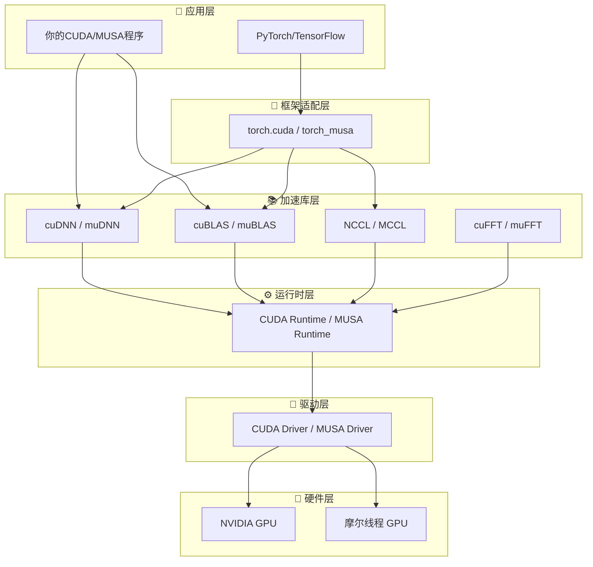

当你第一次接触GPU编程时，很可能会被一连串陌生的名词包围：CUDA Toolkit、cuDNN、Runtime API、Driver API、nvcc、NCCL……这些组件并非随意堆砌，而是构成了一个层次清晰、分工明确的计算生态系统。**理解这个全景图，是避免"只见树木不见森林"的关键第一步**。本文将带你建立GPU计算生态的全局认知，梳理各组件的定位与依赖关系，并指明后续深入学习的方向。

Sources: [GPU计算生态完全指南.md](GPU计算生态完全指南.md#L23-L43)

## 为什么需要了解生态全景

假设你接到一个任务："用GPU加速深度学习训练。" 你很快会发现，这并非只写一段C++代码那么简单。GPU不能独立运行程序，它需要驱动程序让操作系统识别硬件，需要运行时库管理内存与任务调度，需要编译器将代码翻译成GPU指令，需要数学库提供优化好的矩阵运算，还需要深度学习库封装卷积、池化等复杂算子。这些组件自下而上层层叠加，形成了完整的GPU计算生态。**只有理解每一层的作用和边界，你才能在遇到安装错误或性能问题时，快速定位到正确的层级去排查**。如果你希望用一个生活化的比喻来加深理解，可以参考[餐厅类比：理解GPU生态层次](4-can-ting-lei-bi-li-jie-gpusheng-tai-ceng-ci)。

Sources: [GPU计算生态完全指南.md](GPU计算生态完全指南.md#L23-L43)

## 生态分层架构：五层金字塔

GPU计算生态可以采用经典的五层模型来理解。最底层是物理硬件，往上依次是驱动层、运行时层、加速库层，最顶层是应用与框架层。**每一层都只与相邻的上下层交互，上层不需要关心下层的实现细节，下层则为上层提供稳定的服务接口**。这种分层设计让生态具备高度的可扩展性——例如你可以在应用层只改动几行PyTorch代码，就能切换到不同的GPU后端，而不需要重写底层的Kernel。

上图展示了CUDA与MUSA两个生态的并行架构。**你可以将这两条链路理解为两个平行的"餐厅连锁品牌"**：CUDA是历史悠久的国际品牌，生态成熟、文档丰富；MUSA是兼容CUDA设计的国产品牌，目标是让用户能以极低的迁移成本将CUDA代码运行在摩尔线程GPU上。关于两大生态的详细背景与定位，请参阅[CUDA与MUSA：两大生态概览](6-cudayu-musa-liang-da-sheng-tai-gai-lan)。

Sources: [GPU计算生态完全指南.md](GPU计算生态完全指南.md#L1468-L1541)

## 核心组件一览

下面的速查表汇总了生态中每个核心组件的名称、作用及其在双生态中的对应关系。**建议初学者将这张表作为"地图"保存，遇到陌生名词时随时查阅**。

| CUDA组件 | MUSA组件 | 作用说明 | 依赖谁 | 是否必须 |
|---------|---------|---------|--------|---------|
| NVIDIA GPU | 摩尔线程 GPU | 执行所有计算的物理芯片 | 无 | 是 |
| CUDA Driver | MUSA Driver | 操作系统与硬件之间的翻译官 | GPU硬件 | 是 |
| CUDA Runtime | MUSA Runtime | 管理设备、内存分配、Kernel启动 | Driver | 是 |
| CUDA Toolkit | MUSA Toolkit | 编译器+运行时库+基础数学库+调试工具 | Runtime | 是 |
| nvcc | mcc | 将`.cu`文件编译为可执行程序 | Toolkit | 是 |
| CUDA SDK | MUSA SDK | 示例代码、文档、教程 | Toolkit（可选） | 否 |
| cuDNN | muDNN | 深度学习算子库（卷积、池化、RNN等） | Runtime | 否 |
| cuBLAS | muBLAS | 线性代数库（矩阵乘法、向量运算） | Runtime | 否 |
| NCCL | MCCL | 多GPU通信库（AllReduce、Broadcast） | Runtime | 否 |

从表中可以提炼出一个关键规律：**越靠近底层的组件越"必须"，越靠近顶层的组件越"专用"**。Toolkit包含了Runtime和编译器，是开发工作的最小必备集合；而cuDNN、NCCL等库则属于"锦上添花"，只有在做深度学习或多卡训练时才需要安装。

Sources: [GPU计算生态完全指南.md](GPU计算生态完全指南.md#L2107-L2120)

## Toolkit、SDK与独立库的定位

在初学者社区中，Toolkit与SDK的混淆、以及独立库（如cuDNN）的安装疑惑是最常见的问题之一。这里我们从全景视角厘清它们的关系。

**CUDA/MUSA Toolkit**是开发工作的核心基础设施，它是一个大容器，内部包含编译器（nvcc/mcc）、运行时库（libcudart.so/libmusart.so）、Driver库接口、基础数学库（cuBLAS/muBLAS等）以及调试分析工具（cuda-gdb、nvprof等）。**没有Toolkit，你无法编译和运行任何GPU程序**，因此它是绝对必须的。

**CUDA/MUSA SDK**则是示例代码和文档的集合，包含向量加法、矩阵乘法、卷积等官方样例。**SDK不是Toolkit的必需部分**，它的角色更像是"菜谱"——没有菜谱你也能做菜（开发程序），但有了菜谱能学得更快。关于Toolkit与SDK的详细区别和内部文件结构，可进一步阅读[Toolkit、SDK与独立库的定位](18-toolkit-sdkyu-du-li-ku-de-ding-wei)。

**cuDNN/muDNN、NCCL/MCCL**属于独立发布的库，它们不包含在Toolkit中，需要单独下载安装，但**严格依赖Toolkit中已安装的Runtime和Driver**。这就意味着你必须先装好Toolkit，再安装这些库；同时它们的版本必须与Toolkit版本匹配，否则会出现编译错误或运行时符号找不到的问题。

Sources: [GPU计算生态完全指南.md](GPU计算生态完全指南.md#L1542-L1643)

## 算子在生态中的三层实现

在GPU生态中，"算子"（Operator，如卷积、矩阵乘法）可以在三个不同的层级上实现。**理解这三层有助于你根据场景选择最合适的开发策略**。

| 层级 | 实现方式 | 优点 | 缺点 | 适用场景 |
|-----|---------|------|------|---------|
| 第一层：手写Kernel | 用`__global__`自行编写CUDA/MUSA核函数 | 完全可控，可深度定制 | 开发难度大，性能可能不如专家优化 | 学习GPU原理、自定义算子优化 |
| 第二层：调用专用库 | 调用cuDNN/muDNN或cuBLAS/muBLAS | 性能经专家优化，接口稳定 | 灵活性受限，依赖版本匹配 | 生产环境深度学习、科学计算 |
| 第三层：框架自动调度 | 使用PyTorch/TensorFlow高层API | 开发效率最高，跨平台 | 控制力最弱，可能有框架开销 | 快速原型开发、算法实验 |

这三层并非互斥。在实际的深度学习框架（如PyTorch）中，框架会自动在第二层和第三层之间做选择：如果能匹配到cuDNN/muDNN中的优化实现，则直接调用库函数；否则可能退回到第一层执行通用Kernel。**了解算子的三层实现架构**，能帮助你更深入地理解框架背后的调度逻辑。

Sources: [GPU计算生态完全指南.md](GPU计算生态完全指南.md#L1660-L1711)

## 依赖关系总览

整个生态的依赖方向是单向的：**应用 → 库 → Runtime → Driver → 硬件**。任何一个组件要正常工作，其下方的所有层级都必须已经就绪。下面这张依赖关系表可以作为你安装环境时的检查清单。

| 组件 | 直接依赖 | 被谁依赖 |
|-----|---------|---------|
| GPU硬件 | 无 | Driver |
| Driver | GPU硬件 | Runtime |
| Runtime | Driver | Toolkit、cuDNN、cuBLAS、NCCL |
| Toolkit | Runtime | SDK（可选） |
| cuDNN/muDNN | Runtime | PyTorch/TensorFlow |
| cuBLAS/muBLAS | Runtime | PyTorch/TensorFlow、cuDNN |
| NCCL/MCCL | Runtime | 分布式训练框架 |
| PyTorch/TensorFlow | cuDNN、cuBLAS | 用户应用代码 |

**一个常见的安装陷阱是跳过Driver检查直接安装Toolkit**。如果操作系统没有正确加载GPU驱动（例如NVIDIA内核模块未加载），Runtime将无法初始化，此时即使Toolkit安装成功，运行任何程序都会报错。因此，建议按照"硬件→Driver→Toolkit→库→框架"的顺序逐层验证。

Sources: [GPU计算生态完全指南.md](GPU计算生态完全指南.md#L1712-L1723)

## 下一步阅读指南

本文作为全景图，目标是帮你建立生态的"全局地图"。**如果你已经理解了五层架构和组件间的依赖关系，建议按照以下路径继续深入**：

1. **想要用生活化比喻巩固认知** → [餐厅类比：理解GPU生态层次](4-can-ting-lei-bi-li-jie-gpusheng-tai-ceng-ci)
2. **想搞清楚GPU与CPU的设计差异** → [GPU与CPU的核心差异](5-gpuyu-cpude-he-xin-chai-yi)
3. **准备了解CUDA与MUSA的详细背景** → [CUDA与MUSA：两大生态概览](6-cudayu-musa-liang-da-sheng-tai-gai-lan)
4. **想深入硬件架构（SM、CUDA Core、内存层次）** → [CUDA硬件架构：核心、SM与内存层次](7-cudaying-jian-jia-gou-he-xin-smyu-nei-cun-ceng-ci)
5. **想查看生态依赖关系的更详细图解** → [GPU生态层级依赖关系图](17-gpusheng-tai-ceng-ji-yi-lai-guan-xi-tu)

无论你选择哪条路径，请记住：**GPU生态的复杂性源于分层，而分层的本质是为了屏蔽复杂性**。每当你感到迷茫时，回到这张全景图，确认自己当前处在哪一层，问题就会迎刃而解。