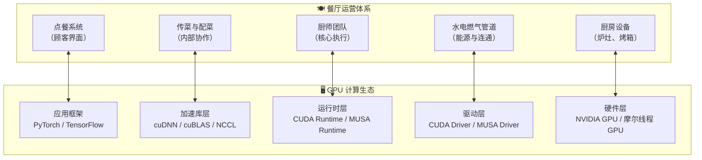
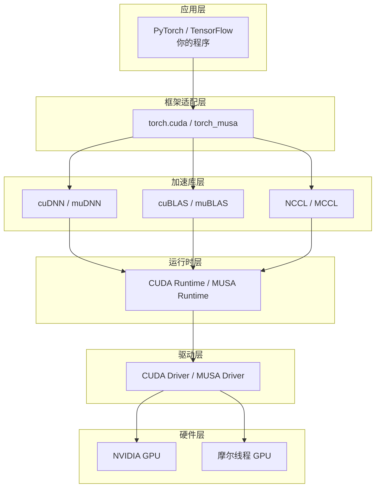

当你第一次接触 GPU 计算时，面对Driver、Runtime、Toolkit、cuDNN、PyTorch 后端等一系列名词，往往会感到无从下手。这些组件之间究竟是什么关系？为什么安装了一个还需要装另一个？为了回答这些问题，本章引入一个贯穿全书的**餐厅类比**：将复杂的 GPU 计算生态映射为一家餐厅的运营体系。通过这个类比，你可以在不触及底层代码的情况下，先建立起对整个生态的**空间直觉**——知道每个组件"住在哪一层"、"依赖谁"、"为谁服务"。

Sources: [GPU计算生态完全指南.md](GPU计算生态完全指南.md#L44-L66)

## 餐厅类比全景图

想象你走进一家现代化的连锁餐厅。从顾客点餐到菜品上桌，中间需要经过厨房设备、水电燃气、厨师团队、厨具、食材供应商等多个环节的精密配合。GPU 计算生态也是如此：从开发者写下 `torch.nn.Conv2d` 到最终芯片执行矩阵运算，数据和控制流要依次穿过多个层级，每一层都依赖下一层提供的基础设施。

下图展示了 GPU 生态的五层架构，以及它们与餐厅运营各岗位的对应关系：

这种对应关系不是随意拼凑的，而是基于**功能角色**的精确映射：框架负责"接单"（提供用户接口），驱动负责"通水通电"（让操作系统识别硬件），Runtime 负责"调度厨师"（管理内存与任务），而硬件则是真正"炒菜"的地方。理解了这个映射，再看任何 GPU 相关文档时，你都能迅速判断某个组件处于生态的哪个位置。

Sources: [GPU计算生态完全指南.md](GPU计算生态完全指南.md#L1474-L1526)

## 逐层解析：从厨房设备到点餐系统

### 硬件层 —— 厨房设备

GPU 硬件芯片是整个生态的物理基础，相当于餐厅里的炉灶、烤箱、冰箱和切菜台。没有这些设备，再优秀的厨师也无法产出菜品。NVIDIA 的 GeForce、RTX、A100 系列以及摩尔线程的 MTT S80/S3000/S4000 等芯片，就是不同品牌的"厨房设备"。它们内部又细分为 CUDA Core（通用厨师）、Tensor Core（专精炒某道菜的自动炒菜机）和 SM（班组）等单元，这些内容将在后续硬件架构章节深入展开。

**关键洞察**：硬件层不依赖任何软件，但所有软件最终都要在这一层落地执行。

Sources: [GPU计算生态完全指南.md](GPU计算生态完全指南.md#L2110-L2112)

### 驱动层 —— 水电燃气管道

驱动程序是操作系统与硬件之间的"翻译官"，相当于连接厨房设备的水电燃气管道。GPU 芯片只认识电信号，而操作系统只发出函数调用；驱动层负责把 `cuInit()` 或 `musaInit()` 这样的高级指令翻译成硬件能理解的底层信号。没有驱动，操作系统根本"看不见" GPU，就像没有接通水电燃气的厨房设备只是一堆废铁。

CUDA 生态在这一层提供 CUDA Driver API，MUSA 生态则提供对应的 MUSA Driver API。两者都扮演着"管道工"的角色，只是服务的"厨房设备品牌"不同。

Sources: [GPU计算生态完全指南.md](GPU计算生态完全指南.md#L191-L198)

### 运行时层 —— 厨师团队

CUDA Runtime / MUSA Runtime 是开发者最常打交道的一层，相当于餐厅里的厨师团队。厨师不负责建造厨房，也不负责铺设管道，但他们决定"什么时候用什么锅、炒什么菜、怎么分配人手"。Runtime 的核心职责包括：设备管理（选择哪张 GPU）、内存管理（在显存中分配空间、在 CPU 与 GPU 之间搬运数据）、Kernel 启动（配置线程网格并触发计算）以及流和事件管理（异步执行与性能计时）。

在餐厅类比中，Runtime 是**承上启下**的关键角色：它向上为库和框架提供简洁的接口，向下依赖驱动层完成实际的硬件控制。

Sources: [GPU计算生态完全指南.md](GPU计算生态完全指南.md#L312-L322)

### 加速库层 —— 食材与预制菜供应商

cuDNN、cuBLAS、NCCL 等加速库，相当于餐厅外部的专业供应商。cuBLAS 是"面点供应商"，提供优化好的矩阵乘法；cuDNN 是"预制菜供应商"，提供深度学习中常用的卷积、池化等算子；NCCL 则是"多厨房传菜系统"，专门解决多个 GPU 之间的协作通信问题。

这些库有一个共同特点：它们都**依赖 Runtime** 提供的内存管理和设备调度能力，但把特定领域的算法优化封装成了即调即用的接口。没有这些库，开发者就像餐厅主厨必须从零种植小麦、酿造酱油一样，每件事都要手写 Kernel 实现，开发效率极低。

Sources: [GPU计算生态完全指南.md](GPU计算生态完全指南.md#L48-L58)

### 应用框架层 —— 点餐系统

PyTorch、TensorFlow 等深度学习框架位于生态的最顶端，相当于餐厅面向顾客的"点餐系统"。普通开发者（顾客）不需要知道厨房里有几位厨师、用了什么锅、食材从哪个供应商来，只需要在菜单上勾选 `torch.nn.Conv2d` 即可完成复杂的深度学习计算。框架在背后自动选择调用 cuDNN 或 muDNN、分配显存、调度 Kernel，将底层细节完全隐藏。

这一层的设计理念是**抽象与便利**：越往上层，控制力越弱，但开发效率越高；越往下层，控制力越强，但你需要了解的细节也越多。

Sources: [GPU计算生态完全指南.md](GPU计算生态完全指南.md#L1712-L1722)

## 层级依赖关系图解

餐厅能够正常运营的前提是**下层为上层提供 indispensable（不可或缺的）服务**。GPU 生态的依赖关系同样严格遵循自上而下的单向依赖原则，可以用下图表示：

**依赖原则**：箭头方向表示"依赖"。应用层依赖框架适配层，框架适配层依赖加速库层，加速库层依赖运行时层，运行时层依赖驱动层，驱动层最终依赖物理硬件。任何一层缺失或版本不匹配，都会导致整个链条断裂。例如，如果驱动没有正确安装，Runtime 再完善也无法调度 GPU；如果 cuDNN 版本与 CUDA Toolkit 不匹配，PyTorch 在导入时就会报错。

Sources: [GPU计算生态完全指南.md](GPU计算生态完全指南.md#L1528-L1541)

## 核心组件对应关系总表

为了便于快速查阅，下表汇总了 GPU 生态各层组件与餐厅类比的精确对应，并标注了必要性及安装方式：

| GPU 生态组件 | 餐厅类比 | 作用说明 | 是否必须 | 如何获得 |
|-------------|---------|---------|---------|---------|
| GPU 硬件（芯片） | 厨房设备（炉灶、烤箱、冰箱） | 真正执行计算的地方 | 是 | 物理设备 |
| GPU 驱动 | 水电燃气管道 | 操作系统识别并控制硬件的桥梁 | 是 | 随操作系统或厂商提供 |
| CUDA/MUSA Runtime | 厨师团队 | 管理任务分配、内存、调度 | 是 | Toolkit 包含 |
| CUDA/MUSA Toolkit | 厨房工具套装（刀具、锅具、量杯） | 包含编译器、调试器、基础库 | 是 | 官方安装包 |
| cuBLAS/muBLAS | 面点供应商 | 优化好的线性代数运算 | 否 | Toolkit 包含 |
| cuDNN/muDNN | 预制菜供应商 | 优化好的深度学习算子 | 否 | 单独下载 |
| NCCL/MCCL | 传菜系统 | 多 GPU 之间的协作通信 | 否 | 单独下载 |
| PyTorch/TensorFlow | 点餐系统 | 用户直接面对的开发界面 | 否 | pip/conda 安装 |
| SDK | 菜谱和培训手册 | 示例代码与文档 | 否 | Toolkit 可选附带 |

**关键洞察**："必须"与"可选"的区分对于初学者安装环境至关重要。如果你只是想运行 PyTorch 训练脚本，你只需要确保硬件、驱动、Toolkit 已安装，框架会通过包管理器自动处理大部分依赖；但如果你要进行底层 CUDA 开发或自定义算子，你就需要深入理解 Toolkit 内部各组件的依赖关系。

Sources: [GPU计算生态完全指南.md](GPU计算生态完全指南.md#L48-L58)

## 两个平行的"连锁餐厅品牌"

当前 GPU 计算市场存在两个主要的生态体系，它们就像餐饮界的两个国际连锁品牌：

**NVIDIA CUDA（国际品牌）**
- 历史悠久，生态成熟，文档与社区资源丰富
- 几乎所有深度学习框架原生支持
- 对应餐厅品牌中的"行业标杆"

**摩尔线程 MUSA（国产品牌）**
- 兼容 CUDA 生态设计，API 命名与语义高度对应
- 针对国产 GPU 硬件架构进行优化
- 目标是让原本为 CUDA 编写的代码能够平滑迁移

两者的关系类似于同一业态下的不同品牌：它们都有"厨房设备—管道—厨师—供应商—点餐系统"的完整链条，但具体配方（API 内部实现）和供应链（硬件架构）存在差异。对于开发者而言，理解了 CUDA 的餐厅运营模式，再学习 MUSA 就如同在麦当劳工作过的人去肯德基应聘——岗位设置相同，只需要适应新的操作手册。

Sources: [GPU计算生态完全指南.md](GPU计算生态完全指南.md#L69-L81)

## 从类比到实践：下一步

餐厅类比为你提供了一个**认知框架**，但真正的理解还需要深入每一层的实现细节。建议按以下顺序继续阅读：

1. 如果你想了解硬件层内部结构——CUDA Core、SM、内存层次等物理组成，请阅读 [CUDA硬件架构：核心、SM与内存层次](7-cudaying-jian-jia-gou-he-xin-smyu-nei-cun-ceng-ci)
2. 如果你想理解驱动层与运行时层的具体 API 差异，请阅读 [CUDA驱动与运行时：Driver API与Runtime API](8-cudaqu-dong-yu-yun-xing-shi-driver-apiyu-runtime-api)
3. 如果你想看内存管理在实际代码中的体现，请阅读 [CUDA内存管理：分配、传输与内存类型](9-cudanei-cun-guan-li-fen-pei-chuan-shu-yu-nei-cun-lei-xing)
4. 如果你好奇整个生态的依赖关系如何以可视化方式呈现，请阅读 [GPU生态层级依赖关系图](17-gpusheng-tai-ceng-ji-yi-lai-guan-xi-tu)