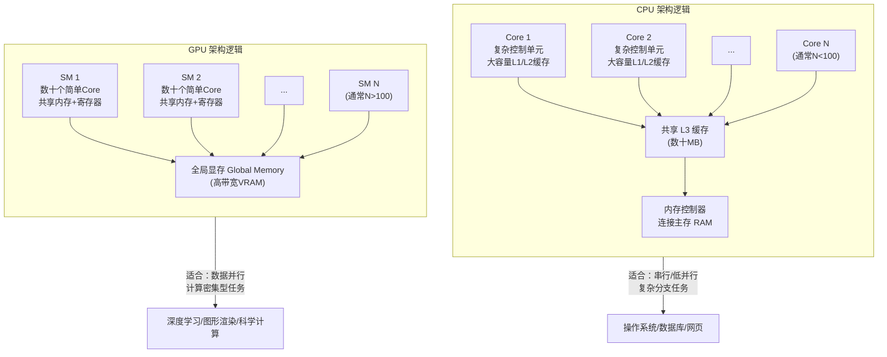

在深入CUDA或MUSA的具体生态之前，你必须先回答一个根本问题：**GPU和CPU到底有什么不同？** 这不是一道"谁更快"的选择题，而是"设计目标不同导致擅长领域完全不同"的架构哲学问题。理解这一差异，是你在后续阅读[CUDA硬件架构](7-cudaying-jian-jia-gou-he-xin-smyu-nei-cun-ceng-ci)和[MUSA架构设计](13-musajia-gou-she-ji-yu-cudajian-rong-xing)时建立正确心智模型的基础。本章将从设计目标、物理结构、内存体系和执行模型四个维度，用可视化的方式拆解这一核心差异。

Sources: [GPU计算生态完全指南.md](GPU计算生态完全指南.md#L100-L112)

## 设计哲学的根本分野

CPU（Central Processing Unit，中央处理器）和GPU（Graphics Processing Unit，图形处理器）诞生于完全不同的设计假设。CPU的设计假设是"面对的任务种类不可预测"——它可能要运行操作系统调度、执行数据库查询、渲染网页，或者解压缩文件。这些任务共同的特点是**逻辑复杂、分支繁多、依赖关系不确定**。因此CPU的每个核心都被设计成"全能型选手"：拥有复杂的分支预测器、乱序执行引擎、大容量多级缓存，以及强大的单线程性能。

GPU的设计假设则截然相反——它假设"面对的任务具有极高的并行度和数据一致性"。图形渲染中，同一帧画面的数百万个像素需要执行几乎相同的着色计算；深度学习中，同一个矩阵乘法的成千上万个元素可以独立更新。因此GPU将芯片面积和功耗预算投入到**增加核心数量**而非**增强单个核心**上。这一设计哲学的差异，是理解所有后续架构特征的总开关。

Sources: [GPU计算生态完全指南.md](GPU计算生态完全指南.md#L104-L107)

## 架构特征全景对比

下表从六个关键维度对比CPU与GPU的架构差异，这是你在技术讨论中定位问题时的速查参考。

| 特性 | CPU | GPU | 对开发者的影响 |
|------|-----|-----|-------------|
| **设计目标** | 通用计算，复杂逻辑控制 | 大规模并行数据计算 | CPU适合"协调者"角色，GPU适合"计算工人"角色 |
| **核心数量** | 少（4~64个物理核心） | 极多（数千个CUDA/MUSA Core） | GPU通过数量换吞吐量，核心数差距可达100倍以上 |
| **单个核心能力** | 极强（复杂控制流、分支预测、乱序执行） | 较弱（简单ALU，无复杂分支预测） | GPU不适合大量`if/else`的代码，CPU轻松应对 |
| **缓存体系** | 大容量三级缓存（L1/L2/L3共数十MB） | 小容量缓存，以共享内存为主 | CPU靠缓存隐藏延迟，GPU靠多线程切换隐藏延迟 |
| **内存带宽** | 中等（DDR5约50~100 GB/s） | 极高（HBM3/GDDR6X可达1~3 TB/s） | GPU显存带宽是CPU内存的10~30倍，但延迟更高 |
| **擅长任务** | 操作系统、数据库、网页服务、编译构建 | 矩阵运算、图像处理、深度学习训练/推理 | 数据并行型任务上GPU能效比远超CPU |

Sources: [GPU计算生态完全指南.md](GPU计算生态完全指南.md#L102-L108)

## 架构可视化：两种截然不同的组织方式

为了建立直观的认知，下图展示了CPU与GPU在芯片层面的组织逻辑差异。注意这不是按比例绘制的物理布局图，而是**功能模块的逻辑关系图**。



在上图中，CPU通过**少量强力核心+大缓存+复杂控制逻辑**来优化**单线程延迟**（即完成一个任务的速度）；而GPU通过**海量简单核心+高带宽显存+精简控制逻辑**来优化**整体吞吐量**（即单位时间内完成的任务总量）。这正是"延迟导向"与"吞吐导向"两种设计哲学的体现。

Sources: [GPU计算生态完全指南.md](GPU计算生态完全指南.md#L128-L137)

## 教授与小学生：一个核心类比

如果你一时难以记住所有技术参数，记住这个类比就够了：

**CPU像一位大学教授**——知识渊博，能处理复杂的推理和决策，精通各种学科，但一次只能专注处理几件事。让他批改一万道相同的小学算术题，他会觉得无聊且效率低下。

**GPU像一万名小学生**——每个人只会做简单的加减乘除，但人数庞大，组织有序。当你把一万道相同的算术题分发给一万个小学生时，他们能在同一时间同时完成，总耗时只相当于做一道题的时间。

这个类比的深层含义是：**GPU的威力来源于"任务的高度相似性"和"数据的独立性"**。如果一万个小学生每人拿到的题目都不一样，或者题目之间有很强的依赖关系（必须先知道前一道题的结果才能做下一道），那GPU的优势就会大打折扣，甚至可能不如CPU。

Sources: [GPU计算生态完全指南.md](GPU计算生态完全指南.md#L110-L112)

## 内存墙：为什么分离的内存体系是必然的

CPU和GPU不仅计算单元不同，它们的内存体系也是完全分离的。CPU通过主板上的内存插槽连接**主存（RAM，通常DDR4/DDR5）**，而GPU拥有自己的**显存（VRAM，通常GDDR6X/HBM）**。两者之间通过PCIe总线进行数据传输。

这一分离不是设计失误，而是物理规律约束下的必然选择。高带宽内存需要更宽的位宽和更短的物理走线，因此显存芯片必须紧挨着GPU核心封装。CPU内存追求的是**低延迟**（快速响应单个请求），而GPU显存追求的是**高带宽**（同时满足海量核心的数据饥渴）。当你调用`cudaMemcpy`或`musaMemcpy`时，你实际上是在让数据跨越这两个异构的内存世界。

| 内存属性 | CPU 主存（RAM） | GPU 显存（VRAM） |
|---------|----------------|-----------------|
| 典型类型 | DDR5 | HBM3 / GDDR6X |
| 带宽量级 | ~50-100 GB/s | ~1-3 TB/s |
| 延迟量级 | ~100 纳秒 | ~300-500 纳秒 |
| 容量量级 | 16-256 GB | 8-192 GB（消费级到数据中心级） |
| 与处理器距离 | 主板PCB走线 | 片上或2.5D封装 |

这一差异意味着：**数据搬运往往是GPU程序的性能瓶颈**。如果计算量不够大，花在PCIe传输上的时间可能比GPU计算本身还长。只有当你能把大量计算"就地"在GPU上完成时，加速效果才会显著。

Sources: [GPU计算生态完全指南.md](GPU计算生态完全指南.md#L326-L330)

## GPU内部一瞥：SM与CUDA Core

虽然详细的硬件架构属于[CUDA硬件架构](7-cudaying-jian-jia-gou-he-xin-smyu-nei-cun-ceng-ci)一章的内容，但为了完整理解"GPU与CPU的差异"，你需要知道GPU最基本的组织单元。

**SM（Streaming Multiprocessor，流式多处理器）**是GPU的调度单元。一个GPU芯片包含几十个到一百多个SM，每个SM内部又包含几十个更小的**CUDA Core**（基础计算单元）以及**共享内存（Shared Memory）**和**寄存器文件**。SM就像一个"班组"，而CUDA Core就是班组里的"工人"。所有工人听从同一个调度器指挥，同时执行相同或高度相似的指令——这种执行模式被称为**SIMT（Single Instruction Multiple Threads，单指令多线程）**。

这与CPU的超标量、乱序执行核心形成鲜明对比：CPU的一个核心可以同时执行几条不同的指令，并且动态重排指令顺序以最大化效率；而GPU的每个CUDA Core在同一时刻通常执行相同的指令，只是操作的数据不同。

Sources: [GPU计算生态完全指南.md](GPU计算生态完全指南.md#L116-L137)

## 动手实践：查看你的GPU硬件信息

理论最终要落地。以下代码可以查询你本机GPU的核心配置，直观感受GPU"海量核心"的特征。如果你安装了CUDA环境，可以直接编译运行：

```cpp
#include <cuda_runtime.h>
#include <stdio.h>

void 查询CUDA硬件信息() {
    int 设备数量 = 0;
    cudaError_t 错误码 = cudaGetDeviceCount(&设备数量);
    if (错误码 != cudaSuccess) {
        printf("获取设备数量失败: %s\n", cudaGetErrorString(错误码));
        return;
    }
    printf("系统中共有 %d 个 CUDA 设备\n\n", 设备数量);

    for (int 设备编号 = 0; 设备编号 < 设备数量; 设备编号++) {
        cudaDeviceProp 设备属性;
        cudaGetDeviceProperties(&设备属性, 设备编号);

        printf("===== 设备 %d =====\n", 设备编号);
        printf("设备名称: %s\n", 设备属性.name);
        printf("SM 数量: %d\n", 设备属性.multiProcessorCount);
        printf("每个 SM 的最大线程数: %d\n", 设备属性.maxThreadsPerMultiProcessor);
        printf("每个块的最大线程数: %d\n", 设备属性.maxThreadsPerBlock);
        printf("全局内存总量: %.2f GB\n",
               设备属性.totalGlobalMem / (1024.0 * 1024.0 * 1024.0));
        printf("共享内存每块: %.2f KB\n",
               设备属性.sharedMemPerBlock / 1024.0);
        printf("寄存器每块: %d\n", 设备属性.regsPerBlock);
        printf("\n");
    }
}

int main() {
    查询CUDA硬件信息();
    return 0;
}
```

**编译与运行**：
```bash
nvcc -o 查询硬件 查询硬件.cpp
./查询硬件
```

运行后你会看到，即使是一块消费级GPU，其SM数量也可能达到几十甚至上百个，每个SM又能同时托管数百个线程——这与CPU的"个位数核心"形成了强烈对比。

Sources: [GPU计算生态完全指南.md](GPU计算生态完全指南.md#L141-L187)

## 适用场景决策：何时用GPU，何时用CPU

理解了核心差异后，你可以用下面的决策逻辑判断自己的任务是否适合GPU加速：

| 任务特征 | 推荐处理器 | 原因 |
|---------|-----------|------|
| 大量独立、相同的计算（如像素着色、矩阵元素运算） | **GPU** | SIMT执行模型完美匹配，核心数量带来压倒性优势 |
| 需要频繁数据交换、计算量小的任务 | **CPU** | PCIe传输开销会淹没GPU计算收益 |
| 复杂分支、递归、不规则内存访问 | **CPU** | GPU缺乏复杂分支预测，线程发散会严重降低效率 |
| 深度学习训练/推理、科学模拟 | **GPU** | 数据并行度高，显存带宽可充分释放算力 |
| 操作系统、数据库事务、网络服务 | **CPU** | 需要低延迟响应和复杂逻辑控制 |

Sources: [GPU计算生态完全指南.md](GPU计算生态完全指南.md#L102-L108)

## 总结

GPU与CPU的核心差异可以浓缩为一句话：**CPU用少量强力核心优化单任务延迟，GPU用海量简单核心优化整体吞吐量**。这一差异源于两者完全不同的设计假设：CPU面对不可预测的通用任务，GPU面对高度规则的数据并行任务。在实际编程中，这意味着你不能简单地把CPU代码"搬"到GPU上运行，而必须重新思考算法的并行结构、内存访问模式和数据布局。当你真正内化这一差异后，阅读后续关于[CUDA硬件架构](7-cudaying-jian-jia-gou-he-xin-smyu-nei-cun-ceng-ci)和[CUDA与MUSA两大生态概览](6-cudayu-musa-liang-da-sheng-tai-gai-lan)时，就能建立起清晰的认知锚点。

Sources: [GPU计算生态完全指南.md](GPU计算生态完全指南.md#L100-L112)

## 推荐阅读顺序

基于本目录的结构，建议你按以下顺序继续阅读：

1. **[餐厅类比：理解GPU生态层次](4-can-ting-lei-bi-li-jie-gpusheng-tai-ceng-ci)** —— 如果你还没读过，通过餐厅类比建立对GPU生态各层级角色的直觉认知
2. **[CUDA与MUSA：两大生态概览](6-cudayu-musa-liang-da-sheng-tai-gai-lan)** —— 了解NVIDIA CUDA和摩尔线程MUSA两个生态的全貌与关系
3. **[CUDA硬件架构：核心、SM与内存层次](7-cudaying-jian-jia-gou-he-xin-smyu-nei-cun-ceng-ci)** —— 深入GPU芯片内部，理解CUDA Core、SM和各类内存的协作方式
4. **[CUDA内存管理：分配、传输与内存类型](9-cudanei-cun-guan-li-fen-pei-chuan-shu-yu-nei-cun-lei-xing)** —— 掌握CPU与GPU之间的数据搬运机制和GPU内部内存优化策略