当你第一次接触GPU计算时，很可能会被两个名字反复包围：CUDA和MUSA。前者是NVIDIA构建的国际标准，几乎垄断了深度学习基础设施；后者是摩尔线程推出的国产方案，致力于在兼容中走出自主路线。本篇将从初学者的视角，为你建立这两个生态的整体认知框架——它们的层级结构如何对应、组件如何命名、以及理解其中一个生态后，学习另一个生态的成本为何极低。你不需要现在就掌握每一层的细节，但读完本篇后，你会拥有一张清晰的"导航地图"，知道每个技术名词在生态中的位置。  
Sources: [GPU计算生态完全指南.md](GPU计算生态完全指南.md#L1-L91)

---

## 两个平行的"餐厅连锁品牌"

GPU计算生态可以类比为餐厅经营：硬件是厨房设备，驱动是水电燃气管道，Runtime是厨师团队，各类数学库和深度学习库是预制菜供应商，PyTorch和TensorFlow则是顾客直接面对的点餐系统。在这个"餐饮市场"上，目前主要有两个"连锁品牌"在提供服务。

**NVIDIA CUDA（国际品牌）** 历史悠久，生态成熟，市场份额最大，几乎所有深度学习框架都对其提供原生支持。它的硬件体系包括CUDA Core、Tensor Core和SM（流式多处理器），软件体系则覆盖从驱动到深度学习库的全栈工具链。  
Sources: [GPU计算生态完全指南.md](GPU计算生态完全指南.md#L71-L75)

**摩尔线程 MUSA（国产品牌）** 采用兼容CUDA生态的设计思路，针对国产GPU硬件进行优化，其核心目标是让用户能够平滑地将CUDA代码迁移到摩尔线程GPU上运行。它的硬件架构包括MUSA Core、AI Core和MUSA Compute Unit，软件组件在命名和API设计上与CUDA保持高度一致。  
Sources: [GPU计算生态完全指南.md](GPU计算生态完全指南.md#L76-L80)

它们的关系并非互斥，而更像麦当劳与肯德基：都是快餐连锁，都有汉堡，但配方和供应链各自独立。对于开发者而言，这意味着理解CUDA的分层逻辑后，MUSA的学习曲线会变得非常平缓。

---

## GPU计算生态的分层架构

无论是CUDA还是MUSA，两者都遵循同一套六层架构模型。上层依赖下层，但不需要知道下层的实现细节。这种分层设计是初学者理解复杂生态的关键入口。

```mermaid
flowchart TB
    subgraph 应用层
        A1[PyTorch]
        A2[TensorFlow]
        A3[你的程序]
    end
    
    subgraph 框架适配层
        B1[torch.cuda / torch_musa]
    end
    
    subgraph 加速库层
        C1[cuDNN / muDNN]
        C2[cuBLAS / muBLAS]
        C3[NCCL / MCCL]
        C4[cuFFT / muFFT]
    end
    
    subgraph 运行时层
        D1[CUDA Runtime / MUSA Runtime]
    end
    
    subgraph 驱动层
        E1[CUDA Driver / MUSA Driver]
    end
    
    subgraph 硬件层
        F1[NVIDIA GPU]
        F2[摩尔线程 GPU]
    end
    
    A1 --> B1
    A2 --> B1
    A3 --> C1
    A3 --> C2
    B1 --> C1
    B1 --> C2
    C1 --> D1
    C2 --> D1
    C3 --> D1
    C4 --> D1
    D1 --> E1
    E1 --> F1
    E1 --> F2
```

**分层依赖规则**：应用层依赖框架适配层，框架适配层依赖加速库层，加速库层依赖运行时层，运行时层依赖驱动层，驱动层最终依赖硬件层。这种自上而下的依赖关系决定了你的安装顺序必须反向进行：先确保硬件被驱动识别，再安装运行时，最后才是上层的库和框架。  
Sources: [GPU计算生态完全指南.md](GPU计算生态完全指南.md#L1468-L1541)

---

## CUDA生态概览

CUDA（Compute Unified Device Architecture）是NVIDIA于2007年推出的并行计算平台，它定义了从硬件抽象到高层库的一整套标准。初学者需要记住以下四个核心层级。

**硬件层**：NVIDIA GPU的核心计算单元是CUDA Core，负责执行整数和浮点运算；Tensor Core则专门加速矩阵运算（尤其是混合精度场景）；多个CUDA Core和Tensor Core被组织在SM（Streaming Multiprocessor）中进行统一调度。你可以通过`cudaGetDeviceProperties`查询自己GPU的SM数量、显存大小等关键参数。  
Sources: [GPU计算生态完全指南.md](GPU计算生态完全指南.md#L116-L181)

**驱动与运行时层**：CUDA提供两套API。Driver API是底层接口，需要手动管理上下文和设备，适合框架开发者；Runtime API是高层封装，自动处理上下文创建和模块加载，代码量更少，是普通应用开发的首选。两者并非互斥，Runtime API在底层实际上会调用Driver API。  
Sources: [GPU计算生态完全指南.md](GPU计算生态完全指南.md#L200-L311)

**工具链层**：CUDA Toolkit是开发者的核心工具包，包含编译器`nvcc`、调试器`cuda-gdb`、性能分析器`nvprof`、Runtime库`libcudart.so`以及基础数学库（cuBLAS、cuFFT、cuRAND）。Toolkit中的大多数库都依赖`libcudart.so`，而Runtime库又依赖`libcuda.so`（Driver库），Driver库最终依赖操作系统内核中的GPU驱动模块。  
Sources: [GPU计算生态完全指南.md](GPU计算生态完全指南.md#L432-L465)

**专用库层**：cuDNN（深度学习）、NCCL（多卡通信）等库独立于Toolkit发布，但必须在已安装Toolkit的前提下才能工作。这些库不提供新的编程模型，而是将常用操作（如卷积、矩阵乘法、集合通信）封装为高度优化的实现，省去开发者手写Kernel的麻烦。  
Sources: [GPU计算生态完全指南.md](GPU计算生态完全指南.md#L1621-L1659)

---

## MUSA生态概览

MUSA（Moore Threads Unified System Architecture）是摩尔线程为其GPU产品构建的计算生态。它的设计哲学非常明确：在保持与CUDA编程模型一致的前提下，替换底层硬件实现和软件前缀，从而降低开发者的学习和迁移成本。

**硬件层**：摩尔线程GPU的基础计算单元是MUSA Core，功能定位与CUDA Core类似，都执行整数和浮点运算并支持SIMT执行模型；AI Core对应Tensor Core，专门加速矩阵运算；MUSA Compute Unit则对应SM，负责线程调度和管理。对于应用开发者来说，这些硬件差异通常被驱动和运行时层完全屏蔽，你不需要直接操作MUSA Core，而是通过MUSA Runtime API调用。  
Sources: [GPU计算生态完全指南.md](GPU计算生态完全指南.md#L866-L893)

**驱动与运行时层**：MUSA的API命名规则极其简单——将CUDA中的`cuda`前缀替换为`musa`即可。例如`cudaMalloc`变为`musaMalloc`，`cudaMemcpy`变为`musaMemcpy`，`cudaDeviceProp`变为`musaDeviceProp`。头文件路径从`cuda_runtime.h`变为`musa_runtime.h`。这种"前缀替换"策略贯穿整个MUSA生态，使得熟悉CUDA的开发者可以在几小时内适应MUSA的API风格。  
Sources: [GPU计算生态完全指南.md](GPU计算生态完全指南.md#L895-L918)

**工具链层**：MUSA Toolkit包含编译器`mcc`、Runtime库`musart`、Driver库`musa`，以及基础数学库muBLAS、muFFT、muRAND。`mcc`的编译命令与`nvcc`几乎一致，例如基础编译分别是`nvcc -o 程序 程序.cu`和`mcc -o 程序 程序.cu`，指定架构时则是`-arch=sm_70`与`-arch=mp_20`的区别。  
Sources: [GPU计算生态完全指南.md](GPU计算生态完全指南.md#L1020-L1059)

**专用库层**：muDNN对应cuDNN，MCCL对应NCCL。这些库同样独立发布，依赖MUSA Toolkit中的Runtime和Driver。muDNN的API设计与cuDNN高度兼容，常量前缀从`CUDNN_`变为`MUDNN_`，数据结构保持一致。需要留意的是，某些cuDNN的高级特性在muDNN中可能尚未完全实现，版本更新也可能存在滞后，迁移前建议查阅摩尔线程的官方兼容性文档。  
Sources: [GPU计算生态完全指南.md](GPU计算生态完全指南.md#L1080-L1132)

---

## 双生态组件逐层对照

下表以六层架构为纵轴，列出CUDA与MUSA在各层的核心组件。这张表可以作为你日后查阅API时的"翻译词典"。

| 架构层级 | CUDA组件 | MUSA组件 | 作用说明 |
|---------|---------|---------|---------|
| 硬件层 | NVIDIA GPU (GeForce/RTX/A100) | 摩尔线程GPU (MTT S80/S3000/S4000) | 执行实际计算 |
| 基础计算单元 | CUDA Core | MUSA Core | 整数和浮点运算 |
| AI加速单元 | Tensor Core | AI Core | 矩阵运算加速 |
| 调度单元 | SM | MUSA Compute Unit | 线程调度和管理 |
| 驱动层 | CUDA Driver | MUSA Driver | 操作系统与硬件的桥梁 |
| 运行时层 | CUDA Runtime | MUSA Runtime | 设备管理、内存管理、Kernel启动 |
| 编译器 | nvcc | mcc | 将.cu文件编译为可执行文件 |
| 线性代数库 | cuBLAS | muBLAS | 矩阵乘法等BLAS运算 |
| FFT库 | cuFFT | muFFT | 快速傅里叶变换 |
| 随机数库 | cuRAND | muRAND | 随机数生成 |
| 深度学习库 | cuDNN | muDNN | 卷积、池化、归一化等算子 |
| 通信库 | NCCL | MCCL | 多GPU间的数据通信与同步 |
| 头文件路径 | `/usr/local/cuda/include` | `/usr/local/musa/include` | API声明 |
| 库文件路径 | `/usr/local/cuda/lib64` | `/usr/local/musa/lib` | 动态链接库 |
| 环境变量 | `CUDA_HOME` | `MUSA_HOME` | 工具链定位 |

Sources: [GPU计算生态完全指南.md](GPU计算生态完全指南.md#L1981-L2003)

---

## MUSA的兼容策略：为什么迁移成本很低

MUSA并非在重新发明一套GPU编程模型，而是采用"接口兼容+硬件自主"的策略。这意味着开发者的认知资产（对CUDA编程模型的理解）可以被完整复用。

**命名前缀的统一替换规则**是这一策略的核心体现。从Driver API到Runtime API，从内存管理到错误处理，从设备属性查询到流和事件管理，几乎所有函数都遵循`cudaXxx`→`musaXxx`的映射。甚至连错误码的命名风格也保持一致：`CUDA_SUCCESS`对应`MUSA_SUCCESS`，`cudaError_t`对应`musaError_t`。这种高度机械化的对应关系使得代码迁移工具能够自动完成大部分替换工作。  
Sources: [GPU计算生态完全指南.md](GPU计算生态完全指南.md#L1983-L1988)

**编程模型的一致性**则体现在更深层的抽象上。MUSA完全继承了CUDA的线程网格模型：Kernel通过`<<<grid, block>>>`语法启动，线程组织为Grid→Block→Thread的三级层次，内存类型同样分为全局内存、共享内存、常量内存和寄存器。这意味着你在CUDA中学习的线程协作、内存访问优化、 bank conflict 避免等技巧，在MUSA中同样适用。  
Sources: [GPU计算生态完全指南.md](GPU计算生态完全指南.md#L1013-L1019)

**不能直接使用，但迁移很简单**——这是初学者需要建立的准确预期。MUSA不是CUDA的透明兼容层，你不能直接将编译好的CUDA二进制文件放到摩尔线程GPU上运行。但如果你有源代码，迁移工作主要限于前缀替换、头文件替换和重新编译，业务逻辑和算法实现几乎不需要修改。

---

## 初学者应该抓住的核心认知

面对两个生态的众多组件，初学者最容易陷入"每个都想学，每个都学不深"的困境。以下是三个优先级最高的认知锚点。

**第一，分层思维比记住具体API更重要**。无论CUDA还是MUSA，其生态都遵循"硬件→驱动→运行时→库→框架"的层级依赖。当你遇到安装错误或编译错误时，首先判断错误发生在哪一层：是驱动没有正确加载硬件？是Runtime版本与库不匹配？还是框架调用加速库时传参错误？分层定位能显著缩短问题排查时间。  
Sources: [GPU计算生态完全指南.md](GPU计算生态完全指南.md#L1661-L1711)

**第二，Runtime API是绝大多数开发者的起点**。Driver API提供了更精细的控制（如手动管理上下文和模块加载），但它的代码量更大，学习曲线更陡峭，主要服务于深度学习框架的底层开发者。如果你只是编写应用或进行算法研究，Runtime API的自动化管理已经绰绰有余。你可以将Driver API理解为手动挡汽车，Runtime API理解为自动挡汽车——除非你明确知道为什么需要手动挡，否则选择自动挡。  
Sources: [GPU计算生态完全指南.md](GPU计算生态完全指南.md#L2073-L2088)

**第三，Toolkit和SDK是完全不同的概念**。Toolkit是开发必需品，包含编译器、运行时库和调试工具，没有它你无法编译任何GPU程序。SDK则是学习资源包，包含示例代码和文档，它是可选的，但强烈推荐安装以加速学习。一个常见的初学者误区是将两者混为一谈，导致在缺少Toolkit的情况下试图编译代码。  
Sources: [GPU计算生态完全指南.md](GPU计算生态完全指南.md#L2022-L2036)

---

## 下一步阅读建议

本篇为你建立了CUDA与MUSA两大生态的"地图"，但地图无法替代实地探索。建议你按照以下顺序继续深入，每一步都在上一层的认知基础上增加细节：

如果你希望从硬件层面建立根基，下一步请阅读 [CUDA硬件架构：核心、SM与内存层次](7-cudaying-jian-jia-gou-he-xin-smyu-nei-cun-ceng-ci)。这部分内容对MUSA同样适用，因为两者的硬件抽象层次高度相似。

如果你想理解软件如何与硬件交互， [CUDA驱动与运行时：Driver API与Runtime API](8-cudaqu-dong-yu-yun-xing-shi-driver-apiyu-runtime-api) 将带你深入CUDA的两套API接口；之后可以通过 [MUSA驱动、运行时与mcc编译器](14-musaqu-dong-yun-xing-shi-yu-mccbian-yi-qi) 体会MUSA的兼容策略如何在代码层面落地。

如果你更关心"如何管理GPU内存"这一日常开发中的高频问题， [CUDA内存管理：分配、传输与内存类型](9-cudanei-cun-guan-li-fen-pei-chuan-shu-yu-nei-cun-lei-xing) 提供了系统性的讲解，它是编写任何GPU程序都无法绕开的基础。

对于希望快速看到代码差异的读者，可以直接跳转到 [基础向量加法：CUDA与MUSA对比](21-ji-chu-xiang-liang-jia-fa-cudayu-musadui-bi)，通过同一算法的两种实现，直观感受前缀替换迁移法的实际效果。

无论你选择哪条路径，请记住：CUDA与MUSA的分层逻辑是相通的，掌握其中一个生态的分层思维和编程模型，就是掌握了通往另一个生态的钥匙。