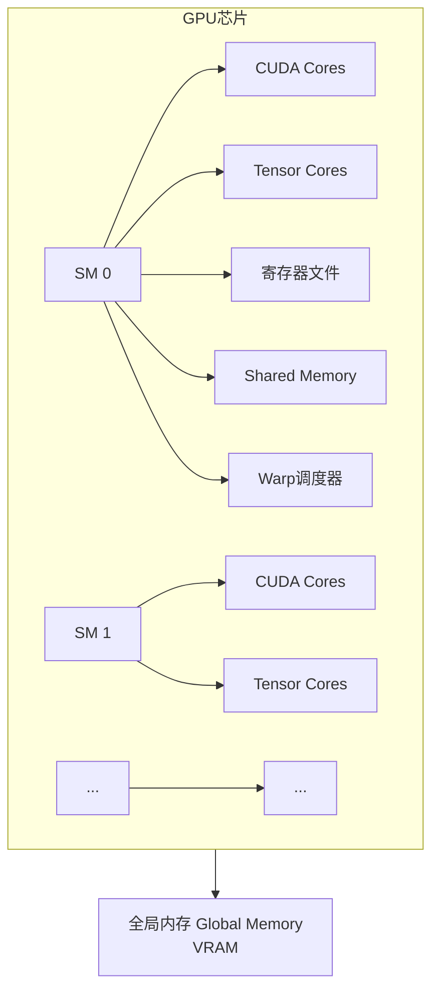
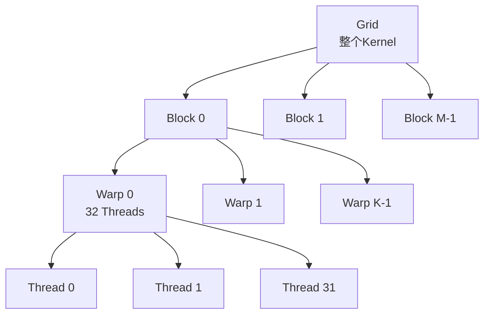

在深入CUDA驱动、运行时与内存管理的API细节之前，你必须先理解GPU芯片的物理组织方式。CUDA程序中的所有线程网格、内存分配和调度决策，最终都要映射到硬件上的CUDA Core、SM和各级存储单元。正如整体指南所强调的，在讲软件之前，我们必须先了解GPU硬件的基本结构，因为所有软件最终都是为硬件服务的。本页将系统拆解NVIDIA GPU的硬件组成，建立从核心到SM再到内存层次的完整认知框架，为后续理解Driver API、Runtime API和内存类型奠定基础。

Sources: [GPU计算生态完全指南.md](GPU计算生态完全指南.md#L98-L99)

## CPU与GPU的架构分野

CPU与GPU的根本差异源于设计目标的背离。CPU面向通用计算，拥有少量功能强大的核心，擅长复杂控制流和分支预测；GPU则面向大规模并行计算，拥有数千个简化的核心，通过数量优势换取吞吐量。这种差异直接体现在硬件布局上：CPU将大量晶体管用于缓存和控制逻辑，而GPU将晶体管优先分配给计算单元和内存带宽。当你查询到`multiProcessorCount`返回几十甚至上百时，其背后正是GPU将芯片面积投入SM阵列而非单核复杂度的设计选择。

Sources: [GPU计算生态完全指南.md](GPU计算生态完全指南.md#L102-L113)

## CUDA核心计算单元

CUDA Core是NVIDIA GPU中最基础的计算单元，负责执行整数和浮点运算，它就像餐厅里的基础厨师，每个都能独立完成一道简单菜品。在现代GPU中，每个SM包含数十到上百个CUDA Core，它们共享同一套调度器和寄存器文件，构成了并行的最小执行阵地。从早期架构到Hopper，单个SM内的CUDA Core数量持续增长，但单个Core始终保持着相对简单的流水线设计——它专注于执行算术指令，而非像CPU核心那样处理复杂的分支预测和乱序执行。与此同时，NVIDIA从Volta架构开始引入了Tensor Core，这是一种专门用于加速矩阵运算的专用计算单元，特别针对混合精度矩阵乘法进行了硬化设计，它的出现标志着GPU从通用并行处理器向AI专用加速器的演进，也是cuDNN和cuBLAS能够在深度学习领域提供数量级加速的物理基础。

Sources: [GPU计算生态完全指南.md](GPU计算生态完全指南.md#L116-L126)

两种核心单元的对比如下：

| 计算单元 | 功能定位 | 典型负载 |
|---------|---------|---------|
| CUDA Core | 通用整数与浮点运算 | 标量计算、通用并行任务、地址生成 |
| Tensor Core | 专用矩阵乘加运算 | 混合精度GEMM、深度学习训练与推理 |

## SM：流式多处理器的内部解剖

Streaming Multiprocessor（SM，流式多处理器）是GPU的基本调度单元，也是理解CUDA硬件架构的核心枢纽。一个GPU芯片通常集成数十到一百多个SM，每个SM内部包含多个CUDA Core、Tensor Core（较新架构）、共享内存（Shared Memory）、寄存器文件以及调度器。SM的设计哲学可以概括为"在有限面积内最大化并行吞吐"：它通过大量轻量线程的零开销切换来隐藏内存延迟，而不是像CPU那样依赖大容量缓存和复杂预测机制。当你通过`cudaGetDeviceProperties`查询到`multiProcessorCount`、`maxThreadsPerMultiProcessor`、`maxThreadsPerBlock`、`regsPerBlock`和`sharedMemPerBlock`时，这些数字描述的正是单个SM的并行预算——如果Kernel申请的每线程寄存器过多，或每Block共享内存过大，会导致SM上同时驻留的Block数量减少，直接降低硬件利用率。

Sources: [GPU计算生态完全指南.md](GPU计算生态完全指南.md#L128-L137), [GPU计算生态完全指南.md](GPU计算生态完全指南.md#L165-L172)

下图展示了GPU芯片、SM与内部核心组件的层级关系：



在SM内部，调度器采用SIMT（Single Instruction, Multiple Threads，单指令多线程）执行模型，这与CUDA Core所支持的执行模型一脉相承。这意味着同一组线程（称为Warp）在同一条指令流上同步推进，当遇到分支条件时，不同执行路径的线程需要串行化执行，导致分支发散。SM的Warp调度器通过快速切换不同Warp来掩盖这种延迟，只要SM上有足够多可执行的Warp，就能保持执行单元的高利用率。理解这一机制至关重要：你编写的`if-else`语句在硬件层面可能被拆分成多条Warp级指令路径，从而直接影响实际吞吐。

Sources: [GPU计算生态完全指南.md](GPU计算生态完全指南.md#L128-L137), [GPU计算生态完全指南.md](GPU计算生态完全指南.md#L890-L891)

## 线程层次结构：从Grid到Thread

CUDA的编程模型将并行计算组织为三层线程层次：Grid（网格）、Block（块）和Thread（线程）。当你使用`<<<块数, 线程数>>>`启动Kernel时，实际上是在定义一个由若干Block组成的Grid，每个Block内部包含若干Thread。在Kernel函数内部，通过`blockIdx`和`threadIdx`可以唯一确定当前线程在Grid中的坐标，例如一维索引计算`int 索引 = blockIdx.x * blockDim.x + threadIdx.x`就是最常见的线性线程定位模式。硬件上，Grid是逻辑概念，Block才是被调度到SM上执行的实体；一个Block内的所有线程共享该Block的共享内存，并保证运行于同一个SM之内。当Block被分配到SM后，其内部的线程被进一步分组为Warp，由Warp调度器统一发射指令。这种设计为开发者提供了表达大规模并行的抽象接口，同时又为硬件提供了可预测的调度粒度。

Sources: [GPU计算生态完全指南.md](GPU计算生态完全指南.md#L903-L903), [GPU计算生态完全指南.md](GPU计算生态完全指南.md#L1326-L1326), [GPU计算生态完全指南.md](GPU计算生态完全指南.md#L1342-L1343), [GPU计算生态完全指南.md](GPU计算生态完全指南.md#L166-L167)

下图展示了软件线程层次与硬件调度粒度的映射关系：



## CUDA内存层次全景

CUDA定义了多种内存类型，它们按照访问速度、容量大小和可见范围形成清晰的层次结构。位于最顶层的是寄存器（Register），它驻留在SM内部，为单个线程私有，访问延迟最低，但数量极为有限，由`regsPerBlock`间接约束。紧接着是共享内存（Shared Memory），同样位于SM内部，但为同一个Block内的所有线程共享，访问速度远快于显存，典型容量由`sharedMemPerBlock`描述，开发者可以通过`__shared__`关键字显式声明，这是优化Kernel性能最关键的手段之一。跨越SM边界后，所有线程都能访问全局内存（Global Memory），即GPU的显存（VRAM），其容量最大但访问延迟也最高。此外，GPU还配备了常量内存（Constant Memory）和纹理内存（Texture Memory）两种只读缓存机制：常量内存适合广播式的小数据读取，纹理内存则针对具有空间局部性的访问模式进行了优化。主机内存（Host Memory）和固定内存（Pinned Memory）位于CPU侧，负责数据准备和CPU与GPU之间的传输。

Sources: [GPU计算生态完全指南.md](GPU计算生态完全指南.md#L411-L419)

下图从速度、容量和可见性三个维度展示了CUDA内存层次：

```mermaid
graph LR
    subgraph 离计算单元越近，越快、越小、越私有
        R[寄存器 Register<br/>~1 cycle<br/>每线程私有]
        S[Shared Memory<br/>~5-20 cycles<br/>每Block共享]
        C[常量/纹理内存<br/>缓存加速<br/>只读广播]
        G[全局内存 Global Memory<br/>~400-800 cycles<br/>所有线程可见]
    end
    R --- S
    S --- C
    C --- G
```

各级内存的对比如下：

| 内存类型 | 物理位置 | 访问速度 | 生命周期 | 典型用途 |
|---------|---------|---------|---------|---------|
| 寄存器 | SM内部 | 最快 | 线程执行期间 | 存储临时变量、中间结果 |
| 共享内存 | SM内部 | 很快 | Block执行期间 | 线程块内数据交换、Tile缓存 |
| 常量内存 | GPU显存（只读缓存） | 快（缓存命中时） | 程序运行期间 | 存储常量参数、滤波器系数 |
| 纹理内存 | GPU显存（只读缓存） | 快（空间局部性好时） | 程序运行期间 | 图像处理、具有2D局部性的数据 |
| 全局内存 | GPU显存 | 慢 | 程序运行期间 | 存储大规模输入/输出数据 |
| 主机内存 | CPU内存 | N/A | 程序运行期间 | 数据准备、结果处理 |
| 固定内存 | CPU内存（锁定页） | 传输快 | 程序运行期间 | 异步数据传输、减少拷贝开销 |

Sources: [GPU计算生态完全指南.md](GPU计算生态完全指南.md#L411-L419)

## 计算能力与架构演进

NVIDIA通过"计算能力"（Compute Capability）来标识GPU的硬件架构代际，格式为主版本号.次版本号（如7.0、8.0）。这一编号直接决定了你的GPU支持哪些硬件特性。例如，Tensor Core最早在Volta架构（计算能力7.0，对应SM 7.0）中引入，而编译时通过`nvcc -arch=sm_70`指定目标计算能力，编译器才能生成对应架构的机器指令。理解计算能力不仅能帮你判断代码能否使用Tensor Core等高级特性，还能解释为什么同样的Kernel在不同代际的GPU上表现出截然不同的寄存器压力和共享内存容量。

Sources: [GPU计算生态完全指南.md](GPU计算生态完全指南.md#L124-L124), [GPU计算生态完全指南.md](GPU计算生态完全指南.md#L164-L164), [GPU计算生态完全指南.md](GPU计算生态完全指南.md#L483-L484)

主要架构代际与计算能力的对应关系如下：

| 架构代号 | 计算能力 | 代表型号 | 核心硬件特性 |
|---------|---------|---------|------------|
| Pascal | 6.0 - 6.2 | P100 | 基础FP16运算支持 |
| Volta | 7.0 | V100 | 第一代Tensor Core |
| Turing | 7.5 | T4 / RTX 2080 Ti | Tensor Core + INT8支持 |
| Ampere | 8.0 - 8.9 | A100 / RTX 3090 | 第三代Tensor Core，结构化稀疏 |
| Hopper | 9.0 | H100 | 第四代Tensor Core，Transformer Engine |

## 硬件信息查询实战

在实际优化之前，你必须先知道目标硬件的物理规格。CUDA Runtime提供的`cudaGetDeviceProperties`函数可以一次性获取设备名称、计算能力、SM数量、每SM最大线程数、每Block最大线程数、全局内存总量、共享内存容量和寄存器数量等关键指标。这些数据不是简单的参考数字——它们直接决定了你的Kernel应该如何配置Block大小、共享内存用量和寄存器分配策略。例如，当`sharedMemPerBlock`显示每Block仅有48KB共享内存时，你就必须确保Tile大小不会超出这一硬限制，否则Kernel甚至无法启动。以下代码展示了如何完整查询这些硬件属性：

```cpp
#include <cuda_runtime.h>
#include <stdio.h>

// 查询 CUDA 硬件信息
void 查询CUDA硬件信息() {
    int 设备数量 = 0;
    
    // 获取系统中 CUDA 设备的数量
    cudaError_t 错误码 = cudaGetDeviceCount(&设备数量);
    if (错误码 != cudaSuccess) {
        printf("获取设备数量失败: %s\n", cudaGetErrorString(错误码));
        return;
    }
    
    printf("系统中共有 %d 个 CUDA 设备\n\n", 设备数量);
    
    for (int 设备编号 = 0; 设备编号 < 设备数量; 设备编号++) {
        cudaDeviceProp 设备属性;
        cudaGetDeviceProperties(&设备属性, 设备编号);
        
        printf("===== 设备 %d =====\n", 设备编号);
        printf("设备名称: %s\n", 设备属性.name);
        printf("计算能力: %d.%d\n", 设备属性.major, 设备属性.minor);
        printf("SM 数量: %d\n", 设备属性.multiProcessorCount);
        printf("每个 SM 的最大线程数: %d\n", 设备属性.maxThreadsPerMultiProcessor);
        printf("每个块的最大线程数: %d\n", 设备属性.maxThreadsPerBlock);
        printf("全局内存总量: %.2f GB\n", 
               设备属性.totalGlobalMem / (1024.0 * 1024.0 * 1024.0));
        printf("共享内存每块: %.2f KB\n", 
               设备属性.sharedMemPerBlock / 1024.0);
        printf("寄存器每块: %d\n", 设备属性.regsPerBlock);
        printf("\n");
    }
}

int main() {
    查询CUDA硬件信息();
    return 0;
}
```

编译并运行：

```bash
nvcc -o 查询硬件 查询硬件.cpp
./查询硬件
```

Sources: [GPU计算生态完全指南.md](GPU计算生态完全指南.md#L141-L181)

## 总结与阅读路径

CUDA硬件架构的本质是一套围绕SM构建的"海量轻量线程与分级存储"系统。CUDA Core和Tensor Core提供计算能力，SM通过Warp调度和SIMT模型管理线程执行，而寄存器、共享内存和全局内存的层次结构决定了数据访问效率。掌握了这些硬件事实后，你才能理解为什么CUDA Driver和Runtime要这样设计API，以及为什么内存管理策略对性能有致命影响。所有软件最终都是为硬件服务的，脱离硬件谈优化是无源之水。

Sources: [GPU计算生态完全指南.md](GPU计算生态完全指南.md#L98-L99)

建议你在阅读本文后，继续深入了解软件层如何封装这些硬件细节：[CUDA驱动与运行时：Driver API与Runtime API](8-cudaqu-dong-yu-yun-xing-shi-driver-apiyu-runtime-api)将带你理解驱动层如何与上述硬件对话；[CUDA内存管理：分配、传输与内存类型](9-cudanei-cun-guan-li-fen-pei-chuan-shu-yu-nei-cun-lei-xing)则会教你如何在本页所述的内存层次之间高效搬运数据。如果你希望回顾GPU与CPU在更高层面的设计差异，也可返回阅读[GPU与CPU的核心差异](5-gpuyu-cpude-he-xin-chai-yi)。