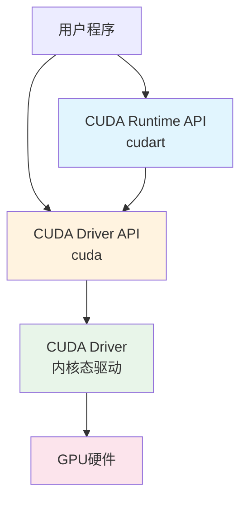
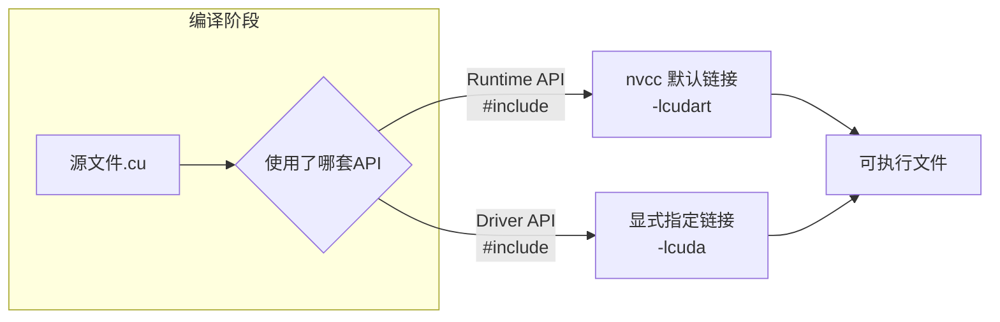
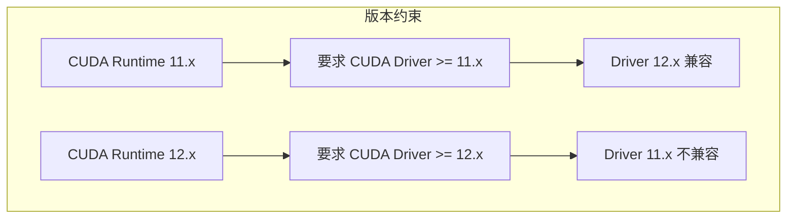

CUDA生态并非只有一套统一的编程接口，而是从硬件到应用之间构建了层次分明、职责清晰的两级软件体系：**CUDA Driver**（驱动层）与 **CUDA Runtime**（运行时层）。理解这两层的设计边界，以及它们分别暴露出的 **Driver API** 与 **Runtime API**，是中级开发者从"能写CUDA程序"迈向"能驾驭CUDA程序"的关键分水岭。本文将围绕这两套API的设计哲学、核心差异与典型应用场景展开，帮助你在合适的场景做出合适的技术选择。

Sources: [GPU计算生态完全指南.md](GPU计算生态完全指南.md#L189-L215)

## 生态定位：驱动与运行时在CUDA中的位置

在NVIDIA的软件栈中，CUDA Driver与CUDA Runtime处于硬件之上、应用之下的核心夹层。如果把整个GPU计算生态看作一座大厦，**Driver是地基中的钢筋骨架**，负责将操作系统层面的调用转译为GPU能理解的指令；**Runtime则是大厦的电梯与管网系统**，为上层应用提供便捷的设备管理、内存调度与任务编排能力。



**关键洞察**：Runtime API并不是Driver API的替代品，而是建立在Driver API之上的一层封装。当你调用`cudaMalloc`时，Runtime内部最终会通过Driver API与硬件交互；但Runtime帮你屏蔽了上下文创建、模块加载、错误传播等繁琐细节。这种层级关系决定了：**所有Runtime能做到的事，Driver都能做到；但Driver能做到的精细控制，Runtime未必暴露给你**。

Sources: [GPU计算生态完全指南.md](GPU计算生态完全指南.md#L200-L215)

## 设计哲学：手动挡与自动挡

NVIDIA同时提供两套API，本质上是在**开发效率**与**控制精度**之间做出的架构性权衡。Driver API像手动挡汽车，Runtime API像自动挡汽车——两者都能抵达目的地，但驾驶体验和适用路况截然不同。

| 维度 | CUDA Driver API | CUDA Runtime API |
|------|----------------|------------------|
| 抽象层级 | 底层，直接对接驱动内核 | 高层，封装常见模式 |
| 上下文管理 | 显式（手动创建/销毁/切换） | 隐式（自动绑定当前线程） |
| 代码冗余度 | 高（需手动处理初始化链条） | 低（一行代码启动设备） |
| 错误粒度 | 精细（可定位到驱动级返回码） | 聚合（统一返回cudaError_t） |
| 动态编译支持 | 原生支持（JIT编译PTX模块） | 有限支持（需间接调用Driver） |
| 典型使用者 | 深度学习框架底层、虚拟化方案、编译器中间层 | 普通HPC应用、算法原型、教学示例 |

这种分层设计的智慧在于：**让90%的开发者用10%的接口完成90%的工作，同时让10%的深度用户保有100%的控制力**。如果你只是写一个简单的向量加法或训练脚本，Runtime API是毫无疑问的首选；但如果你正在开发一个需要在运行时动态加载GPU代码的JIT编译器，或者需要在多个GPU上下文之间做精细切换的虚拟化平台，Driver API就成了不可替代的工具。

Sources: [GPU计算生态完全指南.md](GPU计算生态完全指南.md#L204-L214)

## 核心差异：上下文管理的显式与隐式

**上下文（Context）**是CUDA编程模型中最容易被忽视却最为关键的概念。可以将其理解为CPU线程在GPU侧的镜像——它封装了一块GPU的状态，包括当前分配的内存地址空间、模块加载状态、缓存配置等。**Driver API要求你像管理文件句柄一样显式管理上下文，而Runtime API则将其完全自动化**。

### Driver API：显式上下文管理

使用Driver API时，你的初始化代码必须遵循严格的调用链条：`cuInit` → `cuDeviceGet` → `cuCtxCreate`。上下文创建成功后，所有后续的内存分配、Kernel加载都绑定在这个上下文上。你甚至可以在一个线程中创建多个上下文，并通过`cuCtxPushCurrent`/`cuCtxPopCurrent`进行切换——这种能力在多租户GPU虚拟化场景中极为重要，但对于普通开发者而言是过度设计。

```cpp
#include <cuda.h>
#include <stdio.h>

void 驱动API示例() {
    CUresult 结果;
    结果 = cuInit(0);
    if (结果 != CUDA_SUCCESS) { printf("Driver 初始化失败\n"); return; }
    
    int 设备数量 = 0;
    cuDeviceGetCount(&设备数量);
    
    CUdevice 设备;
    cuDeviceGet(&设备, 0);
    
    char 设备名称[256];
    cuDeviceGetName(设备名称, sizeof(设备名称), 设备);
    printf("设备名称: %s\n", 设备名称);
    
    // 显式创建上下文——这是Driver API与Runtime API的分水岭
    CUcontext 上下文;
    结果 = cuCtxCreate(&上下文, 0, 设备);
    if (结果 != CUDA_SUCCESS) { printf("创建上下文失败\n"); return; }
    
    printf("Driver API 上下文创建成功\n");
    cuCtxDestroy(上下文);
}
```

### Runtime API：隐式上下文管理

Runtime API的代码量显著更少，因为它将`cuInit`和`cuCtxCreate`隐藏在第一次CUDA调用时自动执行。当你调用`cudaSetDevice(0)`时，Runtime会在后台为你创建并绑定一个Primary Context——这个上下文与线程相关联，生命周期由Runtime自动管理。**你感知不到上下文的存在，但这不意味着它不存在**。

```cpp
#include <cuda_runtime.h>
#include <stdio.h>

void 运行时API示例() {
    // Runtime API 会自动初始化 Driver 并创建上下文
    int 设备数量 = 0;
    cudaGetDeviceCount(&设备数量);
    printf("Runtime API 检测到 %d 个设备\n", 设备数量);
    
    cudaSetDevice(0);  // 隐式完成上下文绑定
    
    cudaDeviceProp 属性;
    cudaGetDeviceProperties(&属性, 0);
    printf("设备名称: %s\n", 属性.name);
}
```

**深层注意**：Runtime API的隐式上下文虽然方便，但也带来一个常见陷阱——如果你在一个线程中使用了`cudaSetDevice`，然后试图在另一个线程中访问那块内存，可能会遇到上下文不匹配的错误。Driver API的显式管理虽然繁琐，却让你在多线程程序中对"谁在哪个上下文中执行什么操作"拥有完全的可预测性。

Sources: [GPU计算生态完全指南.md](GPU计算生态完全指南.md#L216-L310)

## Runtime的核心能力矩阵

CUDA Runtime是绝大多数开发者日常交互最频繁的接口层，其核心能力可以归纳为五大领域。对于中级开发者而言，不需要背诵每一个函数签名，但需要建立清晰的**能力地图**——知道某个需求应该去Runtime的哪个子系统中寻找答案。

| 能力领域 | 核心函数族 | 典型用途 |
|---------|-----------|---------|
| 设备管理 | `cudaGetDeviceCount`, `cudaSetDevice`, `cudaGetDeviceProperties` | 多GPU环境下的设备选择与属性查询 |
| 内存管理 | `cudaMalloc`, `cudaFree`, `cudaMemcpy`, `cudaMemset` | 显存分配与Host-Device数据传输 |
| 执行控制 | `kernel<<<grid, block>>>` 语法糖 | 启动Kernel并配置线程网格 |
| 流与事件 | `cudaStreamCreate`, `cudaEventCreate`, `cudaStreamSynchronize` | 异步执行、流水线重叠、性能计时 |
| 错误处理 | `cudaGetLastError`, `cudaPeekAtLastError`, `cudaGetErrorString` | 调试与生产环境中的错误定位 |

这里需要特别强调的是**内存管理**的语义。`cudaMemcpy`的第四个参数`cudaMemcpyKind`决定了传输方向（HostToDevice、DeviceToHost、DeviceToDevice等），错误的方向参数不会触发编译错误，但会在运行时导致未定义行为——这是中级开发者最常踩的坑之一。此外，Runtime提供的流机制允许你将内存拷贝与Kernel计算重叠执行，是隐藏延迟、提升吞吐量的核心手段。

Sources: [GPU计算生态完全指南.md](GPU计算生态完全指南.md#L312-L323)

## 编译链接：不同的库依赖

Driver API与Runtime API不仅在使用方式上不同，在编译和链接阶段也有明确的区分。理解这一点可以避免常见的链接错误。



| API类型 | 头文件 | 链接库 | 编译命令示例 |
|--------|--------|--------|-------------|
| Runtime API | `<cuda_runtime.h>` | `cudart`（nvcc默认链接） | `nvcc -o app app.cu` |
| Driver API | `<cuda.h>` | `cuda`（需显式指定） | `nvcc -o app app.cpp -lcuda` |

**关键细节**：当你使用Driver API时，需要显式传递`-lcuda`给链接器，因为Driver库不会被nvcc默认引入。另外，Driver API的代码通常以`.cpp`结尾即可（纯Host代码调用驱动函数），而Runtime API的代码通常需要`.cu`后缀以便nvcc识别CUDA C++扩展语法（如`<<< >>>`Kernel启动语法）。

Sources: [GPU计算生态完全指南.md](GPU计算生态完全指南.md#L267-L271)

## 决策指南：何时用Driver，何时用Runtime

理论上的区分最终要落地到工程决策。以下场景化建议可以帮助你在项目早期做出正确选择：

| 场景特征 | 推荐API | 理由 |
|---------|--------|------|
| 快速算法验证、教学示例、个人项目 | **Runtime API** | 代码简洁，心智负担低，编译命令简单 |
| 生产级深度学习框架底层（如PyTorch CUDA后端） | **Driver API** | 需要动态加载PTX/Cubin、精细管理多设备上下文 |
| 多进程共享GPU、虚拟化/容器环境 | **Driver API** | 显式上下文管理允许多租户隔离 |
| 需要运行时JIT编译GPU代码 | **Driver API** | `cuModuleLoadData`等接口直接支持动态模块加载 |
| 跨平台HPC应用、需要与大量现有CUDA代码集成 | **Runtime API** | 社区生态最丰富，第三方库兼容性最好 |

**实用原则**：**默认选择Runtime API，直到你遇到一个Runtime做不到或做得不够好的具体需求，再考虑下沉到Driver API**。这种"按需下沉"的策略能最大程度兼顾开发效率与架构灵活性。值得注意的是，两套API可以在同一个程序中混用——你可以用Runtime API管理内存和启动Kernel，同时在特定环节调用Driver API获取更底层的控制能力。

Sources: [GPU计算生态完全指南.md](GPU计算生态完全指南.md#L204-L214)

## 依赖关系与版本约束

CUDA Driver与CUDA Runtime之间存在严格的版本兼容性约束。**Driver是向后兼容的，但Runtime需要Driver的版本不低于自身**。换言之，你可以用新版本的Driver运行旧版本的Runtime程序，但反过来不行。这一约束在部署环境中尤为重要：服务器升级CUDA Toolkit后，如果未同步更新GPU驱动，可能导致Runtime初始化失败。



Sources: [GPU计算生态完全指南.md](GPU计算生态完全指南.md#L189-L199)

## 总结与下一步

CUDA Driver API与Runtime API构成了GPU计算软件栈的中流砥柱。**Driver API是通往硬件的钥匙，Runtime API是日常开发的桥梁**。中级开发者的成长路径，往往是从熟练驾驭Runtime API开始，逐步理解Driver API背后的上下文、模块与内存模型，最终在需要时能够无缝下沉到更底层的控制。这种分层认知不仅能帮你写出更健壮的CUDA程序，也能让你在面对PyTorch、TensorFlow等框架的底层报错时，快速定位问题所在的层级。

如需继续深入，建议按以下顺序阅读：
- 下一节：[CUDA内存管理：分配、传输与内存类型](9-cudanei-cun-guan-li-fen-pei-chuan-shu-yu-nei-cun-lei-xing)——深入理解`cudaMalloc`背后的内存模型与各类内存的适用场景
- 相关前置：[CUDA硬件架构：核心、SM与内存层次](7-cudaying-jian-jia-gou-he-xin-smyu-nei-cun-ceng-ci)——从硬件视角理解Driver与Runtime的设计动机
- 工具链延伸：[CUDA Toolkit与nvcc编译器](10-cuda-toolkityu-nvccbian-yi-qi)——理解`nvcc`如何将包含Runtime API的`.cu`文件编译为可执行程序