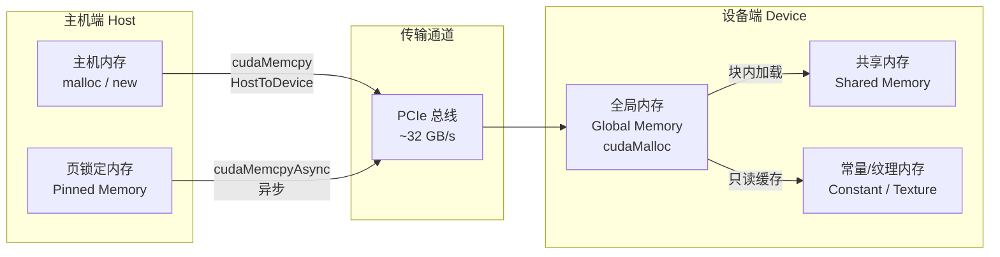

CUDA内存管理是连接软件抽象与硬件层次的枢纽。在[CUDA硬件架构：核心、SM与内存层次](7-cudaying-jian-jia-gou-he-xin-smyu-nei-cun-ceng-ci)中，你已经理解了寄存器、共享内存和全局内存的物理布局；在[CUDA驱动与运行时：Driver API与Runtime API](8-cudaqu-dong-yu-yun-xing-shi-driver-apiyu-runtime-api)中，你看到了Runtime API如何通过`cudaMalloc`和`cudaMemcpy`屏蔽底层复杂性。本文将在这两层认知之间建立完整的操作图景——从显存分配的生命周期管理，到Host-Device数据传输的性能瓶颈，再到各类内存类型的适用场景与陷阱。对于中级开发者而言，掌握这些内容是写出高效、稳定GPU程序的必要条件。

Sources: [GPU计算生态完全指南.md](GPU计算生态完全指南.md#L312-L323)

## 显存分配与释放的三原色

CUDA Runtime为设备内存分配提供了与C标准库对称但语义不同的接口 trio：`cudaMalloc`、`cudaFree`和`cudaMemset`。理解这三者的行为边界是避免内存泄漏和段错误的第一步。与主机端的`malloc`不同，`cudaMalloc`分配的是GPU全局内存（Global Memory），这段内存不在CPU的地址空间内，因此主机代码不能直接解引用设备指针——任何试图直接访问`cudaMalloc`返回指针的CPU代码都会立即触发段错误。

Sources: [GPU计算生态完全指南.md](GPU计算生态完全指南.md#L324-L405)

设备内存的分配遵循严格的对称原则：每一次成功的`cudaMalloc`都必须对应一次`cudaFree`，否则在程序退出前显存不会被归还给操作系统，这在长时间运行的服务进程中尤为致命。一个稳健的设备内存分配模式应当始终检查返回错误码，并在异常路径上确保释放已分配的资源。`cudaMemset`则用于将设备内存区域初始化为指定值，其语义与`memset`一致，但操作发生在GPU端，常用于在Kernel执行前清零输出缓冲区。

Sources: [GPU计算生态完全指南.md](GPU计算生态完全指南.md#L356-L398)

```cpp
#include <cuda_runtime.h>
#include <stdio.h>
#include <stdlib.h>

void 显存分配释放示例() {
    const int 元素数 = 1024;
    const int 字节数 = 元素数 * sizeof(float);
    
    float* 设备指针 = nullptr;
    cudaError_t 错误码 = cudaMalloc((void**)&设备指针, 字节数);
    if (错误码 != cudaSuccess) {
        printf("显存分配失败: %s\n", cudaGetErrorString(错误码));
        return;
    }
    
    // 将设备内存清零
    cudaMemset(设备指针, 0, 字节数);
    
    // ... 在此处启动 Kernel 进行计算 ...
    
    cudaFree(设备指针);  // 必须释放
}
```

Sources: [GPU计算生态完全指南.md](GPU计算生态完全指南.md#L333-L404)

## Host-Device数据传输：PCIe上的高速公路

GPU拥有独立的内存地址空间，这意味着数据在参与计算前必须跨越PCIe总线从主机内存迁移到设备显存。`cudaMemcpy`是执行这一迁移的核心函数，其第四个参数`cudaMemcpyKind`定义了传输方向，包括`cudaMemcpyHostToDevice`、`cudaMemcpyDeviceToHost`、`cudaMemcpyDeviceToDevice`以及`cudaMemcpyDefault`。错误指定传输方向不会引发编译错误，但会在运行时产生未定义行为，这是中级开发者最常见的调试陷阱之一。

Sources: [GPU计算生态完全指南.md](GPU计算生态完全指南.md#L376-L386)

从性能视角看，`cudaMemcpy`是**同步操作**——它在CPU侧阻塞，直到数据完整抵达目的地后才返回。这意味着在`cudaMemcpy`执行期间，主机线程无法执行任何有用工作，GPU也处于等待数据的状态。PCIe带宽是这里的硬瓶颈：现代PCIe 4.0 x16的理论带宽约为32 GB/s，而高端GPU的显存带宽可达数千GB/s，两者相差两个数量级。因此，任何减少不必要数据传输、提升传输效率的策略都会直接转化为端到端性能收益。

Sources: [GPU计算生态完全指南.md](GPU计算生态完全指南.md#L324-L327)

下图展示了标准CUDA程序中的数据流路径：



Sources: [GPU计算生态完全指南.md](GPU计算生态完全指南.md#L411-L419)

## CUDA内存类型全景解析

CUDA定义了层次分明的内存体系，每种内存在**物理位置**、**访问速度**、**可见范围**和**生命周期**四个维度上具有独特的定位。中级开发者必须建立的条件反射是：在编写Kernel之前，先判断数据应该放在哪一层内存中。

Sources: [GPU计算生态完全指南.md](GPU计算生态完全指南.md#L407-L419)

| 内存类型 | 物理位置 | 访问延迟 | 可见范围 | 生命周期 | 典型用途 |
|---------|---------|---------|---------|---------|---------|
| 寄存器（Register） | SM内部 | ~1 cycle | 单个线程私有 | 线程执行期间 | 局部变量、中间结果 |
| 共享内存（Shared Memory） | SM内部 | ~5-20 cycles | 同Block内线程共享 | Block执行期间 | Tile缓存、线程块协作 |
| 常量内存（Constant Memory） | GPU显存（只读缓存） | 缓存命中时快 | 所有线程只读 | 程序运行期间 | 滤波器系数、配置参数 |
| 纹理内存（Texture Memory） | GPU显存（只读缓存） | 空间局部性好时快 | 所有线程只读 | 程序运行期间 | 图像处理、2D局部性数据 |
| 全局内存（Global Memory） | GPU显存（DRAM） | ~400-800 cycles | 所有线程可见 | 程序运行期间 | 大规模输入输出数据 |
| 页锁定内存（Pinned Memory） | CPU内存（锁定页） | 传输速度快 | 主机+设备均可访问 | 程序运行期间 | 异步传输、零拷贝 |
| 统一内存（Unified Memory） | GPU显存+CPU内存 | 按需迁移 | 所有线程/主机 | 程序运行期间 | 简化编程、复杂数据结构 |

Sources: [GPU计算生态完全指南.md](GPU计算生态完全指南.md#L411-L419)

寄存器和共享内存位于SM内部，访问速度最快但容量极为有限。共享内存的典型应用场景是矩阵乘法的Tile算法：将全局内存中的子矩阵加载到共享内存后，Block内的线程可以高速复用这些数据，避免重复访问高延迟的全局内存。全局内存虽然容量最大（数GB到数十GB），但延迟极高，因此高效的内存访问模式——尤其是合并访问（Coalesced Access）——是Kernel优化的核心课题。常量内存和纹理内存通过只读缓存提供广播能力，当Warp内所有线程读取同一地址时，常量内存只需一次内存事务即可服务整个Warp。

Sources: [GPU计算生态完全指南.md](GPU计算生态完全指南.md#L128-L137)

## 页锁定内存与异步传输

默认情况下，`malloc`分配的主机内存是可分页的（Pageable），操作系统可以在物理内存和磁盘之间迁移其页帧。当`cudaMemcpy`执行HostToDevice传输时，CUDA驱动必须首先将可分页数据复制到一块临时的页锁定（Pinned）内存区域，然后再通过DMA引擎传送到GPU。这一额外的拷贝步骤使有效传输带宽远低于PCIe理论上限。

Sources: [GPU计算生态完全指南.md](GPU计算生态完全指南.md#L324-L327)

页锁定内存通过`cudaMallocHost`（或`cudaHostAlloc`）分配，其核心特性是页面被锁定在物理内存中且不会被交换到磁盘。由于DMA引擎可以直接访问页锁定内存，`cudaMemcpy`可以跳过临时拷贝步骤，传输带宽显著提升——在实际测量中通常可提升1.5到2倍。更重要的是，页锁定内存是**异步传输**的前提条件：`cudaMemcpyAsync`只能在页锁定内存上执行，它允许主机线程在数据传输的同时继续执行计算或发起其他GPU命令，这是实现CPU-GPU流水线重叠的关键机制。

Sources: [GPU计算生态完全指南.md](GPU计算生态完全指南.md#L419-L419)

```cpp
#include <cuda_runtime.h>
#include <stdio.h>

void 异步传输示例() {
    const int 大小 = 1024 * 1024 * sizeof(float);
    
    float* 主机页锁定 = nullptr;
    float* 设备指针 = nullptr;
    
    // 分配页锁定内存
    cudaMallocHost((void**)&主机页锁定, 大小);
    cudaMalloc((void**)&设备指针, 大小);
    
    cudaStream_t 流;
    cudaStreamCreate(&流);
    
    // 异步传输：主机线程不会阻塞
    cudaMemcpyAsync(设备指针, 主机页锁定, 大小, cudaMemcpyHostToDevice, 流);
    
    // 主机线程可以在此执行其他工作
    // ...
    
    cudaStreamSynchronize(流);  // 等待流完成
    
    cudaFree(设备指针);
    cudaFreeHost(主机页锁定);   // 释放页锁定内存必须使用 cudaFreeHost
    cudaStreamDestroy(流);
}
```

Sources: [GPU计算生态完全指南.md](GPU计算生态完全指南.md#L411-L419)

需要警惕的是，页锁定内存的过度分配会对操作系统造成压力：锁定的页面减少了可供其他进程使用的物理内存，极端情况下可能触发系统级的内存压力。因此，建议仅对参与频繁Host-Device传输的缓冲区使用页锁定内存，并在传输完成后及时释放。

Sources: [GPU计算生态完全指南.md](GPU计算生态完全指南.md#L324-L327)

## 统一内存：简化编程模型的双刃剑

CUDA 6.0引入的统一内存（Unified Memory）通过`cudaMallocManaged`提供了一套单一指针编程模型。开发者只需分配一次内存，获得的指针既可以在主机代码中解引用，也可以在设备Kernel中使用，CUDA运行时自动在后台处理数据在CPU和GPU之间的迁移。这一机制极大地降低了初学者的认知负担，也使得管理复杂数据结构（如嵌套指针、链表）变得可行——传统`cudaMemcpy`要求手动处理深层指针的逐层拷贝，而统一内存将这一过程自动化。

Sources: [GPU计算生态完全指南.md](GPU计算生态完全指南.md#L324-L327)

然而，统一内存的便利性是有代价的。在Pascal架构之前的GPU上，统一内存在Kernel启动前会一次性迁移到设备端；而在Pascal及更新的架构上，支持**按需分页迁移**（On-Demand Page Migration），即只有当GPU访问某个页面时，该页面才会被迁移到显存。这种延迟迁移虽然减少了不必要的传输，但首次访问引发的页错误（Page Fault）会带来显著的性能惩罚。因此，统一内存并非高性能计算的首选方案，它更适合于原型验证、代码迁移阶段，或者那些数据访问模式难以预先确定的算法场景。

Sources: [GPU计算生态完全指南.md](GPU计算生态完全指南.md#L324-L327)

```cpp
#include <cuda_runtime.h>
#include <stdio.h>

__global__ void 向量缩放(float* 数据, float 系数, int 长度) {
    int 索引 = blockIdx.x * blockDim.x + threadIdx.x;
    if (索引 < 长度) {
        数据[索引] *= 系数;
    }
}

void 统一内存示例() {
    const int 长度 = 1024;
    const int 大小 = 长度 * sizeof(float);
    
    float* 统一指针 = nullptr;
    cudaMallocManaged(&统一指针, 大小);
    
    // 主机端初始化
    for (int i = 0; i < 长度; i++) {
        统一指针[i] = (float)i;
    }
    
    // 设备端直接使用同一指针
    向量缩放<<<(长度 + 255) / 256, 256>>>(统一指针, 2.0f, 长度);
    cudaDeviceSynchronize();
    
    // 主机端读取结果
    printf("结果: %f\n", 统一指针[0]);
    
    cudaFree(统一指针);  // 统一内存使用 cudaFree 释放
}
```

Sources: [GPU计算生态完全指南.md](GPU计算生态完全指南.md#L324-L327)

## 内存管理最佳实践与常见陷阱

高效的CUDA内存管理不仅是API的正确调用，更是一套系统性的资源规划策略。以下是中级开发者在生产环境中应当遵循的核心原则。

Sources: [GPU计算生态完全指南.md](GPU计算生态完全指南.md#L324-L405)

**分配策略**：避免在性能关键路径中频繁调用`cudaMalloc`和`cudaFree`。显存分配涉及与驱动的交互和地址空间管理，开销不可忽略。推荐在程序初始化阶段一次性分配所需的最大显存，通过内存池（Memory Pool）模式手动管理生命周期。CUDA 11.2起引入的`cudaMallocAsync`与CUDA内存池（CUDA Memory Pool）API进一步将这一模式标准化，允许开发者复用已分配的显存块而无需反复归还操作系统。

Sources: [GPU计算生态完全指南.md](GPU计算生态完全指南.md#L324-L327)

**错误处理模式**：`cudaMalloc`失败通常意味着显存不足或请求尺寸超过设备限制。与主机`malloc`不同，`cudaMalloc`不会因尺寸过大而返回`NULL`——它返回`cudaError_t`错误码。稳健代码应当始终检查返回值，并在失败时提供可操作的诊断信息（如通过`cudaGetErrorString`解析错误码）。

Sources: [GPU计算生态完全指南.md](GPU计算生态完全指南.md#L356-L372)

**内存对齐**：全局内存的合并访问要求线程按连续地址顺序读取数据。当数据结构的起始地址未按128字节或256字节边界对齐时，原本可以单次事务完成的读取可能分裂为多次，严重降低有效带宽。使用`cudaMalloc`分配的内存默认至少按256字节对齐，满足大多数合并访问需求。

Sources: [GPU计算生态完全指南.md](GPU计算生态完全指南.md#L324-L327)

**泄漏检测**：显存泄漏不会像主机内存泄漏那样触发OOM killer（因为GPU内存不由操作系统直接管理），而是表现为后续`cudaMalloc`调用失败或程序性能逐渐恶化。利用`cuda-memcheck`工具（较新版本由Compute Sanitizer接替）可以在开发阶段捕获未释放的显存分配和越界访问。

Sources: [GPU计算生态完全指南.md](GPU计算生态完全指南.md#L448-L450)

| 陷阱 | 表现 | 解决方案 |
|-----|------|---------|
| 主机直接解引用设备指针 | 段错误 / 程序崩溃 | 严格区分主机指针与设备指针，统一内存除外 |
| 可分页内存上调用`cudaMemcpyAsync` | 隐式同步，失去异步意义 | 确保异步传输的源/目标为页锁定内存 |
| 忘记释放页锁定内存 | 主机物理内存持续占用 | 使用`cudaFreeHost`而非`free`释放 |
| 传输方向参数错误 | 运行时未定义行为、数据静默损坏 | 显式使用枚举值，避免硬编码整数 |
| Kernel内越界访问全局内存 | 难以调试的随机错误 | 使用`cuda-memcheck`或Compute Sanitizer |

Sources: [GPU计算生态完全指南.md](GPU计算生态完全指南.md#L324-L405)

## 总结与阅读路径

CUDA内存管理的核心在于理解**独立地址空间**这一基本约束，以及Runtime API提供的各类机制如何在这个约束下优化数据流动。`cudaMalloc`与`cudaFree`构成了显存生命周期的基础；`cudaMemcpy`及其异步变体定义了Host-Device交互的语义；页锁定内存和统一内存则在性能与易用性之间提供了两个不同方向的权衡。对于追求极致性能的开发者，减少数据传输、最大化合并访问、利用共享内存缓存是永恒的优化主题；对于追求开发效率的团队，统一内存和异步流可以显著降低并行编程的心智负担。

Sources: [GPU计算生态完全指南.md](GPU计算生态完全指南.md#L312-L323)

建议你在掌握本文内容后，按以下顺序继续深入：
- **工具链延伸**：[CUDA Toolkit与nvcc编译器](10-cuda-toolkityu-nvccbian-yi-qi)——理解`nvcc`如何将包含内存操作的`.cu`文件编译为可执行程序，以及编译优化对内存访问模式的影响
- **算法库实践**：[cuBLAS与NCCL通信库](12-cublasyu-nccltong-xin-ku)——观察工业级库如何管理大规模矩阵的显存分配与多GPU数据传输
- **代码实战**：[基础向量加法：CUDA与MUSA对比](21-ji-chu-xiang-liang-jia-fa-cudayu-musadui-bi)——在完整可编译的示例中应用本文所学的内存分配与传输模式
- **国产生态对照**：[MUSA架构设计与CUDA兼容性](13-musajia-gou-she-ji-yu-cudajian-rong-xing)——了解MUSA如何映射CUDA的内存模型到摩尔线程GPU硬件