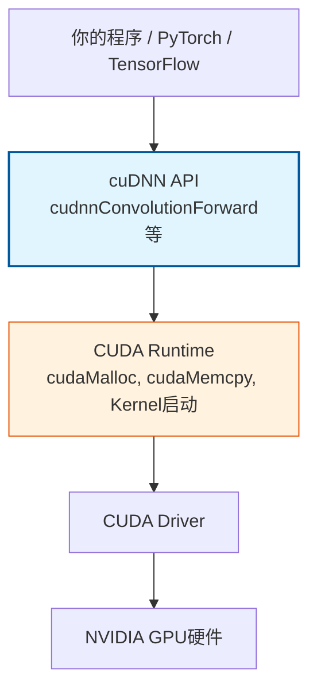

cuDNN（CUDA Deep Neural Network library）是NVIDIA专为深度学习工作负载设计的高性能GPU加速原语库。它并非CUDA Toolkit的组成部分，而是作为独立组件发布，为卷积、池化、归一化、激活函数、循环神经网络及注意力机制等核心深度学习算子提供经过专家级优化的实现。对于从事深度学习训练与推理的中级开发者而言，理解cuDNN的定位、编程模型及其与CUDA生态的协作方式，是掌握GPU加速神经网络开发的关键一步。本文档聚焦cuDNN的设计原理、核心功能与典型使用模式。

Sources: [GPU计算生态完全指南.md](GPU计算生态完全指南.md#L528-L575)

## 为什么需要cuDNN

在GPU上实现一个高效的卷积操作，开发者需要同时处理数学原理、内存访问模式、并行策略、寄存器分配与SM利用率等多个维度的优化问题。手写CUDA Kernel虽然提供了完全的控制权，但对绝大多数开发者而言，要达到cuDNN内部实现的性能水平几乎不可能。cuDNN的价值在于将NVIDIA深度学习专家团队针对各代GPU架构（从Kepler到Hopper）的调优经验封装为可直接调用的API。在GPU计算生态的[餐厅类比](4-can-ting-lei-bi-li-jie-gpusheng-tai-ceng-ci)中，CUDA Toolkit相当于厨房设备与刀具，而cuDNN则是预制菜供应商——它让你无需从零开始处理食材，而是直接获得经过专业烹饪优化的高性能算子实现。

Sources: [GPU计算生态完全指南.md](GPU计算生态完全指南.md#L530-L538)

## cuDNN核心功能全景

cuDNN覆盖深度学习模型中绝大多数计算密集型操作，其功能按类别组织如下：

| 功能类别 | 具体算子 | 典型应用场景 |
|---------|---------|------------|
| 卷积 | 前向卷积、反向卷积（数据梯度、权重梯度） | CNN骨干网络、特征提取 |
| 池化 | 最大池化、平均池化 | 降采样、感受野扩展 |
| 归一化 | Batch Normalization、Layer Normalization、Group Normalization | 训练稳定性加速收敛 |
| 激活函数 | ReLU、Sigmoid、Tanh、ELU、GELU | 非线性变换 |
| 循环神经网络 | LSTM、GRU、RNN | 序列建模、时序预测 |
| 注意力机制 | Multi-head Attention、Scaled Dot-Product Attention | Transformer架构核心 |
| 张量运算 | 张量变换、格式转换（NCHW/NHWC互转）、Add-Tensor | 数据预处理与后处理 |

cuDNN不仅提供算子的功能正确性，更关键的是针对每种算子实现了多种算法（如卷积的隐式预计算GEMM、Winograd、FFT等），并在运行时根据张量尺寸、数据类型与GPU架构自动或手动选择最优路径。

Sources: [GPU计算生态完全指南.md](GPU计算生态完全指南.md#L540-L551)

## cuDNN在GPU生态中的位置

理解cuDNN不能孤立进行，必须将其置于完整的GPU计算层级中观察。在生态依赖关系中，cuDNN处于**加速库层**，直接构建在CUDA Runtime之上，同时被PyTorch、TensorFlow等深度学习框架所依赖。



这一层级结构决定了cuDNN的三个关键属性：第一，cuDNN**不是**CUDA Toolkit的组成部分，必须从NVIDIA开发者网站单独下载安装；第二，cuDNN的运行**严格依赖**CUDA Driver与CUDA Runtime，没有 Toolkit 的环境无法使用cuDNN；第三，cuDNN的版本必须与所安装的CUDA Toolkit版本匹配，否则会出现编译错误或运行时符号缺失。关于层级依赖的完整讨论，可参考[GPU生态层级依赖关系图](17-gpusheng-tai-ceng-ji-yi-lai-guan-xi-tu)。

Sources: [GPU计算生态完全指南.md](GPU计算生态完全指南.md#L552-L575)

## cuDNN编程模型：描述符与执行

cuDNN的API设计遵循一种高度结构化的**描述符-执行**模式。与直接传递数组维度的简单API不同，cuDNN要求开发者先创建并配置多个描述符对象，明确指定张量布局、卷积参数与数据类型，然后再执行实际计算。这种模式看似增加了代码量，实则将**算子配置**与**算子执行**解耦，使cuDNN能够在执行阶段根据描述符信息进行深度优化。

核心描述符类型包括：

| 描述符类型 | 作用 | 典型配置函数 |
|-----------|------|-------------|
| `cudnnTensorDescriptor_t` | 定义输入/输出张量的维度、数据类型与内存布局 | `cudnnSetTensor4dDescriptor` |
| `cudnnFilterDescriptor_t` | 定义卷积核（权重）的维度与类型 | `cudnnSetFilter4dDescriptor` |
| `cudnnConvolutionDescriptor_t` | 定义卷积操作的填充、步幅、扩张与模式 | `cudnnSetConvolution2dDescriptor` |

在执行阶段，cuDNN的卷积API要求开发者显式**选择算法**并**分配工作空间**（Workspace）。算法选择通过 `cudnnGetConvolutionForwardAlgorithm` 完成，开发者可以指定优化目标（如优先最快、优先最少内存或优先确定性）。工作空间则是cuDNN为特定算法预留的临时GPU内存，用于存储中间结果或预处理数据。这种设计让cuDNN能够在不同内存约束与性能需求之间灵活权衡。

Sources: [GPU计算生态完全指南.md](GPU计算生态完全指南.md#L577-L674)

## 完整代码示例：卷积前向传播

以下示例展示了一个标准的cuDNN卷积前向传播流程。代码遵循**创建句柄 → 定义描述符 → 选择算法 → 分配内存 → 执行计算 → 清理资源**的九步模式。


```cpp
#include <cuda_runtime.h>
#include <cudnn.h>
#include <stdio.h>
#include <stdlib.h>

#define checkCUDNN(expression) \
    { cudnnStatus_t status = (expression); \
      if (status != CUDNN_STATUS_SUCCESS) { \
          printf("cuDNN error (%s:%d): %s\n", \
                 __FILE__, __LINE__, cudnnGetErrorString(status)); \
          exit(EXIT_FAILURE); \
      } }

void cudnnConvolutionExample() {
    // 1. 创建 cuDNN 句柄
    cudnnHandle_t handle;
    checkCUDNN(cudnnCreate(&handle));

    // 2. 定义张量描述符：输入 [N=1, C=3, H=32, W=32]
    cudnnTensorDescriptor_t inputDesc;
    checkCUDNN(cudnnCreateTensorDescriptor(&inputDesc));
    checkCUDNN(cudnnSetTensor4dDescriptor(
        inputDesc, CUDNN_TENSOR_NCHW, CUDNN_DATA_FLOAT, 1, 3, 32, 32));

    // 输出 [N=1, C=64, H=32, W=32]
    cudnnTensorDescriptor_t outputDesc;
    checkCUDNN(cudnnCreateTensorDescriptor(&outputDesc));
    checkCUDNN(cudnnSetTensor4dDescriptor(
        outputDesc, CUDNN_TENSOR_NCHW, CUDNN_DATA_FLOAT, 1, 64, 32, 32));

    // 3. 定义卷积核描述符 [OUT=64, IN=3, KH=3, KW=3]
    cudnnFilterDescriptor_t filterDesc;
    checkCUDNN(cudnnCreateFilterDescriptor(&filterDesc));
    checkCUDNN(cudnnSetFilter4dDescriptor(
        filterDesc, CUDNN_DATA_FLOAT, CUDNN_TENSOR_NCHW, 64, 3, 3, 3));

    // 4. 定义卷积操作描述符
    cudnnConvolutionDescriptor_t convDesc;
    checkCUDNN(cudnnCreateConvolutionDescriptor(&convDesc));
    checkCUDNN(cudnnSetConvolution2dDescriptor(
        convDesc, 1, 1,    // padding
        1, 1,              // stride
        1, 1,              // dilation
        CUDNN_CROSS_CORRELATION,
        CUDNN_DATA_FLOAT));

    // 5. 选择卷积算法：优先最快
    cudnnConvolutionFwdAlgo_t algo;
    checkCUDNN(cudnnGetConvolutionForwardAlgorithm(
        handle, inputDesc, filterDesc, convDesc, outputDesc,
        CUDNN_CONVOLUTION_FWD_PREFER_FASTEST, 0, &algo));

    // 6. 查询并分配工作空间
    size_t workspaceSize;
    checkCUDNN(cudnnGetConvolutionForwardWorkspaceSize(
        handle, inputDesc, filterDesc, convDesc, outputDesc, algo, &workspaceSize));
    void* workspace = nullptr;
    if (workspaceSize > 0) cudaMalloc(&workspace, workspaceSize);

    // 7. 分配输入/输出/权重设备内存（并初始化）
    float *dInput, *dOutput, *dFilter;
    cudaMalloc((void**)&dInput,  1 * 3 * 32 * 32 * sizeof(float));
    cudaMalloc((void**)&dOutput, 1 * 64 * 32 * 32 * sizeof(float));
    cudaMalloc((void**)&dFilter, 64 * 3 * 3 * 3 * sizeof(float));

    // 8. 执行卷积前向传播
    float alpha = 1.0f, beta = 0.0f;
    checkCUDNN(cudnnConvolutionForward(
        handle, &alpha, inputDesc, dInput, filterDesc, dFilter,
        convDesc, algo, workspace, workspaceSize, &beta, outputDesc, dOutput));

    // 9. 清理资源
    cudaFree(dInput); cudaFree(dOutput); cudaFree(dFilter); cudaFree(workspace);
    cudnnDestroyTensorDescriptor(inputDesc);
    cudnnDestroyTensorDescriptor(outputDesc);
    cudnnDestroyFilterDescriptor(filterDesc);
    cudnnDestroyConvolutionDescriptor(convDesc);
    cudnnDestroy(handle);
}
```

编译与运行命令如下：

```bash
nvcc -o cudnn_demo cudnn_demo.cpp -lcudnn -lcudart
./cudnn_demo
```

该示例中使用的 `CUDNN_TENSOR_NCHW` 表示批次-通道-高度-宽度的内存排布，这是深度学习框架中最常用的数据格式。实际生产环境中，输入数据通常从上层框架传递而来，开发者主要关注的是描述符配置与算法选择的正确性。

Sources: [GPU计算生态完全指南.md](GPU计算生态完全指南.md#L577-L734)

## 版本匹配与安装策略

cuDNN作为独立发布的库，其版本与CUDA Toolkit版本之间存在严格的兼容性约束。错误的版本组合是新手环境配置中最常见的错误来源之一。

| cuDNN 版本 | 兼容的 CUDA 版本 | 备注 |
|-----------|-----------------|------|
| cuDNN 8.6 | CUDA 11.x | 适用于Ampere及更早架构 |
| cuDNN 8.9 | CUDA 12.x | 支持Ada Lovelace架构 |
| cuDNN 9.0 | CUDA 12.x | 引入新API与性能优化 |

安装cuDNN的标准流程是：先确认已正确安装CUDA Toolkit并可通过 `nvcc --version` 查询版本，然后从NVIDIA开发者网站下载对应版本的cuDNN压缩包，将头文件解压至 `/usr/local/cuda/include`，库文件解压至 `/usr/local/cuda/lib64`，最后更新动态链接器缓存。若版本不匹配，典型的错误表现包括编译阶段头文件类型定义冲突、链接阶段符号未定义，以及运行阶段 `libcudnn.so` 加载失败。更详细的版本匹配与安装策略讨论，请参考[版本匹配与安装策略](20-ban-ben-pi-pei-yu-an-zhuang-ce-lue)。

Sources: [GPU计算生态完全指南.md](GPU计算生态完全指南.md#L1621-L1658)

## cuDNN与上层框架的关系

在实际的深度学习开发中，绝大多数开发者并不会直接调用cuDNN API，而是通过PyTorch、TensorFlow等框架间接使用。理解cuDNN在[算子的三层实现架构](19-suan-zi-de-san-ceng-shi-xian-jia-gou)中的位置，有助于明确何时需要深入底层：

| 层级 | 实现方式 | 是否使用cuDNN | 适用场景 |
|------|---------|--------------|---------|
| 第一层：手写Kernel | 自行编写 `__global__` 函数 | 否 | 学习GPU编程、自定义算子优化 |
| 第二层：调用库函数 | 直接调用 `cudnnConvolutionForward` 等 | 是 | 生产环境追求极致性能 |
| 第三层：框架自动选择 | 使用 `torch.nn.Conv2d` | 间接使用 | 快速原型开发、通用训练 |

框架在第二层充当了"智能调度器"的角色：当你调用 `torch.nn.Conv2d` 时，PyTorch的ATen后端会根据输入尺寸、数据类型、GPU架构以及是否启用TF32/BF16等因素，自动决定是否将计算分发给cuDNN。这意味着，**理解cuDNN的存在与能力边界，能够帮助你在框架层面做出更合理的性能决策**——例如，当你发现某个特殊尺寸的卷积在PyTorch中表现异常时，很可能是因为该尺寸未被cuDNN的优化路径覆盖，框架回退到了更通用的实现。

Sources: [GPU计算生态完全指南.md](GPU计算生态完全指南.md#L1662-L1711)

## 常见问题与最佳实践

**Q：我已经安装了CUDA Toolkit，为什么还需要单独安装cuDNN？**

CUDA Toolkit提供的是通用GPU编程基础设施——编译器、Runtime、基础数学库与调试工具。它不包含任何深度学习专用的算子优化。如果你从事CNN、RNN或Transformer相关的训练与推理工作，cuDNN是获得生产级性能的必要条件。只做通用GPU计算（如流体模拟、分子动力学）则无需cuDNN。

**Q：cuDNN的API与摩尔线程的muDNN是否完全一致？**

muDNN的设计目标是与cuDNN高度兼容，命名规则上仅将前缀从 `cudnn` 替换为 `mudnn`、常量前缀从 `CUDNN_` 替换为 `MUDNN_`。然而，由于硬件架构与软件迭代节奏的差异，某些cuDNN中的高级特性可能在muDNN中尚未实现，性能优化路径也存在差异。若你计划在国产GPU上进行迁移，请务必先查阅摩尔线程的兼容性文档，确认目标特性受支持。详细的API差异与迁移策略，请参阅[卷积网络：cuDNN与muDNN](23-juan-ji-wang-luo-cudnnyu-mudnn)。

**Q：cuDNN工作空间（Workspace）是否必须分配？**

并非所有算法都需要额外工作空间，但 `cudnnGetConvolutionForwardWorkspaceSize` 查询到的值大于0时，必须在使用该算法前分配足够的设备内存并传入。工作空间不用于持久化数据，仅作为临时存储，可在多次前向传播调用中复用。

Sources: [GPU计算生态完全指南.md](GPU计算生态完全指南.md#L2008-L2100)

## 下一步学习路径

掌握cuDNN之后，建议按照以下顺序继续深入GPU计算生态：

1. **横向扩展库知识**：学习 [cuBLAS与NCCL通信库](12-cublasyu-nccltong-xin-ku)，理解线性代数运算与多GPU通信的加速原理。cuBLAS负责矩阵乘法等底层数值计算，NCCL负责分布式训练中的梯度聚合，两者与cuDNN共同构成了深度学习框架的加速库底座。
2. **跨生态对比**：阅读 [卷积网络：cuDNN与muDNN](23-juan-ji-wang-luo-cudnnyu-mudnn)，通过对比加深对API设计模式与迁移策略的理解。
3. **回归系统视角**：结合 [Toolkit、SDK与独立库的定位](18-toolkit-sdkyu-du-li-ku-de-ding-wei) 与 [算子的三层实现架构](19-suan-zi-de-san-ceng-shi-xian-jia-gou)，将cuDNN的知识嵌入到完整的GPU软件开发体系中进行巩固。

对于希望直接查阅原始技术资料的开发者，NVIDIA官方cuDNN文档（https://docs.nvidia.com/deeplearning/cudnn/）提供了完整的API参考与发布说明，是排查版本兼容性问题和探索新特性的权威来源。