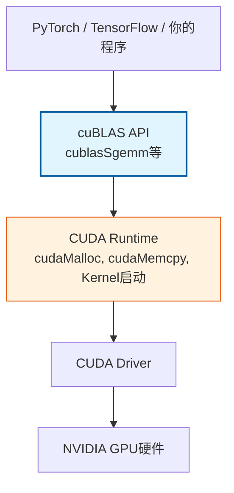
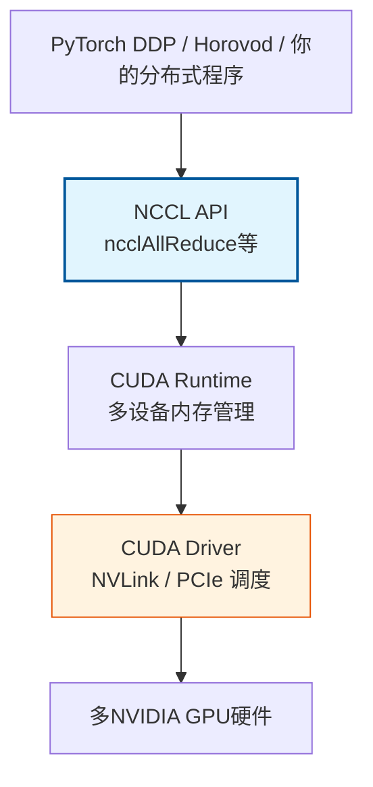
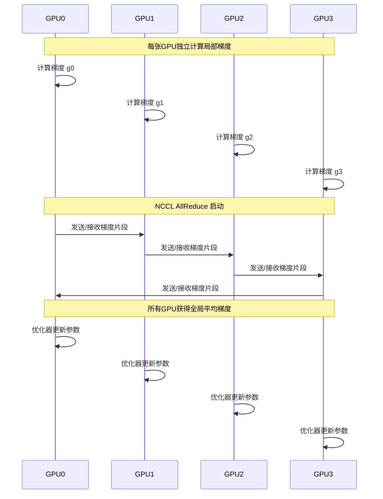

cuBLAS与NCCL是NVIDIA GPU计算生态中两个定位截然不同但同样关键的库。cuBLAS解决的是**单卡内部**的线性代数计算效率问题，将CPU上成熟的BLAS标准移植到GPU并实现极致并行优化；NCCL解决的则是**多卡之间**的数据协作问题，为分布式训练提供高性能的集体通信原语。理解这两个库的分工边界与协作方式，是掌握GPU高性能计算和分布式深度学习基础设施的关键一步。

Sources: [GPU计算生态完全指南.md](GPU计算生态完全指南.md#L738-L859)

## cuBLAS：GPU上的线性代数引擎

### 为什么需要cuBLAS

在GPU上执行矩阵乘法、向量点积等线性代数操作，开发者如果手写CUDA Kernel，需要同时处理线程分块策略、共享内存排布、寄存器分配以及浮点运算流水线调度等多个复杂维度。即便编写出功能正确的Kernel，其性能通常也远不及NVIDIA工程师针对特定架构深度调优的实现。cuBLAS（CUDA Basic Linear Algebra Subprograms）的核心价值在于，它将CPU上已经标准化的BLAS接口迁移到GPU，并针对每一代NVIDIA架构的CUDA Core与Tensor Core进行了底层优化，使开发者能够以一行API调用获得接近硬件极限的矩阵运算性能。

Sources: [GPU计算生态完全指南.md](GPU计算生态完全指南.md#L738-L746)

### BLAS三级体系与cuBLAS覆盖范围

cuBLAS完整实现了传统BLAS规范的三级层次，每一级对应不同的计算密度与内存访问模式：

| BLAS级别 | 运算类型 | 典型函数 | 计算特征 |
|---------|---------|---------|---------|
| **Level 1** | 向量-向量运算 | `cublasSdot`（点积）、`cublasSaxpy`（向量加减）、`cublasSnrm2`（范数） | 内存密集，计算密度低 |
| **Level 2** | 矩阵-向量运算 | `cublasSgemv`（矩阵乘向量） | 中等计算密度，受内存带宽限制 |
| **Level 3** | 矩阵-矩阵运算 | `cublasSgemm`（通用矩阵乘法） | 计算密集，可充分发挥GPU算力 |

在实际生产环境中，**Level 3的GEMM（General Matrix Multiply）是调用频率最高的操作**。深度学习中的全连接层、卷积的隐式GEMM实现、注意力机制中的矩阵乘法，最终都会归约到`cublasSgemm`或其半精度/双精度变体上。因此，理解GEMM的调用方式与参数含义，是掌握cuBLAS的核心。

Sources: [GPU计算生态完全指南.md](GPU计算生态完全指南.md#L740-L746)

### cuBLAS在GPU生态中的位置

cuBLAS处于加速库层，直接构建在CUDA Runtime之上，同时被PyTorch、TensorFlow等框架的底层张量运算所依赖。与cuDNN不同，cuBLAS是CUDA Toolkit的组成部分，随Toolkit一同安装，不需要单独下载。



这一层级结构决定了cuBLAS的三个关键属性：第一，cuBLAS**是**CUDA Toolkit的组成部分，安装Toolkit后即可使用；第二，cuBLAS的运行**依赖**CUDA Driver与CUDA Runtime；第三，cuBLAS的版本与CUDA Toolkit版本严格绑定，不存在跨版本手动匹配的问题。

Sources: [GPU计算生态完全指南.md](GPU计算生态完全指南.md#L552-L575)

### 编程模型：句柄与列优先存储

cuBLAS采用**句柄（Handle）**机制管理库内部状态。在调用任何计算函数之前，开发者必须先通过`cublasCreate`创建一个`cublasHandle_t`实例，该句柄会维护流（Stream）上下文、错误状态与内部工作空间。所有后续API调用都需要传递该句柄，计算完成后通过`cublasDestroy`释放资源。

与C/C++中常见的行优先（Row-Major）数组排布不同，**cuBLAS遵循Fortran传统的列优先（Column-Major）存储**。这意味着在内存中，矩阵的同一列元素连续存放，而非同一行。对于习惯行优先思维的C/C++开发者，这一差异直接影响矩阵乘法中的领先维度（Leading Dimension）参数设置。如果传入错误的`lda`、`ldb`、`ldc`，不会导致程序崩溃，但会产生数学上完全错误的结果，且这类错误极难调试。

Sources: [GPU计算生态完全指南.md](GPU计算生态完全指南.md#L764-L828)

### 完整代码示例：单精度矩阵乘法

以下示例展示了使用cuBLAS进行单精度矩阵乘法`C = alpha * A * B + beta * C`的完整流程。代码遵循**创建句柄 → 分配内存 → 传输数据 → 执行GEMM → 取回结果 → 清理资源**的标准模式。

```cpp
#include <cuda_runtime.h>
#include <cublas_v2.h>
#include <stdio.h>
#include <stdlib.h>

#define checkCuBLAS(expr) \
    { cublasStatus_t status = (expr); \
      if (status != CUBLAS_STATUS_SUCCESS) { \
          printf("cuBLAS error (%s:%d): %d\n", __FILE__, __LINE__, status); \
          exit(EXIT_FAILURE); \
      } }

void cublasGemmDemo() {
    // 矩阵维度：A[M][K], B[K][N], C[M][N]
    const int M = 1024, K = 512, N = 2048;

    // 主机内存分配与初始化
    float* hA = (float*)malloc(M * K * sizeof(float));
    float* hB = (float*)malloc(K * N * sizeof(float));
    float* hC = (float*)malloc(M * N * sizeof(float));
    for (int i = 0; i < M * K; i++) hA[i] = 1.0f;
    for (int i = 0; i < K * N; i++) hB[i] = 2.0f;

    // 设备内存分配
    float *dA, *dB, *dC;
    cudaMalloc((void**)&dA, M * K * sizeof(float));
    cudaMalloc((void**)&dB, K * N * sizeof(float));
    cudaMalloc((void**)&dC, M * N * sizeof(float));

    // 数据从主机拷贝到设备
    cudaMemcpy(dA, hA, M * K * sizeof(float), cudaMemcpyHostToDevice);
    cudaMemcpy(dB, hB, K * N * sizeof(float), cudaMemcpyHostToDevice);

    // 创建cuBLAS句柄
    cublasHandle_t handle;
    checkCuBLAS(cublasCreate(&handle));

    // 执行 GEMM: C = alpha * A * B + beta * C
    // 注意：cuBLAS使用列优先，参数顺序与常规数学记号一致
    const float alpha = 1.0f, beta = 0.0f;
    checkCuBLAS(cublasSgemm(
        handle,
        CUBLAS_OP_N, CUBLAS_OP_N,  // 不转置
        N, M, K,                   // 输出维度与收缩维度
        &alpha,
        dB, N,                     // B矩阵（列优先，leading dimension = N）
        dA, K,                     // A矩阵（列优先，leading dimension = K）
        &beta,
        dC, N                      // C矩阵（leading dimension = N）
    ));

    // 取回结果并验证
    cudaMemcpy(hC, dC, M * N * sizeof(float), cudaMemcpyDeviceToHost);
    printf("cuBLAS result: C[0] = %.2f (expected: %.2f)\n", hC[0], 1.0f * 2.0f * K);

    // 资源清理
    cudaFree(dA); cudaFree(dB); cudaFree(dC);
    free(hA); free(hB); free(hC);
    cublasDestroy(handle);
}

int main() {
    cublasGemmDemo();
    return 0;
}
```

编译与运行命令如下：

```bash
nvcc -o cublas_demo cublas_demo.cpp -lcublas -lcudart
./cublas_demo
```

该示例中`cublasSgemm`的参数顺序需要特别注意：前两个维度参数`N, M`对应输出矩阵`C`的列数与行数，第三个参数`K`为收缩维度。由于cuBLAS的列优先特性，`dB`的领先维度为`N`，`dA`的领先维度为`K`。如果开发者习惯行优先思维，可以将矩阵在逻辑上视为转置后传入，或使用`CUBLAS_OP_T`参数显式要求cuBLAS在内部处理转置。

Sources: [GPU计算生态完全指南.md](GPU计算生态完全指南.md#L750-L840)

## NCCL：多GPU集体通信库

### 为什么需要NCCL

当单张GPU的显存或算力无法满足模型训练需求时，开发者需要将工作负载分布到多张GPU甚至多台机器上。此时，一个核心问题浮现：如何在高带宽、低延迟的前提下，让多张GPU协同完成梯度同步、参数广播与数据聚合？普通的`cudaMemcpyPeer`虽然可以实现点对点显存拷贝，但缺乏针对集体通信模式（Collective Communication）的优化，也无法自动利用GPUDirect、NVLink等硬件互联技术。NCCL（NVIDIA Collective Communications Library）正是为解决这一问题而设计，它针对NVIDIA GPU的拓扑结构（PCIe、NVLink、InfiniBand）进行了深度优化，提供了标准化的集体通信原语。

Sources: [GPU计算生态完全指南.md](GPU计算生态完全指南.md#L843-L850)

### 核心通信原语

NCCL实现了MPI标准中定义的主流集体通信操作，深度学习开发者最常用的是以下四种：

| 通信原语 | 数学语义 | 典型应用场景 |
|---------|---------|------------|
| **Broadcast** | 将根节点数据复制到所有节点 | 初始参数分发、学习率广播 |
| **Reduce** | 将所有节点数据归约（求和/取最大等）到根节点 | 聚合统计量到主节点 |
| **AllReduce** | 将所有节点数据归约后分发到所有节点 | **分布式训练梯度同步（最常用）** |
| **AllGather** | 收集所有节点数据并拼接后分发到所有节点 | 模型并行中的激活值聚合 |

在这四种原语中，**AllReduce是分布式深度学习数据并行训练的基石**。在数据并行模式下，每张GPU处理一个批次（Batch）的子集并独立计算梯度，训练步结束时必须通过AllReduce将所有GPU的梯度求平均，才能保证各卡上的模型参数保持一致更新。NCCL的AllReduce实现针对环形算法（Ring Algorithm）和树形算法（Tree Algorithm）进行了优化，能够充分利用节点内NVLink和节点间InfiniBand的带宽。

Sources: [GPU计算生态完全指南.md](GPU计算生态完全指南.md#L845-L850)

### NCCL在GPU生态中的位置

NCCL处于加速库层，与cuBLAS、cuDNN并列，但它处理的不是计算问题而是**通信问题**。NCCL直接操作CUDA Runtime提供的设备内存指针，并依赖Driver层管理多卡之间的物理互联。



NCCL与CUDA的关系具有以下特点：第一，NCCL**不是**CUDA Toolkit的组成部分，必须从NVIDIA开发者网站单独下载安装；第二，NCCL**依赖**CUDA Runtime和Driver，没有Toolkit环境无法运行；第三，NCCL通常与MPI（跨节点进程管理）或Gloo（Facebook开发的分布式后端）结合使用，共同构成完整的分布式训练通信栈。

Sources: [GPU计算生态完全指南.md](GPU计算生态完全指南.md#L856-L859)

### 典型应用场景：分布式训练中的AllReduce

在PyTorch的DistributedDataParallel（DDP）模块中，NCCL的AllReduce操作被封装在反向传播之后、优化器更新之前。其执行流程可以用以下Mermaid序列图表示：



NCCL的AllReduce内部采用分块（Chunking）与流水线（Pipelining）技术，将梯度张量切分成多个小块，在环形拓扑中同时进行发送、接收与归约操作，从而将通信延迟掩盖在计算之后。对于没有NVLink的PCIe系统，NCCL也会自动选择最优的传输路径。

Sources: [GPU计算生态完全指南.md](GPU计算生态完全指南.md#L852-L854)

### NCCL与MPI/Gloo的协作关系

NCCL本身只负责**设备间的集体通信**，它不管理进程启动、网络发现或错误恢复。在跨节点分布式训练中，NCCL通常与更高层的分布式后端协作：

| 协作后端 | 职责分工 | 典型使用场景 |
|---------|---------|------------|
| **MPI** | 进程管理、跨节点网络发现、主机间数据交换 | 传统HPC集群、超算中心 |
| **Gloo** | 进程组管理、TCP/InfiniBand网络抽象、容错 | PyTorch默认CPU后端，也可用于GPU |
| **PyTorch NCCL Backend** | 将PyTorch张量操作映射到NCCL原语 | 单机多卡、多机多卡GPU训练 |

在实际配置中，PyTorch的`init_process_group(backend='nccl')`会在内部调用NCCL库，而进程之间的初始握手（IP地址交换、端口协商）则由Gloo或MPI完成。这种分层设计让NCCL可以专注于自己最擅长的领域：在已知拓扑的多GPU之间实现最高效率的数据传输。

Sources: [GPU计算生态完全指南.md](GPU计算生态完全指南.md#L859)

## 依赖关系与安装策略

理解cuBLAS与NCCL的安装边界，对于环境配置至关重要。两者在CUDA生态中的依赖层级与安装方式存在明显差异：

| 属性 | cuBLAS | NCCL |
|------|--------|------|
| **所属包** | CUDA Toolkit | 独立下载包 |
| **依赖组件** | CUDA Runtime、CUDA Driver | CUDA Runtime、CUDA Driver |
| **安装方式** | 随Toolkit自动安装 | 从NVIDIA官网下载后解压到CUDA目录 |
| **版本约束** | 与Toolkit版本绑定 | 需匹配CUDA主版本（如CUDA 11.x或12.x） |
| **头文件位置** | `/usr/local/cuda/include/cublas_v2.h` | `/usr/local/cuda/include/nccl.h` |
| **库文件位置** | `/usr/local/cuda/lib64/libcublas.so` | `/usr/local/cuda/lib64/libnccl.so` |
| **编译链接参数** | `-lcublas` | `-lnccl` |

cuBLAS作为Toolkit内置组件，通常不需要开发者额外关注版本匹配问题。而NCCL作为独立组件，在安装时需要确认与已安装CUDA Toolkit的主版本兼容。在容器化部署（如Docker）中，NCCL经常与PyTorch、TensorFlow一同打包，开发者通过`pip`或`conda`安装的GPU版框架通常已经包含了兼容的NCCL动态库。

Sources: [GPU计算生态完全指南.md](GPU计算生态完全指南.md#L1557-L1722)

## 从CUDA到MUSA：cuBLAS与NCCL的对应关系

摩尔线程MUSA生态为cuBLAS和NCCL提供了功能兼容的国产替代实现，即muBLAS与MCCL。它们在API命名、参数语义与编程模型上与NVIDIA版本保持高度一致，主要差异体现在前缀替换与架构适配：

| 功能 | NVIDIA API | MUSA API |
|------|------------|----------|
| 创建句柄 | `cublasCreate` | `mublasCreate` |
| 矩阵乘法 | `cublasSgemm` | `mublasSgemm` |
| 销毁句柄 | `cublasDestroy` | `mublasDestroy` |
| 多卡归约 | `ncclAllReduce` | `mcclAllReduce` |
| 数据广播 | `ncclBroadcast` | `mcclBroadcast` |
| 通信初始化 | `ncclCommInitRank` | `mcclCommInitRank` |

对于开发者而言，从cuBLAS迁移到muBLAS、从NCCL迁移到MCCL的核心工作是将代码中的`cublas`前缀替换为`mublas`、`nccl`前缀替换为`mccl`，并将编译器从`nvcc`切换为`mcc`。详细的代码级对比与迁移技巧，请参阅后续专门的代码实践章节。

Sources: [GPU计算生态完全指南.md](GPU计算生态完全指南.md#L1294-L1314)

## 下一步

cuBLAS与NCCL分别代表了GPU计算生态中**单卡计算优化**与**多卡通信优化**的两个核心方向。掌握它们之后，你已经完整覆盖了CUDA生态详解中从硬件、驱动、运行时、编译器到数学库与通信库的全链路知识。

建议你按以下顺序继续深入：

1. **[MUSA架构设计与CUDA兼容性](13-musajia-gou-she-ji-yu-cudajian-rong-xing)** — 从宏观层面理解MUSA如何兼容CUDA生态设计
2. **[muDNN、muBLAS与MCCL](15-mudnn-mublasyu-mccl)** — 深入了解MUSA生态中的对应库实现
3. **[算子的三层实现架构](19-suan-zi-de-san-ceng-shi-xian-jia-gou)** — 理解手写Kernel、调用库函数与使用框架这三个层级的取舍
4. **[矩阵乘法：cuBLAS与muBLAS](22-ju-zhen-cheng-fa-cublasyu-mublas)** — 通过完整代码对比，掌握从cuBLAS到muBLAS的迁移细节