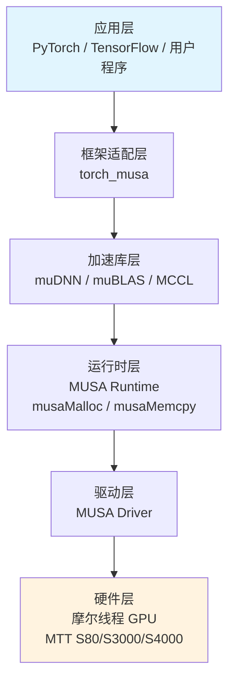

MUSA（Moore Threads Unified System Architecture）是摩尔线程为其国产GPU设计的统一系统架构，其顶层设计理念并非从零构建一套异构计算范式，而是**在保持CUDA编程模型语义一致性的前提下，通过系统性的前缀替换与分层抽象，实现国产GPU对既有CUDA生态的平滑兼容**。对于已掌握CUDA的开发者而言，理解MUSA的核心不在于学习新的并行计算理论，而在于认清其架构分层如何映射到熟悉的CUDA概念，以及这种映射背后的设计边界。

## MUSA架构概述

摩尔线程（Moore Threads）作为中国GPU设计公司，其MUSA生态的定位是国产GPU计算的重要代表。MUSA的设计目标明确指向**兼容CUDA生态**，使用户能够将基于CUDA构建的应用程序以最小改动迁移到摩尔线程GPU上运行。这种兼容性策略并非简单的API模拟，而是从硬件执行模型、运行时接口到编译器工具链的全栈对齐。如果将NVIDIA GPU生态比作封闭但成熟的iPhone体系，那么摩尔线程GPU更像是Android——在保持核心体验兼容的同时，拥有自研的硬件特色。这种定位决定了MUSA的架构设计必须在"遵循既有标准"与"发挥硬件特性"之间寻找平衡。

Sources: [GPU计算生态完全指南.md](GPU计算生态完全指南.md#L868-L884)

## 硬件架构对比

摩尔线程GPU的硬件架构在概念上与NVIDIA GPU高度同构，但在具体实现上采用了自有命名体系。理解这种命名映射是把握MUSA架构设计的第一步。

| 组件 | NVIDIA CUDA | 摩尔线程 MUSA | 功能说明 |
|------|-------------|---------------|----------|
| 基础计算单元 | CUDA Core | MUSA Core | 执行整数和浮点运算 |
| AI加速单元 | Tensor Core | AI Core | 专门加速矩阵运算 |
| 调度单元 | SM (Streaming Multiprocessor) | MUSA Compute Unit | 线程调度和管理 |
| 显存 | HBM2/GDDR6X | 自研显存方案 | 高带宽存储 |
| 互联技术 | NVLink | 自研互联技术 | 多卡通信 |

MUSA Core与CUDA Core在执行模型层面遵循相同的SIMT（单指令多线程）范式，即单个指令同时驱动多个线程执行相同的操作流。这意味着开发者不需要为MUSA重新理解线程发散、内存合并访问等核心概念。同样，MUSA Compute Unit承担了与NVIDIA SM等效的角色：作为线程调度的基本单元，内部包含多个MUSA Core、AI Core、共享内存和寄存器文件。对于开发者而言，这些硬件差异被驱动层和运行时层屏蔽，实际编程中直接接触的是MUSA Runtime API而非底层寄存器或流水线。

Sources: [GPU计算生态完全指南.md](GPU计算生态完全指南.md#L870-L893)

## MUSA软件栈架构

MUSA的软件栈采用了与CUDA几乎镜像的分层架构，这种分层设计是其实现兼容性的结构基础。从应用到硬件，各层之间形成严格的单向依赖关系：

**分层依赖原则**：上层只依赖相邻下层提供的接口，无需感知更底层的实现细节。应用层通过框架适配层调用加速库，加速库依赖MUSA Runtime进行设备内存管理和Kernel启动，Runtime通过MUSA Driver与硬件交互。这种分层与CUDA生态的层级关系完全一致，使得基于CUDA Toolkit开发的上层库在迁移到MUSA时，只需替换各层的对应实现，而无需重构依赖拓扑。

Sources: [GPU计算生态完全指南.md](GPU计算生态完全指南.md#L1470-L1536)

## CUDA兼容性核心策略

MUSA的兼容性设计可以概括为**"语义等价、前缀替换"**的系统性策略。这一策略贯穿软件栈的每一层：MUSA不重新发明编程模型，而是在保留CUDA编程模型全部语义的前提下，通过命名空间的统一替换实现接口层面的兼容。

**核心对齐点**：

| 对齐维度 | CUDA | MUSA | 兼容性说明 |
|----------|------|------|------------|
| API命名 | `cudaXxx` | `musaXxx` | 前缀系统性替换 |
| 数据类型 | `cudaDeviceProp` | `musaDeviceProp` | 结构体字段保持一致 |
| 编程模型 | 线程网格/块/线程 | 线程网格/块/线程 | 三维索引体系相同 |
| 内存层次 | Global/Shared/Register/Constant | Global/Shared/Register/Constant | 内存类型与作用域一致 |
| Kernel语法 | `__global__` + `<<<...>>>` | `__global__` + `<<<...>>>` | 启动语法完全相同 |
| 错误码体系 | `cudaSuccess` / `cudaError_t` | `MUSA_SUCCESS` / `musaError_t` | 状态枚举逻辑对等 |

这种设计的直观结果是：一份CUDA源代码迁移到MUSA时，绝大多数改动集中在文本替换层面——将`cuda`替换为`musa`，将`nvcc`替换为`mcc`，将头文件从`cuda_runtime.h`替换为`musa_runtime.h`。正如美式英语与英式英语的关系，语法和结构完全一致，差异仅体现在个别词汇上。

Sources: [GPU计算生态完全指南.md](GPU计算生态完全指南.md#L899-L917)

## API命名与数据类型映射规则

MUSA的API映射遵循高度规律化的命名约定，开发者可以依据以下规则进行系统性推导，而无需记忆每个函数的对应关系：

**函数级映射**：
- CUDA Runtime API：`cudaMalloc` → `musaMalloc`，`cudaMemcpy` → `musaMemcpy`，`cudaFree` → `musaFree`
- CUDA Driver API：`cuInit` → `muInit`，`cuDeviceGetCount` → `muDeviceGetCount`，`cuCtxCreate` → `muCtxCreate`
- 库级API：`cublasCreate` → `mublasCreate`，`cudnnConvolutionForward` → `mudnnConvolutionForward`

**数据类型与常量映射**：
- 设备属性结构：`cudaDeviceProp` → `musaDeviceProp`
- 错误类型：`cudaError_t` → `musaError_t`，`CUresult` → `MUresult`
- 成功状态：`cudaSuccess` → `MUSA_SUCCESS`
- 内存拷贝方向：`cudaMemcpyHostToDevice` → `musaMemcpyHostToDevice`

| 功能类别 | CUDA 示例 | MUSA 示例 |
|----------|-----------|-----------|
| 初始化 | `cudaInit` / `cuInit` | `musaInit` / `muInit` |
| 设备查询 | `cudaGetDeviceCount` | `musaGetDeviceCount` |
| 内存分配 | `cudaMalloc` | `musaMalloc` |
| 内存拷贝 | `cudaMemcpy` | `musaMemcpy` |
| 错误字符串 | `cudaGetErrorString` | `musaGetErrorString` |
| 设备属性 | `cudaDeviceProp` | `musaDeviceProp` |

这种规则化映射降低了认知负担：掌握CUDA的开发者不需要重新学习API的行为语义，只需要建立新的前缀映射习惯。

Sources: [GPU计算生态完全指南.md](GPU计算生态完全指南.md#L907-L913)

## 编程模型兼容性

MUSA对CUDA编程模型的兼容不仅停留在API层面，更深入到底层的执行模型与内存模型。

**SIMT执行模型**：MUSA Core支持单指令多线程执行，Kernel中的线程按照Warp（或等价调度组）为单位执行。这意味着在MUSA上编写Kernel时，线程发散（Branch Divergence）、Warp级同步、协作组（Cooperative Groups）等概念的行为预期与CUDA保持一致。

**线程网格体系**：MUSA完整保留了CUDA的三级线程组织——Grid（线程网格）、Block（线程块）、Thread（线程）。Kernel启动语法`<<<gridDim, blockDim>>>`在MUSA中完全通用，线程索引查询同样使用`blockIdx`、`threadIdx`、`blockDim`、`gridDim`等内置变量。

**内存层次对齐**：MUSA的内存类型体系与CUDA一一对应，包括全局内存（Global Memory）、共享内存（Shared Memory）、寄存器（Register）、常量内存（Constant Memory）和纹理内存（Texture Memory）。各类内存的访问速度特征、生命周期和作用域边界与CUDA保持语义一致：

| 内存类型 | 位置 | 访问速度 | 生命周期 | 典型用途 |
|---------|------|---------|---------|---------|
| 全局内存 | GPU显存 | 慢 | 程序运行期间 | 存储大量数据 |
| 共享内存 | Compute Unit内部 | 很快 | Block执行期间 | 线程块内数据交换 |
| 寄存器 | Compute Unit内部 | 最快 | 线程执行期间 | 存储临时变量 |
| 常量内存 | GPU显存（只读缓存） | 快（缓存命中时） | 程序运行期间 | 存储常量参数 |

这种内存模型的对齐确保了基于共享内存优化的CUDA Kernel（如矩阵乘法的Tiling实现）可以直接迁移到MUSA而无需重构内存访问模式。

Sources: [GPU计算生态完全指南.md](GPU计算生态完全指南.md#L890-L903)

## 编译器架构对比

MUSA工具链中的`mcc`编译器在架构定位上与NVIDIA的`nvcc`完全对等，两者都承担将CUDA/CUDA兼容代码分离为设备代码和主机代码的职责。

| 编译场景 | CUDA (nvcc) | MUSA (mcc) |
|----------|-------------|------------|
| 基础编译 | `nvcc -o 程序 程序.cu` | `mcc -o 程序 程序.cpp` |
| 指定架构 | `nvcc -arch=sm_70` | `mcc -arch=mp_20` |
| 链接外部库 | `nvcc -lcublas` | `mcc -lmublas` |
| 生成PTX | `nvcc -ptx` | `mcc` 提供对应中间表示 |

`mcc`的工作流程与`nvcc`保持一致：预处理阶段处理宏定义和头文件包含，编译阶段将代码分离为主机代码（交由系统C++编译器）和设备代码（交由MUSA设备编译器），最后通过链接阶段生成包含主机可执行指令与设备二进制/中间代码的统一可执行文件。这种编译流程的对齐意味着现有的CMake构建脚本、Makefile逻辑和CI/CD流水线可以通过最小改动适配MUSA编译器。

Sources: [GPU计算生态完全指南.md](GPU计算生态完全指南.md#L1024-L1038)

## 兼容性边界与限制

尽管MUSA在架构设计上追求与CUDA的全栈对齐，但开发者需要明确认识其兼容性边界，以避免在迁移过程中产生不切实际的预期。

**硬件特性差异**：摩尔线程GPU的AI Core与NVIDIA Tensor Core在具体指令集、支持的混合精度格式和峰值吞吐量上存在差异。这意味着依赖Tensor Core特定行为（如FP16/INT8矩阵乘法的精确舍入模式）的高性能Kernel可能需要针对MUSA硬件进行重新调优。

**库特性覆盖度**：muDNN、muBLAS、MCCL等库的设计目标是API兼容，但某些CUDA生态中的高级特性或最新版本引入的函数可能尚未在MUSA对应库中实现。迁移前应当查阅摩尔线程的兼容性矩阵文档。

**性能特征差异**：MUSA通过兼容层运行CUDA代码时，API调用的延迟特征和内存带宽表现受驱动优化、硬件架构和库实现的影响，与原生CUDA环境不会完全一致。性能敏感型应用在迁移后需要进行针对性的基准测试和优化。

**自动迁移的局限**：摩尔线程提供了代码迁移工具来自动完成前缀替换，但对于依赖NVIDIA特定扩展（如PTX内联汇编、CUDA特定Intrinsic函数）的代码，自动工具无法保证完全正确的转换，仍需人工审查。

Sources: [GPU计算生态完全指南.md](GPU计算生态完全指南.md#L1998-L2101)

## 总结

MUSA的架构设计体现了**"标准兼容、分层替换"**的工程智慧：在硬件层采用与CUDA同构的执行单元和调度单元，在软件层保持完全镜像的分层依赖关系，在接口层实施系统性的前缀替换策略。这种设计使得CUDA开发者迁移到MUSA的认知成本极低——不需要重新学习并行计算理论，只需要建立`cuda`→`musa`、`nvcc`→`mcc`的映射习惯。理解MUSA架构的关键，在于认识到它并非CUDA的简化版或模拟层，而是一套拥有独立硬件实现、但在编程接口上主动对齐CUDA标准的完整GPU计算生态。

如需进一步了解MUSA驱动与运行时的具体使用方法，可继续阅读 [MUSA驱动、运行时与mcc编译器](14-musaqu-dong-yun-xing-shi-yu-mccbian-yi-qi)；若希望查看CUDA与MUSA的完整代码对比实践，请参考 [基础向量加法：CUDA与MUSA对比](21-ji-chu-xiang-liang-jia-fa-cudayu-musadui-bi)。