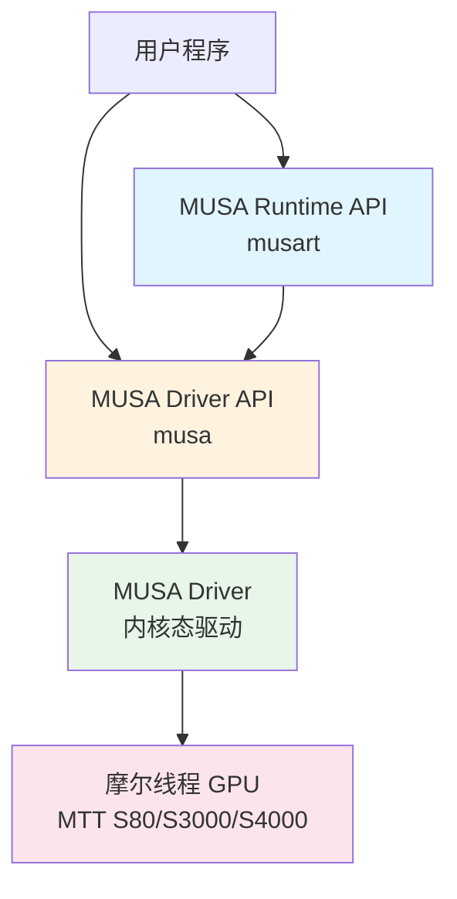
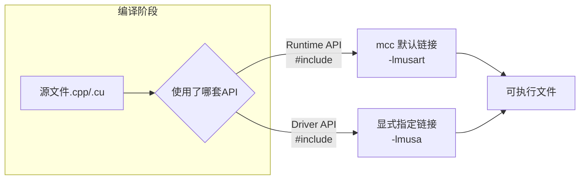
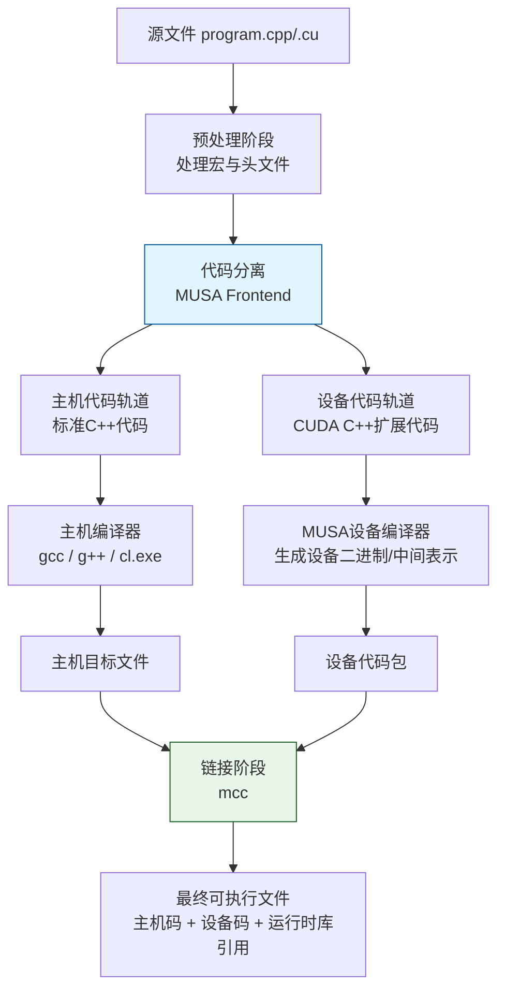
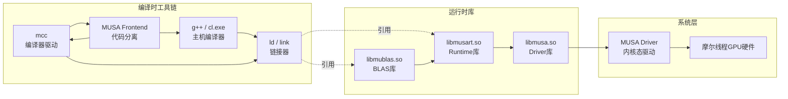

MUSA软件栈的核心由三大支柱构成：**MUSA Driver**（驱动层）、**MUSA Runtime**（运行时层）与**mcc编译器**（工具链核心）。这三者在架构定位上与NVIDIA的CUDA Driver、CUDA Runtime和nvcc完全对等，共同承担了将上层应用代码转译为摩尔线程GPU可执行指令的职责。对于已经理解[MUSA架构设计与CUDA兼容性](13-musajia-gou-she-ji-yu-cudajian-rong-xing)中"前缀替换"与"分层镜像"策略的开发者而言，本章将深入这三层的职责边界、交互方式与编译流程，建立从源码到硬件的完整认知链条。

Sources: [GPU计算生态完全指南.md](GPU计算生态完全指南.md#L895-L918)

## 生态定位：驱动与运行时在MUSA中的位置

在摩尔线程的软件栈中，MUSA Driver与MUSA Runtime处于硬件之上、应用之下的核心夹层，其分层关系与CUDA保持镜像一致。MUSA Driver是直接对接操作系统内核与GPU硬件的底层接口，负责将Runtime层发来的高层指令转译为硬件可理解的控制信号；MUSA Runtime则建立在Driver之上，为开发者提供便捷的设备管理、内存分配与Kernel启动接口。



需要明确的是，MUSA Runtime API并非Driver API的替代品，而是后者的一层封装。当你调用`musaMalloc`时，Runtime内部最终会通过Driver API与硬件交互，但Runtime替你屏蔽了上下文创建、模块加载与错误传播等繁琐细节。这种"上层封装下层、下层支撑上层"的依赖原则，是MUSA实现与CUDA生态兼容的结构基础。

Sources: [GPU计算生态完全指南.md](GPU计算生态完全指南.md#L895-L918) · [GPU计算生态完全指南.md](GPU计算生态完全指南.md#L2109-L2119)

## 设计哲学：显式控制与隐式便捷

MUSA同时提供Driver API与Runtime API，本质上是在**开发效率**与**控制精度**之间做出的架构性权衡。这一设计哲学直接继承自CUDA的分层思想：Driver API像手动挡汽车，Runtime API像自动挡汽车——两者都能抵达目的地，但驾驶体验和适用路况截然不同。

| 维度 | MUSA Driver API | MUSA Runtime API |
|------|-----------------|------------------|
| 抽象层级 | 底层，直接对接驱动内核 | 高层，封装常见模式 |
| 上下文管理 | 显式（手动创建/销毁/切换） | 隐式（自动绑定当前线程） |
| 代码冗余度 | 高（需手动处理初始化链条） | 低（一行代码启动设备） |
| 错误粒度 | 精细（可定位到驱动级返回码`MUresult`） | 聚合（统一返回`musaError_t`） |
| 头文件 | `<musa.h>` | `<musa_runtime.h>` |
| 链接库 | `-lmusa`（需显式指定） | `-lmusart`（mcc默认链接） |
| 典型使用者 | 深度学习框架底层、虚拟化方案、编译器中间层 | 普通HPC应用、算法原型、教学示例 |

这种分层设计的价值在于：让大多数开发者用高层接口完成日常工作，同时为需要精细控制的深度用户保留底层通道。如果你只是编写向量加法或进行算法验证，Runtime API是首选；但如果你正在开发需要在运行时动态加载设备代码的框架底层，Driver API提供了不可或缺的控制力。

Sources: [GPU计算生态完全指南.md](GPU计算生态完全指南.md#L895-L918)

## MUSA Driver API：显式上下文管理

**上下文（Context）**是MUSA编程模型中连接CPU线程与GPU状态的关键抽象，它封装了GPU的当前内存地址空间、模块加载状态与缓存配置。与CUDA Driver API一致，MUSA Driver API要求开发者显式管理这一抽象：初始化、设备获取、上下文创建与销毁都必须以明确的函数调用来完成。

以下代码展示了使用MUSA Driver API进行设备初始化的完整流程：

```cpp
#include <musa.h>
#include <stdio.h>

void MUSA驱动API示例() {
    MUresult 结果;
    
    // 初始化 MUSA Driver
    结果 = muInit(0);
    if (结果 != MUSA_SUCCESS) {
        printf("Driver 初始化失败\n");
        return;
    }
    
    // 获取设备数量
    int 设备数量 = 0;
    muDeviceGetCount(&设备数量);
    printf("MUSA Driver API 检测到 %d 个设备\n", 设备数量);
    
    // 获取第一个设备
    MUdevice 设备;
    muDeviceGet(&设备, 0);
    
    // 获取设备名称
    char 设备名称[256];
    muDeviceGetName(设备名称, sizeof(设备名称), 设备);
    printf("设备名称: %s\n", 设备名称);
    
    // 创建上下文（Context）
    MUcontext 上下文;
    结果 = muCtxCreate(&上下文, 0, 设备);
    if (结果 != MUSA_SUCCESS) {
        printf("创建上下文失败\n");
        return;
    }
    
    printf("MUSA Driver API 上下文创建成功\n");
    
    // 清理：销毁上下文
    muCtxDestroy(上下文);
}

int main() {
    MUSA驱动API示例();
    return 0;
}
```

编译此程序需要显式链接MUSA Driver库：

```bash
mcc -o MUSA驱动示例 MUSA驱动示例.cpp -lmusa
```

**深层注意**：显式上下文管理虽然繁琐，却带来了多租户隔离的可能性。你可以在单个线程中创建多个上下文，并通过Driver API提供的上下文切换接口进行管理。这对于多进程共享GPU或虚拟化环境中的资源隔离至关重要。然而，大多数应用开发者无需直接面对这些复杂性——这正是Runtime API存在的意义。

Sources: [GPU计算生态完全指南.md](GPU计算生态完全指南.md#L919-L974)

## MUSA Runtime API：隐式上下文与核心能力

MUSA Runtime API将`muInit`和`muCtxCreate`隐藏在第一次MUSA调用时自动执行，从而为开发者提供极简的入门体验。当你调用`musaSetDevice(0)`时，Runtime会在后台创建并绑定一个Primary Context，其生命周期由Runtime自动管理。

以下代码展示了Runtime API的简洁风格：

```cpp
#include <musa_runtime.h>
#include <stdio.h>

void MUSA运行时API示例() {
    // Runtime API 会自动初始化 Driver
    int 设备数量 = 0;
    musaGetDeviceCount(&设备数量);
    printf("MUSA Runtime API 检测到 %d 个设备\n", 设备数量);
    
    // 设置当前设备（相当于 Driver API 的上下文管理）
    musaSetDevice(0);
    
    // 获取设备属性
    musaDeviceProp 属性;
    musaGetDeviceProperties(&属性, 0);
    printf("设备名称: %s\n", 属性.name);
    
    printf("MUSA Runtime API 使用成功\n");
}

int main() {
    MUSA运行时API示例();
    return 0;
}
```

编译命令更为简洁，因为mcc默认链接Runtime库：

```bash
mcc -o MUSA运行时示例 MUSA运行时示例.cpp
```

Runtime API的核心能力可以归纳为五大领域，这些领域与CUDA Runtime一一对应：

| 能力领域 | 核心函数族 | 典型用途 |
|---------|-----------|---------|
| 设备管理 | `musaGetDeviceCount`, `musaSetDevice`, `musaGetDeviceProperties` | 多GPU环境下的设备选择与属性查询 |
| 内存管理 | `musaMalloc`, `musaFree`, `musaMemcpy`, `musaMemset` | 显存分配与Host-Device数据传输 |
| 执行控制 | `kernel<<<grid, block>>>` 语法糖 | 启动Kernel并配置线程网格 |
| 流与事件 | `musaStreamCreate`, `musaEventCreate`, `musaStreamSynchronize` | 异步执行、流水线重叠、性能计时 |
| 错误处理 | `musaGetLastError`, `musaPeekAtLastError`, `musaGetErrorString` | 调试与生产环境中的错误定位 |

这里需要特别强调的是**内存管理**的语义。`musaMemcpy`的第四个参数`musaMemcpyKind`决定了传输方向（`musaMemcpyHostToDevice`、`musaMemcpyDeviceToHost`、`musaMemcpyDeviceToDevice`等），错误的方向参数不会触发编译错误，但会在运行时导致未定义行为——这是中级开发者最常踩的陷阱之一。

Sources: [GPU计算生态完全指南.md](GPU计算生态完全指南.md#L975-L1011)

## 编译链接：API类型决定工具链路径

Driver API与Runtime API不仅在使用方式上不同，在编译和链接阶段也有明确的区分。理解这一点可以避免常见的链接错误。



| API类型 | 头文件 | 链接库 | 编译命令示例 |
|--------|--------|--------|-------------|
| Runtime API | `<musa_runtime.h>` | `musart`（mcc默认链接） | `mcc -o app app.cpp` |
| Driver API | `<musa.h>` | `musa`（需显式指定） | `mcc -o app app.cpp -lmusa` |

**关键细节**：使用Driver API时必须显式传递`-lmusa`给链接器，因为Driver库不会被mcc默认引入。另外，Driver API的代码通常以`.cpp`结尾即可（纯Host代码调用驱动函数），而Runtime API的代码若包含`<<<...>>>`内核启动语法，通常需要`.cu`后缀以便mcc识别CUDA C++扩展。不过，由于mcc对CUDA语法的高度兼容，若代码中仅包含Runtime函数调用而不含内核启动语法，使用`.cpp`后缀同样可以正常编译。

Sources: [GPU计算生态完全指南.md](GPU计算生态完全指南.md#L975-L1011)

## mcc编译器：MUSA工具链的核心

`mcc`是摩尔线程提供的CUDA兼容编译器，其架构定位与NVIDIA的`nvcc`完全对等。两者承担相同的职责：将同时包含主机代码与设备代码的源文件分离编译，最终链接为包含双端指令的可执行文件。正如[MUSA架构设计与CUDA兼容性](13-musajia-gou-she-ji-yu-cudajian-rong-xing)中所阐述的，MUSA在软件层保持与CUDA完全镜像的分层依赖关系，mcc正是这一镜像策略在工具链层的具体体现。

### 双轨编译模型

`mcc`的工作流程与`nvcc`保持一致：预处理阶段处理宏定义和头文件包含；编译阶段依据`__global__`、`__device__`等修饰符以及`<<<...>>>`内核启动语法，将代码分离为主机代码（交由系统C++编译器处理）和设备代码（交由MUSA设备编译器处理）；最终通过链接阶段生成包含主机可执行指令与设备二进制或中间表示的完整可执行文件。这种"双轨编译"机制确保了开发者可以继续使用熟悉的CUDA C++语法编写Kernel，而无需学习全新的设备端语言。



### 编译命令对比

| 编译场景 | CUDA (nvcc) | MUSA (mcc) |
|----------|-------------|------------|
| 基础编译 | `nvcc -o 程序 程序.cu` | `mcc -o 程序 程序.cu` |
| 指定架构 | `nvcc -arch=sm_70 ...` | `mcc -arch=mp_20 ...` |
| 链接外部库 | `nvcc ... -lcublas` | `mcc ... -lmublas` |

**架构参数差异**：nvcc使用`sm_XX`（Streaming Multiprocessor）标识NVIDIA GPU的计算能力，而mcc使用`mp_XX`（MUSA Processor）标识摩尔线程GPU的架构代际。例如`-arch=mp_20`对应摩尔线程第一代GPU架构（如MTT S80/S3000系列）。这一参数告诉mcc应当针对哪个架构级别生成设备代码，类似于nvcc中`-arch=sm_70`的含义。

Sources: [GPU计算生态完全指南.md](GPU计算生态完全指南.md#L1020-L1038) · [.zread/wiki/drafts/13-musajia-gou-she-ji-yu-cudajian-rong-xing.md](.zread/wiki/drafts/13-musajia-gou-she-ji-yu-cudajian-rong-xing.md#L113-L126)

## MUSA Toolkit的组成与依赖网络

MUSA Toolkit在物理组织上与CUDA Toolkit保持对等关系，包含编译器、运行时库、数学库以及调试和分析工具。理解Toolkit的目录结构与内部依赖网络，对排查"找不到库"、"符号未定义"等链接错误至关重要。

**核心组件清单**：

| 组件类别 | 具体组件 | 对应CUDA组件 | 说明 |
|---------|---------|-------------|------|
| 编译器 | `mcc` | `nvcc` | 编译器驱动，负责双轨编译 |
| Runtime库 | `libmusart.so` | `libcudart.so` | Runtime API的实现，mcc默认链接 |
| Driver库 | `libmusa.so` | `libcuda.so` | Driver API的实现，需显式链接 |
| 线性代数库 | `libmublas.so` | `libcublas.so` | 基础BLAS运算（矩阵乘法等） |
| 快速傅里叶变换 | `libmuFFT.so` | `libcufft.so` | FFT运算加速 |
| 随机数生成 | `libmuRAND.so` | `libcurand.so` | 设备端随机数生成 |

**需要单独下载的库**（不属于Toolkit核心包）：
- `muDNN`：深度神经网络算子库，对应cuDNN
- `MCCL`：多GPU通信库，对应NCCL



从依赖方向看，所有用户级MUSA程序最终都收敛到`libmusa.so`，而`libmusa.so`通过系统调用与内核态的MUSA驱动模块通信。这意味着即使程序只调用了Runtime API（如`musaMalloc`、`kernel<<<...>>>`），底层仍然经过Driver库。Toolkit中的`libmusart.so`向上为muDNN、muBLAS等数学库以及PyTorch等框架提供运行时接口，向下则通过`libmusa.so`与Driver通信，最终对接GPU硬件。

Sources: [GPU计算生态完全指南.md](GPU计算生态完全指南.md#L1038-L1059)

## 决策指南：何时用Driver API，何时用Runtime API

理论上的区分最终要落地到工程决策。以下场景化建议可以帮助你在MUSA项目早期做出正确选择：

| 场景特征 | 推荐API | 理由 |
|---------|--------|------|
| 快速算法验证、教学示例、个人项目 | **Runtime API** | 代码简洁，心智负担低，编译命令简单 |
| 生产级深度学习框架底层（如PyTorch MUSA后端） | **Driver API** | 需要动态加载设备代码、精细管理多设备上下文 |
| 多进程共享GPU、虚拟化/容器环境 | **Driver API** | 显式上下文管理允许多租户隔离 |
| 需要运行时JIT编译GPU代码 | **Driver API** | Driver API提供的动态模块加载接口直接支持运行时编译 |
| 跨平台HPC应用、需要与大量现有CUDA代码集成 | **Runtime API** | 前缀替换即可迁移，第三方库兼容性最好 |

**实用原则**：**默认选择Runtime API，直到你遇到一个Runtime做不到或做得不够好的具体需求，再考虑下沉到Driver API**。这种"按需下沉"的策略能最大程度兼顾开发效率与架构灵活性。两套API可以在同一个程序中混用——Runtime API负责常规路径，Driver API处理特殊需求。

Sources: [GPU计算生态完全指南.md](GPU计算生态完全指南.md#L895-L918)

## 总结与下一步

MUSA Driver API、Runtime API与mcc编译器构成了MUSA软件栈的中流砥柱。**Driver API是通往摩尔线程GPU硬件的钥匙，Runtime API是日常开发的桥梁，mcc则是将两者编织为一体的编织机**。中级开发者的成长路径，往往是从熟练驾驭Runtime API开始，逐步理解Driver API背后的上下文、模块与内存模型，最终通过mcc的编译参数精确控制设备代码的生成行为。

如需继续深入，建议按以下顺序阅读：
- **下一节**：[muDNN、muBLAS与MCCL](15-mudnn-mublasyu-mccl)——理解MUSA加速库如何建立在Runtime之上提供高性能数学运算与多卡通信能力
- **前置关联**：[MUSA架构设计与CUDA兼容性](13-musajia-gou-she-ji-yu-cudajian-rong-xing)——回顾MUSA与CUDA在架构层面的全栈对齐策略
- **代码实践**：[MUSA Kernel编写与向量加法](16-musa-kernelbian-xie-yu-xiang-liang-jia-fa)——动手编写第一份在摩尔线程GPU上运行的Kernel代码
- **对比阅读**：[CUDA驱动与运行时：Driver API与Runtime API](8-cudaqu-dong-yu-yun-xing-shi-driver-apiyu-runtime-api)与[CUDA Toolkit与nvcc编译器](10-cuda-toolkityu-nvccbian-yi-qi)——通过CUDA侧的对称知识加深对MUSA设计思想的理解
- **部署参考**：[版本匹配与安装策略](20-ban-ben-pi-pei-yu-an-zhuang-ce-lue)——理解MUSA Driver、Toolkit与加速库之间的版本约束