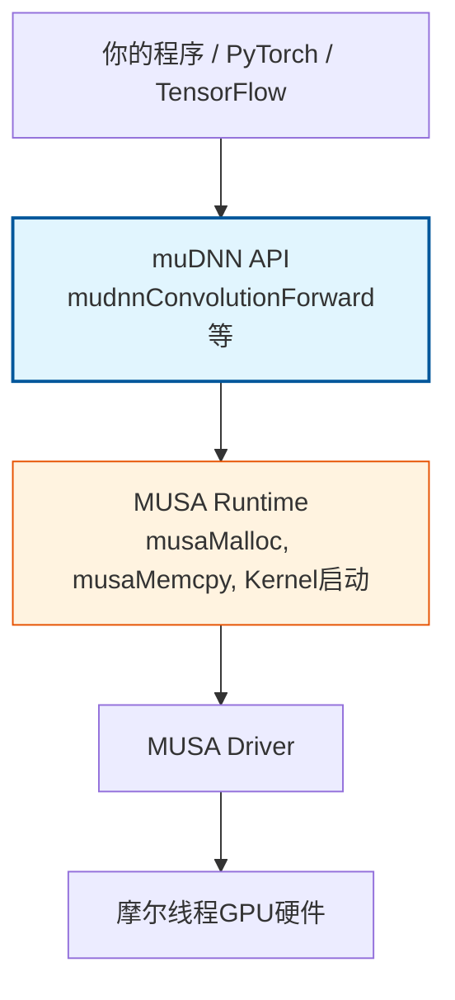
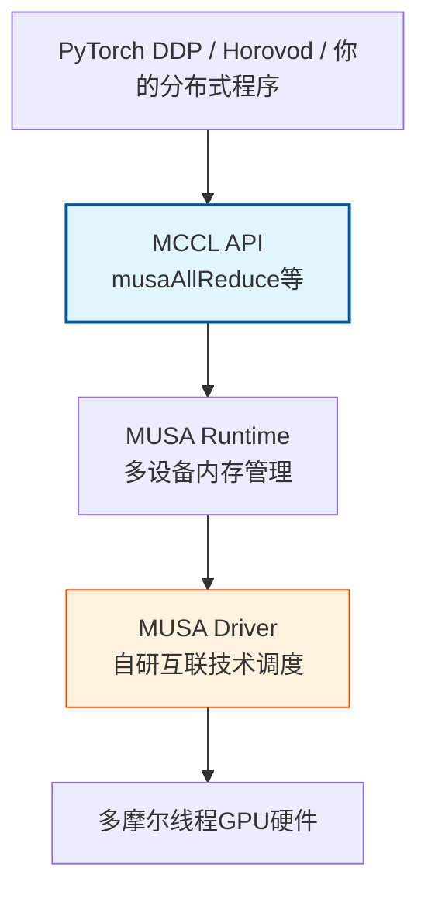

muDNN、muBLAS与MCCL构成了摩尔线程MUSA生态的**加速库层**，分别对应NVIDIA CUDA生态中的cuDNN、cuBLAS与NCCL。这三者的设计目标并非重新发明API，而是在保持与CUDA高度兼容的前提下，针对摩尔线程GPU硬件架构进行深度优化。理解这三个库的定位、依赖关系与迁移模式，是掌握MUSA生态并将其投入生产环境的关键一步。

Sources: [GPU计算生态完全指南.md](GPU计算生态完全指南.md#L1050-L1058)

## 三库定位：MUSA生态的"预制菜、面点与传菜系统"

延续[餐厅类比：理解GPU生态层次](4-can-ting-lei-bi-li-jie-gpusheng-tai-ceng-ci)中的比喻，muDNN、muBLAS与MCCL在MUSA餐厅中扮演着与cuDNN、cuBLAS、NCCL完全对应的角色，只是供应商从"国际品牌"换成了"国产替代"。muDNN是**预制菜供应商**，提供卷积、池化、归一化等深度学习算子的高度优化实现；muBLAS是**面点供应商**，负责矩阵乘法、向量运算等线性代数计算的GPU加速；MCCL则是**传菜系统**，解决多厨房（多GPU）之间的数据同步与协作通信问题。三者的共性在于：它们都直接构建在MUSA Runtime之上，向下依赖MUSA Driver与摩尔线程GPU硬件，向上被PyTorch、TensorFlow等深度学习框架所调用。

Sources: [GPU计算生态完全指南.md](GPU计算生态完全指南.md#L54-L56)

## muDNN：摩尔线程深度神经网络库

### 功能定位与cuDNN的对应关系

muDNN是摩尔线程提供的深度神经网络加速库，其功能边界与cuDNN完全一致：覆盖卷积前向与反向传播、池化、批量归一化、激活函数、循环神经网络及注意力机制等核心深度学习算子。与cuDNN类似，muDNN针对每种算子实现了多种底层算法（如隐式GEMM、Winograd、直接卷积等），并在运行时根据张量尺寸、数据类型与GPU架构自动或手动选择最优执行路径。这种设计使得开发者无需手写MUSA Kernel即可获得接近硬件极限的计算性能。

Sources: [GPU计算生态完全指南.md](GPU计算生态完全指南.md#L1080-L1089)

### 依赖关系与版本约束

muDNN在MUSA生态层级中处于加速库层，其依赖链条清晰且严格。与cuDNN一样，muDNN**不是**MUSA Toolkit的组成部分，需要单独下载安装，但其运行**严格依赖**MUSA Toolkit中的Runtime与Driver。这种"独立发布但依赖Runtime"的特性意味着：安装muDNN之前必须先完成MUSA Toolkit的部署，且muDNN的版本必须与MUSA Toolkit的版本匹配，否则会出现编译错误、运行时符号找不到或性能降级等问题。



Sources: [GPU计算生态完全指南.md](GPU计算生态完全指南.md#L1090-L1114)

### API兼容模式：前缀替换策略

muDNN的API设计遵循与cuDNN高度兼容的策略，核心差异几乎仅限于命名前缀的替换。这种"前缀替换"的迁移模式是MUSA生态的重要设计哲学，它大幅降低了代码迁移的认知成本与工程风险。

| 功能 | cuDNN API | muDNN API |
|------|-----------|-----------|
| 创建句柄 | `cudnnCreate` | `mudnnCreate` |
| 创建张量描述符 | `cudnnCreateTensorDescriptor` | `mudnnCreateTensorDescriptor` |
| 设置4D张量描述符 | `cudnnSetTensor4dDescriptor` | `mudnnSetTensor4dDescriptor` |
| 创建卷积核描述符 | `cudnnCreateFilterDescriptor` | `mudnnCreateFilterDescriptor` |
| 设置2D卷积描述符 | `cudnnSetConvolution2dDescriptor` | `mudnnSetConvolution2dDescriptor` |
| 卷积前向传播 | `cudnnConvolutionForward` | `mudnnConvolutionForward` |
| 选择卷积算法 | `cudnnGetConvolutionForwardAlgorithm` | `mudnnGetConvolutionForwardAlgorithm` |
| 销毁句柄 | `cudnnDestroy` | `mudnnDestroy` |

除了函数名前缀从`cudnn`变为`mudnn`外，常量宏前缀也从`CUDNN_`变为`MUDNN_`，头文件从`cudnn.h`变为`mudnn.h`，链接库从`-lcudnn`变为`-lmudnn`。这种一一对应的映射关系意味着：在大多数情况下，代码迁移可以通过简单的文本替换完成。

Sources: [GPU计算生态完全指南.md](GPU计算生态完全指南.md#L1115-L1132)

### 完整代码示例：muDNN卷积前向传播

以下示例展示了一个标准的muDNN卷积前向传播流程，其结构与cuDNN版本几乎完全一致。代码遵循**创建句柄 → 定义描述符 → 选择算法 → 分配工作空间 → 分配数据内存 → 执行计算 → 清理资源**的九步模式。


```cpp
#include <musa_runtime.h>
#include <mudnn.h>
#include <stdio.h>
#include <stdlib.h>

#define checkMUDNN(expression) \
    { mudnnStatus_t status = (expression); \
      if (status != MUDNN_STATUS_SUCCESS) { \
          printf("muDNN error (%s:%d): %s\n", \
                 __FILE__, __LINE__, mudnnGetErrorString(status)); \
          exit(EXIT_FAILURE); \
      } }

void mudnnConvolutionExample() {
    // 1. 创建 muDNN 句柄
    mudnnHandle_t handle;
    checkMUDNN(mudnnCreate(&handle));

    // 2. 定义张量描述符：输入 [N=1, C=3, H=32, W=32]
    mudnnTensorDescriptor_t inputDesc;
    checkMUDNN(mudnnCreateTensorDescriptor(&inputDesc));
    checkMUDNN(mudnnSetTensor4dDescriptor(
        inputDesc, MUDNN_TENSOR_NCHW, MUDNN_DATA_FLOAT, 1, 3, 32, 32));

    // 输出 [N=1, C=64, H=32, W=32]
    mudnnTensorDescriptor_t outputDesc;
    checkMUDNN(mudnnCreateTensorDescriptor(&outputDesc));
    checkMUDNN(mudnnSetTensor4dDescriptor(
        outputDesc, MUDNN_TENSOR_NCHW, MUDNN_DATA_FLOAT, 1, 64, 32, 32));

    // 3. 定义卷积核描述符 [OUT=64, IN=3, KH=3, KW=3]
    mudnnFilterDescriptor_t filterDesc;
    checkMUDNN(mudnnCreateFilterDescriptor(&filterDesc));
    checkMUDNN(mudnnSetFilter4dDescriptor(
        filterDesc, MUDNN_DATA_FLOAT, MUDNN_TENSOR_NCHW, 64, 3, 3, 3));

    // 4. 定义卷积操作描述符
    mudnnConvolutionDescriptor_t convDesc;
    checkMUDNN(mudnnCreateConvolutionDescriptor(&convDesc));
    checkMUDNN(mudnnSetConvolution2dDescriptor(
        convDesc, 1, 1,    // padding
        1, 1,              // stride
        1, 1,              // dilation
        MUDNN_CROSS_CORRELATION,
        MUDNN_DATA_FLOAT));

    // 5. 选择卷积算法：优先最快
    mudnnConvolutionFwdAlgo_t algo;
    checkMUDNN(mudnnGetConvolutionForwardAlgorithm(
        handle, inputDesc, filterDesc, convDesc, outputDesc,
        MUDNN_CONVOLUTION_FWD_PREFER_FASTEST, 0, &algo));

    // 6. 查询并分配工作空间
    size_t workspaceSize;
    checkMUDNN(mudnnGetConvolutionForwardWorkspaceSize(
        handle, inputDesc, filterDesc, convDesc, outputDesc, algo, &workspaceSize));
    void* workspace = nullptr;
    if (workspaceSize > 0) musaMalloc(&workspace, workspaceSize);

    // 7. 分配输入/输出/权重设备内存
    float *dInput, *dOutput, *dFilter;
    musaMalloc((void**)&dInput,  1 * 3 * 32 * 32 * sizeof(float));
    musaMalloc((void**)&dOutput, 1 * 64 * 32 * 32 * sizeof(float));
    musaMalloc((void**)&dFilter, 64 * 3 * 3 * 3 * sizeof(float));

    // 8. 执行卷积前向传播
    float alpha = 1.0f, beta = 0.0f;
    checkMUDNN(mudnnConvolutionForward(
        handle, &alpha, inputDesc, dInput, filterDesc, dFilter,
        convDesc, algo, workspace, workspaceSize, &beta, outputDesc, dOutput));

    // 9. 清理资源
    musaFree(dInput); musaFree(dOutput); musaFree(dFilter); musaFree(workspace);
    mudnnDestroyTensorDescriptor(inputDesc);
    mudnnDestroyTensorDescriptor(outputDesc);
    mudnnDestroyFilterDescriptor(filterDesc);
    mudnnDestroyConvolutionDescriptor(convDesc);
    mudnnDestroy(handle);
}

int main() {
    mudnnConvolutionExample();
    return 0;
}
```

编译与运行命令如下：

```bash
mcc -o mudnn_demo mudnn_demo.cpp -lmudnn -lmusart
./mudnn_demo
```

该示例使用的 `MUDNN_TENSOR_NCHW` 格式与cuDNN的 `CUDNN_TENSOR_NCHW` 完全对应，表示批次-通道-高度-宽度的内存排布。muDNN的描述符-执行编程模型与cuDNN保持一致，这意味着熟悉cuDNN的开发者可以直接将知识迁移到muDNN上，几乎无需额外的学习成本。

Sources: [GPU计算生态完全指南.md](GPU计算生态完全指南.md#L1133-L1291)

## muBLAS：摩尔线程线性代数库

### 功能定位与BLAS三级体系

muBLAS提供了标准的BLAS（Basic Linear Algebra Subprograms）接口的GPU实现，其功能分层与cuBLAS完全对齐。BLAS规范的三级体系定义了从向量运算到矩阵运算的完整覆盖范围，而muBLAS针对每一级都提供了摩尔线程GPU的优化实现。

| BLAS级别 | 运算类型 | muBLAS典型函数 | 计算特征 |
|---------|---------|---------------|---------|
| **Level 1** | 向量-向量运算 | `mublasSdot`（点积）、`mublasSaxpy`（向量加减） | 内存密集，计算密度低 |
| **Level 2** | 矩阵-向量运算 | `mublasSgemv`（矩阵乘向量） | 中等计算密度，受内存带宽限制 |
| **Level 3** | 矩阵-矩阵运算 | `mublasSgemm`（通用矩阵乘法） | 计算密集，可充分发挥GPU算力 |

在实际生产环境中，Level 3的GEMM（General Matrix Multiply）是调用频率最高的操作。深度学习中的全连接层、卷积的隐式GEMM实现以及注意力机制中的矩阵乘法，最终都会归约到`mublasSgemm`或其半精度/双精度变体上。

Sources: [GPU计算生态完全指南.md](GPU计算生态完全指南.md#L1292-L1303)

### API兼容模式与关键差异

muBLAS的API同样遵循前缀替换策略，核心函数、数据类型与常量定义的映射关系高度规律化。

| 功能 | cuBLAS API | muBLAS API |
|------|------------|------------|
| 创建句柄 | `cublasCreate` | `mublasCreate` |
| 单精度矩阵乘法 | `cublasSgemm` | `mublasSgemm` |
| 双精度矩阵乘法 | `cublasDgemm` | `mublasDgemm` |
| 半精度矩阵乘法 | `cublasHgemm` | `mublasHgemm` |
| 转置选项（不转置） | `CUBLAS_OP_N` | `MUBLAS_OP_N` |
| 状态码（成功） | `CUBLAS_STATUS_SUCCESS` | `MUBLAS_STATUS_SUCCESS` |
| 销毁句柄 | `cublasDestroy` | `mublasDestroy` |

与muDNN相同，muBLAS也使用句柄机制管理内部状态，并遵循Fortran传统的**列优先（Column-Major）**存储格式。这一特性对从cuBLAS迁移而来的开发者是透明的，因为muBLAS完全继承了cuBLAS的内存布局约定。需要特别注意的是，muBLAS是MUSA Toolkit的组成部分，随Toolkit一同安装，不需要像muDNN那样单独下载。

Sources: [GPU计算生态完全指南.md](GPU计算生态完全指南.md#L1292-L1303)

### 完整代码示例：muBLAS单精度矩阵乘法

以下示例展示了使用muBLAS进行单精度矩阵乘法 `C = alpha * A * B + beta * C` 的完整流程。对比cuBLAS版本可以发现，除了前缀替换与运行时函数名变化外，代码结构、参数顺序与数学语义完全一致。

```cpp
#include <musa_runtime.h>
#include <mublas_v2.h>
#include <stdio.h>
#include <stdlib.h>

#define checkMUBLAS(expr) \
    { mublasStatus_t status = (expr); \
      if (status != MUBLAS_STATUS_SUCCESS) { \
          printf("muBLAS error (%s:%d): %d\n", __FILE__, __LINE__, status); \
          exit(EXIT_FAILURE); \
      } }

void mublasGemmDemo() {
    // 矩阵维度：A[M][K], B[K][N], C[M][N]
    const int M = 1024, K = 512, N = 2048;

    // 主机内存分配与初始化
    float* hA = (float*)malloc(M * K * sizeof(float));
    float* hB = (float*)malloc(K * N * sizeof(float));
    float* hC = (float*)malloc(M * N * sizeof(float));
    for (int i = 0; i < M * K; i++) hA[i] = 1.0f;
    for (int i = 0; i < K * N; i++) hB[i] = 2.0f;

    // 设备内存分配
    float *dA, *dB, *dC;
    musaMalloc((void**)&dA, M * K * sizeof(float));
    musaMalloc((void**)&dB, K * N * sizeof(float));
    musaMalloc((void**)&dC, M * N * sizeof(float));

    // 数据从主机拷贝到设备
    musaMemcpy(dA, hA, M * K * sizeof(float), musaMemcpyHostToDevice);
    musaMemcpy(dB, hB, K * N * sizeof(float), musaMemcpyHostToDevice);

    // 创建muBLAS句柄
    mublasHandle_t handle;
    checkMUBLAS(mublasCreate(&handle));

    // 执行 GEMM: C = alpha * A * B + beta * C
    // 注意：muBLAS使用列优先，参数顺序与cuBLAS完全一致
    const float alpha = 1.0f, beta = 0.0f;
    checkMUBLAS(mublasSgemm(
        handle,
        MUBLAS_OP_N, MUBLAS_OP_N,  // 不转置
        N, M, K,                   // 输出维度与收缩维度
        &alpha,
        dB, N,                     // B矩阵（列优先，leading dimension = N）
        dA, K,                     // A矩阵（列优先，leading dimension = K）
        &beta,
        dC, N                      // C矩阵（leading dimension = N）
    ));

    // 取回结果并验证
    musaMemcpy(hC, dC, M * N * sizeof(float), musaMemcpyDeviceToHost);
    printf("muBLAS result: C[0] = %.2f (expected: %.2f)\n", hC[0], 1.0f * 2.0f * K);

    // 资源清理
    musaFree(dA); musaFree(dB); musaFree(dC);
    free(hA); free(hB); free(hC);
    mublasDestroy(handle);
}

int main() {
    mublasGemmDemo();
    return 0;
}
```

编译与运行命令如下：

```bash
mcc -o mublas_demo mublas_demo.cpp -lmublas -lmusart
./mublas_demo
```

Sources: [GPU计算生态完全指南.md](GPU计算生态完全指南.md#L1858-L1967)

## MCCL：摩尔线程多GPU集体通信库

### 功能定位与通信原语

MCCL（Moore Threads Collective Communications Library）是摩尔线程提供的多GPU通信库，对应NVIDIA的NCCL。当单张GPU的显存或算力无法满足模型训练需求时，开发者需要将工作负载分布到多张GPU甚至多台机器上，此时MCCL负责解决多GPU之间的数据协作问题。MCCL实现了MPI标准中定义的主流集体通信操作，深度学习开发者最常用的是以下四种：

| 通信原语 | 数学语义 | 典型应用场景 |
|---------|---------|------------|
| **Broadcast** | 将根节点数据复制到所有节点 | 初始参数分发、学习率广播 |
| **Reduce** | 将所有节点数据归约（求和/取最大等）到根节点 | 聚合统计量到主节点 |
| **AllReduce** | 将所有节点数据归约后分发到所有节点 | **分布式训练梯度同步（最常用）** |
| **AllGather** | 收集所有节点数据并拼接后分发到所有节点 | 模型并行中的激活值聚合 |

在这四种原语中，**AllReduce是分布式深度学习数据并行训练的基石**。在数据并行模式下，每张GPU处理一个批次的子集并独立计算梯度，训练步结束时必须通过AllReduce将所有GPU的梯度求平均，才能保证各卡上的模型参数保持一致。

Sources: [GPU计算生态完全指南.md](GPU计算生态完全指南.md#L1304-L1316)

### 依赖关系与生态位置

MCCL在MUSA生态中处于加速库层，与muDNN、muBLAS并列，但它处理的不是计算问题而是**通信问题**。MCCL直接操作MUSA Runtime提供的设备内存指针，并依赖Driver层管理多卡之间的物理互联。



与NCCL类似，MCCL**不是**MUSA Toolkit的组成部分，需要单独下载安装。MCCL**依赖**MUSA Runtime和Driver，没有Toolkit环境无法运行。在实际部署中，MCCL通常与MPI（跨节点进程管理）或Gloo（Facebook开发的分布式通信后端）结合使用，实现跨节点的分布式训练。摩尔线程针对自研GPU互联技术对MCCL进行了优化，以在多卡场景下达到接近硬件极限的通信带宽利用率。

Sources: [GPU计算生态完全指南.md](GPU计算生态完全指南.md#L1304-L1317)

## CUDA到MUSA的迁移：统一映射表

muDNN、muBLAS与MCCL的API设计遵循统一的迁移规律。以下汇总表展示了从CUDA生态迁移到MUSA生态时需要替换的核心元素，这种规律化的映射是MUSA兼容策略的核心优势。

| 迁移项 | CUDA生态 | MUSA生态 |
|--------|---------|---------|
| 编译器 | `nvcc` | `mcc` |
| Runtime前缀 | `cuda` | `musa` |
| 头文件路径 | `/usr/local/cuda/include` | `/usr/local/musa/include` |
| 库文件路径 | `/usr/local/cuda/lib64` | `/usr/local/musa/lib` |
| 环境变量 | `CUDA_HOME` | `MUSA_HOME` |
| DNN库头文件 | `cudnn.h` | `mudnn.h` |
| DNN库链接 | `-lcudnn` | `-lmudnn` |
| DNN前缀 | `cudnn` / `CUDNN_` | `mudnn` / `MUDNN_` |
| BLAS库头文件 | `cublas_v2.h` | `mublas_v2.h` |
| BLAS库链接 | `-lcublas` | `-lmublas` |
| BLAS前缀 | `cublas` / `CUBLAS_` | `mublas` / `MUBLAS_` |
| 通信库前缀 | `nccl` / `NCCL_` | `mccl` / `MCCL_` |

### 版本匹配注意事项

muDNN与MCCL作为独立发布的库，其版本必须与MUSA Toolkit的版本匹配。错误的版本组合是MUSA环境配置中最常见的错误来源之一。与cuDNN类似，muDNN的版本更新可能滞后于MUSA Toolkit，开发者在迁移前应先查阅摩尔线程的兼容性文档，确认目标API在muDNN中是否已实现。

Sources: [GPU计算生态完全指南.md](GPU计算生态完全指南.md#L1981-L2004)

## 算子的三层实现与库的定位

在实际的深度学习开发中，绝大多数开发者并不会直接调用muDNN或muBLAS的API，而是通过PyTorch、TensorFlow等框架间接使用。理解这三个库在[算子的三层实现架构](19-suan-zi-de-san-ceng-shi-xian-jia-gou)中的位置，有助于明确何时需要深入底层。

| 层级 | 实现方式 | 是否使用muDNN/muBLAS | 适用场景 |
|------|---------|---------------------|---------|
| 第一层：手写Kernel | 自行编写 `__global__` 函数 | 否 | 学习GPU编程、自定义算子优化 |
| 第二层：调用库函数 | 直接调用 `mudnnConvolutionForward`、`mublasSgemm` 等 | 是 | 生产环境追求极致性能 |
| 第三层：框架自动选择 | 使用 `torch.nn.Conv2d` | 间接使用 | 快速原型开发、通用训练 |

框架在第二层充当了"智能调度器"的角色：当你调用 `torch.nn.Conv2d` 时，PyTorch的后端会根据输入尺寸、数据类型、GPU架构等因素，自动决定是否将计算分发给muDNN或muBLAS。这意味着，理解这些库的存在与能力边界，即使在框架层面开发也能帮助你更好地诊断性能问题与兼容性错误。

Sources: [GPU计算生态完全指南.md](GPU计算生态完全指南.md#L1662-L1711)

## 下一步学习路径

掌握muDNN、muBLAS与MCCL的概念与API模式后，建议按以下顺序深入实践：

1. **[矩阵乘法：cuBLAS与muBLAS](22-ju-zhen-cheng-fa-cublasyu-mublas)** —— 通过 side-by-side 代码对比，巩固muBLAS的迁移模式与列优先存储的理解。
2. **[卷积网络：cuDNN与muDNN](23-juan-ji-wang-luo-cudnnyu-mudnn)** —— 深入对比cuDNN与muDNN在描述符配置、算法选择与工作空间管理上的异同。
3. **[CUDA到MUSA迁移策略与工具](24-cudadao-musaqian-yi-ce-lue-yu-gong-ju)** —— 学习系统性的代码迁移方法论与自动化工具使用。
4. **[版本匹配与安装策略](20-ban-ben-pi-pei-yu-an-zhuang-ce-lue)** —— 理解Toolkit、独立库与驱动之间的版本约束，避免环境配置陷阱。