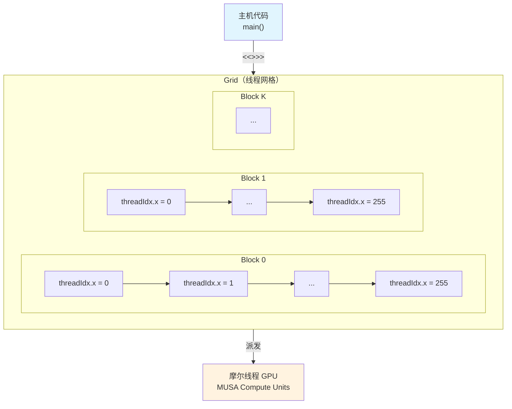
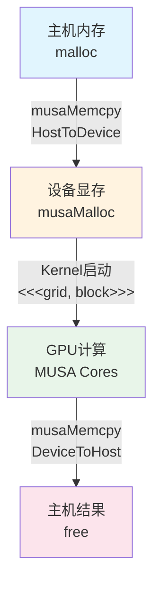

本节面向已具备C/C++基础并了解GPU计算概念的中级开发者，目标是掌握MUSA Kernel的完整编写流程。你将理解MUSA的线程组织模型，学会使用`__global__`修饰符定义设备函数，并通过一个可编译运行的向量加法程序，贯通从主机内存分配、设备数据传输、Kernel启动到结果回收的全链路操作。MUSA沿用了CUDA的SIMT编程模型与`<<<...>>>`启动语法，因此本节内容同时构成理解GPU异构计算范式的基础实践单元。

Sources: [GPU计算生态完全指南.md](GPU计算生态完全指南.md#L1318-L1332)

## MUSA Kernel编程模型

MUSA Kernel的编写建立在CUDA兼容的编程模型之上，核心抽象是**线程网格（Grid）**、**线程块（Block）**与**线程（Thread）**的三级层级结构。当Kernel被启动时，MUSA Runtime会按照开发者指定的网格维度，在摩尔线程GPU的多个MUSA Compute Unit上派发大量并行线程，每个线程执行同一段设备代码，但拥有独立的线程索引以区分数据位置。

Kernel函数使用`__global__`修饰符声明，表示该函数既被主机调用、又在设备上执行。与`__global__`配合的还有`__device__`修饰符，用于定义只能被设备代码调用的辅助函数。线程在设备内部通过内置变量定位自身：`blockIdx`标识当前线程所在的块索引，`threadIdx`标识块内的线程索引，`blockDim`描述每个块的线程总数，`gridDim`描述网格中的块总数。这些内置变量的命名与语义和CUDA完全一致，这是MUSA"兼容CUDA"设计哲学在编程模型层的直接体现。



Sources: [GPU计算生态完全指南.md](GPU计算生态完全指南.md#L1320-L1332)

## 向量加法的完整MUSA实现

向量加法是GPU并行计算最经典的入门示例：将两个长度为N的一维数组逐元素相加，结果写入第三个数组。由于每个元素的加法操作相互独立，天然适合用N个线程并行处理。以下代码展示了完整的MUSA实现，涵盖主机端内存管理、设备端内存管理、Kernel启动与同步的全流程。

```cpp
#include <musa_runtime.h>
#include <stdio.h>
#include <stdlib.h>

// MUSA Kernel：每个线程负责计算一个元素的加法
__global__ void vectorAdd(float* 结果, const float* 输入甲, const float* 输入乙, int 长度) {
    int 索引 = blockIdx.x * blockDim.x + threadIdx.x;
    if (索引 < 长度) {
        结果[索引] = 输入甲[索引] + 输入乙[索引];
    }
}

int main() {
    const int 长度 = 1024;
    const int 大小 = 长度 * sizeof(float);
    
    // ========== 1. 主机内存分配与初始化 ==========
    float* 主机甲 = (float*)malloc(大小);
    float* 主机乙 = (float*)malloc(大小);
    float* 主机结果 = (float*)malloc(大小);
    
    for (int i = 0; i < 长度; i++) {
        主机甲[i] = (float)i;
        主机乙[i] = (float)(长度 - i);
    }
    
    // ========== 2. 设备内存分配 ==========
    float* 设备甲; 
    float* 设备乙; 
    float* 设备结果;
    musaMalloc(&设备甲, 大小);
    musaMalloc(&设备乙, 大小);
    musaMalloc(&设备结果, 大小);
    
    // ========== 3. 主机到设备的数据传输 ==========
    musaMemcpy(设备甲, 主机甲, 大小, musaMemcpyHostToDevice);
    musaMemcpy(设备乙, 主机乙, 大小, musaMemcpyHostToDevice);
    
    // ========== 4. 启动Kernel ==========
    int 线程数 = 256;
    int 块数 = (长度 + 线程数 - 1) / 线程数;
    vectorAdd<<<块数, 线程数>>>(设备结果, 设备甲, 设备乙, 长度);
    
    // ========== 5. 设备到主机的结果回传 ==========
    musaMemcpy(主机结果, 设备结果, 大小, musaMemcpyDeviceToHost);
    
    // ========== 6. 结果验证 ==========
    printf("MUSA 结果验证: %f + %f = %f\n", 主机甲[0], 主机乙[0], 主机结果[0]);
    printf("MUSA 结果验证: %f + %f = %f\n", 主机甲[长度-1], 主机乙[长度-1], 主机结果[长度-1]);
    
    // ========== 7. 资源释放 ==========
    musaFree(设备甲); 
    musaFree(设备乙); 
    musaFree(设备结果);
    free(主机甲); 
    free(主机乙); 
    free(主机结果);
    
    return 0;
}
```

代码的执行流程遵循GPU异构计算的典型六步范式：**主机内存准备** → **设备内存分配** → **H2D数据拷贝** → **Kernel启动** → **D2H结果回传** → **资源释放**。其中`musaMalloc`与`musaFree`管理设备端的显存生命周期，`musaMemcpy`负责主机内存与设备显存之间的双向数据搬运，而`<<<块数, 线程数>>>`语法则是将控制流从CPU侧切换到GPU侧的触发器。

Sources: [GPU计算生态完全指南.md](GPU计算生态完全指南.md#L1391-L1462)

## 线程网格配置策略

Kernel启动参数`<<<gridDim, blockDim>>>`决定了并行化的粒度。合理的配置直接影响GPU的利用率与执行效率。在向量加法示例中，`块数 = (长度 + 线程数 - 1) / 线程数`这一表达式确保了即使数组长度不是线程块大小的整数倍，也能覆盖所有元素，同时通过`if (索引 < 长度)`边界检查避免越界访问。

| 配置参数 | 含义 | 向量加法中的取值 | 选择依据 |
|---------|------|----------------|---------|
| `blockDim.x` | 每个线程块的线程数 | 256 | 通常为Warp大小（32）的整数倍，平衡寄存器占用与调度效率 |
| `gridDim.x` | 线程网格中的块数 | `(1024 + 256 - 1) / 256 = 4` | 确保总线程数不少于元素数量 |
| 总线程数 | `gridDim.x × blockDim.x` | 1024 | 覆盖全部数据元素，允许少量冗余线程被边界检查过滤 |

摩尔线程GPU的线程调度同样以Warp（或等价的线程束）为基本单位，因此将`blockDim.x`设为32的倍数有助于合并内存访问并减少调度碎片。对于更大规模的数组（如百万级长度），`gridDim.x`会相应增大，MUSA Runtime会自动将各个线程块分发到空闲的MUSA Compute Unit上执行。

Sources: [GPU计算生态完全指南.md](GPU计算生态完全指南.md#L1372-L1375)

## 错误检查与防御性编程

生产环境的MUSA代码必须显式检查每个Runtime API的返回值。MUSA使用`musaError_t`枚举表示操作状态，成功时返回`musaSuccess`（对应CUDA的`cudaSuccess`）。以下是带错误检查的向量加法改进版本：

```cpp
#include <musa_runtime.h>
#include <stdio.h>
#include <stdlib.h>

#define 检查MUSA(表达式) \
    { musaError_t 状态 = (表达式); \
      if (状态 != musaSuccess) { \
          printf("MUSA 错误 (%s:%d): %s\n", \
                 __FILE__, __LINE__, musaGetErrorString(状态)); \
          exit(EXIT_FAILURE); \
      } }

__global__ void vectorAddSafe(float* 结果, const float* 输入甲, const float* 输入乙, int 长度) {
    int 索引 = blockIdx.x * blockDim.x + threadIdx.x;
    if (索引 < 长度) {
        结果[索引] = 输入甲[索引] + 输入乙[索引];
    }
}

int main() {
    const int 长度 = 1024;
    const int 大小 = 长度 * sizeof(float);
    
    float* 主机甲 = (float*)malloc(大小);
    float* 主机乙 = (float*)malloc(大小);
    float* 主机结果 = (float*)malloc(大小);
    
    for (int i = 0; i < 长度; i++) {
        主机甲[i] = (float)i;
        主机乙[i] = (float)(长度 - i);
    }
    
    float *设备甲 = nullptr, *设备乙 = nullptr, *设备结果 = nullptr;
    检查MUSA(musaMalloc(&设备甲, 大小));
    检查MUSA(musaMalloc(&设备乙, 大小));
    检查MUSA(musaMalloc(&设备结果, 大小));
    
    检查MUSA(musaMemcpy(设备甲, 主机甲, 大小, musaMemcpyHostToDevice));
    检查MUSA(musaMemcpy(设备乙, 主机乙, 大小, musaMemcpyHostToDevice));
    
    int 线程数 = 256;
    int 块数 = (长度 + 线程数 - 1) / 线程数;
    vectorAddSafe<<<块数, 线程数>>>(设备结果, 设备甲, 设备乙, 长度);
    
    // Kernel启动是异步的，需同步以捕获执行错误
    检查MUSA(musaDeviceSynchronize());
    
    检查MUSA(musaMemcpy(主机结果, 设备结果, 大小, musaMemcpyDeviceToHost));
    
    printf("结果验证: %f + %f = %f\n", 主机甲[0], 主机乙[0], 主机结果[0]);
    
    musaFree(设备甲); 
    musaFree(设备乙); 
    musaFree(设备结果);
    free(主机甲); 
    free(主机乙); 
    free(主机结果);
    
    return 0;
}
```

**关键注意事项**：
- `musaMalloc`和`musaMemcpy`的错误可以在调用后立即检查
- Kernel启动`<<<...>>>`本身不返回错误码，必须通过后续的`musaDeviceSynchronize()`或`musaGetLastError()`捕获异步执行错误
- `musaGetErrorString`将错误码转换为可读字符串，与`cudaGetErrorString`语义一致

Sources: [GPU计算生态完全指南.md](GPU计算生态完全指南.md#L1447-L1462)

## 编译与运行

使用`mcc`编译器编译MUSA程序的过程与`nvcc`几乎相同。假设上述代码保存为`vectorAdd.cu`，编译命令如下：

```bash
# 基础编译
mcc -o vectorAdd vectorAdd.cu

# 运行
./vectorAdd
```

`mcc`会自动处理设备代码的分离编译与链接，并默认链接MUSA Runtime库`musart`。若程序使用了MUSA Driver API，则需显式追加`-lmusa`链接选项。对于需要针对特定摩尔线程GPU架构优化的场景，可通过`-arch`参数指定架构码，例如`-arch=mp_20`（具体架构码需参考对应硬件版本的MUSA文档）。

| 编译场景 | 命令示例 |
|---------|---------|
| 基础编译 | `mcc -o 程序 程序.cu` |
| 指定GPU架构 | `mcc -arch=mp_20 -o 程序 程序.cu` |
| 链接外部库 | `mcc -o 程序 程序.cu -lmublas` |
| 启用调试信息 | `mcc -g -G -o 程序 程序.cu` |

Sources: [GPU计算生态完全指南.md](GPU计算生态完全指南.md#L1022-L1037)

## 内存管理与执行流程总结

完整的MUSA Kernel程序在逻辑上形成一条从主机到设备再返回主机的数据流水线。理解这一流水线的每个阶段，是后续学习多Kernel协作、流（Stream）并发与内存优化的高级主题的前提。



**各阶段职责**：
1. **主机内存**：准备输入数据，使用标准C库的`malloc`/`free`
2. **设备显存**：使用`musaMalloc`分配GPU全局内存，使用`musaFree`释放
3. **数据传输**：`musaMemcpy`完成主机与设备之间的双向搬运，方向参数需显式指定
4. **并行计算**：Kernel函数内通过`blockIdx`与`threadIdx`完成数据分片
5. **结果回收**：计算完成后将结果从显存拷贝回主机内存进行后续处理

Sources: [GPU计算生态完全指南.md](GPU计算生态完全指南.md#L1391-L1462)

## 下一步

完成本节的基础向量加法实践后，你已经掌握了MUSA Kernel编写的核心范式。若要深入理解MUSA与CUDA在代码层面的系统性映射关系，建议继续阅读[基础向量加法：CUDA与MUSA对比](21-ji-chu-xiang-liang-jia-fa-cudayu-musadui-bi)，该章节将通过逐行对比揭示两个生态在API命名、编译选项与运行时行为上的异同。如果你希望将手工编写的Kernel迁移为经过硬件优化的库调用，可前往[矩阵乘法：cuBLAS与muBLAS](22-ju-zhen-cheng-fa-cublasyu-mublas)探索MUSA数学库的使用方法。对于计划将现有CUDA代码批量迁移到MUSA平台的开发者，[CUDA到MUSA迁移策略与工具](24-cudadao-musaqian-yi-ce-lue-yu-gong-ju)提供了系统性的迁移路径与自动化工具指引。