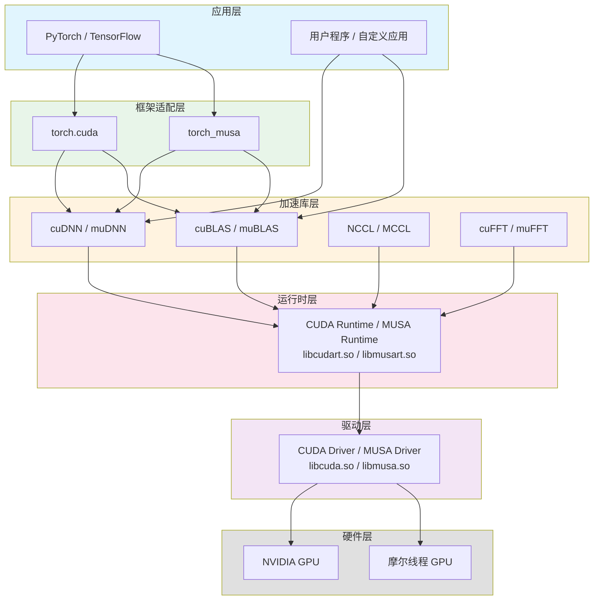
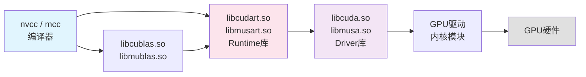
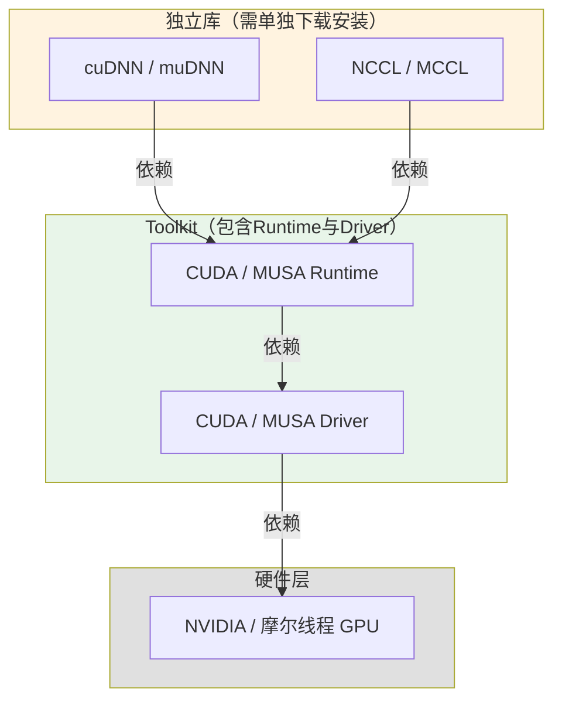

> 本文将CUDA与MUSA生态中分散的硬件、驱动、运行时、库、框架等组件整合为一张**系统的依赖关系图**，帮助你建立"谁依赖谁"的完整认知，避免安装和开发时的版本混乱与依赖陷阱。

## 为什么需要一张依赖关系图

GPU计算生态的复杂性不在于单个组件难以理解，而在于组件之间的**网状依赖关系**容易让人迷失。许多开发者在安装PyTorch时遭遇"CUDA版本不匹配"，在编译程序时遇到"找不到libcudart.so"，在部署模型时困惑"cuDNN是否需要单独安装"——这些问题的根源都是对层级依赖缺乏系统认知。当我们把生态看作一个**严格的层次结构**而非扁平的工具集合时，就能从根源上预判安装顺序、诊断错误来源、选择合适的开发层级。

Sources: [GPU计算生态完全指南.md](GPU计算生态完全指南.md#L42-L66)

## 核心模型：五层依赖架构

GPU生态遵循**自上而下逐层依赖**的设计原则。无论是NVIDIA的CUDA生态还是摩尔线程的MUSA生态，都呈现出高度同构的五层结构。上层组件调用下层接口，而下层对上层完全无感知——这种**单向依赖**是系统稳定性的基石。

**关键洞察**：上层不需要知道下层的实现细节，只需调用接口；这种封装让开发者可以在任意层级切入工作——既可以手写Kernel直接调用Runtime，也可以通过PyTorch一句代码自动贯穿全部层级。

Sources: [GPU计算生态完全指南.md](GPU计算生态完全指南.md#L1468-L1541)

## 逐层解析：从硅片到Python代码

### 硬件层与驱动层：一切的地基

**硬件层**是物理GPU芯片本身，包括NVIDIA的GeForce/RTX/A100系列和摩尔线程的MTT S80/S3000/S4000系列。所有计算最终都在硅片上完成，没有任何软件可以脱离硬件存在。**驱动层**是操作系统与硬件之间的翻译官，将高级API调用转换为硬件能理解的电信号。CUDA Driver和MUSA Driver分别对应各自硬件，两者互不兼容——NVIDIA驱动无法识别摩尔线程GPU，反之亦然。驱动通常由操作系统或厂商安装包统一部署，普通开发者很少直接与之打交道，但它是整个依赖链的绝对起点。

Sources: [GPU计算生态完全指南.md](GPU计算生态完全指南.md#L189-L199)
Sources: [GPU计算生态完全指南.md](GPU计算生态完全指南.md#L1511-L1516)

### 运行时层：开发者的主战场

**运行时层**是开发者最频繁接触的基础设施，提供设备管理、内存分配、数据传输、Kernel启动等核心能力。CUDA Runtime（`libcudart.so`）和MUSA Runtime（`libmusart.so`）向上层库暴露统一接口。所有加速库、框架后端都必须通过Runtime才能访问GPU资源，Runtime又必须依赖底层Driver来真正操作硬件。当你调用`cudaMalloc`或`musaMemcpy`时，你就是在运行时层工作。

Sources: [GPU计算生态完全指南.md](GPU计算生态完全指南.md#L312-L323)
Sources: [GPU计算生态完全指南.md](GPU计算生态完全指南.md#L1502-L1508)

### 加速库层：专家优化的算子集合

**加速库层**汇集了针对特定领域高度优化的数学与深度学习库，包括cuBLAS/muBLAS（线性代数）、cuDNN/muDNN（深度学习算子）、NCCL/MCCL（多卡通信）等。这些库的共同特点是：**它们都建立在Runtime之上，但自身的发布方式存在显著差异**。cuBLAS和muBLAS通常随Toolkit一同发行，而cuDNN、muDNN、NCCL、MCCL则需要单独下载安装。这一区别对部署和版本管理至关重要，后文将详细展开。

Sources: [GPU计算生态完全指南.md](GPU计算生态完全指南.md#L1492-L1498)
Sources: [GPU计算生态完全指南.md](GPU计算生态完全指南.md#L1621-L1643)

### 框架适配层与应用层

**框架适配层**是深度学习框架（如PyTorch、TensorFlow）中负责与GPU生态对接的后端模块，例如`torch.cuda`和`torch_musa`。它们将框架的高层次图表示转换为对底层加速库的调用。**应用层**则是开发者直接编写的业务代码或模型训练脚本，通常通过Python API与框架交互。框架适配层屏蔽了底层所有复杂性，让数据科学家无需了解CUDA或MUSA细节即可使用GPU加速。

Sources: [GPU计算生态完全指南.md](GPU计算生态完全指南.md#L1483-L1488)

## Toolkit内部的微观依赖链

如果把视角从宏观五层架构 zoom in 到Toolkit内部，会看到更精细的库文件依赖关系。CUDA Toolkit和MUSA Toolkit都是一个容器，内部包含编译器、运行时库、数学库和调试工具。

Toolkit中绝大多数库都链接到`libcudart.so`（或`libmusart.so`），而Runtime库又链接到`libcuda.so`（或`libmusa.so`），最终通过操作系统内核模块到达硬件。当你使用`nvcc`编译程序时，编译器会自动处理这些链接关系；但在手动链接或交叉编译场景中，理解这条链能帮助你快速定位"找不到共享库"的错误。

Sources: [GPU计算生态完全指南.md](GPU计算生态完全指南.md#L1544-L1593)

## 独立库的特殊地位

cuDNN、muDNN、NCCL、MCCL在依赖架构中占据一个特殊位置：**它们独立发布，却牢牢依赖Toolkit中的Runtime**。这种设计让NVIDIA和摩尔线程能够独立于Toolkit版本迭代这些高性能库，但也给开发者带来了版本匹配的负担。

以cuDNN为例，你的程序调用`cudnnConvolutionForward`时，cuDNN内部会调用`cudaMalloc`和`cudaMemcpy`来管理显存与数据搬运。这意味着**安装cuDNN之前必须先安装匹配版本的CUDA Toolkit**——cuDNN 8.6对应CUDA 11.x，cuDNN 8.9对应CUDA 12.x。版本不匹配会导致编译错误、运行时符号找不到或性能降级。muDNN与MUSA Toolkit之间遵循同样的匹配规则。

Sources: [GPU计算生态完全指南.md](GPU计算生态完全指南.md#L552-L576)
Sources: [GPU计算生态完全指南.md](GPU计算生态完全指南.md#L1090-L1113)
Sources: [GPU计算生态完全指南.md](GPU计算生态完全指南.md#L856-L859)

## 全量依赖关系总表

以下表格汇总了GPU生态中核心组件的依赖方向、被依赖方、必需性以及获取方式，可作为安装规划与故障排查的速查手册。

| 组件 | 依赖谁 | 被谁依赖 | 是否必需 | 安装方式 |
|------|--------|----------|---------|---------|
| NVIDIA / 摩尔线程 GPU | 无 | 驱动 | 是 | 物理设备 |
| CUDA / MUSA Driver | GPU硬件 | Runtime | 是 | 随操作系统或厂商驱动包 |
| CUDA / MUSA Runtime | Driver | 库/应用 | 是 | Toolkit包含 |
| cuBLAS / muBLAS | Runtime | 框架/应用 | 否 | Toolkit包含 |
| cuFFT / muFFT | Runtime | 信号处理应用 | 否 | Toolkit包含 |
| cuDNN / muDNN | Runtime | 框架 | 否 | 单独下载 |
| NCCL / MCCL | Runtime | 分布式框架 | 否 | 单独下载 |
| PyTorch / TensorFlow | cuDNN / cuBLAS | 用户代码 | 否 | pip / conda安装 |

**从上表可以提炼出三条黄金规则**：第一，硬件和驱动是绝对的必需项，没有它们上层一切无从谈起；第二，Runtime是连接上层世界与底层硬件的"唯一桥梁"，所有库最终都汇聚到它；第三，"单独下载"的组件（cuDNN、NCCL等）往往是最容易因版本不匹配而出错的环节，安装时需要格外核对与Toolkit的版本兼容性。

Sources: [GPU计算生态完全指南.md](GPU计算生态完全指南.md#L1712-L1723)

## 常见依赖陷阱

理解了层级依赖关系后，以下典型问题就能从架构层面得到解释：

| 现象 | 根因分析 | 解决思路 |
|------|---------|---------|
| `cudaMalloc`返回"unknown error" | Driver层未正确加载或版本过旧 | 检查`nvidia-smi`输出，重装驱动 |
| `cannot find -lcudnn` | cuDNN未安装或路径未配置 | 确认cuDNN已单独下载并设置`LD_LIBRARY_PATH` |
| PyTorch提示"CUDA not available" | Runtime与框架编译时版本不匹配 | 对齐PyTorch的CUDA版本与本地Toolkit版本 |
| NCCL报错"initialization failed" | 多卡环境中Runtime与NCCL版本不兼容 | 检查NCCL版本与CUDA Runtime版本的兼容性矩阵 |

这些问题的共同点在于：**错误信息往往出现在上层，但根源在下层**。掌握五层依赖架构后，你可以像剥洋葱一样逐层向下排查，而不是在上层盲目试错。

Sources: [GPU计算生态完全指南.md](GPU计算生态完全指南.md#L1528-L1541)

## 阅读延伸

掌握了层级依赖的全景图后，你可以深入以下专题，从不同维度加固对GPU系统架构的理解：

- 若想知道**算子在这五层架构中具体如何落地实现**，以及手写Kernel、调用库函数、使用框架API三种方式如何选择，请参阅[算子的三层实现架构](19-suan-zi-de-san-ceng-shi-xian-jia-gou)。
- 若对**Toolkit、SDK与独立库各自的边界和定位**仍有模糊，可继续阅读[Toolkit、SDK与独立库的定位](18-toolkit-sdkyu-du-li-ku-de-ding-wei)。
- 若准备实际部署环境，[版本匹配与安装策略](20-ban-ben-pi-pei-yu-an-zhuang-ce-lue)提供了系统化的安装顺序与兼容性检查方法。
- 若要回顾CUDA与MUSA两大生态的平行结构，[CUDA与MUSA：两大生态概览](6-cudayu-musa-liang-da-sheng-tai-gai-lan)是理想的回溯起点。