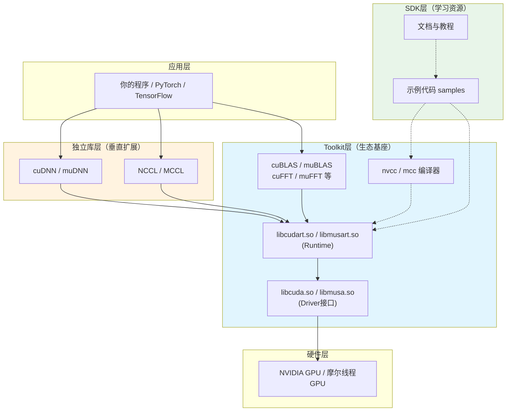

在GPU计算生态中，**Toolkit**、**SDK**与**独立库**是三个频繁出现却极易混淆的概念。许多开发者在初次接触CUDA或MUSA时，会误以为安装了CUDA Toolkit就自动获得了cuDNN的全部能力，或者将SDK与Toolkit视为同一个安装包的不同叫法。本章从架构视角厘清三者的边界、依赖关系与职责分工，帮助你在安装、开发与迁移时做出正确的组件选择。

Sources: [GPU计算生态完全指南.md](GPU计算生态完全指南.md#L422-L451)

## Toolkit：生态系统的基座

**Toolkit是GPU计算生态的唯一必需组件**，它提供了从源代码到GPU可执行程序的完整工具链。没有Toolkit，你无法编译任何CUDA或MUSA程序，也无法链接基础的运行时库。以CUDA Toolkit为例，其内部构成可分为四个核心模块：**编译器**（`nvcc`）、**运行时库**（`libcudart.so`与`libcuda.so`）、**基础数学库**（`cuBLAS`、`cuFFT`、`cuRAND`等）以及**调试与分析工具**（`cuda-gdb`、`nvprof`/`nsight`）。MUSA Toolkit在架构上与CUDA Toolkit一一对应，包含`mcc`编译器、`musart`运行时库和`muBLAS`等数学库，其设计目标是通过兼容的API前缀替换（`cu`→`mu`）实现平滑迁移。 Toolkit的核心特征在于"闭合性"——它内部的组件相互依赖形成完整的自洽体系：编译器生成的代码依赖运行时库，运行时库调用驱动接口，数学库则全部建立在运行时库之上。

Sources: [GPU计算生态完全指南.md](GPU计算生态完全指南.md#L422-L451) [GPU计算生态完全指南.md](GPU计算生态完全指南.md#L1020-L1059) [GPU计算生态完全指南.md](GPU计算生态完全指南.md#L1544-L1593)

## SDK：加速学习的辅助资源

**SDK（Software Development Kit）不是Toolkit的必需部分，而是围绕Toolkit构建的学习资源集合**。它的定位与Toolkit有本质区别：Toolkit是"工具"，SDK是"教程"。CUDA SDK和MUSA SDK通常包含示例代码（如`vectorAdd`、`matrixMul`、`convolution`等经典算法的完整实现）、官方文档PDF以及辅助性的README指引。这些示例代码的价值在于展示了如何正确使用Toolkit中的编译器选项、内存管理API和库函数调用，但它们本身并不提供任何 Toolkit之外的二进制能力。换言之，即使没有安装SDK，只要你持有Toolkit，依然可以独立编写、编译和运行GPU程序。在实际安装包结构中，CUDA Toolkit的`samples/`目录往往就是SDK内容的物理载体，这进一步加剧了初学者的混淆——但从架构逻辑上，Toolkit中的`samples`只是"附赠的SDK内容"，而非Toolkit的核心功能。

Sources: [GPU计算生态完全指南.md](GPU计算生态完全指南.md#L493-L526) [GPU计算生态完全指南.md](GPU计算生态完全指南.md#L1060-L1079) [GPU计算生态完全指南.md](GPU计算生态完全指南.md#L1594-L1620)

## 独立库：垂直领域的专家组件

**独立库是指那些不随Toolkit默认安装、需单独下载、但运行时又依赖Toolkit的专用加速库**。最典型的代表是深度学习库（`cuDNN`/`muDNN`）和多卡通信库（`NCCL`/`MCCL`）。这些库的共同特征是"垂直深耕"：它们在特定领域（如卷积神经网络算子或多GPU梯度同步）提供了经过硬件厂商深度优化的实现，其性能通常远超开发者手写的通用Kernel。然而，独立库无法脱离Toolkit单独工作——`cuDNN`的每个函数调用最终都需要通过`libcudart.so`分配设备内存、调度Kernel执行，而`libcudart.so`正是Toolkit的一部分。这种"独立发布但依赖Runtime"的模式带来了版本匹配的硬性约束：cuDNN 8.6要求CUDA 11.x，cuDNN 8.9/9.0要求CUDA 12.x，版本错配会导致编译错误或运行时符号找不到的崩溃。

Sources: [GPU计算生态完全指南.md](GPU计算生态完全指南.md#L552-L575) [GPU计算生态完全指南.md](GPU计算生态完全指南.md#L1080-L1113) [GPU计算生态完全指南.md](GPU计算生态完全指南.md#L1621-L1659)

## 三者关系的架构全景

从系统架构视角看，Toolkit、SDK与独立库在依赖链条上处于完全不同的层级。Toolkit扎根于驱动层之上，向上支撑所有用户态代码；独立库悬挂在Toolkit的Runtime层之上，面向特定领域提供高级抽象；SDK则游离在依赖链条之外，仅作为学习资源与Toolkit形成松散的"推荐"关系而非"必需"关系。

**图中的实线箭头表示运行时或编译时的硬依赖，虚线箭头表示"使用"或"参考"的软关系**。Toolkit层以浅蓝色标注，表明它是整个生态的承重结构；独立库层以浅橙色标注，表明它们是可选的垂直增强；SDK层以浅绿色标注，表明它是完全可选的学习辅助。

Sources: [GPU计算生态完全指南.md](GPU计算生态完全指南.md#L1472-L1541)

## 安装决策与依赖矩阵

理解三者的定位后，安装策略便可以从"全部下载"的盲目模式转变为"按需装配"的精确模式。下表汇总了各组件的依赖方向与必要性：

| 组件 | 本质 | 依赖谁 | 被谁依赖 | 是否必需 | 安装方式 |
|------|------|--------|----------|---------|---------|
| CUDA/MUSA Toolkit | 编译器+运行时+基础库 | Driver | 所有库与应用 | **是** | 官方安装包 |
| CUDA/MUSA SDK | 示例代码+文档 | Toolkit（软依赖） | 无 | **否** | 随Toolkit或单独下载 |
| cuDNN / muDNN | 深度学习算子库 | Toolkit Runtime | 深度学习框架 | 否（深度学习场景必需） | 单独下载 |
| NCCL / MCCL | 多GPU通信库 | Toolkit Runtime | 分布式训练框架 | 否（多卡场景必需） | 单独下载 |
| cuBLAS / muBLAS | 线性代数库 | Toolkit Runtime | 数值计算应用 | 否 | Toolkit内含 |

**决策路径**：如果你仅进行通用GPU并行计算（如科学模拟、图像处理），只需安装Toolkit，其内含的`cuBLAS`已能满足大部分矩阵运算需求；如果你从事深度学习训练或推理，必须在Toolkit基础上额外安装与Toolkit版本严格匹配的cuDNN；如果你使用多GPU分布式训练，则还需安装NCCL/MCCL。SDK在整个决策路径中都是"可选但推荐"的节点——当你需要理解某个API的最佳实践时，SDK中的`samples`是比官方文档更直观的学习材料。

Sources: [GPU计算生态完全指南.md](GPU计算生态完全指南.md#L1712-L1723)

## 版本匹配的硬性约束

在Toolkit与独立库的协作中，**版本匹配是最常见的踩坑点**。独立库的发布节奏与Toolkit并不同步：NVIDIA可能每年发布两个CUDA Toolkit大版本，而cuDNN的迭代周期更短，且每个cuDNN版本只针对特定的CUDA版本进行编译和测试。这种耦合关系源于ABI（应用程序二进制接口）的脆弱性——`libcudnn.so`在内部调用了`libcudart.so`的特定版本符号，一旦Runtime接口发生变更，旧版cuDNN库就会因符号解析失败而无法加载。MUSA生态遵循完全相同的模式，muDNN的版本必须与MUSA Toolkit的版本匹配。因此，在实际工程环境中，应当先确定目标框架（如PyTorch）所要求的cuDNN版本，再根据cuDNN版本反向选择兼容的Toolkit版本，而非先安装最新Toolkit再试图寻找匹配的cuDNN。

Sources: [GPU计算生态完全指南.md](GPU计算生态完全指南.md#L1645-L1659)

## 小结

Toolkit、SDK与独立库构成了GPU计算生态中"**一基座、一辅助、多扩展**"的三层结构。Toolkit是唯一不可或缺的基础设施，提供了编译、运行和基础数学运算的全部能力；SDK是围绕Toolkit的学习资源，降低入门门槛但不参与实际运行时；独立库则是在Toolkit之上针对特定领域（深度学习、多卡通信）构建的性能优化层，独立发布但强依赖Toolkit的Runtime。掌握这一分层逻辑后，你便能在面对复杂的安装向导和版本兼容性说明时，快速识别每个组件在生态中的真实位置，做出正确的装配决策。

Sources: [GPU计算生态完全指南.md](GPU计算生态完全指南.md#L2008-L2035)

## 下一步阅读建议

理解了组件的定位之后，建议你继续深入以下主题：

- 若希望从代码层面感受Toolkit内部组件的协作方式，可阅读 [CUDA Toolkit与nvcc编译器](10-cuda-toolkityu-nvccbian-yi-qi)
- 若关注独立库的具体使用，可阅读 [cuDNN深度神经网络库](11-cudnnshen-du-shen-jing-wang-luo-ku) 与 [cuBLAS与NCCL通信库](12-cublasyu-nccltong-xin-ku)
- 若需要系统梳理各层之间的依赖流向，可阅读 [GPU生态层级依赖关系图](17-gpusheng-tai-ceng-ji-yi-lai-guan-xi-tu)
- 若已准备好查看具体实现，可阅读 [算子的三层实现架构](19-suan-zi-de-san-ceng-shi-xian-jia-gou)