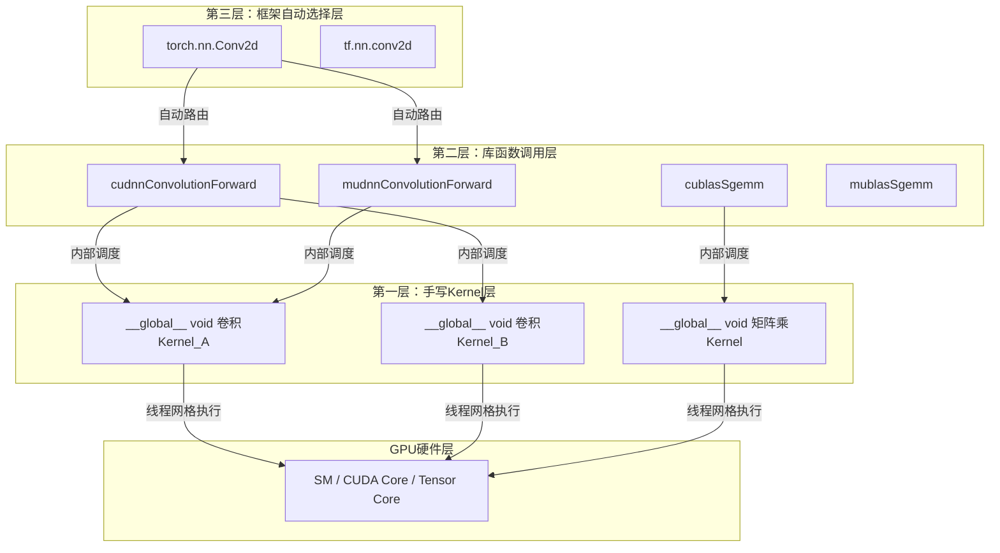

在GPU计算生态中，**算子（Operator）**是执行具体计算任务的核心单元，例如卷积、矩阵乘法、激活函数等。同一个算子可以在三个不同的抽象层级上实现：最底层的手写Kernel、中间层的库函数调用、以及最高层的深度学习框架自动调度。理解这三层架构的划分逻辑与协作关系，是把握GPU软件栈设计精髓的关键。本文将系统解析每一层的实现方式、优缺点及适用场景，并展示CUDA与MUSA生态在三层架构中的对称映射。

Sources: [GPU计算生态完全指南.md](GPU计算生态完全指南.md#L1662-L1701)

## 算子与Kernel：逻辑概念与物理实现

在深入三层架构之前，必须先厘清两个易混淆的核心术语。**算子（Operator）**是深度学习框架中的逻辑计算单元，例如`torch.nn.Conv2d`表示一个二维卷积算子；**Kernel**则是在GPU设备上实际执行的函数，由`__global__`修饰符定义，是算子的物理实现载体。二者的关系并非一一对应，一个算子通常由一个或多个Kernel协同完成，算子位于逻辑抽象层，Kernel位于硬件执行层。以PyTorch的`Conv2d`为例，它作为算子向用户暴露高层接口，其底层可能调用cuDNN的`cudnnConvolutionForward`，而cuDNN内部又会进一步调度多个CUDA Kernel来完成实际的卷积计算。这种分层解耦设计使得上层开发者无需关心底层Kernel的实现细节。

Sources: [GPU计算生态完全指南.md](GPU计算生态完全指南.md#L2041-L2053)

## 第一层：手写Kernel层

**手写Kernel层**是算子实现的最底层，开发者直接使用CUDA或MUSA的`__global__`关键字编写设备函数，精确控制线程网格划分、内存访问模式和寄存器分配。以向量加法为例，一个最基础的CUDA Kernel仅需十几行代码即可定义每个线程负责的加法操作。这种方式赋予开发者对硬件的完全掌控力，能够针对特定数据形状或计算模式进行极致优化，例如通过共享内存复用、合并内存访问、避免线程束分化等手段榨取峰值算力。然而，手写Kernel的门槛极高：开发者必须深入理解GPU的SIMT执行模型、内存层次结构以及Warp调度机制。对于卷积这类复杂算子，手写高效Kernel还需要掌握Winograd算法、im2col数据变换、张量分块等高级技术，通常只有具备丰富GPU编程经验的工程师才能产出超越专家库的性能。

Sources: [GPU计算生态完全指南.md](GPU计算生态完全指南.md#L1669-L1677)
Sources: [GPU计算生态完全指南.md](GPU计算生态完全指南.md#L1738-L1743)

## 第二层：库函数调用层

**库函数调用层**介于手写Kernel与高层框架之间，通过调用经过硬件厂商深度优化的数学库和深度学习库来实现算子。在CUDA生态中，这一层的核心代表是cuDNN和cuBLAS；在MUSA生态中，对应的是muDNN和muBLAS。以cuDNN为例，它封装了卷积、池化、归一化、激活函数、循环神经网络和注意力机制等深度学习算子的高度优化实现。开发者只需创建描述符、配置算法参数并调用如`cudnnConvolutionForward`这样的函数，即可在数行代码内完成原本需要数百行手写Kernel才能实现的功能。cuBLAS则以`cublasSgemm`等接口提供了标准化矩阵运算的硬件加速。这些库的优势在于性能：NVIDIA和摩尔线程的专业团队针对不同GPU架构进行了指令级优化，包括Tensor Core调度、混合精度计算和内存带宽最大化。其代价是灵活性受限——库的接口固定，无法针对非常规数据布局或自定义融合算子进行微调，且应用对特定库版本产生依赖。

Sources: [GPU计算生态完全指南.md](GPU计算生态完全指南.md#L1682-L1689)
Sources: [GPU计算生态完全指南.md](GPU计算生态完全指南.md#L530-L575)
Sources: [GPU计算生态完全指南.md](GPU计算生态完全指南.md#L800-L809)

## 第三层：框架自动选择层

**框架自动选择层**是大多数深度学习从业者直接接触的层级，PyTorch和TensorFlow等框架将算子封装为高层API，如`torch.nn.Conv2d`或`tf.nn.conv2d`。在这一层，开发者完全不需要关心底层是调用了cuDNN、cuBLAS还是框架自研的Kernel实现，框架会根据当前硬件环境、数据类型和算子参数自动选择最优后端执行路径。这种抽象带来了最高的开发效率和跨平台可移植性：同一份模型代码可以在NVIDIA GPU、摩尔线程GPU甚至CPU上无缝运行。然而，自动化的代价是控制力最弱——开发者无法直接干预算法选择、工作空间分配或Kernel融合策略，框架的抽象也可能引入额外的调度开销。当需要调试性能瓶颈或引入自定义算子时，第三层的黑盒特性反而会成为阻碍。

Sources: [GPU计算生态完全指南.md](GPU计算生态完全指南.md#L1694-L1699)

## 三层纵向调用链

三层架构并非相互孤立，而是从用户代码到硬件执行的完整纵向调用链。一个PyTorch卷积算子的执行路径清晰地展示了这种层级穿透关系：PyTorch框架（第三层）解析`nn.Conv2d`的调用参数，将其路由至cuDNN后端（第二层）；cuDNN根据输入张量描述符、卷积核描述符和卷积配置描述符选择最优算法，再通过CUDA Runtime将计算任务拆分为多个Kernel（第一层）下发到GPU硬件执行。理解这一调用链有助于定位性能问题和依赖关系。

框架层向下依赖加速库层，加速库层再向下依赖手写Kernel层与运行时层，每一层都屏蔽了下层的复杂性，同时为上层提供更抽象的接口。这种分层设计是GPU软件栈能够支撑从系统程序员到AI应用开发者多层次用户群体的根本原因。

Sources: [GPU计算生态完全指南.md](GPU计算生态完全指南.md#L1528-L1541)
Sources: [GPU计算生态完全指南.md](GPU计算生态完全指南.md#L552-L575)

## 三层实现的选择策略

不同开发场景对控制力、性能和开发效率的权衡需求各异，三层架构为此提供了清晰的选择依据。以下表格从学习、生产、原型和自定义优化四个典型场景出发，给出层级推荐及理由。

| 场景 | 推荐层级 | 核心原因 | 典型用户 |
|------|---------|---------|---------|
| 学习GPU编程原理 | 第一层（手写Kernel） | 直接操作线程模型和内存层次，建立对硬件执行的直观认知 | 学生、系统开发者 |
| 生产环境深度学习训练/推理 | 第二层（库函数调用） | 性能经过厂商专家优化，通常优于普通开发者手写实现 | 推理引擎开发者、HPC工程师 |
| 快速模型原型验证 | 第三层（框架自动选择） | 开发效率最高，无需关注底层差异，专注算法创新 | AI研究员、算法工程师 |
| 自定义算子或极致性能优化 | 第一层+第二层组合 | 以库函数为基线，对瓶颈环节手写Kernel替换，兼顾性能与灵活性 | 框架开发者、性能优化专家 |

Sources: [GPU计算生态完全指南.md](GPU计算生态完全指南.md#L1703-L1710)

## CUDA与MUSA的三层映射一致性

CUDA生态与MUSA生态在算子的三层实现上保持了高度的结构对称性。这种对称性并非偶然，而是MUSA兼容CUDA设计目标的直接体现：两者在每一层都提供了语义相近、命名可映射的API，使得开发者能够沿用相同的架构思维进行跨平台开发。

| 层级 | CUDA生态 | MUSA生态 | 核心特征 |
|------|---------|---------|---------|
| 第一层 | `__global__ void kernel(...)` | `__global__ void kernel(...)` | 语法完全一致，仅需替换头文件和编译器 |
| 第二层 | `cudnnConvolutionForward` / `cublasSgemm` | `mudnnConvolutionForward` / `mublasSgemm` | API命名前缀`cu`替换为`mu`，参数语义一致 |
| 第三层 | PyTorch CUDA后端 / TensorFlow GPU | PyTorch MUSA后端 / 摩尔线程适配框架 | 框架层通常已自动封装，用户代码无需修改 |

这种映射关系意味着，理解CUDA的三层实现架构等同于理解了MUSA的对应架构。在实际迁移工作中，第一层的Kernel代码可通过简单的字符串替换完成大部分适配；第二层的库调用需要更新头文件和链接库；第三层则通常由框架本身处理，应用代码保持不变。

Sources: [GPU计算生态完全指南.md](GPU计算生态完全指南.md#L1669-L1701)
Sources: [GPU计算生态完全指南.md](GPU计算生态完全指南.md#L2014-L2022)

## 总结

算子的三层实现架构——手写Kernel层、库函数调用层和框架自动选择层——构成了GPU计算生态从硬件到应用的完整抽象阶梯。**第一层**提供极致的硬件控制力，是性能优化和原理学习的根基；**第二层**以cuDNN、cuBLAS等专家库为媒介，在性能与开发效率之间取得最佳平衡；**第三层**通过PyTorch、TensorFlow等框架将算子完全黑盒化，最大化算法开发的迭代速度。CUDA与MUSA在这一架构上保持了对称映射，为跨平台开发和迁移提供了清晰的参照系。开发者的核心能力在于判断当前任务应停留在哪一层抽象：追求性能下探至Kernel，追求效率上溯至框架，而大多数生产场景的最优解是第二层与第一层的精准组合。

若希望从底层代码层面感受三层架构的差异，可继续阅读[基础向量加法：CUDA与MUSA对比](21-ji-chu-xiang-liang-jia-fa-cudayu-musadui-bi)中手写Kernel的实现细节，或深入[卷积网络：cuDNN与muDNN](23-juan-ji-wang-luo-cudnnyu-mudnn)了解第二层库函数的具体调用方式。若要理解三层架构所处的更大生态图景，可回溯阅读[GPU生态层级依赖关系图](17-gpusheng-tai-ceng-ji-yi-lai-guan-xi-tu)。

Sources: [GPU计算生态完全指南.md](GPU计算生态完全指南.md#L1660-L1711)