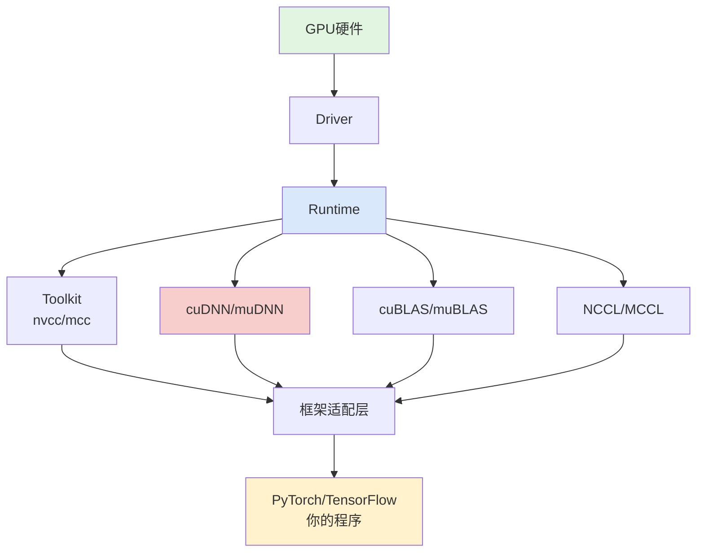
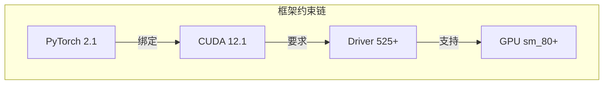
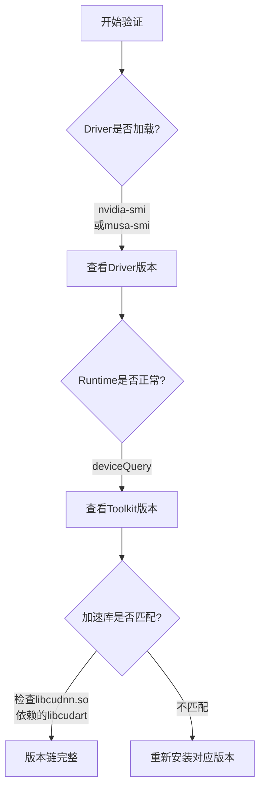

GPU计算生态的复杂性不仅体现在组件数量上，更体现在**严格的版本依赖关系**中。当你在服务器上部署一个深度学习训练任务时，可能会遇到这样的困境：PyTorch报CUDA版本不兼容、cuDNN找不到符号、驱动加载失败——这些问题的根源往往是组件之间的版本链条断裂。本文将系统性地解析CUDA与MUSA生态中的版本匹配规则，并提供经过验证的安装策略，帮助你在多层级依赖中建立一条稳定可靠的"版本链"。

Sources: [GPU计算生态完全指南.md](GPU计算生态完全指南.md#L1466-L1526)

## 版本依赖的链式法则

GPU生态遵循**自下而上的严格依赖链**：硬件层支撑驱动层，驱动层支撑运行时层，运行时层支撑工具包与加速库，最终支撑框架与应用。这意味着**任何一层的版本选择都会向上传导，限制上层组件的可选范围**。



上图展示了完整的五层依赖架构。最关键的认知是：**版本匹配不是"推荐"，而是"强制要求"**。加速库（如cuDNN）的二进制接口与Runtime紧密绑定，若Toolkit升级而cuDNN未同步更新，会出现头文件与库文件不一致导致的编译错误或运行时符号缺失。同理，nvcc编译器在将设备代码编译为PTX或SASS时，必须知道目标GPU的**计算能力**（Compute Capability），这直接关联到Driver的版本支持范围。

Sources: [GPU计算生态完全指南.md](GPU计算生态完全指南.md#L1528-L1540)

## CUDA生态版本匹配矩阵

在CUDA生态中，版本匹配涉及四个核心维度：**Driver版本**、**Toolkit版本**、**计算能力**、以及**独立库版本**。

### Driver与Toolkit的兼容性

CUDA Toolkit的安装前提是有足够新的Driver。NVIDIA的驱动向后兼容旧版Toolkit，但新版Toolkit通常需要新版Driver支持。

| Toolkit版本 | 最低Driver版本 | 典型计算能力 | 支持架构 |
|------------|--------------|------------|---------|
| CUDA 11.x | 450.80.02+ | sm_35 ~ sm_80 | Kepler ~ Ampere |
| CUDA 12.x | 525.60.13+ | sm_50 ~ sm_90 | Maxwell ~ Hopper |

**核心原则**：Driver版本 >= Toolkit要求的最低版本。你可以用新版Driver运行旧版Toolkit编译的程序，但反之不行。

### 编译器架构指定

nvcc编译时必须通过`-arch`参数指定目标GPU的计算能力，这决定了编译器生成哪个架构的机器码。

| GPU架构 | 代表型号 | 计算能力 | nvcc参数 |
|--------|---------|---------|---------|
| Pascal | GTX 1080Ti | 6.1 | `-arch=sm_61` |
| Volta | V100 | 7.0 | `-arch=sm_70` |
| Turing | RTX 2080Ti | 7.5 | `-arch=sm_75` |
| Ampere | A100/RTX 3090 | 8.0/8.6 | `-arch=sm_80` / `-arch=sm_86` |
| Hopper | H100 | 9.0 | `-arch=sm_90` |

若要兼顾向前兼容，可先编译为PTX中间代码（`nvcc -ptx`），让Driver在运行时根据实际GPU架构进行JIT编译。但这会牺牲部分启动性能。

Sources: [GPU计算生态完全指南.md](GPU计算生态完全指南.md#L480-L491)

### cuDNN与Toolkit的版本对应

cuDNN是独立发布的库，其版本必须与Toolkit严格匹配。下表展示了主要版本对应关系：

| cuDNN版本 | 兼容CUDA版本 | 主要特性 |
|----------|-------------|---------|
| cuDNN 8.6 | CUDA 11.x | 支持Ampere，稳定成熟 |
| cuDNN 8.9 | CUDA 12.x | 支持Hopper，新增FP8支持 |
| cuDNN 9.0+ | CUDA 12.x | 重构API，性能优化 |

**不匹配的后果**包括编译错误（头文件接口变更）、运行时错误（`libcudnn.so`符号未找到）、以及性能下降（无法启用新架构的优化Kernel）。在实际部署中，建议通过`ldd`命令检查cuDNN依赖的`libcudart.so`版本，确保与已安装的CUDA Toolkit一致。

Sources: [GPU计算生态完全指南.md](GPU计算生态完全指南.md#L1645-L1658)

## MUSA生态版本匹配矩阵

MUSA生态的设计目标是兼容CUDA，因此其版本匹配逻辑与CUDA高度相似，但存在国产GPU特有的架构标识和版本节奏差异。

### mcc编译器与架构指定

MUSA编译器`mcc`的工作流程与`nvcc`一致，但架构参数使用`mp_`前缀而非`sm_`：

| 场景 | CUDA (nvcc) | MUSA (mcc) |
|------|-------------|------------|
| 基础编译 | `nvcc -o 程序 程序.cu` | `mcc -o 程序 程序.cu` |
| 指定架构 | `nvcc -arch=sm_70 ...` | `mcc -arch=mp_20 ...` |
| 链接外部库 | `nvcc ... -lcublas` | `mcc ... -lmublas` |

摩尔线程GPU的架构代际更新节奏与NVIDIA不同，因此在迁移时需查阅官方文档确认目标GPU支持的`mp_`版本号。

Sources: [GPU计算生态完全指南.md](GPU计算生态完全指南.md#L1030-L1037)

### muDNN与MUSA Toolkit的绑定关系

与cuDNN类似，muDNN也是独立发布且严格依赖MUSA Toolkit的Runtime和Driver：

| muDNN版本 | 兼容MUSA版本 | 说明 |
|----------|-------------|------|
| muDNN 1.x | MUSA 1.x | 初期版本，API兼容cuDNN 8.x |
| muDNN 2.x+ | MUSA 2.x+ | 持续跟进cuDNN新特性 |

**关键差异**：MUSA生态的版本更新可能滞后于CUDA生态。在制定迁移计划时，务必先确认muDNN是否已支持目标cuDNN版本提供的特性，避免在迁移后发现关键算子缺失。

Sources: [GPU计算生态完全指南.md](GPU计算生态完全指南.md#L1109-L1113)

## 框架层的版本约束

当使用PyTorch或TensorFlow时，版本约束会进一步向上收紧。这些框架在编译时已绑定了特定版本的CUDA和cuDNN，因此**框架版本 → CUDA版本 → Driver版本**构成了一条不可突破的链条。



**实践建议**：在团队环境中，优先确定框架版本，然后反推所需的CUDA和Driver版本，最后检查服务器GPU是否满足计算能力要求。不要先安装最新Driver再尝试安装旧版框架——这会导致框架无法识别CUDA后端。

Sources: [GPU计算生态完全指南.md](GPU计算生态完全指南.md#L1530-L1536)

## 安装策略：三种典型场景

根据使用场景的不同，安装策略可分为**最小可用安装**、**深度学习开发安装**和**多版本共存安装**三种模式。

### 场景一：最小可用安装（通用GPU计算）

若只需编写和运行基础CUDA/MUSA程序（如向量加法、矩阵运算），无需深度学习支持：

| 安装组件 | CUDA生态 | MUSA生态 | 是否必须 |
|---------|---------|---------|---------|
| GPU Driver | `nvidia-driver-xxx` | `musa-driver` | 是 |
| Toolkit | CUDA Toolkit | MUSA Toolkit | 是 |
| SDK | CUDA SDK（可选） | MUSA SDK（可选） | 否 |

安装顺序严格遵循**自下而上**：先确认硬件已正确识别，再安装Driver，最后安装Toolkit。安装完成后，使用`nvcc -V`或`mcc -V`验证编译器版本。

Sources: [GPU计算生态完全指南.md](GPU计算生态完全指南.md#L2016-L2021)

### 场景二：深度学习开发安装

深度学习场景需要额外安装独立库：

| 层级 | CUDA生态组件 | MUSA生态组件 | 安装方式 |
|------|-------------|-------------|---------|
| 驱动层 | NVIDIA Driver | MUSA Driver | 系统包管理器 |
| 运行时层 | CUDA Runtime | MUSA Runtime | Toolkit自带 |
| 工具包 | CUDA Toolkit | MUSA Toolkit | 官方安装包 |
| 加速库 | cuDNN + cuBLAS + NCCL | muDNN + muBLAS + MCCL | 单独下载 |
| 框架层 | PyTorch/TensorFlow | 适配版PyTorch | pip/conda |

**版本锁定技巧**：在conda环境中，可使用`cudatoolkit=11.8`等精确版本约束，配合`cudnn=8.6`确保整个环境的版本一致性。这比系统全局安装更易于维护和回滚。

Sources: [GPU计算生态完全指南.md](GPU计算生态完全指南.md#L1714-L1722)

### 场景三：多版本共存安装

在共享服务器或需要维护多个项目的场景中，多版本共存是刚需。CUDA和MUSA均支持通过环境变量切换版本：

```bash
# CUDA多版本切换示例
export PATH=/usr/local/cuda-11.8/bin:$PATH
export LD_LIBRARY_PATH=/usr/local/cuda-11.8/lib64:$LD_LIBRARY_PATH

# 验证当前生效版本
nvcc -V
```

**关键规则**：`LD_LIBRARY_PATH`的搜索顺序决定了运行时加载哪个版本的`libcudart.so`。若多个版本的库混用（如Toolkit 12.x的nvcc编译但运行时链接到11.x的Runtime），几乎必然导致崩溃。建议在启动脚本中显式设置环境变量，而非依赖系统默认值。

## 验证与排错流程

安装完成后，按以下流程验证版本链的完整性：



| 验证目标 | 命令/方法 | 预期输出 |
|---------|----------|---------|
| Driver版本 | `nvidia-smi` | 显示Driver版本和GPU型号 |
| Toolkit版本 | `nvcc -V` | 显示nvcc版本和构建信息 |
| Runtime库路径 | `ldconfig -p \| grep libcudart` | 显示当前链接的Runtime库 |
| cuDNN版本 | 编译运行含`cudnnGetProperty`的程序 | 返回cuDNN主/次版本号 |
| 计算能力 | 运行`deviceQuery`示例 | 显示GPU的major.minor |

Sources: [GPU计算生态完全指南.md](GPU计算生态完全指南.md#L139-L187)

## 常见版本不匹配问题速查

| 现象 | 根因 | 解决方案 |
|------|------|---------|
| `CUDA driver version is insufficient` | Driver版本低于Toolkit要求 | 升级Driver或降级Toolkit |
| `libcudnn.so: cannot open shared object` | cuDNN未安装或路径未配置 | 安装对应版本cuDNN并设置`LD_LIBRARY_PATH` |
| `nvcc fatal : Unsupported gpu architecture` | `-arch`参数与GPU不匹配 | 查询GPU计算能力并修正编译参数 |
| `undefined symbol: cudnnXXX` | cuDNN与CUDA版本不兼容 | 重装匹配版本的cuDNN |
| PyTorch报`No CUDA GPUs available` | 框架编译的CUDA版本与系统不匹配 | 安装与系统CUDA版本对应的PyTorch wheel |

Sources: [GPU计算生态完全指南.md](GPU计算生态完全指南.md#L1645-L1658)

## 总结与下一步

版本匹配的核心认知可以归纳为一句话：**底层决定上层，下层兼容上层，同层必须对齐**。Driver向上兼容旧Runtime，但Toolkit与cuDNN必须版本对齐；编译器的架构参数必须精确匹配目标GPU；框架版本是整个链条的"总阀门"，应由它倒推所需的全部底层版本。

掌握版本匹配规则后，你已具备了在复杂GPU环境中稳定部署的能力。下一步建议深入理解[算子的三层实现架构](19-suan-zi-de-san-ceng-shi-xian-jia-gou)，学习手写Kernel与调用库函数在不同版本约束下的权衡；或参考[CUDA到MUSA迁移策略与工具](24-cudadao-musaqian-yi-ce-lue-yu-gong-ju)，将版本匹配知识应用于跨生态迁移实践。