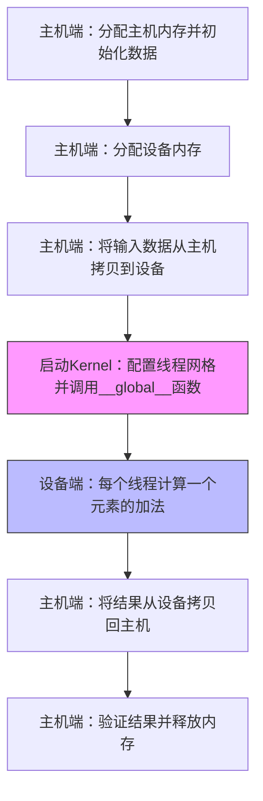

向量加法是学习 GPU 并行计算的"Hello World"。它足够简单，能让初学者聚焦核心概念——**主机与设备的内存分离**、**Kernel 函数定义**、**线程索引计算**——同时又具备完整的 GPU 编程流程。本页将提供可直接编译运行的 CUDA 与 MUSA 完整代码，通过逐行对比揭示两者在设计哲学上的一致性：MUSA 通过前缀替换策略（`cuda` → `musa`）实现与 CUDA 的高度兼容，使得已有 CUDA 代码的迁移成本极低。阅读本页前，建议先理解 [GPU与CPU的核心差异](5-gpuyu-cpude-he-xin-chai-yi) 与 [CUDA内存管理：分配、传输与内存类型](9-cudanei-cun-guan-li-fen-pei-chuan-shu-yu-nei-cun-lei-xing) 中关于主机内存与设备内存分离的基础概念。

Sources: [GPU计算生态完全指南.md](GPU计算生态完全指南.md#L1728-L1732)

## 程序执行流程

无论是 CUDA 还是 MUSA，一个完整的 GPU 向量加法程序都遵循相同的工作流。理解这个流程是后续阅读代码的骨架。



**流程解读**：程序的主体逻辑在 CPU（主机）上执行，而实际的加法运算被卸载到 GPU（设备）上的 Kernel 函数中。由于主机与设备拥有独立的内存地址空间，必须通过显式的 `cudaMemcpy` / `musaMemcpy` 完成数据传输。Kernel 启动后，成千上万个线程在 GPU 上并行执行，每个线程负责结果数组中的一个位置。

Sources: [GPU计算生态完全指南.md](GPU计算生态完全指南.md#L1732-L1843)

## CUDA 完整代码

下面的程序展示了使用 CUDA Runtime API 实现向量加法的标准写法。代码包含五个关键环节：主机内存分配与初始化、设备内存分配、数据拷贝、Kernel 启动、结果回传与清理。

```cpp
#include <cuda_runtime.h>
#include <stdio.h>
#include <stdlib.h>

// CUDA Kernel：向量加法
__global__ void 向量加法_CUDA(float* 结果, const float* 输入甲, const float* 输入乙, int 长度) {
    int 索引 = blockIdx.x * blockDim.x + threadIdx.x;
    if (索引 < 长度) {
        结果[索引] = 输入甲[索引] + 输入乙[索引];
    }
}

int main() {
    const int 长度 = 1024;
    const int 大小 = 长度 * sizeof(float);
    
    // 分配主机内存
    float* 主机甲 = (float*)malloc(大小);
    float* 主机乙 = (float*)malloc(大小);
    float* 主机结果 = (float*)malloc(大小);
    
    // 初始化数据
    for (int i = 0; i < 长度; i++) {
        主机甲[i] = (float)i;
        主机乙[i] = (float)(长度 - i);
    }
    
    // 分配设备内存
    float* 设备甲; cudaMalloc(&设备甲, 大小);
    float* 设备乙; cudaMalloc(&设备乙, 大小);
    float* 设备结果; cudaMalloc(&设备结果, 大小);
    
    // 拷贝数据到设备
    cudaMemcpy(设备甲, 主机甲, 大小, cudaMemcpyHostToDevice);
    cudaMemcpy(设备乙, 主机乙, 大小, cudaMemcpyHostToDevice);
    
    // 启动 Kernel
    int 线程数 = 256;
    int 块数 = (长度 + 线程数 - 1) / 线程数;
    向量加法_CUDA<<<块数, 线程数>>>(设备结果, 设备甲, 设备乙, 长度);
    
    // 拷贝结果回主机
    cudaMemcpy(主机结果, 设备结果, 大小, cudaMemcpyDeviceToHost);
    
    // 验证结果
    printf("CUDA 结果验证: %f + %f = %f\n", 主机甲[0], 主机乙[0], 主机结果[0]);
    
    // 清理
    cudaFree(设备甲); cudaFree(设备乙); cudaFree(设备结果);
    free(主机甲); free(主机乙); free(主机结果);
    
    return 0;
}
```

**代码关键段解析**：

| 代码段 | 作用 | 初学者易错点 |
|--------|------|-------------|
| `__global__ void 向量加法_CUDA(...)` | 声明在 GPU 上执行的 Kernel 函数，由主机调用、在设备上运行 | 忘记 `__global__` 修饰符会导致编译器按普通 C++ 函数处理 |
| `blockIdx.x * blockDim.x + threadIdx.x` | 将三维线程坐标扁平化为全局线性索引，每个线程对应数组中的一个元素 | 漏写边界检查 `if (索引 < 长度)` 会导致数组越界 |
| `<<<块数, 线程数>>>` | 执行配置语法，告诉 GPU 用多少个块、每个块多少线程来启动 Kernel | 块数和线程数必须是整数，总线程数应大于等于数据规模 |

**编译与运行命令**：

```bash
nvcc -o 向量加法_CUDA 向量加法_CUDA.cpp
./向量加法_CUDA
```

Sources: [GPU计算生态完全指南.md](GPU计算生态完全指南.md#L1732-L1786)

## MUSA 完整代码

MUSA 版本的程序在结构、语法、执行逻辑上与 CUDA 版本完全一致，差异仅体现在头文件引入、Runtime API 函数前缀以及编译器名称上。这种设计使得熟悉 CUDA 的开发者能够在几分钟内完成到 MUSA 的切换。

```cpp
#include <musa_runtime.h>
#include <stdio.h>
#include <stdlib.h>

// MUSA Kernel：向量加法
__global__ void 向量加法_MUSA(float* 结果, const float* 输入甲, const float* 输入乙, int 长度) {
    int 索引 = blockIdx.x * blockDim.x + threadIdx.x;
    if (索引 < 长度) {
        结果[索引] = 输入甲[索引] + 输入乙[索引];
    }
}

int main() {
    const int 长度 = 1024;
    const int 大小 = 长度 * sizeof(float);
    
    // 分配主机内存
    float* 主机甲 = (float*)malloc(大小);
    float* 主机乙 = (float*)malloc(大小);
    float* 主机结果 = (float*)malloc(大小);
    
    // 初始化数据
    for (int i = 0; i < 长度; i++) {
        主机甲[i] = (float)i;
        主机乙[i] = (float)(长度 - i);
    }
    
    // 分配设备内存
    float* 设备甲; musaMalloc(&设备甲, 大小);
    float* 设备乙; musaMalloc(&设备乙, 大小);
    float* 设备结果; musaMalloc(&设备结果, 大小);
    
    // 拷贝数据到设备
    musaMemcpy(设备甲, 主机甲, 大小, musaMemcpyHostToDevice);
    musaMemcpy(设备乙, 主机乙, 大小, musaMemcpyHostToDevice);
    
    // 启动 Kernel
    int 线程数 = 256;
    int 块数 = (长度 + 线程数 - 1) / 线程数;
    向量加法_MUSA<<<块数, 线程数>>>(设备结果, 设备甲, 设备乙, 长度);
    
    // 拷贝结果回主机
    musaMemcpy(主机结果, 设备结果, 大小, musaMemcpyDeviceToHost);
    
    // 验证结果
    printf("MUSA 结果验证: %f + %f = %f\n", 主机甲[0], 主机乙[0], 主机结果[0]);
    
    // 清理
    musaFree(设备甲); musaFree(设备乙); musaFree(设备结果);
    free(主机甲); free(主机乙); free(主机结果);
    
    return 0;
}
```

**编译与运行命令**：

```bash
mcc -o 向量加法_MUSA 向量加法_MUSA.cpp
./向量加法_MUSA
```

Sources: [GPU计算生态完全指南.md](GPU计算生态完全指南.md#L1790-L1844)

## CUDA 与 MUSA 逐行差异对比

将两段代码并排对比，可以清晰地看到 MUSA 对 CUDA 的兼容策略：保留所有语法结构、数据类型和编程模型，仅做命名空间级别的替换。

| 对比项 | CUDA | MUSA | 是否影响逻辑 |
|--------|------|------|-------------|
| 头文件 | `<cuda_runtime.h>` | `<musa_runtime.h>` | 否 |
| 内存分配 | `cudaMalloc(&ptr, size)` | `musaMalloc(&ptr, size)` | 否 |
| 内存拷贝 | `cudaMemcpy(dst, src, size, cudaMemcpyHostToDevice)` | `musaMemcpy(dst, src, size, musaMemcpyHostToDevice)` | 否 |
| 内存释放 | `cudaFree(ptr)` | `musaFree(ptr)` | 否 |
| Kernel 修饰符 | `__global__` | `__global__` | 否（完全相同） |
| 线程索引变量 | `blockIdx`、`blockDim`、`threadIdx` | `blockIdx`、`blockDim`、`threadIdx` | 否（完全相同） |
| 执行配置语法 | `<<<块数, 线程数>>>` | `<<<块数, 线程数>>>` | 否（完全相同） |
| 编译器 | `nvcc` | `mcc` | 否 |
| 默认安装路径 | `/usr/local/cuda` | `/usr/local/musa` | 否 |

**关键洞察**：Kernel 函数内部的代码在两个生态中是完全相同的字节级复刻。这意味着，如果你已经掌握 CUDA Kernel 的编写技巧——如何计算全局线程索引、如何避免线程越界、如何优化内存访问模式——这些知识可以直接迁移到 MUSA 平台，无需重新学习。

Sources: [GPU计算生态完全指南.md](GPU计算生态完全指南.md#L1848-L1857)

## 初学者调试清单

在第一次编译运行向量加法程序时，初学者最常遇到以下几类问题。本清单按发生频率排序，可在出错时逐条排查。

| 现象 | 可能原因 | 排查方法 |
|------|---------|---------|
| 编译报错 `cuda_runtime.h: No such file` | CUDA Toolkit 未安装或环境变量未配置 | 检查 `CUDA_HOME` 是否指向 `/usr/local/cuda`，并确认 `nvcc` 在 PATH 中 |
| 运行报错 `no CUDA-capable device` | 驱动未安装或 GPU 未被识别 | 执行 `nvidia-smi`（CUDA）或 `mthreads-gmi`（MUSA）查看设备状态 |
| 结果全为零或随机数 | 忘记调用 `cudaMemcpyDeviceToHost` 回传结果 | 确认 Kernel 启动后存在拷贝结果回主机的步骤 |
| 程序崩溃或数据损坏 | Kernel 中未做边界检查，线程越界写入 | 确保所有 Kernel 都包含 `if (索引 < 长度)` 保护 |
| Kernel 修改后结果无变化 | 编译时使用了旧的可执行文件 | 确认每次修改后都重新执行了 `nvcc` / `mcc` 编译命令 |

## 小结与下一步

本页通过向量加法这一最小完整示例，展示了 CUDA 与 MUSA 在 Runtime API 层面的对应关系。两者共享相同的编程模型——主机管理内存与调度，设备并行执行 Kernel——区别仅限于 API 前缀与编译器名称。对于初学者而言，这意味着**学会 CUDA 就等于同时学会了 MUSA 的基础用法**。

在掌握向量加法后，建议按照以下路径继续深入：

1. **理解内存类型的差异**：向量加法只使用了全局内存，而 GPU 性能优化往往依赖于共享内存（Shared Memory）和寄存器的合理使用。详见 [CUDA内存管理：分配、传输与内存类型](9-cudanei-cun-guan-li-fen-pei-chuan-shu-yu-nei-cun-lei-xing)。
2. **学习使用高级数学库**：手写 Kernel 适合理解原理，但生产环境中矩阵运算应优先使用经过高度优化的 cuBLAS / muBLAS。下一页 [矩阵乘法：cuBLAS与muBLAS](22-ju-zhen-cheng-fa-cublasyu-mublas) 将展示库函数调用与手写 Kernel 的效率差异。
3. **了解自动化迁移工具**：当项目规模从单文件扩展到数万行 CUDA 代码时，手动替换 `cuda` → `musa` 不再现实。[CUDA到MUSA迁移策略与工具](24-cudadao-musaqian-yi-ce-lue-yu-gong-ju) 介绍了摩尔线程提供的代码迁移工具及其使用场景。