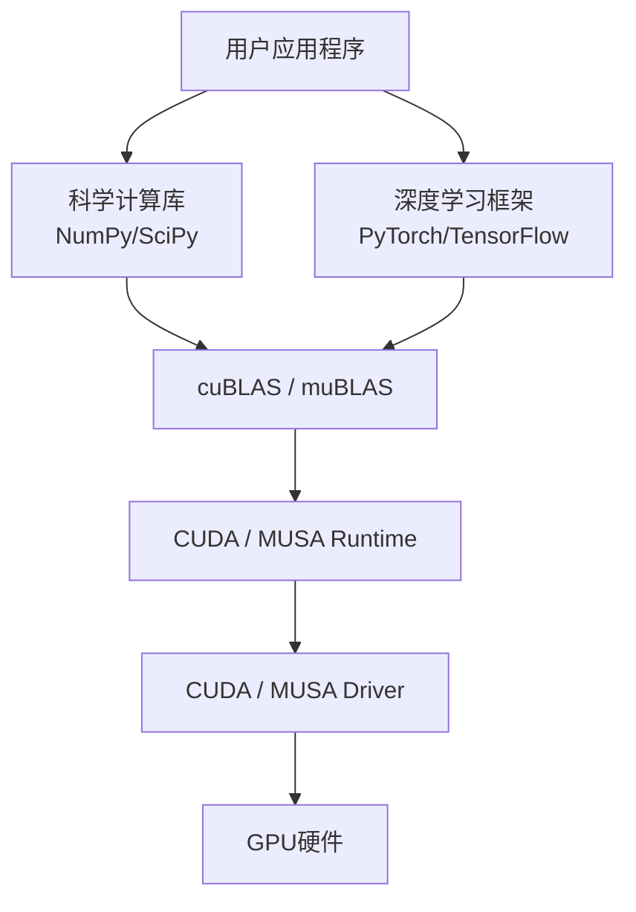

矩阵乘法是GPU加速计算中最核心的操作之一，从深度学习训练中的线性层到科学仿真中的稠密矩阵求解，GEMM（General Matrix Multiply）几乎出现在每一个性能关键路径上。NVIDIA通过cuBLAS提供了高度优化的GPU矩阵运算实现，而摩尔线程的muBLAS则以API兼容为目标，让熟悉cuBLAS的开发者能够几乎零成本地将代码迁移到MUSA生态。本页面向具备基础CUDA/MUSA编程经验的中级开发者，系统对比两个库在矩阵乘法场景下的API映射、参数语义、存储约定与编译链接差异，帮助你建立从"能跑通"到"能排错"的完整认知框架。

Sources: [GPU计算生态完全指南.md](GPU计算生态完全指南.md#L1-L10)

## BLAS库在GPU生态中的定位

在GPU计算生态的层级结构中，cuBLAS与muBLAS处于**运行时（Runtime）之上、框架之下**的中间层，直接面向需要高性能线性代数运算的应用开发者。它们遵循经典的BLAS（Basic Linear Algebra Subprograms）接口规范，将向量运算、矩阵-向量运算和矩阵-矩阵运算三类操作映射到GPU硬件的高效实现上。这种定位意味着：你无需手写CUDA Kernel去调度线程块、优化共享内存排布或处理Tensor Core的WMMA指令细节，只需调用高层API即可获得接近硬件峰值的计算性能。



cuBLAS提供的BLAS接口按计算复杂度分为三个层级：Level 1面向向量运算（如点积、范数），Level 2面向矩阵-向量运算（如通用矩阵向量乘法GEMV），Level 3面向矩阵-矩阵运算（如通用矩阵乘法GEMM）。对于GPU而言，Level 3运算的并行度最高、计算密度最大，是库函数优化的重中之重。muBLAS在设计之初即明确以cuBLAS为兼容基准，三级接口均提供一一对应的API映射。

Sources: [GPU计算生态完全指南.md](GPU计算生态完全指南.md#L738-L744)

## cuBLAS与muBLAS核心API映射

两个库的API命名遵循严格的替换规则：将cuBLAS前缀中的`cu`替换为`mu`，常量宏中的`CUBLAS_`替换为`MUBLAS_`，状态枚举中的`cublasStatus_t`替换为`mublasStatus_t`。这种前缀替换策略贯穿整个接口体系，使得代码迁移可以通过简单的文本替换或宏封装完成。

| 功能 | cuBLAS API | muBLAS API | 说明 |
|------|------------|------------|------|
| 创建句柄 | `cublasCreate` | `mublasCreate` | 初始化库内部状态与资源池 |
| 矩阵乘法 | `cublasSgemm` | `mublasSgemm` | 单精度浮点通用矩阵乘法 |
| 销毁句柄 | `cublasDestroy` | `mublasDestroy` | 释放句柄关联的资源 |
| 状态类型 | `cublasStatus_t` | `mublasStatus_t` | 函数返回的错误码类型 |
| 成功常量 | `CUBLAS_STATUS_SUCCESS` | `MUBLAS_STATUS_SUCCESS` | 调用成功的标识 |
| 不转置标记 | `CUBLAS_OP_N` | `MUBLAS_OP_N` | 矩阵按原样参与运算 |
| 库链接参数 | `-lcublas` | `-lmublas` | 编译器链接选项 |

需要特别注意的是，两个库的头文件命名也遵循相同模式：cuBLAS使用`cublas_v2.h`，muBLAS使用`mublas_v2.h`。这里的`v2`表示第二代API接口，与旧的`cublas.h`相比引入了显式的句柄管理机制，支持多流并发与更细粒度的错误传播。

Sources: [GPU计算生态完全指南.md](GPU计算生态完全指南.md#L1294-L1302)

## 矩阵乘法执行流程

使用cuBLAS或muBLAS执行一次矩阵乘法，无论底层硬件如何变化，其逻辑流程都遵循固定的六步模式。理解这一流程不仅有助于正确编写代码，更是在遇到"结果不对"或"段错误"时进行系统性排查的基础。


这一流程与手动编写Kernel的最大区别在于**第四步和第五步的解耦**：句柄（Handle）的创建是重量级的初始化操作，通常在整个应用生命周期中只执行一次；而实际的`gemm`调用则是轻量级的，可以在同一句柄上反复执行不同维度的矩阵乘法。对于需要在一个循环中多次调用GEMM的场景，应当将句柄创建移到循环外部，避免重复分配内部资源池带来的性能损耗。

Sources: [GPU计算生态完全指南.md](GPU计算生态完全指南.md#L748-L841)

## 完整代码对比

下面的两个代码示例执行完全相同的计算：对维度为M×K和K×N的两个单精度浮点矩阵进行乘法，得到M×N的结果矩阵。左侧为cuBLAS实现，右侧为muBLAS实现。通过并列阅读，可以直观感受两个生态在API层面的同构性。

| cuBLAS (NVIDIA CUDA) | muBLAS (摩尔线程 MUSA) |
|----------------------|------------------------|
| `#include <cuda_runtime.h>`<br>`#include <cublas_v2.h>` | `#include <musa_runtime.h>`<br>`#include <mublas_v2.h>` |
| `#define 检查cuBLAS(表达式) ...`<br>`  cublasStatus_t 状态 ...`<br>`  CUBLAS_STATUS_SUCCESS` | `#define 检查muBLAS(表达式) ...`<br>`  mublasStatus_t 状态 ...`<br>`  MUBLAS_STATUS_SUCCESS` |
| `cudaMalloc(&设备甲, 大小甲);`<br>`cudaMemcpy(设备甲, 主机甲, ..., cudaMemcpyHostToDevice);` | `musaMalloc(&设备甲, 大小甲);`<br>`musaMemcpy(设备甲, 主机甲, ..., musaMemcpyHostToDevice);` |
| `cublasHandle_t 句柄;`<br>`cublasCreate(&句柄);` | `mublasHandle_t 句柄;`<br>`mublasCreate(&句柄);` |
| `cublasSgemm(句柄, CUBLAS_OP_N, CUBLAS_OP_N, ...);` | `mublasSgemm(句柄, MUBLAS_OP_N, MUBLAS_OP_N, ...);` |
| `cudaFree(设备甲);`<br>`cublasDestroy(句柄);` | `musaFree(设备甲);`<br>`mublasDestroy(句柄);` |
| **编译**：`nvcc -o 程序 程序.cpp -lcublas -lcudart` | **编译**：`mcc -o 程序 程序.cpp -lmublas -lmusart` |

从对比中可以提炼出三条迁移铁律：第一，所有Runtime函数的前缀从`cuda`替换为`musa`；第二，所有库函数与类型的前缀从`cublas`替换为`mublas`；第三，所有宏常量的前缀从`CUBLAS_`替换为`MUBLAS_`。除此之外，函数签名、参数顺序和语义完全一致。这种设计使得大型项目的迁移可以通过编写一层薄薄的宏封装或条件编译层来完成，而无需重写算法逻辑。

Sources: [GPU计算生态完全指南.md](GPU计算生态完全指南.md#L1858-L1966)

## cublasSgemm参数深度解析

`cublasSgemm`（以及对应的`mublasSgemm`）是Level 3 BLAS中最核心的函数，其原型承载了Fortran传统与GPU并行优化之间的历史包袱。初学者最容易在此处犯错，因此有必要对每一个参数进行解剖式说明。

函数执行的数学操作是：`C = alpha * op(A) * op(B) + beta * C`。其中`op(X)`表示可选的转置操作。对于单精度版本，函数原型如下：

```cpp
cublasSgemm(
    handle,     // BLAS句柄
    transa,     // A矩阵是否转置
    transb,     // B矩阵是否转置
    m,          // C的行数（op(A)的行数）
    n,          // C的列数（op(B)的列数）
    k,          // A的列数 / B的行数（相乘维度）
    alpha,      // 输入缩放因子
    A,          // A矩阵设备指针
    lda,        // A的leading dimension
    B,          // B矩阵设备指针
    ldb,        // B的leading dimension
    beta,       // 输出累加缩放因子
    C,          // C矩阵设备指针
    ldc         // C的leading dimension
);
```

| 参数 | 名称 | 含义 | 常见陷阱 |
|------|------|------|---------|
| `handle` | 句柄 | 库实例上下文 | 多线程场景下每个线程应独立创建句柄 |
| `transa` | A转置标志 | `CUBLAS_OP_N`不转置，`CUBLAS_OP_T`转置 | 与存储格式相关，非转置时指针按列优先解释 |
| `transb` | B转置标志 | 同上 | 同上 |
| `m` | C的行数 | 结果矩阵高度 | **注意**：在cuBLAS中对应C的列数逻辑，因列优先而异 |
| `n` | C的列数 | 结果矩阵宽度 | 实际调用时常写为`N`，但语义是C的leading dim维度 |
| `k` | 相乘维度 | A的列数 = B的行数 | 若与矩阵实际维度不匹配，会导致越界或数值错误 |
| `alpha` | 输入缩放 | A*B结果的乘数 | 通常设为1.0f；设为0可跳过乘法只做beta*C |
| `lda` | A的leading dimension | 列优先下为A的行数（内存中一列的元素数） | 行优先程序员容易误填为列数 |
| `ldb` | B的leading dimension | 列优先下为B的行数 | 同上 |
| `beta` | 输出缩放 | 旧C值的乘数 | 设为0.0f表示完全覆盖；设为1.0f表示累加 |
| `ldc` | C的leading dimension | 列优先下为C的行数 | 同上 |

`alpha`与`beta`的存在使得单次调用即可表达"矩阵乘加"（C = A*B + C）这一在神经网络前向传播中极其常见的模式，避免了额外的内存读写与Kernel启动开销。

Sources: [GPU计算生态完全指南.md](GPU计算生态完全指南.md#L795-L809)

## 列优先存储：最大的认知陷阱

cuBLAS与muBLAS继承自Fortran的BLAS传统，内部采用**列优先（Column-Major）**存储格式，而C/C++语言原生使用行优先（Row-Major）格式。这一差异是迁移手写CPU矩阵乘法代码到GPU时bug最集中的来源。

在行优先的C语言思维中，矩阵元素`A[i][j]`位于内存偏移`i * 列数 + j`处；而在列优先的BLAS思维中，同一元素的内存偏移为`j * 行数 + i`。当传入`cublasSgemm`的参数时，`lda`（leading dimension）在列优先下表示"每列有多少个元素"，即矩阵的行数。

如果你的数据在主机端以行优先方式排布，而直接原封不动地传入cuBLAS，你有两种处理策略：其一，在数据拷贝前手动转置矩阵，将行优先数据转换为列优先格式；其二，利用`transa`和`transb`参数进行"逻辑转置"，通过`CUBLAS_OP_T`告诉库函数"将这块行优先内存按列优先的转置来理解"。在实际工程实践中，深度学习框架通常会在内部统一采用列优先或NDCHW等特定格式来与cuBLAS对接，从而避免反复转置的开销。

Sources: [GPU计算生态完全指南.md](GPU计算生态完全指南.md#L796)

## 编译链接与环境配置

将源代码转换为可执行文件时，cuBLAS与muBLAS的差异主要体现在编译器与链接库名称上。两个生态的编译命令结构高度相似，只需替换工具链名称与库名前缀即可。

| 配置项 | CUDA / cuBLAS | MUSA / muBLAS |
|--------|---------------|---------------|
| 编译器 | `nvcc` | `mcc` |
| 头文件 | `cublas_v2.h` | `mublas_v2.h` |
| 链接库 | `-lcublas` | `-lmublas` |
| Runtime库 | `-lcudart` | `-lmusart` |
| 头文件搜索路径 | `/usr/local/cuda/include` | `/usr/local/musa/include` |
| 库文件搜索路径 | `/usr/local/cuda/lib64` | `/usr/local/musa/lib` |
| 环境变量 | `CUDA_HOME` | `MUSA_HOME` |

cuBLAS的完整编译命令示例：
```bash
nvcc -o cublas_demo cublas_demo.cpp -lcublas -lcudart
```

muBLAS的完整编译命令示例：
```bash
mcc -o mublas_demo mublas_demo.cpp -lmublas -lmusart
```

若编译器报告找不到头文件或库文件，首先检查对应的环境变量是否已设置，并确认Toolkit已正确安装。在CMake等构建系统中，通常只需将`find_package(CUDA)`替换为MUSA对应的查找模块，或直接使用显式的包含路径与链接标志。

Sources: [GPU计算生态完全指南.md](GPU计算生态完全指南.md#L837-L840)

## 错误检查与调试策略

cuBLAS和muBLAS的函数均返回状态码，忽视这些返回值是生产环境中"静默失败"的主要来源。推荐为每个项目定义统一的检查宏，在调试构建中触发断言或打印文件名与行号，在发布构建中可降级为日志记录。

两个库的错误码命名遵循相同的映射规则：`CUBLAS_STATUS_SUCCESS`对应`MUBLAS_STATUS_SUCCESS`，`CUBLAS_STATUS_INVALID_VALUE`对应`MUBLAS_STATUS_INVALID_VALUE`，依此类推。最常见的错误包括：`INVALID_VALUE`（参数超出范围或指针为空）、`ALLOC_FAILED`（设备内存不足）、`ARCH_MISMATCH`（当前GPU不支持请求的指令集）。遇到`INVALID_VALUE`时，请优先检查`m`、`n`、`k`与`lda`、`ldb`、`ldc`的匹配关系，以及转置标志是否与矩阵实际维度逻辑一致。

另一个高频调试场景是数值结果不正确但无错误码返回。此时应依次排查：数据拷贝方向是否误用（`HostToDevice` vs `DeviceToHost`）、矩阵初始化是否按预期完成、列优先/行优先假设是否与代码实现一致、以及`alpha`和`beta`是否意外设为了非预期值。

Sources: [GPU计算生态完全指南.md](GPU计算生态完全指南.md#L754-L761)

## 下一步阅读建议

矩阵乘法是理解GPU数学库体系的入口，掌握了cuBLAS与muBLAS的调用范式后，你将更容易理解更复杂的深度学习算子封装。建议按以下顺序继续深入：

- 若尚未建立GPU生态的全局认知，请返回阅读[GPU计算生态全景图](3-gpuji-suan-sheng-tai-quan-jing-tu)与[GPU生态层级依赖关系图](17-gpusheng-tai-ceng-ji-yi-lai-guan-xi-tu)。
- 如需理解cuBLAS在CUDA生态中的上下游关系，请参考[cuBLAS与NCCL通信库](12-cublasyu-nccltong-xin-ku)。
- 若准备将矩阵乘法知识扩展到卷积神经网络场景，下一页[卷积网络：cuDNN与muDNN](23-juan-ji-wang-luo-cudnnyu-mudnn)将展示API兼容策略在更复杂算子中的延续。
- 对于计划进行大规模代码迁移的开发者，[CUDA到MUSA迁移策略与工具](24-cudadao-musaqian-yi-ce-lue-yu-gong-ju)提供了系统性的迁移方法论与自动化工具介绍。