卷积运算是卷积神经网络（CNN）最核心的计算负载，也是GPU加速深度学习时最需要精细优化的环节。NVIDIA通过cuDNN为CUDA生态提供了经过专家调优的卷积、池化、归一化与激活等算子原语，而摩尔线程则以muDNN在MUSA生态中实现了功能边界与API设计完全对齐的对应方案。对于已经掌握cuDNN、希望将模型或推理引擎迁移到摩尔线程GPU的开发者，理解二者在编程模型、描述符配置与执行流程上的同构性，是降低迁移成本的关键。本文以卷积前向传播为典型场景，通过并置代码与流程拆解，展示从cuDNN到muDNN的系统性迁移路径。

Sources: [GPU计算生态完全指南.md](GPU计算生态完全指南.md#L528-L538)

## 生态位与依赖关系

在GPU计算层级中，cuDNN与muDNN均处于**加速库层**，直接构建在各自Runtime之上，同时被PyTorch、TensorFlow等框架所依赖。它们并非Toolkit的组成部分，需要单独下载安装，且版本必须与底层Toolkit严格匹配。cuDNN依赖CUDA Runtime与Driver，muDNN则依赖MUSA Runtime与Driver；这种“独立发布、依赖Runtime”的特性决定了二者的安装策略与版本约束完全一致。从系统架构视角看，唯一的差异在于硬件后端：cuDNN面向NVIDIA GPU进行指令级与内存层次优化，而muDNN针对摩尔线程GPU的计算单元与显存带宽特征进行底层Kernel调优。

Sources: [GPU计算生态完全指南.md](GPU计算生态完全指南.md#L1621-L1643)

以下Mermaid图展示了两个生态中加速库层的对称位置：你的程序通过cuDNN或muDNN API发起卷积调用，再经由各自的Runtime与Driver下发到GPU硬件执行。

```mermaid
flowchart TD
    subgraph CUDA生态
        A1[应用程序 / PyTorch / TensorFlow] --> B1[cuDNN API<br/>cudnnConvolutionForward]
        B1 --> C1[CUDA Runtime<br/>cudaMalloc, cudaMemcpy]
        C1 --> D1[CUDA Driver]
        D1 --> E1[NVIDIA GPU硬件]
    end
    subgraph MUSA生态
        A2[应用程序 / PyTorch / TensorFlow] --> B2[muDNN API<br/>mudnnConvolutionForward]
        B2 --> C2[MUSA Runtime<br/>musaMalloc, musaMemcpy]
        C2 --> D2[MUSA Driver]
        D2 --> E2[摩尔线程GPU硬件]
    end
    style B1 fill:#e1f5fe,stroke:#01579b,stroke-width:2px
    style B2 fill:#e1f5fe,stroke:#01579b,stroke-width:2px
```

## 描述符-执行编程模型

cuDNN与muDNN的API设计遵循高度结构化的**描述符-执行**模式。开发者不能直接向函数传递原始维度数组，而必须先创建并配置三类核心描述符：张量描述符（Tensor Descriptor）定义输入/输出的维度、数据类型与内存布局（如NCHW）；卷积核描述符（Filter Descriptor）定义权重张量的形状；卷积操作描述符（Convolution Descriptor）定义填充、步幅、扩张率与卷积模式。描述符配置完成后，执行阶段要求显式**选择算法**并**分配工作空间**（Workspace）：算法选择决定了底层采用隐式GEMM、Winograd还是FFT等实现路径，而工作空间则为这些算法提供临时设备内存。整个流程遵循“创建句柄 → 定义描述符 → 选择算法 → 分配内存 → 执行计算 → 清理资源”的九步范式，muDNN完全继承了这一范式，仅在命名前缀上有所不同。

Sources: [.zread/wiki/drafts/11-cudnnshen-du-shen-jing-wang-luo-ku.md](.zread/wiki/drafts/11-cudnnshen-du-shen-jing-wang-luo-ku.md#L48-L62)

下图以流程图形式呈现了从句柄创建到资源清理的完整卷积前向传播步骤，cuDNN与muDNN均严格遵循此流程。

## API兼容模式：前缀替换

muDNN的API兼容策略可以归纳为“前缀替换”：将cuDNN函数名中的`cudnn`替换为`mudnn`，常量宏前缀从`CUDNN_`替换为`MUDNN_`，头文件从`cudnn.h`替换为`mudnn.h`，链接库从`-lcudnn`替换为`-lmudnn`。除了前缀之外，函数签名、参数顺序、数据类型与语义完全保持一致，这使得绝大多数基于cuDNN的代码可以通过批量文本替换完成迁移，无需重构逻辑。

Sources: [GPU计算生态完全指南.md](GPU计算生态完全指南.md#L1117-L1132)

下表列出了卷积前向传播中最常用的API映射关系，帮助开发者建立直观的替换对照。

| 功能 | cuDNN API | muDNN API |
|------|-----------|-----------|
| 创建句柄 | `cudnnCreate` | `mudnnCreate` |
| 创建张量描述符 | `cudnnCreateTensorDescriptor` | `mudnnCreateTensorDescriptor` |
| 设置4D张量描述符 | `cudnnSetTensor4dDescriptor` | `mudnnSetTensor4dDescriptor` |
| 创建卷积核描述符 | `cudnnCreateFilterDescriptor` | `mudnnCreateFilterDescriptor` |
| 设置2D卷积描述符 | `cudnnSetConvolution2dDescriptor` | `mudnnSetConvolution2dDescriptor` |
| 选择卷积算法 | `cudnnGetConvolutionForwardAlgorithm` | `mudnnGetConvolutionForwardAlgorithm` |
| 卷积前向传播 | `cudnnConvolutionForward` | `mudnnConvolutionForward` |
| 销毁句柄 | `cudnnDestroy` | `mudnnDestroy` |

## 卷积前向传播：代码对比

以下表格以卷积前向传播为例，将cuDNN与muDNN的关键代码段落并置展示。左侧为CUDA/cuDNN实现，右侧为MUSA/muDNN实现；二者均完成相同的计算——输入维度为`[N=1, C=3, H=32, W=32]`，输出维度为`[N=1, C=64, H=32, W=32]`，卷积核为`[OUT=64, IN=3, KH=3, KW=3]`，填充与步幅均为1。通过并列阅读，可以直观感受到二者在描述符配置、算法选择、内存分配与执行调用上的逐行对应关系。

Sources: [GPU计算生态完全指南.md](GPU计算生态完全指南.md#L577-L734)

| 步骤 | cuDNN (NVIDIA CUDA) | muDNN (摩尔线程 MUSA) |
|------|---------------------|-----------------------|
| **头文件与宏** | `#include <cuda_runtime.h>` `#include <cudnn.h>` `#define checkCUDNN(expr) { cudnnStatus_t status=(expr); ... }` | `#include <musa_runtime.h>` `#include <mudnn.h>` `#define checkMUDNN(expr) { mudnnStatus_t status=(expr); ... }` |
| **描述符配置** | `cudnnHandle_t handle;` `cudnnCreate(&handle);` `cudnnTensorDescriptor_t inputDesc;` `cudnnSetTensor4dDescriptor(inputDesc, CUDNN_TENSOR_NCHW, CUDNN_DATA_FLOAT, 1, 3, 32, 32);` `cudnnFilterDescriptor_t filterDesc;` `cudnnSetFilter4dDescriptor(filterDesc, CUDNN_DATA_FLOAT, CUDNN_TENSOR_NCHW, 64, 3, 3, 3);` `cudnnConvolutionDescriptor_t convDesc;` `cudnnSetConvolution2dDescriptor(convDesc, 1,1, 1,1, 1,1, CUDNN_CROSS_CORRELATION, CUDNN_DATA_FLOAT);` | `mudnnHandle_t handle;` `mudnnCreate(&handle);` `mudnnTensorDescriptor_t inputDesc;` `mudnnSetTensor4dDescriptor(inputDesc, MUDNN_TENSOR_NCHW, MUDNN_DATA_FLOAT, 1, 3, 32, 32);` `mudnnFilterDescriptor_t filterDesc;` `mudnnSetFilter4dDescriptor(filterDesc, MUDNN_DATA_FLOAT, MUDNN_TENSOR_NCHW, 64, 3, 3, 3);` `mudnnConvolutionDescriptor_t convDesc;` `mudnnSetConvolution2dDescriptor(convDesc, 1,1, 1,1, 1,1, MUDNN_CROSS_CORRELATION, MUDNN_DATA_FLOAT);` |
| **算法与工作空间** | `cudnnConvolutionFwdAlgo_t algo;` `cudnnGetConvolutionForwardAlgorithm(handle, ..., CUDNN_CONVOLUTION_FWD_PREFER_FASTEST, 0, &algo);` `size_t wsSize;` `cudnnGetConvolutionForwardWorkspaceSize(handle, ..., algo, &wsSize);` `void* ws = nullptr;` `if (wsSize > 0) cudaMalloc(&ws, wsSize);` | `mudnnConvolutionFwdAlgo_t algo;` `mudnnGetConvolutionForwardAlgorithm(handle, ..., MUDNN_CONVOLUTION_FWD_PREFER_FASTEST, 0, &algo);` `size_t wsSize;` `mudnnGetConvolutionForwardWorkspaceSize(handle, ..., algo, &wsSize);` `void* ws = nullptr;` `if (wsSize > 0) musaMalloc(&ws, wsSize);` |
| **执行与清理** | `float alpha=1.0f, beta=0.0f;` `cudnnConvolutionForward(handle, &alpha, inputDesc, dInput, filterDesc, dFilter, convDesc, algo, ws, wsSize, &beta, outputDesc, dOutput);` `cudaFree(dInput); cudaFree(dOutput); cudaFree(dFilter); cudaFree(ws);` `cudnnDestroyTensorDescriptor(inputDesc); ...` `cudnnDestroy(handle);` | `float alpha=1.0f, beta=0.0f;` `mudnnConvolutionForward(handle, &alpha, inputDesc, dInput, filterDesc, dFilter, convDesc, algo, ws, wsSize, &beta, outputDesc, dOutput);` `musaFree(dInput); musaFree(dOutput); musaFree(dFilter); musaFree(ws);` `mudnnDestroyTensorDescriptor(inputDesc); ...` `mudnnDestroy(handle);` |
| **编译命令** | `nvcc -o demo demo.cpp -lcudnn -lcudart` | `mcc -o demo demo.cpp -lmudnn -lmusart` |

从代码对比中可以提炼出三条迁移铁律：第一，所有Runtime函数的前缀从`cuda`替换为`musa`（如`cudaMalloc`→`musaMalloc`）；第二，所有DNN库函数与类型的前缀从`cudnn`替换为`mudnn`（如`cudnnConvolutionForward`→`mudnnConvolutionForward`）；第三，所有宏常量的前缀从`CUDNN_`替换为`MUDNN_`（如`CUDNN_TENSOR_NCHW`→`MUDNN_TENSOR_NCHW`）。除此之外，函数签名、参数顺序与语义没有任何变化，描述符的生命周期管理亦遵循相同的创建-销毁配对原则。

Sources: [GPU计算生态完全指南.md](GPU计算生态完全指南.md#L1127-L1132)

## 算法选择与工作空间管理

卷积算法的选择是cuDNN与muDNN编程中最容易忽视但直接影响性能的关键环节。两个库均提供`GetConvolutionForwardAlgorithm`接口，允许开发者在“最快”、“内存占用最小”或“确定性”等策略之间进行权衡。选定算法后，必须通过`GetConvolutionForwardWorkspaceSize`查询所需的工作空间大小，并在设备端分配足够的临时内存。需要强调的是，工作空间不属于持久化数据，仅作为卷积实现的临时缓存，因此可以在同一次推理或训练的多次前向传播中复用，从而避免重复的内存分配开销。

Sources: [GPU计算生态完全指南.md](GPU计算生态完全指南.md#L645-L673)

## 编译链接与环境配置

将源代码编译为可执行文件时，cuDNN与muDNN的差异主要体现在工具链名称与库名前缀上。下表汇总了从CUDA生态迁移到MUSA生态时需要替换的核心编译配置项，帮助开发者在CMake或手动编译脚本中快速完成环境切换。

Sources: [GPU计算生态完全指南.md](GPU计算生态完全指南.md#L730-L734)

| 配置项 | CUDA / cuDNN | MUSA / muDNN |
|--------|--------------|--------------|
| 编译器 | `nvcc` | `mcc` |
| DNN头文件 | `cudnn.h` | `mudnn.h` |
| DNN链接库 | `-lcudnn` | `-lmudnn` |
| Runtime库 | `-lcudart` | `-lmusart` |
| 头文件搜索路径 | `/usr/local/cuda/include` | `/usr/local/musa/include` |
| 库文件搜索路径 | `/usr/local/cuda/lib64` | `/usr/local/musa/lib` |
| 环境变量 | `CUDA_HOME` | `MUSA_HOME` |

## 迁移实践与常见陷阱

尽管API层面的映射高度规律，但在实际迁移中仍需警惕以下陷阱。首先是**版本不匹配**：cuDNN与CUDA Toolkit、muDNN与MUSA Toolkit之间存在严格的版本兼容性约束，错误的组合会导致编译错误、运行时符号找不到或性能劣化。其次是**工作空间遗漏**：若查询到的工作空间大小大于0却未分配或分配不足，调用卷积函数将直接报错。第三是**数据格式假设**：两个库默认使用NCHW格式，若上层框架传入NHWC数据而未重新配置描述符，会导致静默的维度错误。最后是**高级特性差异**：由于硬件架构与软件迭代节奏不同，cuDNN中的某些前沿特性（如特定数据类型的融合卷积）可能在muDNN中尚未实现，迁移前应查阅摩尔线程的兼容性文档。

Sources: [.zread/wiki/drafts/11-cudnnshen-du-shen-jing-wang-luo-ku.md](.zread/wiki/drafts/11-cudnnshen-du-shen-jing-wang-luo-ku.md#L201-L214)

## 下一步阅读建议

完成cuDNN与muDNN的卷积对比后，建议按照以下顺序继续深入实践。若希望将对比方法扩展到更基础的线性代数算子，请阅读[矩阵乘法：cuBLAS与muBLAS](22-ju-zhen-cheng-fa-cublasyu-mublas)，掌握BLAS库的前缀替换与列优先存储陷阱。若准备进行系统性的代码迁移，请前往[CUDA到MUSA迁移策略与工具](24-cudadao-musaqian-yi-ce-lue-yu-gong-ju)，了解自动化迁移工具与工程化流程。若对版本约束与安装细节仍有疑问，请参考[版本匹配与安装策略](20-ban-ben-pi-pei-yu-an-zhuang-ce-lue)，避免环境配置成为迁移瓶颈。