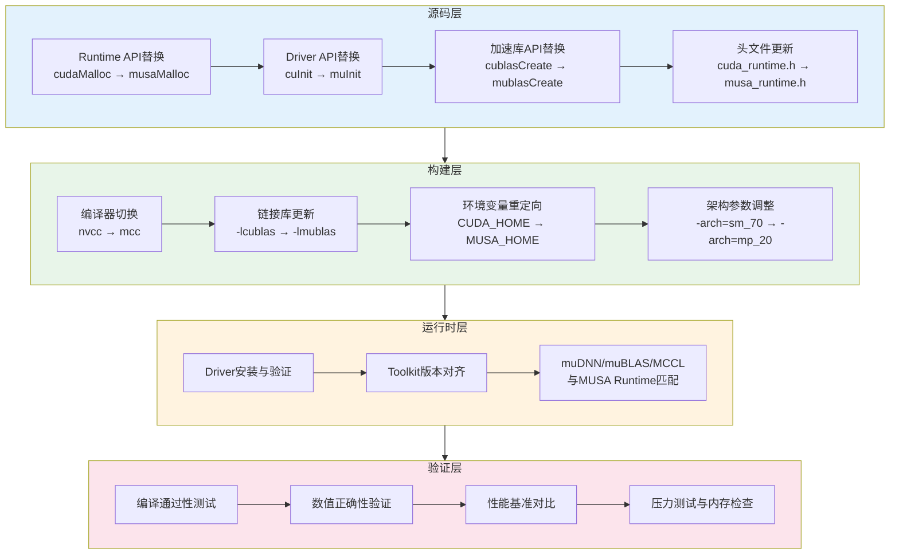

将一份成熟的CUDA代码库迁移到MUSA生态，表面上看只是一场大规模的"查找替换"——把`cuda`换成`musa`，把`nvcc`换成`mcc`，重新编译即可运行。然而，对于任何超过千行、依赖多个加速库、嵌套在复杂构建系统中的真实项目而言，这种简化认知往往会导致构建失败、运行时崩溃或隐蔽的性能退化。本页面向已掌握CUDA基础编程与MUSA生态概览的中级开发者，提供一套**可执行的系统性迁移方法论**：从源码层的命名空间映射规则，到构建层的Makefile与CMake改造，再到运行时层的版本匹配与验证策略，最后触及自动迁移工具的能力边界与人工审查要点。阅读完本页，你将能够制定符合自身项目规模的迁移计划，并规避最常见的兼容性陷阱。

Sources: [GPU计算生态完全指南.md](GPU计算生态完全指南.md#L868-L884) · [GPU计算生态完全指南.md](GPU计算生态完全指南.md#L2055-L2071)

## 迁移总览：四层迁移模型

在动手修改代码之前，有必要先建立对迁移工作量的全局认知。CUDA到MUSA的迁移并非单一维度的文本替换，而是贯穿**源码层、构建层、运行时层、验证层**的系统性工程。以下Mermaid图展示了这四个层次之间的依赖关系与核心任务：源码层负责API与数据类型的语义等价转换，构建层负责编译器、链接库与头文件路径的切换，运行时层负责驱动、Toolkit与独立库的版本对齐，验证层则负责正确性、性能与稳定性的回归测试。四个层次必须自下而上逐层通关，任何一层的遗漏都会在上层以编译错误或运行时异常的形式暴露出来。

**关键认知**：小型演示程序（如向量加法）通常只需处理源码层和构建层的前两项替换即可运行，但生产级项目往往深度依赖cuDNN的特定算法选择、cuBLAS的列优先约定、以及CMake的模块查找逻辑，因此四层模型中的每一步都可能被触发。建议在迁移初期先对代码库进行依赖扫描，明确项目触及了CUDA生态的哪些组件——是直接调用Runtime API，还是通过PyTorch框架间接使用CUDA后端——这将直接决定迁移的工作量和风险点。

Sources: [GPU计算生态完全指南.md](GPU计算生态完全指南.md#L1998-L2002) · [.zread/wiki/drafts/13-musajia-gou-she-ji-yu-cudajian-rong-xing.md](.zread/wiki/drafts/13-musajia-gou-she-ji-yu-cudajian-rong-xing.md#L128-L139)

## 命名空间替换法则：系统性映射表

MUSA对CUDA的兼容策略可以高度概括为**"语义等价、前缀替换"**。这一策略贯穿软件栈的每一层，从Runtime API到Driver API，从数学库到深度学习库，命名替换规则高度规律化，开发者可以依据推导规则完成系统性转换，而无需记忆每个函数的对应关系。下表汇总了CUDA到MUSA迁移中最核心的命名空间映射，涵盖函数前缀、数据类型、常量宏、头文件与链接库五大类别。

| 类别 | CUDA 示例 | MUSA 示例 | 替换规则 |
|------|-----------|-----------|---------|
| **Runtime函数** | `cudaMalloc`, `cudaMemcpy`, `cudaFree` | `musaMalloc`, `musaMemcpy`, `musaFree` | `cuda` → `musa` |
| **Driver函数** | `cuInit`, `cuDeviceGetCount`, `cuCtxCreate` | `muInit`, `muDeviceGetCount`, `muCtxCreate` | `cu` → `mu` |
| **Runtime数据类型** | `cudaError_t`, `cudaDeviceProp` | `musaError_t`, `musaDeviceProp` | `cuda` → `musa` |
| **Driver数据类型** | `CUresult`, `CUdevice`, `CUcontext` | `MUresult`, `MUdevice`, `MUcontext` | `CU` → `MU` |
| **Runtime常量** | `cudaSuccess`, `cudaMemcpyHostToDevice` | `MUSA_SUCCESS`, `musaMemcpyHostToDevice` | `cuda` → `musa`（状态码首字母大写） |
| **BLAS库函数** | `cublasCreate`, `cublasSgemm` | `mublasCreate`, `mublasSgemm` | `cublas` → `mublas` |
| **BLAS常量/类型** | `cublasStatus_t`, `CUBLAS_STATUS_SUCCESS` | `mublasStatus_t`, `MUBLAS_STATUS_SUCCESS` | `cublas` → `mublas` / `CUBLAS_` → `MUBLAS_` |
| **DNN库函数** | `cudnnCreate`, `cudnnConvolutionForward` | `mudnnCreate`, `mudnnConvolutionForward` | `cudnn` → `mudnn` |
| **DNN常量/类型** | `cudnnStatus_t`, `CUDNN_STATUS_SUCCESS` | `mudnnStatus_t`, `MUDNN_STATUS_SUCCESS` | `cudnn` → `mudnn` / `CUDNN_` → `MUDNN_` |
| **Runtime头文件** | `cuda_runtime.h` | `musa_runtime.h` | `cuda` → `musa` |
| **Driver头文件** | `cuda.h` | `musa.h` | `cuda` → `musa` |
| **BLAS头文件** | `cublas_v2.h` | `mublas_v2.h` | `cublas` → `mublas` |
| **DNN头文件** | `cudnn.h` | `mudnn.h` | `cudnn` → `mudnn` |
| **Runtime链接库** | `-lcudart` | `-lmusart` | `cudart` → `musart` |
| **Driver链接库** | `-lcuda` | `-lmusa` | `cuda` → `musa` |
| **BLAS链接库** | `-lcublas` | `-lmublas` | `cublas` → `mublas` |
| **DNN链接库** | `-lcudnn` | `-lmudnn` | `cudnn` → `mudnn` |
| **编译器** | `nvcc` | `mcc` | 整体替换 |
| **环境变量** | `CUDA_HOME` | `MUSA_HOME` | `CUDA` → `MUSA` |
| **架构参数** | `-arch=sm_70` | `-arch=mp_20` | `sm_` → `mp_` |

**深层规律洞察**：上述替换并非随意的命名重构，而是严格遵循"保留语义、替换命名空间"的原则。例如，`cublasSgemm`与`mublasSgemm`不仅函数名对应，其参数顺序、数据类型（`float*`设备指针、`int`维度、`cublasOperation_t`转置标志）以及列优先存储约定都完全一致。这意味着，一旦你建立了前缀替换的条件反射，迁移工作就从"重新学习API"降级为"系统性文本操作"。但需警惕一个细节：Driver API中的`CUresult`映射为`MUresult`而非`MUSAresult`，这是少数不严格遵循`cuda`→`musa`规则的地方，手动替换时需单独检查。

Sources: [GPU计算生态完全指南.md](GPU计算生态完全指南.md#L907-L913) · [.zread/wiki/drafts/21-ji-chu-xiang-liang-jia-fa-cudayu-musadui-bi.md](.zread/wiki/drafts/21-ji-chu-xiang-liang-jia-fa-cudayu-musadui-bi.md#L176-L188) · [.zread/wiki/drafts/22-ju-zhen-cheng-fa-cublasyu-mublas.md](.zread/wiki/drafts/22-ju-zhen-cheng-fa-cublasyu-mublas.md#L28-L37) · [.zread/wiki/drafts/23-juan-ji-wang-luo-cudnnyu-mudnn.md](.zread/wiki/drafts/23-juan-ji-wang-luo-cudnnyu-mudnn.md#L58-L68)

## 手动迁移五步法

对于中小型项目或需要精确控制迁移质量的场景，手动迁移仍然是最可靠的路径。以下五步流程将迁移任务分解为可验收的阶段，每一步都有明确的输入、操作与验收标准。建议配合版本控制系统（如Git）使用，每完成一步提交一个commit，以便在出现问题时快速回退。

**步骤1：依赖扫描**。在修改任何代码之前，先使用`grep`或IDE的全局搜索功能扫描项目中出现的CUDA关键词，生成一份"CUDA依赖清单"。搜索范围应覆盖`.cpp`、`.cu`、`.h`、`.hpp`源文件，以及`CMakeLists.txt`、`Makefile`等构建脚本。典型的搜索模式包括：`cuda_`、`cuInit`、`cuDevice`、`cublas`、`cudnn`、`nccl`、`nvcc`、`CUDA_HOME`。扫描结果将告诉你项目处于哪个复杂度层级：如果只涉及`cuda_runtime.h`和`cudaMalloc`，迁移风险极低；如果涉及`cudnn`高级算法选择或PTX内联汇编，则需要预留额外的兼容性验证时间。

**步骤2：环境准备**。在目标机器上安装与项目需求匹配的MUSA软件栈。由于MUSA生态遵循与CUDA相同的层级依赖链，安装顺序必须严格自下而上：先确认GPU硬件被正确识别（通过`mthreads-gmi`或对应工具），再安装MUSA Driver，然后安装MUSA Toolkit，最后根据项目需要安装muDNN、muBLAS、MCCL等独立库。版本匹配是关键约束——muDNN的版本必须与MUSA Toolkit严格对齐，错误的组合会导致编译错误或运行时符号未找到。对于需要多版本共存的场景，可通过`MUSA_HOME`环境变量指向不同版本的Toolkit路径来实现切换，但需确保`LD_LIBRARY_PATH`中的库搜索顺序与`MUSA_HOME`一致。

**步骤3：批量前缀替换**。依据上一节的系统性映射表，对源码执行批量替换。对于简单的项目，一组`sed`命令即可完成核心替换：`s/cuda/musa/g`、`s/CUDA/MUSA/g`、`s/cublas/mublas/g`、`s/cudnn/mudnn/g`、`s/nvcc/mcc/g`。但需注意边界情况：变量名中若包含`cuda`子串（如`my_cuda_buffer`）可能被误替换，因此建议在替换后通过代码审查或编译器报错来修正误伤。此外，错误检查宏（如`#define CHECK_CUDA(expr)`）内部的类型名称和常量也需要同步更新，否则宏展开后会产生未定义标识符。

**步骤4：构建系统改造**。修改项目的构建配置，将编译器从`nvcc`切换为`mcc`，将头文件搜索路径从`/usr/local/cuda/include`切换为`/usr/local/musa/include`，将库文件路径从`/usr/local/cuda/lib64`切换为`/usr/local/musa/lib`，并更新链接库名称（如`-lcublas`改为`-lmublas`）。对于CMake项目，若使用了`find_package(CUDA)`，需要替换为MUSA对应的查找模块，或直接使用显式的`include_directories`和`target_link_libraries`。架构参数也需要调整：将`-arch=sm_70`之类的NVIDIA计算能力参数替换为摩尔线程GPU对应的`-arch=mp_20`等参数，具体版本号需查阅目标GPU的官方文档。

**步骤5：编译验证与测试**。执行完整编译，逐个修复编译错误。常见的编译错误包括：头文件未找到（路径或文件名替换遗漏）、未定义引用（链接库名称未更新）、类型不匹配（常量宏前缀未完全替换）。编译通过后，运行项目的单元测试和集成测试，验证数值正确性。对于科学计算和深度学习项目，需特别关注浮点运算的精度差异——虽然MUSA与CUDA在API层面语义等价，但底层硬件的AI Core与NVIDIA Tensor Core在混合精度舍入模式上可能存在细微差异，这可能导致训练损失曲线或推理结果出现可接受范围内的偏差。

Sources: [GPU计算生态完全指南.md](GPU计算生态完全指南.md#L1024-L1038) · [GPU计算生态完全指南.md](GPU计算生态完全指南.md#L2055-L2071) · [.zread/wiki/drafts/20-ban-ben-pi-pei-yu-an-zhuang-ce-lue.md](.zread/wiki/drafts/20-ban-ben-pi-pei-yu-an-zhuang-ce-lue.md#L100-L104)

## 构建系统迁移：Makefile与CMake实战

生产项目的构建系统往往比单文件编译复杂得多，涉及条件编译、第三方库探测、多目标生成等机制。将构建系统从CUDA适配到MUSA时，核心原则是将所有硬编码的CUDA路径、编译器名称和库名抽象为可配置变量，从而使项目能够同时支持两个后端。下表对比了Makefile与CMake两种主流构建系统中需要修改的关键配置项。

| 配置项 | CUDA生态（Makefile） | MUSA生态（Makefile） | CUDA生态（CMake） | MUSA生态（CMake） |
|--------|---------------------|---------------------|-------------------|-------------------|
| 编译器 | `NVCC = nvcc` | `NVCC = mcc` | `find_package(CUDA)` | 自定义查找模块或显式路径 |
| 头文件路径 | `-I$(CUDA_HOME)/include` | `-I$(MUSA_HOME)/include` | `CUDA_INCLUDE_DIRS` | `$(MUSA_HOME)/include` |
| 库文件路径 | `-L$(CUDA_HOME)/lib64` | `-L$(MUSA_HOME)/lib` | `CUDA_LIBRARIES` | `$(MUSA_HOME)/lib` |
| Runtime链接 | `-lcudart` | `-lmusart` | `${CUDA_CUDA_LIBRARY}` | `-lmusart` |
| BLAS链接 | `-lcublas` | `-lmublas` | `${CUDA_CUBLAS_LIBRARIES}` | `-lmublas` |
| DNN链接 | `-lcudnn` | `-lmudnn` | 手动指定 | `-lmudnn` |
| 架构参数 | `-arch=sm_70` | `-arch=mp_20` | `CUDA_NVCC_FLAGS` | 传递给`mcc`的对应参数 |
| 环境变量 | `CUDA_HOME` | `MUSA_HOME` | `CUDA_HOME` | `MUSA_HOME` |

**CMake迁移进阶建议**：许多成熟项目使用CMake的`FindCUDA`或较新版本的`enable_language(CUDA)`模块来管理CUDA编译。MUSA生态目前可能尚未提供与NVIDIA完全对等的CMake第一方支持模块，因此推荐的做法是在`CMakeLists.txt`中增加一个后端选项（如`-DGPU_BACKEND=MUSA`），通过条件分支切换编译器与路径设置。这样既能保持代码的跨平台能力，也便于在未来维护两个后端。例如，可将`set(CMAKE_CUDA_COMPILER ${CUDA_NVCC_EXECUTABLE})`改写为根据`GPU_BACKEND`选择`nvcc`或`mcc`的逻辑，同时将包含目录和链接库列表抽象为变量。对于使用`autotools`或`Bazel`的项目，迁移逻辑类似：找到所有硬编码的`cuda`、`nvcc`、`CUDA_HOME`，依据映射表执行对应替换，并在构建脚本中增加环境变量探测逻辑。

Sources: [GPU计算生态完全指南.md](GPU计算生态完全指南.md#L1030-L1037) · [GPU计算生态完全指南.md](GPU计算生态完全指南.md#L1991-L1996)

## 自动迁移工具：能力边界与使用策略

摩尔线程提供了代码迁移工具，可以自动完成大部分前缀替换工作。这类工具的本质是基于规则的模式匹配引擎：输入CUDA源码，按照预设的映射词典执行文本级别的替换，输出MUSA兼容源码，并附带迁移报告。对于千行级别、仅使用标准Runtime API和主流加速库（cuBLAS、cuDNN）的项目，自动工具能够显著缩短迁移周期，将原本需要数小时的手工替换压缩到几分钟内完成。

**自动工具的典型能力范围**包括：标准Runtime API的函数名与类型名替换（`cudaMalloc`→`musaMalloc`等）、头文件路径与包含指令更新、编译器调用指令的改写、以及常见宏定义和错误检查模板的批量转换。然而，开发者必须清醒认识其**能力边界**：首先，对于依赖NVIDIA特定扩展的代码——如PTX内联汇编（`asm("..."::"...")`）、CUDA特定Intrinsic函数（如`__shfl_sync`的某些变体）、以及直接操作计算能力相关寄存器的底层优化——自动工具无法保证语义正确的转换，甚至可能生成无法编译的伪代码；其次，自动工具通常不处理构建系统的深层逻辑，如CMake模块的复杂依赖探测或条件编译分支；第三，性能调优相关的隐式假设（如针对NVIDIA Tensor Core内存布局的手动优化）在迁移后可能不再适用，需要人工审查。因此，**推荐的使用策略**是将自动迁移工具作为"第一遍草稿生成器"：先用工具完成80%的机械替换，再由熟悉项目的开发者进行20%的人工审查与修正，重点检查PTX汇编、Intrinsic调用、版本兼容性断言以及性能关键路径的Kernel代码。

Sources: [GPU计算生态完全指南.md](GPU计算生态完全指南.md#L2070-L2071) · [.zread/wiki/drafts/13-musajia-gou-she-ji-yu-cudajian-rong-xing.md](.zread/wiki/drafts/13-musajia-gou-she-ji-yu-cudajian-rong-xing.md#L128-L139)

## 兼容性边界与风险清单

尽管MUSA在架构设计上追求与CUDA的全栈对齐，但兼容性并非无限延伸。在制定迁移计划时，必须预先识别那些无法通过简单前缀替换解决的差异点，并为每个风险点准备回退方案或替代实现。以下风险清单按影响程度从低到高排列，建议在迁移前的技术评审会议中逐条核对。

| 风险类别 | 具体表现 | 影响程度 | 应对策略 |
|---------|---------|---------|---------|
| **硬件架构差异** | NVIDIA Tensor Core vs 摩尔线程AI Core在混合精度格式、峰值吞吐量和舍入模式上存在差异 | 中 | 迁移后对FP16/INT8算子进行数值精度测试，必要时调整训练超参数或改用FP32 |
| **库特性覆盖度** | muDNN/muBLAS的某些高级API或最新版本特性尚未实现 | 高 | 迁移前查阅摩尔线程兼容性矩阵，确认目标API已被支持；若不支持，需手写Kernel替代或降级算法 |
| **PTX内联汇编** | 直接嵌入PTX指令的CUDA Kernel无法被mcc正确编译 | 高 | 必须重写为MISA（摩尔线程指令集架构）汇编或改用标准CUDA C++语义 |
| **Intrinsic函数** | NVIDIA特定的Warp级Intrinsic（如某些`__shfl`变体）可能缺失或行为不同 | 中 | 审查所有Intrinsic调用，用MUSA等效函数替换，或在Warp级操作处增加兼容性封装层 |
| **版本节奏滞后** | MUSA生态的版本更新可能滞后于CUDA，导致新特性不可用 | 低-中 | 锁定项目依赖的CUDA特性版本，确认MUSA侧已提供对应支持后再启动迁移 |
| **性能特征差异** | 相同算法的Kernel在MUSA上的内存带宽与延迟特征与NVIDIA不同 | 中 | 迁移后建立新的性能基线，重新进行Profiling和内存访问优化，勿直接照搬NVIDIA优化参数 |

**最关键的认知**：MUSA的兼容性保证停留在**API语义层**，而非**硬件性能层**。一份通过前缀替换成功编译的CUDA代码，在MUSA上必然产生逻辑等价的结果（在排除精度差异的前提下），但其执行时间、内存占用和吞吐量不会自动与NVIDIA平台持平。性能敏感型应用（如大语言模型推理、实时图像处理）在迁移后必须投入专门的Profiling与调优周期，使用摩尔线程提供的性能分析工具重新识别瓶颈。

Sources: [.zread/wiki/drafts/13-musajia-gou-she-ji-yu-cudajian-rong-xing.md](.zread/wiki/drafts/13-musajia-gou-she-ji-yu-cudajian-rong-xing.md#L128-L139) · [GPU计算生态完全指南.md](GPU计算生态完全指南.md#L1998-L2002)

## 验证与测试策略

编译通过只是迁移的起点，而非终点。一套严谨的验证策略应覆盖三个维度：**编译正确性**、**数值正确性**与**运行时稳定性**。在编译维度，建议开启编译器的全部警告（`mcc -Wall`或等效选项），并解决所有由替换引发的隐式类型转换或废弃API警告。在数值维度，对于计算密集型应用（如矩阵乘法、卷积网络），应准备与CUDA版本 bitwise 可比或容差可接受的参考输出，通过逐元素比较或相对误差计算来验证MUSA版本的结果。在稳定性维度，需运行长时间压力测试与内存泄漏检测：使用`cuda-memcheck`的MUSA等效工具（若有提供）检查越界访问和未初始化读取，同时通过多次循环执行观察是否存在资源泄漏（如未调用`musaFree`导致的显存耗尽）。

**回归测试清单模板**：

| 测试阶段 | 验证内容 | 通过标准 |
|---------|---------|---------|
| 编译阶段 | 零错误、零警告（或警告已审查） | `mcc`返回0 |
| 功能阶段 | 单测全部通过 | 输出与CUDA参考值的相对误差 `< 1e-5`（FP32） |
| 内存阶段 | 无越界访问、无泄漏 | 内存检测工具报告clean |
| 性能阶段 | 关键路径耗时在预期范围内 | 不劣于CPU基线的10倍（示例阈值，按项目调整） |
| 并发阶段 | 多流、多线程场景稳定 | 无死锁、无竞争条件导致的随机失败 |

Sources: [GPU计算生态完全指南.md](GPU计算生态完全指南.md#L2090-L2101)

## 性能预期与调优方向

迁移后的性能表现是项目决策者最关心的问题之一。需要建立正确的预期：MUSA通过兼容层运行CUDA代码时，API调用的翻译本身可能引入轻微开销，但真正的性能差异主要来自硬件架构——摩尔线程GPU的AI Core、内存带宽和缓存层次与NVIDIA同代产品不同，因此**不能假设相同的Kernel在MUSA上会自动达到与CUDA相同的加速比**。对于计算受限型Kernel（如大规模矩阵乘法），性能高度依赖muBLAS的优化水平；对于内存受限型Kernel（如逐元素向量运算），性能则取决于显存带宽和全局内存合并访问效率。建议迁移后首先使用摩尔线程提供的Profiling工具采集Kernel级的执行时间、内存吞吐量和占用率指标，识别瓶颈后再进行针对性优化——是调整Block大小以更好地匹配MUSA Compute Unit的Warp尺寸，还是重构共享内存的Bank访问模式以减少冲突。切忌在未Profiling的情况下直接照搬NVIDIA平台上的"最优参数"。

Sources: [GPU计算生态完全指南.md](GPU计算生态完全指南.md#L1998-L2002)

## 总结与下一步阅读建议

CUDA到MUSA的迁移本质上是一场**"保留语义、替换实现"**的工程实践。掌握系统性映射规则后，源码层的迁移风险已大幅降低；真正的挑战集中在构建系统的适配、版本链的对齐、以及迁移后的性能基线重建。如果你已完成本页阅读并准备动手实践，建议按照以下路径继续深入：

- 若尚未建立GPU生态的全局认知，请返回阅读[GPU计算生态全景图](3-gpuji-suan-sheng-tai-quan-jing-tu)与[GPU生态层级依赖关系图](17-gpusheng-tai-ceng-ji-yi-lai-guan-xi-tu)，理解驱动、Runtime、Toolkit与库之间的严格依赖关系。
- 如需在具体算子层面验证迁移效果，可参考[基础向量加法：CUDA与MUSA对比](21-ji-chu-xiang-liang-jia-fa-cudayu-musadui-bi)、[矩阵乘法：cuBLAS与muBLAS](22-ju-zhen-cheng-fa-cublasyu-mublas)以及[卷积网络：cuDNN与muDNN](23-juan-ji-wang-luo-cudnnyu-mudnn)，这三页提供了可直接编译运行的前后对比代码。
- 若迁移涉及多组件版本管理，[版本匹配与安装策略](20-ban-ben-pi-pei-yu-an-zhuang-ce-lue)提供了详细的版本约束矩阵与安装顺序建议。
- 遇到具体问题时，[常见问题解答](25-chang-jian-wen-ti-jie-da)汇总了初学者与中级开发者最常碰到的报错现象及排查方案。