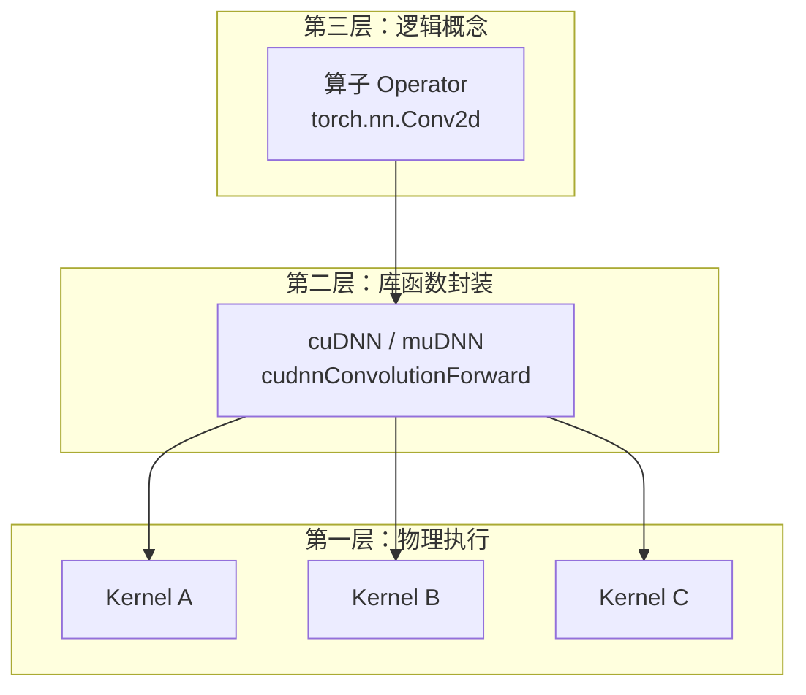
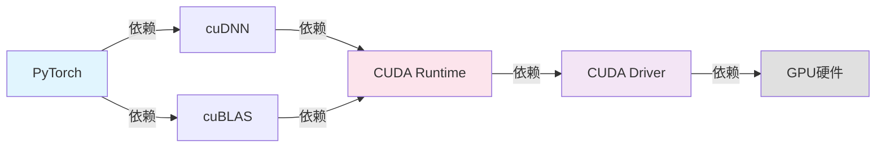
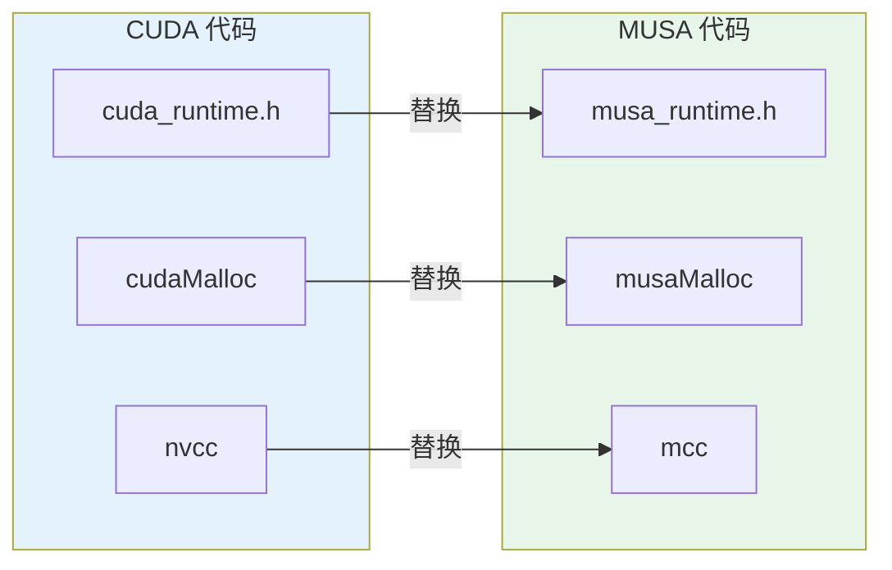

本文汇集初学者在接触 GPU 计算生态时最频繁遇到的困惑，按**概念辨析**、**安装环境**、**代码迁移**、**调试排查**四大主题组织。每个问题都配有**直观类比**和**可操作的答案**，帮助你在不迷失于术语海洋的前提下快速建立判断能力。如果你在阅读其他章节时遇到"这个词和那个词有什么区别"或"为什么我装了这个还需要那个"的疑问，这里大概率已有解答。

Sources: [GPU计算生态完全指南.md](GPU计算生态完全指南.md#L2006-L2102)

---

## 概念辨析：最容易混淆的三组术语

### "SDK 和 Toolkit 是不是同一个东西？"

**答：不是。** 这是初学者在下载安装阶段最常踩的坑。

Toolkit 是**开发工具集合**，包含编译器（`nvcc`/`mcc`）、运行时库（`libcudart.so`/`libmusart.so`）、数学库和调试工具。没有 Toolkit，你连一个 `.cu` 文件都编译不了。SDK 则是**学习资源集合**，包含示例代码、文档和教程。它让你学得更快，但绝不是编译运行的前提。

| 特性 | Toolkit | SDK |
|------|---------|-----|
| 本质 | 开发工具 | 学习资源 |
| 是否必须 | 是 | 否 |
| 包含内容 | 编译器、库、调试器 | 示例代码、文档、教程 |
| 餐厅类比 | 厨房里的刀具锅具 | 菜谱和烹饪教学视频 |

**一句话记忆**：没有 Toolkit 你做不了菜；没有 SDK 你也能做菜，只是不知道怎么做最好吃。更详细的层级定位可参考 [Toolkit、SDK与独立库的定位](18-toolkit-sdkyu-du-li-ku-de-ding-wei)。

Sources: [GPU计算生态完全指南.md](GPU计算生态完全指南.md#L493-L527)

### "算子和 Kernel 有什么区别？"

**答：两者有重叠，但处于不同抽象层级。**

**Kernel** 是指在 GPU 上实际执行的函数，通常用 `__global__` 修饰，由 CUDA/MUSA 编程者直接编写或调用。**算子（Operator）** 则是深度学习框架中的逻辑概念，例如 PyTorch 里的 `torch.nn.Conv2d`。一个算子在底层可能由一个或多个 Kernel 组合实现，也可能通过调用 cuDNN/muDNN 这样的优化库来完成。

它们的关系可以用三层架构来理解：



**简单类比**：算子是"菜单上的菜名"，Kernel 是"厨房里真正炒菜的厨师"。一道菜可能需要多位厨师协作完成。关于算子三层实现的完整分析，可阅读 [算子的三层实现架构](19-suan-zi-de-san-ceng-shi-xian-jia-gou)。

Sources: [GPU计算生态完全指南.md](GPU计算生态完全指南.md#L660-L702)

### "Runtime API 和 Driver API 我该用哪个？"

**答：除非你在开发深度学习框架或需要精细控制多上下文，否则一律选 Runtime API。**

Runtime API 会自动管理设备上下文、模块加载和内存池，代码量少、学习曲线平缓。Driver API 则暴露更多底层细节，如手动创建 `CUcontext`、加载 PTX/CUBIN 模块，适合需要极致控制的场景。

| 场景 | 推荐 API | 原因 |
|------|---------|------|
| 普通应用开发 | Runtime API | 简单、易用、代码量少 |
| 深度学习框架开发 | Driver API | 需要精细控制上下文、模块加载 |
| 需要多上下文管理 | Driver API | Runtime API 自动管理上下文，不够灵活 |
| 学习 GPU 底层原理 | Driver API | 理解更底层的机制 |

**一句话记忆**：Runtime API 像自动挡汽车，Driver API 像手动挡汽车——除非你明确知道为什么需要手动挡，否则选自动挡。两种 API 的详细对比和代码示例见 [CUDA驱动与运行时：Driver API与Runtime API](8-cudaqu-dong-yu-yun-xing-shi-driver-apiyu-runtime-api)。

Sources: [GPU计算生态完全指南.md](GPU计算生态完全指南.md#L189-L215)

---

## 安装与环境：为什么装了 A 还需要 B

### "我装了 CUDA Toolkit，为什么还需要 cuDNN？"

**答：Toolkit 提供的是通用 GPU 编程能力，cuDNN 提供的是深度学习专用算子的专家级优化。**

CUDA Toolkit 包含编译器、Runtime、基础数学库（cuBLAS 等），足以让你手写 Kernel 做通用并行计算。但深度学习中的卷积、池化、归一化等操作涉及极其复杂的内存访问模式和张量布局优化，自己手写很难达到 cuDNN 工程师调优后的性能。cuDNN 正是 NVIDIA 专门为此发布的独立库。

| 使用场景 | 需要安装 |
|---------|---------|
| 通用 GPU 计算（非深度学习） | CUDA Toolkit 即可 |
| 深度学习训练/推理 | Toolkit + cuDNN |
| 多 GPU 分布式训练 | Toolkit + cuDNN + NCCL |

**餐厅类比**：Toolkit 是"厨房设备"，cuDNN 是"预制菜供应商"——你可以用厨房设备从零做菜，但用预制菜更快更省心。cuDNN 的详细功能和代码示例请参考 [cuDNN深度神经网络库](11-cudnnshen-du-shen-jing-wang-luo-ku)。

Sources: [GPU计算生态完全指南.md](GPU计算生态完全指南.md#L528-L576)

### "cuDNN 和 muDNN 的 API 完全一样吗？"

**答：设计目标高度兼容，但不能保证 100% 一致。**

muDNN 的核心策略是将 cuDNN 中的前缀从 `cudnn` 替换为 `mudnn`，常量前缀从 `CUDNN_` 替换为 `MUDNN_`。绝大多数常用 API（如卷积前向、池化、归一化）都有对应实现。但需要注意以下差异：

| 差异类型 | 说明 |
|---------|------|
| 高级特性 | 某些 cuDNN 最新特性可能尚未在 muDNN 中实现 |
| 性能优化 | 同一算子在两种 GPU 上的优化策略不同 |
| 版本更新 | muDNN 通常滞后于 cuDNN 的版本迭代 |
| 编译链接 | `-lcudnn` 需改为 `-lmudnn` |

**迁移建议**：先在目标平台上用最小示例验证你需要的 cuDNN 特性是否被 muDNN 支持，再逐步迁移完整项目。摩尔线程也提供自动代码迁移工具来处理大部分替换工作。更多对比细节见 [卷积网络：cuDNN与muDNN](23-juan-ji-wang-luo-cudnnyu-mudnn)。

Sources: [GPU计算生态完全指南.md](GPU计算生态完全指南.md#L1089-L1116)

### "版本不匹配会导致什么问题？"

**答：版本不匹配是 GPU 开发中最常见的编译和运行时错误来源。**

cuDNN 与 CUDA Toolkit、PyTorch 与 CUDA、甚至 NVIDIA 驱动与 CUDA Toolkit 之间都存在严格的版本对应关系。常见的不匹配后果如下：

| 不匹配类型 | 典型症状 | 解决方案 |
|-----------|---------|---------|
| cuDNN 与 CUDA 版本不兼容 | 编译错误（头文件不兼容）、运行时找不到符号 | 查阅 NVIDIA 官方兼容性表，重新安装匹配版本 |
| PyTorch 与 CUDA 版本不兼容 | `CUDA error: no kernel image is available` | 用 `torch.version.cuda` 检查，安装对应 wheel |
| 驱动与 Toolkit 版本不兼容 | Runtime API 初始化失败 | 升级驱动到 Toolkit 要求的最低版本 |



**关键原则**：沿着依赖链从下到上确认版本。先确认驱动支持你的 GPU，再确认 Runtime 兼容驱动，最后确认上层库兼容 Runtime。更系统的依赖关系分析请参考 [版本匹配与安装策略](20-ban-ben-pi-pei-yu-an-zhuang-ce-lue) 和 [GPU生态层级依赖关系图](17-gpusheng-tai-ceng-ji-yi-lai-guan-xi-tu)。

Sources: [GPU计算生态完全指南.md](GPU计算生态完全指南.md#L1645-L1658)

---

## CUDA 与 MUSA 迁移：代码层面的高频疑问

### "MUSA 能直接跑 CUDA 代码吗？"

**答：不能不经修改直接运行，但迁移成本很低。**

MUSA 不是 CUDA 的二进制兼容层，你需要完成以下几步"翻译"工作：

1. **头文件替换**：`cuda_runtime.h` → `musa_runtime.h`
2. **API 前缀替换**：`cudaMalloc` → `musaMalloc`、`cudaMemcpy` → `musaMemcpy` 等
3. **编译器替换**：`nvcc` → `mcc`
4. **常量前缀替换**：`CUDA_SUCCESS` → `MUSA_SUCCESS`、`CUBLAS_` → `MUBLAS_` 等



**类比**：CUDA 代码像英语作文，MUSA 代码像美式英语作文——语法几乎一样，只是个别单词不同，需要"翻译"一下。对于完整的基础向量加法对比，请参考 [基础向量加法：CUDA与MUSA对比](21-ji-chu-xiang-liang-jia-fa-cudayu-musadui-bi)；系统性的迁移策略见 [CUDA到MUSA迁移策略与工具](24-cudadao-musaqian-yi-ce-lue-yu-gong-ju)。

Sources: [GPU计算生态完全指南.md](GPU计算生态完全指南.md#L855-L917)

### "Kernel 语法需要改吗？"

**答：不需要。** `__global__`、`__device__`、`blockIdx`、`threadIdx`、`<<<...>>>` 启动语法在 MUSA 中完全保持不变。这是 MUSA "兼容 CUDA 生态"设计理念的最直接体现——让开发者的算法逻辑和并行思维模式可以零成本迁移。

真正需要改的只有**运行时 API 调用**和**编译命令**。以下是一个最小对比：

| 项目 | CUDA | MUSA |
|------|------|------|
| Kernel 定义 | `__global__ void foo(...)` | `__global__ void foo(...)` |
| 线程索引 | `blockIdx.x * blockDim.x + threadIdx.x` | 相同 |
| 启动语法 | `foo<<<grid, block>>>(...)` | 相同 |
| 内存分配 | `cudaMalloc` | `musaMalloc` |
| 内存拷贝 | `cudaMemcpy` | `musaMemcpy` |
| 编译器 | `nvcc` | `mcc` |

Sources: [GPU计算生态完全指南.md](GPU计算生态完全指南.md#L1318-L1356)

---

## 内存与调试：运行时的常见陷阱

### "cudaMalloc 返回失败，但我明明还有显存？"

**答：显存不足只是原因之一，驱动未正确加载、上下文未初始化、传入空指针同样会导致分配失败。**

排查建议按以下顺序进行：

1. **先检查错误码**：不要忽略 `cudaMalloc` 的返回值，使用 `cudaGetErrorString` 打印具体错误信息
2. **确认 GPU 可见**：运行 `nvidia-smi`（或 `musa-smi`）查看系统是否识别到 GPU
3. **检查显存占用**：其他进程可能已占用大量显存，导致剩余空间不足
4. **验证指针地址**：确保传入的是合法指针的地址（`&ptr`），而非未初始化指针

```cpp
cudaError_t err = cudaMalloc((void**)&d_ptr, size);
if (err != cudaSuccess) {
    printf("分配失败: %s\n", cudaGetErrorString(err));
    // 根据错误信息进一步排查
}
```

关于 GPU 内存类型的完整介绍（全局内存、共享内存、固定内存等），请参阅 [CUDA内存管理：分配、传输与内存类型](9-cudanei-cun-guan-li-fen-pei-chuan-shu-yu-nei-cun-lei-xing)。

Sources: [GPU计算生态完全指南.md](GPU计算生态完全指南.md#L324-L405)

### "为什么 CPU 到 GPU 的数据传输这么慢？"

**答：传输速度受两个关键因素制约——PCIe 带宽和主机内存类型。**

默认情况下，`malloc` 分配的 CPU 内存是**可分页内存（Pageable Memory）**，GPU 无法直接访问，需要驱动先做一次额外的拷贝到**固定内存（Pinned Memory）**，再通过 DMA 传输到 GPU。如果你用 `cudaMallocHost`（或 `musaMallocHost`）直接分配固定内存，可以跳过中间拷贝，传输速度通常能提升 1.5 到 2 倍。

| 内存类型 | 分配方式 | 传输到 GPU 速度 | 适用场景 |
|---------|---------|---------------|---------|
| 可分页内存 | `malloc` / `new` | 较慢（需额外拷贝） | 小规模数据、无需频繁传输 |
| 固定内存 | `cudaMallocHost` | 较快（DMA 直传） | 大规模数据、频繁传输、异步流 |

**注意**：固定内存会锁定物理页，分配过多会影响操作系统内存管理，建议仅用于需要频繁传输的数据缓冲区。

Sources: [GPU计算生态完全指南.md](GPU计算生态完全指南.md#L407-L420)

### "共享内存和全局内存应该怎么选？"

**答：共享内存快但容量小且生命周期仅限 Block；全局内存慢但容量大且全局可见。** 两者的定位完全不同：

| 内存类型 | 位置 | 访问延迟 | 容量 | 生命周期 | 典型用途 |
|---------|------|---------|------|---------|---------|
| 全局内存 | GPU 显存 | 高（约数百周期） | 几 GB 到几十 GB | 程序运行期间 | 存储大量输入/输出数据 |
| 共享内存 | SM 内部 | 低（约数十周期） | 每 Block 几十 KB | Block 执行期间 | 线程块内数据复用和交换 |

**选择原则**：如果同一块（Block）内的多个线程需要重复访问同一批数据，先将数据从全局内存加载到共享内存，再在共享内存上做计算，通常能显著降低延迟。但如果数据只被访问一次，额外的加载操作反而会增加开销。

Sources: [GPU计算生态完全指南.md](GPU计算生态完全指南.md#L407-L420)

---

## 总结：一张表速查所有高频问题

| 问题类别 | 核心结论 | 推荐深入阅读 |
|---------|---------|-------------|
| Toolkit vs SDK | Toolkit 是必需工具，SDK 是可选教程 | [Toolkit、SDK与独立库的定位](18-toolkit-sdkyu-du-li-ku-de-ding-wei) |
| Kernel vs 算子 | Kernel 是物理实现，算子是逻辑概念 | [算子的三层实现架构](19-suan-zi-de-san-ceng-shi-xian-jia-gou) |
| Runtime vs Driver API | 普通开发选 Runtime，框架开发选 Driver | [CUDA驱动与运行时](8-cudaqu-dong-yu-yun-xing-shi-driver-apiyu-runtime-api) |
| 是否需要 cuDNN | 深度学习必须装，通用计算不需要 | [cuDNN深度神经网络库](11-cudnnshen-du-shen-jing-wang-luo-ku) |
| CUDA 转 MUSA | 不能直跑，但改前缀即可迁移 | [CUDA到MUSA迁移策略与工具](24-cudadao-musaqian-yi-ce-lue-yu-gong-ju) |
| 版本不匹配 | 从上到下逐层检查依赖链 | [版本匹配与安装策略](20-ban-ben-pi-pei-yu-an-zhuang-ce-lue) |
| 内存分配失败 | 查错误码、查 `nvidia-smi`、查指针 | [CUDA内存管理](9-cudanei-cun-guan-li-fen-pei-chuan-shu-yu-nei-cun-lei-xing) |
| 数据传输慢 | 用固定内存（`cudaMallocHost`）加速 | [CUDA内存管理](9-cudanei-cun-guan-li-fen-pei-chuan-shu-yu-nei-cun-lei-xing) |

如果你在完成本页阅读后仍然遇到未覆盖的问题，建议按照以下顺序继续探索：**先查阅对应组件的专项页面，再动手编译运行最小示例，最后对照错误信息反向定位**。GPU 生态的复杂性往往不在于单个知识点，而在于组件之间的**依赖关系和版本约束**——理解了"谁依赖谁"，就能独立解决大多数环境配置问题。