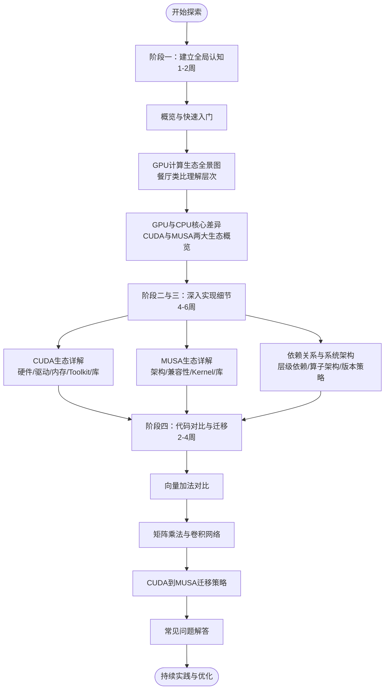

面对CUDA与MUSA两大GPU计算生态，初学者最常遇到的困境不是某个具体API难以理解，而是面对驱动、运行时、编译器、数学库、深度学习库等众多层级时，不知道该从何处入手、按什么顺序学习。GPU计算生态就像一座多层建筑，如果没有导览图，很容易在其中迷路。本页作为整套Wiki的终点与起点，将为你提供一条经过结构化设计的渐进式学习路径，并汇总关键参考资源，帮助你从全局认知平滑过渡到独立开发。

Sources: [GPU计算生态完全指南.md](GPU计算生态完全指南.md#L2105-L2122)

## 为什么需要系统性的学习路径

GPU计算涉及硬件架构、驱动程序、运行时系统、编译工具链、加速库和上层框架等多个层次，每个层次都有其独特的概念模型和编程接口。如果跳过基础直接深入Kernel优化，你会发现自己不得不频繁回退去补驱动和内存管理的知识；如果停留在概念层面从不实践，则永远无法建立对性能瓶颈的直观感知。一套合理的学习路径应当遵循"先建立全景图，再逐层深入；先理解单生态，再对比双生态；先阅读示例，再动手修改"的原则。Wiki的目录结构正是按照这一原则编排的，从[概览](1-gai-lan)到[常见问题解答](25-chang-jian-wen-ti-jie-da)，形成了一条完整的认知递进链。

Sources: [GPU计算生态完全指南.md](GPU计算生态完全指南.md#L2105-L2122)

## 学习路径总览

下图展示了从入门到实战的四阶段学习路线，每个阶段对应Wiki中特定的页面组合。箭头表示推荐的学习顺序，你可以根据自身背景跳过已掌握的内容，但不建议打乱阶段内部的依赖关系。

这张图的核心逻辑是"分层递进、对比强化"。阶段一帮你建立生态全景思维，阶段二和阶段三分别深入CUDA与MUSA的内部实现，阶段四通过并排的代码对比将知识转化为可迁移的技能。无论你的最终目标是优化深度学习训练性能，还是将现有CUDA项目移植到国产GPU平台，这条路径都能为你提供扎实的知识底座。

Sources: [GPU计算生态完全指南.md](GPU计算生态完全指南.md#L2105-L2141)

## 分阶段学习指南

### 阶段一：建立全局认知（1-2周）

**阅读顺序**：[概览](1-gai-lan) → [快速入门](2-kuai-su-ru-men) → [GPU计算生态全景图](3-gpuji-suan-sheng-tai-quan-jing-tu) → [餐厅类比：理解GPU生态层次](4-can-ting-lei-bi-li-jie-gpusheng-tai-ceng-ci) → [GPU与CPU的核心差异](5-gpuyu-cpude-he-xin-chai-yi) → [CUDA与MUSA：两大生态概览](6-cudayu-musa-liang-da-sheng-tai-gai-lan)。本阶段的核心目标是建立"分层思维"，理解从硬件到应用层的依赖关系，而非记忆具体API。建议在学习过程中绘制属于自己的"餐厅类比"图，将抽象的分层架构转化为可视化的认知模型。

Sources: [GPU计算生态完全指南.md](GPU计算生态完全指南.md#L2123-L2127)

### 阶段二：CUDA生态深入（2-3周）

**阅读顺序**：[CUDA硬件架构：核心、SM与内存层次](7-cudaying-jian-jia-gou-he-xin-smyu-nei-cun-ceng-ci) → [CUDA驱动与运行时：Driver API与Runtime API](8-cudaqu-dong-yu-yun-xing-shi-driver-apiyu-runtime-api) → [CUDA内存管理：分配、传输与内存类型](9-cudanei-cun-guan-li-fen-pei-chuan-shu-yu-nei-cun-lei-xing) → [CUDA Toolkit与nvcc编译器](10-cuda-toolkityu-nvccbian-yi-qi) → [cuDNN深度神经网络库](11-cudnnshen-du-shen-jing-wang-luo-ku) → [cuBLAS与NCCL通信库](12-cublasyu-nccltong-xin-ku)。CUDA生态是理解GPU计算的"标准答案"，其文档最丰富、社区最活跃。每读完一章，务必编译并运行该章的示例代码，观察输出结果。特别要关注Driver API与Runtime API的选择场景，以及不同内存类型的性能差异，这些是后续优化的关键基础。

Sources: [GPU计算生态完全指南.md](GPU计算生态完全指南.md#L2128-L2132)

### 阶段三：MUSA生态与系统架构（2-3周）

**阅读顺序**：[MUSA架构设计与CUDA兼容性](13-musajia-gou-she-ji-yu-cudajian-rong-xing) → [MUSA驱动、运行时与mcc编译器](14-musaqu-dong-yun-xing-shi-yu-mccbian-yi-qi) → [muDNN、muBLAS与MCCL](15-mudnn-mublasyu-mccl) → [MUSA Kernel编写与向量加法](16-musa-kernelbian-xie-yu-xiang-liang-jia-fa) → [GPU生态层级依赖关系图](17-gpusheng-tai-ceng-ji-yi-lai-guan-xi-tu) → [Toolkit、SDK与独立库的定位](18-toolkit-sdkyu-du-li-ku-de-ding-wei) → [算子的三层实现架构](19-suan-zi-de-san-ceng-shi-xian-jia-gou) → [版本匹配与安装策略](20-ban-ben-pi-pei-yu-an-zhuang-ce-lue)。本阶段的重点在于对比理解：MUSA在哪些设计上与CUDA保持一致以方便迁移，在哪些地方因硬件差异而不得不做出不同选择。系统架构部分（依赖关系、算子分层、版本策略）是连接两个生态的桥梁知识，能帮助你从"会写代码"提升到"会设计系统"。

Sources: [GPU计算生态完全指南.md](GPU计算生态完全指南.md#L2133-L2141)

### 阶段四：代码对比与迁移实战（2-4周）

**阅读顺序**：[基础向量加法：CUDA与MUSA对比](21-ji-chu-xiang-liang-jia-fa-cudayu-musadui-bi) → [矩阵乘法：cuBLAS与muBLAS](22-ju-zhen-cheng-fa-cublasyu-mublas) → [卷积网络：cuDNN与muDNN](23-juan-ji-wang-luo-cudnnyu-mudnn) → [CUDA到MUSA迁移策略与工具](24-cudadao-musaqian-yi-ce-lue-yu-gong-ju) → [常见问题解答](25-chang-jian-wen-ti-jie-da)。这是知识向技能转化的关键阶段。建议你选择一个小型但完整的项目（如一个手写数字识别的CNN推理程序），先实现CUDA版本，再尝试用MUSA重写或迁移。过程中遇到的问题请先在[常见问题解答](25-chang-jian-wen-ti-jie-da)中查找，这能帮你避开大部分初学者陷阱。

Sources: [GPU计算生态完全指南.md](GPU计算生态完全指南.md#L2133-L2141)

## 核心组件速查表

无论你是处于哪个学习阶段，都可能需要快速回顾CUDA与MUSA各组件的对应关系和依赖链条。下表总结了生态中的核心组件及其定位，建议将其作为书签保存，遇到安装或编译问题时随时查阅。

| CUDA 组件 | MUSA 组件 | 作用 | 依赖关系 |
|-----------|-----------|------|---------|
| GPU 硬件 | GPU 硬件 | 执行计算 | 无 |
| CUDA Driver | MUSA Driver | 操作系统与硬件的桥梁 | 硬件 |
| CUDA Runtime | MUSA Runtime | 管理设备、内存、Kernel | Driver |
| CUDA Toolkit | MUSA Toolkit | 编译器 + 运行时 + 基础库 | Runtime |
| CUDA SDK | MUSA SDK | 示例代码和文档 | Toolkit（可选） |
| cuDNN | muDNN | 深度学习算子优化 | Runtime |
| cuBLAS | muBLAS | 线性代数运算 | Runtime |
| NCCL | MCCL | 多 GPU 通信 | Runtime |
| nvcc | mcc | 编译器 | Toolkit |

这张表揭示了一个关键规律：**驱动依赖硬件，运行时依赖驱动，库函数依赖运行时，编译器依赖Toolkit**。理解这个单向依赖链，你就能在报错时快速定位问题根源——如果`nvcc`找不到，检查Toolkit安装；如果`cudaMalloc`失败，检查Runtime和Driver状态；如果程序无法启动，检查GPU硬件是否被操作系统正确识别。

Sources: [GPU计算生态完全指南.md](GPU计算生态完全指南.md#L2107-L2119)

## 推荐资源清单

除了本Wiki提供的系统性知识外，以下外部资源能在不同阶段为你提供补充支持。建议根据当前所处的学习阶段有针对性地选择，避免在入门阶段就陷入过于底层的源码阅读。

| 资源类型 | 资源名称 | 推荐阶段 | 价值说明 |
|---------|---------|---------|---------|
| 官方文档 | NVIDIA CUDA Documentation | 全阶段 | CUDA编程的权威参考，API细节和最佳实践的首选来源 |
| 官方文档 | NVIDIA cuDNN Developer Guide | 阶段二/四 | 深度学习算子调用的完整手册，包含配置描述符的详细说明 |
| 官方文档 | 摩尔线程MUSA开发者文档 | 阶段三/四 | 国产生态的API参考和兼容性说明，迁移时的必读材料 |
| 示例代码 | CUDA Samples（随Toolkit安装） | 阶段二 | 覆盖从基础内存操作到多GPU通信的典型场景 |
| 系统教程 | CUDA C Programming Guide | 阶段二 | 从零到精通CUDA的系统性教材，适合配合Wiki章节阅读 |
| 源码参考 | PyTorch ATen/CUDA后端 | 阶段五 | 学习工业级框架如何组织算子、管理流和内存池 |
| 技术社区 | NVIDIA Developer Forums | 全阶段 | 英文社区，适合查询特定错误码和性能调优问题 |
| 技术社区 | 摩尔线程开发者社区 | 阶段三/四 | 中文社区，专注国产GPU迁移问题和兼容性讨论 |

Sources: [GPU计算生态完全指南.md](GPU计算生态完全指南.md#L2143-L2157)

## 下一步行动清单

阅读完本Wiki后，最有效的学习方式是立即动手。以下五项行动按优先级排序，建议你在接下来的一周内逐项完成，将被动阅读转化为主动探索。

**第一，安装Toolkit并验证环境。** 根据[版本匹配与安装策略](20-ban-ben-pi-pei-yu-an-zhuang-ce-lue)的指引，安装适合你GPU的CUDA Toolkit或MUSA Toolkit，运行`nvcc -V`或`mcc -V`确认编译器可用，然后编译[基础向量加法](21-ji-chu-xiang-liang-jia-fa-cudayu-musadui-bi)中的示例代码，看到正确的输出结果。

**第二，绘制你的生态分层图。** 不翻阅文档，仅凭记忆画出硬件、驱动、运行时、Toolkit、库、框架六层结构，并标注每层的关键组件和向下依赖关系。如果某个层级模糊不清，那就是你需要回读的重点。

**第三，完成一次跨生态对比实验。** 选择一个简单算法（如两个向量的点积），分别查阅CUDA和MUSA的实现方式，记录API命名差异、头文件差异和编译命令差异。这种对比能显著提升你对"兼容性设计"的理解深度。

**第四，建立个人问题日志。** 在学习过程中遇到的所有报错、困惑和性能异常，都记录在一个文档中。当积累到十个以上问题时，统一在[常见问题解答](25-chang-jian-wen-ti-jie-da)和相关社区中查找答案，你会发现80%的初学者问题都有标准解法。

**第五，设定一个三个月的里程碑。** 例如："独立完成一个CNN推理程序的CUDA版本，并将其迁移到MUSA平台"。具体的目标能迫使你在遇到困难时坚持探索，而不是停留在舒适区的示例代码上。

Sources: [GPU计算生态完全指南.md](GPU计算生态完全指南.md#L2159-L2187)

## 结语

GPU计算生态看似庞杂，但其底层逻辑始终清晰：**硬件是基础，驱动是桥梁，运行时管理资源，库函数加速常用操作，框架封装复杂性**。无论是NVIDIA的CUDA还是摩尔线程的MUSA，这套分层逻辑都是相通的。当你掌握了这种"分层-对比-迁移"的思维模式后，面对未来可能出现的新GPU生态，也能快速定位自己的知识缺口并上手实践。