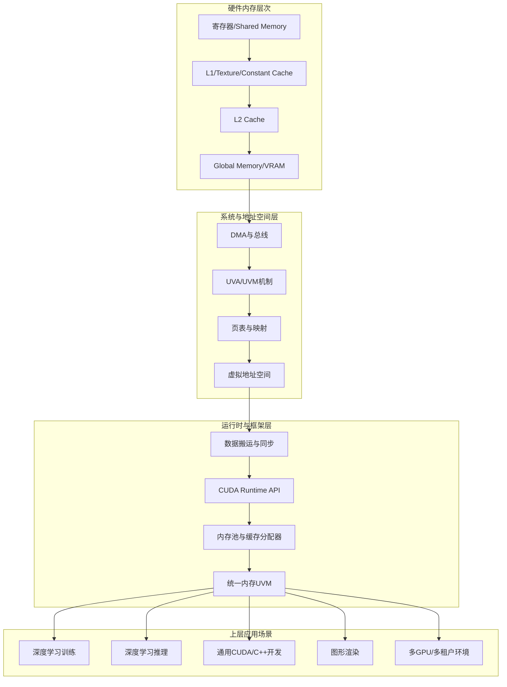

本文档是整套 GPU 内存管理教程的入口页。如果你是第一次接触这个主题，或者不确定为什么要花时间去理解显存分配、页表、带宽和访问模式，那么这一页就是为你准备的。这里不会深入任何 API 细节，而是先回答一个更根本的问题：为什么 GPU 内存管理值得作为一门独立知识来系统学习，以及这套教程将如何带你从“程序能跑”走向“GPU 用得对”。整套教程以 CUDA 为主线，覆盖从寄存器到深度学习框架的完整链路，总篇幅超过八千行，按“从底层到顶层”的逻辑展开，适合初学者按序阅读，也适合有经验的开发者按需查阅。

Sources: [gpu_memory_management_tutorial.md](gpu_memory_management_tutorial.md#L1-L66)

## 核心命题：算力决定上限，内存决定你能多接近上限

许多初学者对 GPU 的第一印象集中在“核心多、并行强、算得快”，但这套直觉只覆盖了“算力侧”。在真实工程中，GPU 程序经常不是先被算力卡住，而是先被内存系统卡住。显存容量不足导致 OOM、显存带宽用不满导致 kernel 空转、CPU 与 GPU 之间搬运数据太慢拖垮整体流水线、频繁分配释放引入隐式同步——这些问题的共同点是：它们都不属于“计算”本身，却直接决定了计算资源能否被有效利用。本教程在第一章就明确提出了一个核心认知转变：**算力只决定理论上限，内存系统决定你能多接近这个上限**。这就像一座大型工厂，机器再多，如果原材料供应、流水线运输和仓库调度跟不上，产能也无法释放。

Sources: [gpu_memory_management_tutorial.md](gpu_memory_management_tutorial.md#L69-L97)

## 教程全景：一条从硅片到框架的完整链路

为了帮你建立结构化的认知，本教程将全部内容组织成一张层次分明的总图。最底层是 GPU 硬件内存层次（寄存器、共享内存、L2、显存），往上依次是地址空间与页映射层、CUDA 运行时层、内存池与缓存分配器层，最终抵达深度学习框架、推理引擎、通用 CUDA 应用和图形渲染引擎等上层场景。很多问题的难点恰恰在于它们跨层出现：例如一个“显存没满却 OOM”的现象，可能同时涉及分配器碎片（运行时层）、虚拟地址空间布局（系统层）和框架缓存策略（应用层）。下面的 Mermaid 图展示了这套教程的内容架构，每一层都对应后续的具体章节。

这张图的阅读顺序是从下到上、从左到右：先理解硬件提供了什么样的存储介质和带宽特性，再理解系统如何为它们建立地址空间和映射关系，然后理解 CUDA 运行时提供了哪些 API 和抽象来管理这些资源，最后进入具体场景看不同应用如何组合这些能力。如果你一开始没有这张图，后面的每个概念都会显得很碎；但一旦建立了定位感，你就能快速判断某个术语属于哪一层、解决哪一类问题。

Sources: [gpu_memory_management_tutorial.md](gpu_memory_management_tutorial.md#L418-L498)

## 为什么“程序能跑”远不等于“GPU 用得对”

这是本教程试图传递的第二个关键认知。在 CPU 编程中，只要逻辑正确、复杂度合理，性能通常还能接受；但在 GPU 上，“算对”和“跑好”之间往往隔着多层约束。数据布局是否适合并行线程访问、内存访问是否合并、中间 buffer 是否频繁申请释放、计算和传输是否能重叠、是否被显存碎片卡住——这些因素不会导致程序报错，却会让同样的算法在性能上相差数倍甚至数十倍。本教程将 GPU 程序视为一个完整的数据流系统，而不是单纯的算术函数，它至少包含七个环节：数据从哪里来、如何进入 GPU、在 GPU 内部存在哪里、线程如何访问、中间结果如何复用、何时释放资源、如何避免传输和同步成为瓶颈。学习 GPU 内存管理，本质上就是在学习如何设计这个数据流系统。

Sources: [gpu_memory_management_tutorial.md](gpu_memory_management_tutorial.md#L221-L263)

## 五大核心线索：贯穿全教程的分析维度

为了不让“内存问题”变成一个笼统而模糊的词汇，本教程从一开始就要求你区分五类不同性质的问题。这五组关键词将在后续章节反复出现，构成你分析任何 GPU 内存现象的基准框架。

| 关键词 | 本质问题 | 典型表现 | 对应教程重点章节 |
|:---|:---|:---|:---|
| **容量** | 能放多少数据 | OOM、batch size 受限、模型装不下 | [GPU硬件内存层次解析](4-gpuying-jian-nei-cun-ceng-ci-jie-xi)、[训练场景GPU内存构成分析](13-xun-lian-chang-jing-gpunei-cun-gou-cheng-fen-xi) |
| **带宽** | 单位时间能运多少 | kernel 不重但很慢、ALU 空闲而内存通路饱和 | [访问模式优化](10-fang-wen-mo-shi-you-hua-he-bing-fang-wen-yu-ju-bu-xing)、[CPU与GPU数据流动机制](8-cpuyu-gpushu-ju-liu-dong-ji-zhi) |
| **延迟** | 一次访问要多久 | 线程等待数据、并发度不足 | [GPU硬件内存层次解析](4-gpuying-jian-nei-cun-ceng-ci-jie-xi) |
| **访问模式** | 数据如何被读写 | 连续访问快、随机访问慢、布局一改性能巨变 | [访问模式优化](10-fang-wen-mo-shi-you-hua-he-bing-fang-wen-yu-ju-bu-xing) |
| **分配开销** | 管理内存本身的成本 | 频繁 cudaMalloc/cudaFree 导致卡顿、碎片 | [内存池与缓存分配器原理](11-nei-cun-chi-yu-huan-cun-fen-pei-qi-yuan-li)、[内存分配全链路](7-nei-cun-fen-pei-quan-lian-lu-cong-cudamallocdao-qu-dong) |

这五类问题的解决方法完全不同。容量问题通常需要量化、压缩、分块或卸载；带宽问题需要优化访问模式和数据搬运路径；延迟问题需要利用并发隐藏；访问模式问题需要重构数据布局；分配开销问题需要引入内存池或缓存分配器。本教程的章节编排正是围绕这些区分展开的，帮助你在面对具体现象时快速归类、对症下药。

Sources: [gpu_memory_management_tutorial.md](gpu_memory_management_tutorial.md#L154-L217)

## 学习路径推荐：不同背景读者的入口选择

虽然本教程按“从底层到顶层”的顺序编排，但不同背景的读者可以从不同位置切入。下表提供了三种典型的阅读策略，你可以根据自己的当前阶段选择最适合的起点。

| 读者背景 | 建议起点 | 优先阅读路径 | 可暂跳的章节 |
|:---|:---|:---|:---|
| **完全的初学者** | [五大核心概念速览](3-wu-da-he-xin-gai-nian-su-lan) | 快速开始 → 硬件基础 → CUDA内存管理 → 感兴趣的场景 | 高级内存机制（可先建立直觉后再回读） |
| **深度学习从业者** | [训练场景GPU内存构成分析](13-xun-lian-chang-jing-gpunei-cun-gou-cheng-fen-xi) 或 [推理场景GPU内存管理](15-tui-li-chang-jing-gpunei-cun-guan-li) | 先读对应场景章节定位问题 → 回溯底层原理（带宽、访问模式、分配器） → 再读优化专题 | 图形渲染章节（如暂不涉及） |
| **CUDA/C++ 开发者** | [内存分配全链路](7-nei-cun-fen-pei-quan-lian-lu-cong-cudamallocdao-qu-dong) | CUDA内存API → 访问模式优化 → 内存池 → 通用CUDA设计模式 | 深度学习训练/推理（按需选读） |

无论你从哪一章开始，都建议在进入具体技术细节之前，先浏览 [阅读路径与快速导航](2-yue-du-lu-jing-yu-kuai-su-dao-hang) 和 [五大核心概念速览](3-wu-da-he-xin-gai-nian-su-lan)，这样可以在脑中先建立一张总图。对于所有读者，最后两章 [统一心智模型：一切从"账单"出发](23-tong-xin-zhi-mo-xing-qie-cong-zhang-dan-chu-fa) 和 [术语表与API速查手册](24-zhu-yu-biao-yu-apisu-cha-shou-ce) 都是值得反复查阅的收尾资料，前者把全部内容压缩成一个可操作的思维框架，后者提供快速检索。

Sources: [gpu_memory_management_tutorial.md](gpu_memory_management_tutorial.md#L338-L401)

## 你会反复遇到的典型问题

本教程在第一章就预先列出了六个最常见的真实问题，作为你后续学习的“问题锚点”。这些问题看似零散，实则分别对应五大核心线索的不同组合。当你读到后面某一章时，可以经常回来看看这些问题是否获得了更清晰的答案。

第一，**显存没满为什么还 OOM**——这通常不是单纯容量不足，而是碎片、框架缓存分配器行为、峰值内存或未完成的异步操作持有内存块导致的。第二，**GPU 利用率不高为什么程序还是慢**——传输阻塞、kernel 太碎、访问模式差或 CPU 端等待都可能是原因。第三，**异步 API 为什么还是会卡**——因为“调用异步”不等于“整个链路异步”，pageable memory、隐式同步和 stream 依赖都会引入阻塞。第四，**框架为什么不主动释放显存**——缓存分配器故意保留显存以避免昂贵的系统级分配与释放。第五，**为什么改个 batch size 显存变化特别大**——因为显存消耗不只来自模型参数，还包括激活值、梯度、优化器状态、临时 workspace 和通信 buffer。第六，**为什么同样的算法数据布局一变就快很多**——因为 GPU 高度依赖连续、对齐、合并访问和局部性。

Sources: [gpu_memory_management_tutorial.md](gpu_memory_management_tutorial.md#L267-L335)

## 教程的终点：一个统一的心智模型

本教程共 22 章，但最终的交付物不是 22 组孤立的知识点，而是一个统一的分析框架。在最后一章，全部内容被压缩成一个“五维账单”模型：面对任何 GPU 内存问题，你只需要回答五个维度——**谁（什么对象）、占了多少（容量）、占多久（生命周期）、放在哪（物理位置）、怎么访问（访问模式）**——就能定位绝大多数问题的根因。这个模型适用于训练 OOM、推理显存膨胀、通用 CUDA 程序优化、多 GPU 资源调度等一切场景。因此，你在阅读过程中不必急于记住每一个 API 签名或硬件参数，而要始终关注这五个维度如何在不同章节中被逐步展开和具体化。

Sources: [gpu_memory_management_tutorial.md](gpu_memory_management_tutorial.md#L8062-L8137)

## 内容覆盖范围与章节组织

为了让读者对全教程的覆盖面有精确预期，下面按主题组列出核心章节及其定位。整篇教程从硬件寄存器一直延伸到云环境中的多租户调度，既讲原理也讲实战。

| 主题组 | 包含章节 | 核心目标 |
|:---|:---|:---|
| 快速开始 | 教程概述、阅读路径、五大核心概念速览 | 建立总图和共同语言 |
| 硬件基础与内存架构 | GPU硬件内存层次、地址空间与页表、CPU与GPU内存思维差异 | 理解物理基础和思维范式转换 |
| CUDA内存管理与数据流动 | 分配全链路、数据流动机制、CUDA内存API全景、访问模式优化 | 掌握运行时能力和工程实践 |
| 高级内存机制 | 内存池与缓存分配器、统一内存UVM | 理解框架行为和便利背后的代价 |
| 深度学习训练 | 训练显存构成分析、训练优化（混合精度、重计算、ZeRO） | 拆解训练时的显存账单并优化 |
| 深度学习推理 | 推理显存管理、推理优化（量化、分页缓存、连续批处理） | 管理KV cache和 serving 场景 |
| 通用开发与图形渲染 | 通用CUDA/C++设计模式、图形渲染中的GPU内存 | 跨场景的工程模式 |
| 多GPU与系统环境 | 多GPU、多进程与多租户环境 | 理解并行策略和隔离机制 |
| 故障排查与实战优化 | 常见故障与误区、排障方法与工具链、实战优化清单 | 建立系统化的诊断和优化能力 |
| 心智模型与参考资料 | 统一心智模型、术语表与API速查手册 | 形成可迁移的分析框架 |

这张表同时也是一份学习进度检查单。你可以在读完后回头勾选已经掌握的主题组，对薄弱环节进行针对性复习。

Sources: [gpu_memory_management_tutorial.md](gpu_memory_management_tutorial.md#L418-L8488)

## 如何高效使用这套教程

对于初学者，最有效的阅读方式不是“一次读完”，而是“带着问题分层深入”。建议第一遍阅读时，把重点放在建立总图和理解思维差异上：先读完快速开始的三章，然后通读硬件基础和 CUDA 内存管理部分，目标是能够向他人解释“GPU 内存系统有哪些层、每层解决什么问题”。第二遍阅读时，再深入到与你工作相关的具体场景章节，同时开始关注 API 细节和代码模式。第三遍阅读时，把重点放在故障排查和心智模型上，用“五维账单”去复盘你遇到的实际问题。遇到不熟悉的术语时，优先查阅 [术语表与API速查手册](24-zhu-yu-biao-yu-apisu-cha-shou-ce) 而不是临时搜索，因为该手册中的定义与全教程的上下文一致，能避免概念混淆。

Sources: [gpu_memory_management_tutorial.md](gpu_memory_management_tutorial.md#L338-L414)

## 下一步

如果你已经理解了“为什么学”和“学什么”，接下来有两条自然路径：如果你想先建立全教程的导航地图和术语速览，请前往 [阅读路径与快速导航](2-yue-du-lu-jing-yu-kuai-su-dao-hang)；如果你已经等不及想了解容量、带宽、延迟、访问模式和分配开销这五大核心概念的精要定义，请直接跳到 [五大核心概念速览](3-wu-da-he-xin-gai-nian-su-lan)。无论你选择哪一条，都建议在进入底层细节之前，先把“GPU 内存管理是一个跨层系统工程”这一认知固定下来——它是你理解后续全部内容的根基。