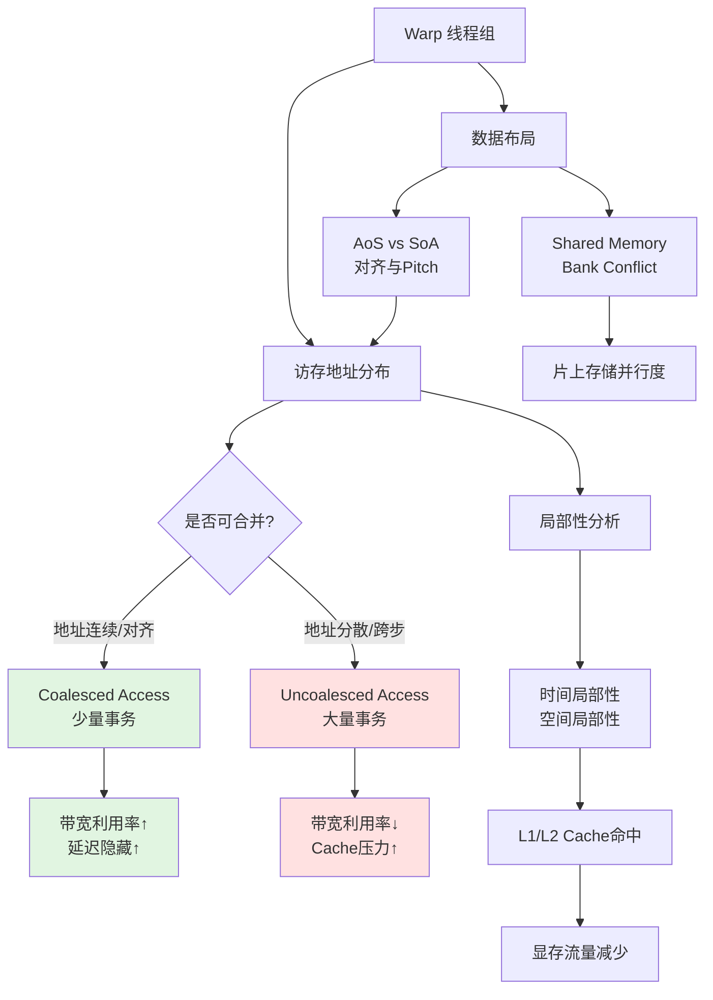
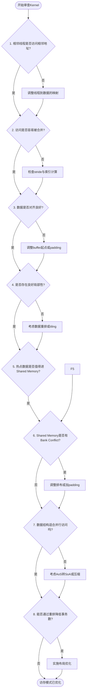

GPU 显存的理论带宽数字常常高达数百 GB/s 甚至 TB/s 级别，但真实程序能否逼近这一上限，极少取决于"数据量有多大"或"算法用了多少算术操作"，而取决于一个更根本的问题：**线程组如何组织数据的读写**。同样的数据量、同样的计算逻辑，仅因索引映射方式不同，性能可能相差数倍甚至一个数量级。本章聚焦于访问模式优化的核心机制——从 warp 级的合并访问（coalescing）到数据布局与局部性设计——建立一套可落地的访存优化思维框架。

Sources: [gpu_memory_management_tutorial.md](gpu_memory_management_tutorial.md#L3252-L3282)

## 核心概念架构：访问模式优化的知识地图

在深入具体机制之前，先用一张概念关系图建立整体认知。访问模式优化不是孤立的"调优技巧"，而是围绕 **warp 级线程协同** 展开的系统性设计问题。下图展示了核心概念之间的依赖与协作关系：



这张图揭示了一条关键主线：**GPU 访存性能优化的本质，是让 warp 中一组线程的地址请求与硬件的事务组织方式高度匹配**。无论是 global memory 的 coalescing、shared memory 的 bank conflict，还是缓存层次的效率，最终都可以归结为"线程组访问模式是否符合硬件组织结构"这一个问题。

Sources: [gpu_memory_management_tutorial.md](gpu_memory_management_tutorial.md#L3252-L3334)

## Warp：GPU 访存优化的基本观测单元

理解 GPU 访存模式的第一步，是抛弃"单线程视角"。CPU 内存优化常以单个线程的局部性为核心考量，但 GPU 的线程调度与访存仲裁都是以 warp（或 wavefront）为单位进行的。当一个 warp 中的 32 个线程同时发起访存请求时，硬件不会逐个处理这些请求，而是将整个 warp 的地址集合作为一个批次，判断能否将其合并为更少、更大的底层内存事务。

这意味着一个反直觉的事实：**某个线程自己的访问顺序是否"漂亮"并不重要，重要的是同一 warp 内相邻线程的访问地址是否相邻**。如果线程 0 访问地址 `A`，线程 1 访问地址 `A+4`，线程 2 访问地址 `A+8`，这种"线程与地址一一对应"的模式恰恰是硬件最容易合并的。反之，即使每个线程内部访问都是顺序的，只要 warp 内线程的地址相互跳跃，事务数量就会急剧膨胀。

Sources: [gpu_memory_management_tutorial.md](gpu_memory_management_tutorial.md#L3315-L3334)

## 合并访问（Coalescing）：从线程请求到硬件事务

Coalescing 可以精确地定义为：**让一组线程的多个访存请求尽可能合并成更少、更高效的底层内存事务**。为什么这一机制如此关键？因为 GPU 显存控制器的设计目标是批量搬运数据，而不是响应零散的字节级请求。一个 warp 若原本可以用一次 128 字节事务完成的读取，因地址分散变成四次 32 字节事务，其后果不仅是带宽利用率下降，还包括事务管理开销增加、总线仲裁压力上升、以及 cache line 填充效率恶化。

### 三种基本访问模式的代价差异

在实际 kernel 开发中，访存模式通常落入三个类别，其硬件友好程度依次递减：

| 访问模式 | 地址特征 | 事务合并效果 | 带宽利用 | Cache 友好度 | 典型代码模式 |
|---------|---------|------------|---------|------------|------------|
| **连续访问** | 相邻线程访问相邻地址，stride=1 | 最优，常合并为单个事务 | 接近理论峰值 | 极易命中同一/相邻 cache line | `a[tid]` |
| **跨步访问** | 固定步长 stride>1，地址规则但分散 | 中等，事务数随 stride 增加 | 随 stride 增大而下降 | 可能分散在多个 line | `a[tid * stride]` |
| **随机访问** | 地址不可预测，无空间规律 | 最差，几乎每个请求独立事务 | 极低 | 几乎无复用 | `a[index[tid]]` |

这里的核心洞察在于：**GPU 访存代价不取决于"读取了多少字节"，而取决于"为了读取这些字节发起了多少事务，以及每个事务的有效载荷有多少"**。跨步访问中，即使总读取量与连续访问完全相同，事务数量的增加和 cache line 利用率的下降仍会导致显著的性能退化。随机访问则彻底破坏了合并的可能性，迫使硬件退回到逐个地址响应模式。

Sources: [gpu_memory_management_tutorial.md](gpu_memory_management_tutorial.md#L3338-L3435)

## 事务粒度、对齐与带宽利用率

理解了 coalescing 之后，还需要深入一层：硬件究竟以什么粒度处理访存请求？当线程请求 4 字节或 8 字节数据时，显存控制器通常不会只搬运这 4 或 8 字节，而是执行某个固定粒度的 **transaction**——可能是 32 字节、64 字节或 128 字节，具体取决于架构和访问类型。

这意味着，如果一个 warp 的访问集中在同一小段区域内，硬件可以用较少事务满足全部请求；但如果地址分散，即使总读取量不变，也可能需要更多事务。更进一步，**对齐**会直接影响事务的边界组织。如果一组线程的访问起点刚好落在硬件舒服的边界上（如 128 字节对齐），事务可以自然打包；若偏移了几个字节，原本一笔能完成的读取可能被迫拆成两笔。

对齐的影响在工程实践中随处可见：buffer 起始地址的设计、结构体字段的 padding、二维数据的 pitch 分配、tile 边界的处理，本质上都是在确保 warp 级访问落在硬件高效处理的事务边界上。忽视对齐不是"损失一点点性能"，而是可能导致事务数量翻倍。

Sources: [gpu_memory_management_tutorial.md](gpu_memory_management_tutorial.md#L3439-L3497)

## 局部性原理与缓存层次的协作关系

GPU 的缓存层次（L1、L2、texture cache、constant cache）虽然设计理念与 CPU 不同，但**局部性原理**仍然是其效率的前提。局部性分为两类：**时间局部性**（刚访问的数据很快会再次访问）和**空间局部性**（刚访问的位置附近很快也会被访问）。

当访问具有良好局部性时，L1/L2 缓存可以截获一部分请求，减少对显存的直接访问，降低总流量和延迟。然而，GPU 缓存的一个关键特征是它**不能替代良好的访问组织**。对于高吞吐计算场景，缓存更像是"吃掉一部分重复访问"的辅助层，而非"兜底混乱访问模式"的安全网。如果一个 kernel 的访存模式本身完全不规则、不可合并，缓存的命中率会极低，L2 也几乎帮不上忙。

因此，正确的优化顺序应当是：首先将访问组织成尽量合并、连续、对齐的模式，然后让缓存在此基础上锦上添花。反过来，寄希望于缓存自动修复糟糕的索引设计，通常是徒劳的。L2 的作用尤其能说明这一点——它缓存 global memory 的热点数据、降低 VRAM 压力，但如果访问完全随机且工作集巨大，L2 的帮助将非常有限。

Sources: [gpu_memory_management_tutorial.md](gpu_memory_management_tutorial.md#L3500-L3528), [gpu_memory_management_tutorial.md](gpu_memory_management_tutorial.md#L1669-L1698)

## 数据布局设计：AoS 与 SoA 的访存效率对比

数据结构的内存排布直接决定了一组线程访问时的地址分布模式，因此**数据布局本身就是 GPU 内存设计的一部分**。两种经典布局的对比如下：

**AoS（Array of Structures）** 将单个对象的所有字段集中存放：
```cpp
struct Particle {
    float x, y, z;
    float vx, vy, vz;
};
Particle particles[N];
```
这种布局在 CPU 编程中非常自然，因为它贴近对象语义，且利于单线程顺序访问全部字段。

**SoA（Structure of Arrays）** 将同一字段的所有对象值集中存放：
```cpp
struct Particles {
    float x[N], y[N], z[N];
    float vx[N], vy[N], vz[N];
};
```
GPU 常常更喜欢 SoA，因为其典型访问模式是"很多线程同时处理很多对象的同一字段"。当 warp 中 32 个线程同时读取所有粒子的 `x` 坐标时，SoA 布局下这些访问是连续且易于合并的；而在 AoS 布局下，线程的访问将间隔 `sizeof(Particle)` 字节，形成跨步访问。

但这不意味着"永远 SoA 更好"。实际决策需综合考量：kernel 每次主要访问哪些字段、字段是否总是一起被用到、是否存在某种复合布局（如 Hybrid SoA）更优。真正应铭记的原则是：**数据结构设计必须与线程访问模式协同设计，而非独立决定**。

Sources: [gpu_memory_management_tutorial.md](gpu_memory_management_tutorial.md#L3532-L3576)

## Shared Memory Bank Conflict：同一逻辑在不同层次的表现

Global memory 的不合并访问与 shared memory 的 bank conflict，表面上是两个不同问题，但内核逻辑高度相似。Shared memory 被组织为多个并行的 bank，理想情况下不同线程访问不同 bank，可以实现完全并行的片上访问；若多个线程同时访问同一 bank 的不同地址，就会产生 bank conflict，导致原本可并行的访问被部分串行化。

两者的共同本质是：**硬件都希望一组线程以规则、可并行的方式访问存储；若访问组织方式与硬件结构不匹配，就会把原本可并行的操作拆碎或串行化**。Global memory 的代价体现为事务数增加和带宽浪费，shared memory 的代价体现为 bank 冲突和有效吞吐下降。将这两类问题放在一起理解，有助于建立统一的访存思维：无论优化哪一层存储，核心判据始终是"线程组访问与硬件组织方式是否匹配"。

Sources: [gpu_memory_management_tutorial.md](gpu_memory_management_tutorial.md#L3579-L3599), [gpu_memory_management_tutorial.md](gpu_memory_management_tutorial.md#L1602-L1628)

## 不规则数据结构的访存挑战与应对策略

GPU 并非天然适合所有数据结构。图、树、链表、稀疏邻接矩阵等不规则结构之所以难以在 GPU 上跑快，根源在于它们破坏了 GPU 偏好的规则访问模式。具体挑战包括：

1. **地址极度分散**：指针追逐、间接索引导致线程访问完全不可预测的位置，合并访问无从谈起，局部性也极差。
2. **工作负载不均匀**：不同线程处理的数据量和访问路径差异巨大，引发分支发散和访存模式混乱。
3. **难以构造整齐映射**：规则网格和矩阵中"相邻线程处理相邻数据"的映射在不规则结构中几乎不可能天然成立。

面对这类问题，工程上的应对往往不是"换更好的 GPU"，而是**在算法预处理阶段修复访存模式**。常用策略包括：重排节点/边顺序、使用压缩稀疏格式（CSR、CSC）、重新编号以提升局部性、分块（blocking）处理、以及改变遍历顺序。这些操作看似属于"算法优化"，本质上都服务于同一个内存层次目标——让 warp 级访问尽量连续、可预测、可合并。

Sources: [gpu_memory_management_tutorial.md](gpu_memory_management_tutorial.md#L3603-L3641)

## 实战检查清单与常见误区

### 访存优化八问检查清单

在审查一个 kernel 的访存效率时，可以沿着以下八个问题快速定位瓶颈：



### 四大常见误区

| 误区 | 错误认知 | 实际情况 |
|-----|---------|---------|
| **误区一** | 总读写量一样，性能应该差不多 | GPU 上总流量相同不代表事务数量、带宽利用率和 cache 行为相同。事务组织方式才是决定性因素。 |
| **误区二** | 缓存会自动修复坏访问模式 | 缓存只能缓解部分重复访问，无法挽救彻底不规则、不可合并的访问模式。 |
| **误区三** | Shared Memory 一上就会快 | 若 bank conflict 严重、数据复用不高、同步开销过大或 occupancy 被压低，shared memory 反而得不偿失。 |
| **误区四** | GPU 慢就是算力不够 | 很多时候瓶颈根本不在 ALU，而在显存访问没有把算力喂饱。kernel 的算术复杂度不高但运行慢，正是访存瓶颈的典型症状。 |

Sources: [gpu_memory_management_tutorial.md](gpu_memory_management_tutorial.md#L3694-L3734)

## 小结：从"访问模式"到"系统性能"

访问模式优化是 GPU 内存管理中最具杠杆效应的领域。本章的核心结论可以归纳为以下九点：

1. **GPU 显存性能高度依赖访问模式**，而非仅由硬件带宽数字决定。
2. **Warp 是访存行为的基本观测单元**，优化时应关注"一组线程合起来怎么访问"，而非单个线程的访问顺序。
3. **Coalescing 的核心是事务合并**，目标是让多个线程的请求汇聚为更少、更高效的事务。
4. **连续访问最优，跨步访问次之，随机访问最差**，三者的本质差异在于地址在内存空间中的排布是否适合成组取用。
5. **对齐与事务粒度直接影响底层流量**，偏移几个字节可能影响整个 warp 的事务组织。
6. **局部性仍然重要，但缓存是锦上添花**，不能替代良好的访问组织。
7. **AoS/SoA 等数据布局选择是访存设计的一部分**，必须与线程映射协同考量。
8. **Global memory 不合并访问与 shared memory bank conflict 内核逻辑一致**，都反映"线程组访问不符合硬件组织方式"。
9. **很多 GPU 优化的本质是在修复访存模式**，调整索引、改布局、做 tiling，最终都服务于让 warp 访问更规整这一目标。

掌握了这套访问模式优化的方法论后，你已经具备了从底层硬件视角审视 CUDA 代码的能力。接下来，可以将这些原则与具体的内存管理接口结合起来——在 [CUDA 内存 API 全景与选型](9-cudanei-cun-apiquan-jing-yu-xuan-xing) 中，你会看到 `cudaMalloc`、`cudaMemcpy`、`cudaMallocManaged` 等 API 如何在系统层面支持或限制你的访存优化策略。而如果你更关注如何在实际训练中应用这些原理，可继续阅读 [训练优化：混合精度、重计算与 ZeRO](14-xun-lian-you-hua-hun-he-jing-du-zhong-ji-suan-yu-zero)，其中大量内存优化手段（如激活重计算、ZeRO 分片）的底层收益，正是通过改善访存模式和数据局部性来实现的。