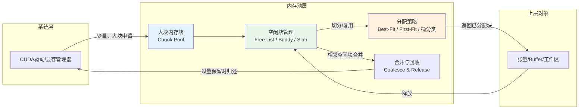
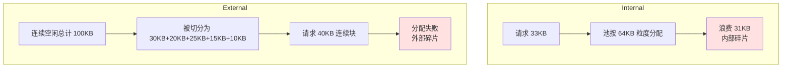

如果你曾经观察过深度学习框架或推理引擎的显存行为，一定会对一个现象感到困惑：张量已经被释放了，进程逻辑上也不再需要那块数据，但 `nvidia-smi` 显示的显存占用却纹丝不动。更极端的情况下，系统报告仍有数百 MB 甚至数 GB 的"空闲"显存， Yet a seemingly modest allocation request fails with OOM. 这些反直觉现象的根源，不在于 CUDA 驱动缺陷，也不等于内存泄漏——它们指向 GPU 软件栈中一个承上启下的关键层：**内存池与缓存分配器**。本章将剥离框架封装，从第一性原理出发，解释这一层为何存在、如何运作、以及它怎样重塑了"分配"与"释放"的语义边界。

Sources: [gpu_memory_management_tutorial.md](gpu_memory_management_tutorial.md#L4277-L4310)

## 为什么系统级分配器无法直接承载高频动态负载

在深入内存池之前，需要建立一个清晰的工程前提：**`cudaMalloc` 与 `cudaFree` 的每次调用都不是免费的**。如 [内存分配全链路：从cudaMalloc到驱动](7-nei-cun-fen-pei-quan-lian-lu-cong-cudamallocdao-qu-dong) 中所揭示的，一次设备内存分配需要穿透 CUDA Runtime、驱动层、乃至显存管理器的多轮协调；而 `cudaFree` 更可能引入隐式全局同步，强行排空当前设备上的活跃工作。对于一个仅启动时分配几块大 buffer 便长期复用的程序，这种开销可以忽略不计。然而，现代 GPU 工作负载——无论是深度学习框架中的临时张量、推理引擎中的请求级 buffer，还是多 stream 交错产生的阶段性工作区——普遍呈现**数量多、生命周期短、大小分布复杂、分配释放频繁**的特征。若让这类高频动态对象的生命周期直接暴露给底层系统分配器，后果是系统调用成本、同步阻塞、空间碎片化与延迟抖动四重问题的叠加放大。

Sources: [gpu_memory_management_tutorial.md](gpu_memory_management_tutorial.md#L4312-L4358)

## 内存池的核心架构：从"按需下单"到"批量仓储"

内存池的本质是一种**空间-时间权衡**策略：用预先持有的空间换取后续分配的时间效率。其架构思想可以概括为五个步骤的闭环——向系统申请大块内存、在池内切分为可用单元、将单元分配给上层对象、对象释放时回收到池内、并在条件允许下合并相邻空闲块以恢复更大的连续区域。这个模型把"频繁系统级操作"转化为"少量系统级操作 + 大量池内轻量操作"，使得池内路径可以做到更少同步、更细粒度的生命周期跟踪、以及针对上层负载模式的局部优化。

这张图揭示了一条关键认知：**内存池不是"只缓存不用管"的被动容器，而是一个实时做多目标平衡的活跃系统**。复用效率、分配速度、内存保留量、碎片程度与同步代价之间经常互相冲突，池的策略设计决定了上层体验的稳定性。

Sources: [gpu_memory_management_tutorial.md](gpu_memory_management_tutorial.md#L4362-L4471)

## 缓存分配器：重新定义"释放"的语义边界

缓存分配器是内存池思想在深度学习框架与推理引擎中的最常见实现形态。它的核心行为是：当上层对象请求内存时，优先从已保留的空闲块中分配；当对象释放时，不立刻归还到底层 CUDA，而是标记为"可复用"；后续同类请求直接命中这些块，仅在池内无法满足时才向系统扩张。这一机制在工程上极为合理——既然归还后再申请会重复支付昂贵的系统成本，且 `cudaFree` 可能触发同步打乱流水线，那么将显存保留在进程内部以备复用，通常是更优策略。

然而，这带来了一个深刻的**语义鸿沟**：上层开发者认知中的"释放"（对象析构、张量变零）与系统视角中的"显存归还"被解耦了。对象已经消失，但对应的物理显存页仍挂在进程名下；`nvidia-smi` 看到的占用数字反映的是"进程已持有"，而非"活跃对象正在使用"。理解这一层语义转换，是阅读任何框架显存统计的前提。

Sources: [gpu_memory_management_tutorial.md](gpu_memory_management_tutorial.md#L4397-L4429)

## 碎片的双重形态：Internal 与 External Fragmentation

"为什么显存还有空闲，却分配失败？"这个问题的答案，几乎总是落在碎片上。但碎片不是一种，而是两种根本不同的形态，它们的成因、表现与治理策略完全不同。

| 维度 | 内部碎片（Internal Fragmentation） | 外部碎片（External Fragmentation） |
|:---|:---|:---|
| **定义** | 已分配块内部未被实际使用的浪费空间 | 空闲总量充足，但无一块足够大的连续区域 |
| **典型成因** | 分配粒度对齐、固定桶大小、向上取整策略 | 长期交错分配释放导致空闲块被切割成零碎小洞 |
| **可观测性** | 难以直接从外部工具观察，需池内统计 | 常表现为"总空闲 > 请求大小，但分配失败" |
| **工程危害** | 降低空间有效载荷比，累积隐性浪费 | 直接触发 OOM，破坏服务可用性 |
| **缓解方向** | 精细化粒度、按实际大小分配、减少过度对齐 | 合并相邻空闲块、分桶策略、定期整理、预分配固定尺寸 |

内部碎片相对温和，它浪费空间但不破坏分配能力；外部碎片则更为棘手，因为它会制造最令人困惑的故障表象——总空闲量看起来健康，但一次稍大的连续请求就会撞墙。在 GPU 显存这种容量严格受限且缺乏虚拟内存过度承诺机制的语境下，外部碎片是长期运行系统中最常见的隐形杀手。

Sources: [gpu_memory_management_tutorial.md](gpu_memory_management_tutorial.md#L4474-L4511)

## 空闲显存与分配成功之间的断层

基于上述碎片模型，我们可以系统性地拆解"有空闲却 OOM"的四种典型场景。第一种是最常见的外部碎片：池中存在空闲字节，但没有一块物理连续的显存能满足请求的连续布局要求。第二种是**可见性断层**：框架内部保留的"可复用"块、受 stream 生命周期约束的异步释放块、以及统计口径混杂的"缓存空闲"，都被外部工具笼统地计入"进程占用"，上层很难区分其中哪些真正可供下一次分配。第三种是峰值冲击：程序并非静态匀速消费显存，而是在某些计算阶段（如反向传播的中间激活、注意力矩阵的临时缓冲区）产生瞬时的内存尖峰，即使平均占用不高，峰值仍可能突破物理上限。第四种则来自策略层面的硬约束：对齐要求、分配粒度、特定 stream 或 arena 的隔离策略、大小分类桶的边界，都可能让"理论上有空间"变为"实际上不可达"。这些场景共同指向一个工程铁律：**能不能分配成功，不只取决于空闲总字节数，还取决于空闲空间的分布形态、归属边界、对齐约束与回收时序。**

Sources: [gpu_memory_management_tutorial.md](gpu_memory_management_tutorial.md#L4514-L4545)

## 缓存保留显存 vs 内存泄漏：如何区分

由于缓存分配器的行为特征，"显存没降"这一表象同时覆盖了两种截然不同的语义状态：正常的缓存保留与真正的内存泄漏。准确区分二者，是 GPU 服务运维与性能排查的基本功。

| 特征 | 缓存保留（Caching） | 内存泄漏（Leak） |
|:---|:---|:---|
| **回收路径** | 分配器明确掌握该块，可在后续请求中复用或按策略归还 | 没有任何活跃引用或管理路径能触达该块 |
| **占用趋势** | 达到稳定平台后波动，与活跃工作负载正相关 | 长时间单调增长，与活跃工作量脱节 |
| **复用能力** | 后续同类请求能立即命中，分配延迟极低 | 永远无法复用，空间永久丢失 |
| **归还可能性** | 在内存压力策略或显式清理触发下可归还系统 | 不可回收，除非进程终止 |
| **典型判断** | 高占用稳定，且新对象能快速复用已有空间 | 占用持续只增不减，超出正常工作集范围 |

从实践角度，一个简单但有效的判别思路是：在固定工作负载下运行足够长的时间，观察显存占用曲线。如果曲线收敛到某个平台并在小范围内震荡，这更接近缓存策略的稳态；如果曲线持续上扬且无收敛迹象，则需要深入框架内存统计，检查是否存在失控的保留或真正的泄漏。

Sources: [gpu_memory_management_tutorial.md](gpu_memory_management_tutorial.md#L4548-L4633)

## 长期运行系统的碎片累积动力学

短命程序（如单次训练脚本）与长期运行系统（如在线推理服务、多租户 GPU 服务）在显存行为上存在结构性差异。短命程序的运行模式集中、生命周期统一，即使产生碎片，进程结束后一切归零。而长期服务面临请求大小的持续波动、不同生命周期的对象交错存活、批量间内存需求的剧烈差异，以及长时间累积产生的内存空洞。这些动力学会使得外部碎片随运行时间逐步恶化，最终在某个偶发的大请求下触发分配失败。因此，长期运行系统往往更需要**稳定的分配粒度、预分配与分桶策略、以及定期的碎片趋势监控**。避免任意尺寸的动态分配风暴，是将碎片问题从"事后救火"转为"事前预防"的关键设计原则。

Sources: [gpu_memory_management_tutorial.md](gpu_memory_management_tutorial.md#L4636-L4674)

## `cudaMallocAsync`：面向异步执行的分配器进化

`cudaMallocAsync` 及其对应的 `cudaFreeAsync` 并非传统意义上"更快一点的 malloc"，它们在分配器层面的核心意义在于**将内存分配释放与 stream 顺序语义深度绑定**。传统路径中，分配释放与全局状态耦合较重，`cudaFree` 容易卷入全局同步；而在异步路径下，释放操作可以按 stream 的完成顺序排队，使得内存复用与异步流水线更自然地协作。这改善了高频动态对象在多 stream、高吞吐、长时间运行场景下的分配体验。然而，它并非万能——糟糕的生命周期设计、失控的大小分布、不合理的内存峰值，以及本质上的容量不足，都无法通过接口替换自动消解。关于 CUDA 异步内存池 API 的更详细技术细节与适用边界，可参考 [CUDA内存API全景与选型](9-cudanei-cun-apiquan-jing-yu-xuan-xing) 中的异步分配与内存池章节。

Sources: [gpu_memory_management_tutorial.md](gpu_memory_management_tutorial.md#L4677-L4714)

## 分配器设计的五维平衡框架

一个工业级的 GPU 缓存分配器，不是在优化单一指标，而是在以下五个互相牵制的目标之间寻找帕累托前沿：

| 目标维度 | 核心诉求 | 典型权衡冲突 |
|:---|:---|:---|
| **分配速度** | 用户请求尽量快速命中，减少等待 | 过度追求速度可能导致粗粒度分桶，放大内部碎片 |
| **释放非阻塞** | 避免全局同步，不打断 GPU 流水线 | 异步释放延迟回收，可能短期推高保留量 |
| **碎片抑制** | 维持足够的连续大块可用空间 | 合并与整理操作消耗 CPU/GPU 时间，降低即时吞吐 |
| **保留量控制** | 不把显存无限制地囤在进程内 | 频繁归还系统会丧失缓存优势，分配速度回落 |
| **负载适配** | 匹配训练/推理/图形等不同模式的分配模式 | 通用策略难以在所有负载下同时最优 |

不存在单一"完美分配器"，更常见的现实是：某种策略在训练场景下表现优异（如大块预分配 + 细粒度复用），却在推理服务中因请求大小波动而碎片爆炸；另一种策略对图形渲染的固定资源池很高效，却对深度学习框架中不规则的临时张量尺寸适应性不足。这也是 PyTorch、TensorFlow、ONNX Runtime、vLLM 等框架显存行为各异的技术根源。

Sources: [gpu_memory_management_tutorial.md](gpu_memory_management_tutorial.md#L4717-L4748)

## 统一心智模型：显存数字的解读法则

你现在可以用一套统一的心智模型来理解框架中的显存现象：底层系统分配昂贵，因此框架尽量减少直接调用；框架更倾向于预留和复用，而非频繁归还；对象释放后，显存可能仍留在框架池中；这些块在框架视角下是"空闲可复用"的，但在系统视角下仍显示为进程占用。因此，**外部工具（如 `nvidia-smi`）看到的显存数字，不等于当前活跃对象的真实占用**。当你评估一个 GPU 程序是否"内存紧张"时，应当同时关注三个层面的数字：活跃使用量（真正被张量/缓冲区持有的部分）、已保留量（缓存分配器中标记为可复用的部分）、以及底层系统层面的进程占用量。混淆这三者，是大多数显存排查误判的起点。

Sources: [gpu_memory_management_tutorial.md](gpu_memory_management_tutorial.md#L4752-L4763)

## 本章小结与延伸阅读

内存池与缓存分配器是现代 GPU 软件栈中不可或缺的一层抽象，它将底层昂贵的系统调用与上层高频动态对象的生命周期解耦，用空间换时间，用保留换稳定。理解这一层，意味着你不再会被"框架不释放显存"的表象误导，也能够系统性地分析 OOM 的根因是容量不足、碎片累积、峰值冲击，还是泄漏失控。

继续前进时，你可以根据兴趣选择以下路径：若希望理解让 CPU 与 GPU 共享同一套地址视图的机制及其隐性性能代价，请阅读 [统一内存UVM机制与代价](12-tong-nei-cun-uvmji-zhi-yu-dai-jie)；若关注深度学习训练中显存的具体构成与优化手段，可进入 [训练场景GPU内存构成分析](13-xun-lian-chang-jing-gpunei-cun-gou-cheng-fen-xi)；若面向推理服务的显存管理实践，则 [推理场景GPU内存管理](15-tui-li-chang-jing-gpunei-cun-guan-li) 提供了场景化的深入分析；而对于通用 CUDA/C++ 开发中的内存设计模式与编码实践，可参考 [通用CUDA/C++内存设计模式](17-tong-yong-cuda-c-nei-cun-she-ji-mo-shi)。