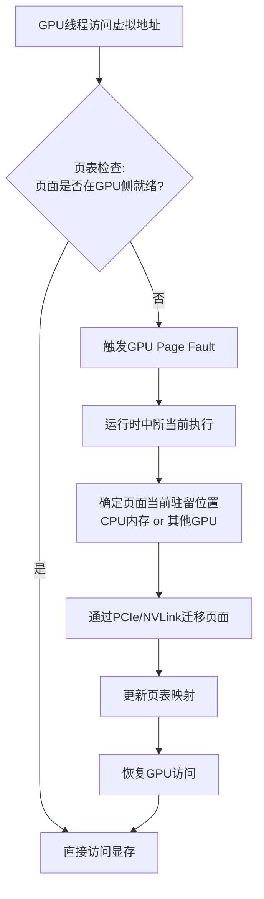

统一内存（Unified Virtual Memory, UVM）是CUDA中最具诱惑力的特性之一，它承诺用单一指针消除CPU与GPU之间的数据管理割裂。然而，这种便利性的本质并非消灭了物理差异，而是将复杂性从显式代码层转移到了运行时行为层。本章将深入剖析UVM的底层机制——page migration与page fault——揭示其隐性代价的构成逻辑，并建立一套基于场景的判断框架，帮助你在开发效率与运行性能之间做出精确权衡。

Sources: [gpu_memory_management_tutorial.md](gpu_memory_management_tutorial.md#L4784-L4812)

## UVM试图解决的核心问题

在传统的CUDA编程模型中，开发者必须显式维护两套内存空间：主机侧缓冲区与设备侧缓冲区。一个典型的数据流包含五个步骤——设备分配、主机准备、H2D拷贝、Kernel计算、D2H回传。当程序规模扩大、数据结构变得复杂（如图结构、嵌套对象、不规则索引）时，这种显式双副本管理模式会带来显著的工程负担：代码量增加、生命周期管理繁琐、CPU/GPU共享逻辑割裂。统一内存的目标正是降低这种割裂感，让程序员操作"同一份逻辑数据"，将部分迁移和驻留决策交给CUDA运行时处理。它通过`cudaMallocManaged`提供一个统一指针，使CPU代码和GPU Kernel能够共享同一个虚拟地址视图，从而大幅减少显式`cudaMemcpy`的代码量。

Sources: [gpu_memory_management_tutorial.md](gpu_memory_management_tutorial.md#L4813-L4853)

## Managed Memory的编程直觉与认知陷阱

使用`cudaMallocManaged`分配内存后，最直接的感受是"这块内存好像大家都能直接用"。这种直觉在逻辑层面是正确的——你确实无需手动维护host buffer和device buffer两份副本。但在性能层面，它是不完整的。"都能访问"并不意味着数据当前就在最适合访问者的一侧，也不意味着下一次访问不会触发跨设备页面迁移。统一内存的真正本质是一个**统一的逻辑对象加上一套运行时负责的页面驻留、迁移和映射机制**，而非"物理上所有处理器零代价共享同一块内存"。许多开发者会误认为"统一内存=不用管内存了"，但更准确的说法是：统一内存让你少管了一部分显式操作，却要求你更深入地理解背后的迁移和访问代价。

Sources: [gpu_memory_management_tutorial.md](gpu_memory_management_tutorial.md#L4856-L4885)

## 页面迁移：统一内存的代价中心

Page migration是理解UVM性能特征的核心机制。其工作逻辑可以概括为：当某块内存页当前主要驻留在CPU侧，而GPU开始大量访问它时，系统会将对应页面迁移到GPU更方便访问的物理位置；反之亦然。统一内存并未消除CPU内存与GPU显存之间的物理差异，它只是将"何时搬、搬哪些页、谁来决定"的决策权从程序员转移到了运行时。这意味着原本由你手动编写的显式H2D/D2H拷贝，现在变成了运行时按页、按需、按访问行为驱动的自动迁移。这种转移带来双重后果：编程更省心，但运行时行为更复杂、更难预测。如果程序的访问模式稳定且阶段清晰，迁移成本可控；但如果CPU与GPU交替访问同一批页面、访问范围跳跃大、或工作集频繁超过设备舒适容量，page migration就会演变为显著的性能瓶颈。

Sources: [gpu_memory_management_tutorial.md](gpu_memory_management_tutorial.md#L4889-L4922)

### 页面迁移触发流程

下图展示了统一内存环境下一次典型页面迁移的触发路径：

在这个流程中，**page fault和迁移的延迟被直接插入到访问的关键路径上**，且其发生时机对程序员而言是隐式的。这与显式`cudaMemcpy`有本质区别：显式拷贝的时间边界清晰，更容易设计流水线重叠；而page fault驱动的按需迁移则延迟更隐式、更依赖访问行为、更可能带来性能抖动。

Sources: [gpu_memory_management_tutorial.md](gpu_memory_management_tutorial.md#L4925-L4958)

## GPU Page Fault：当访问需要"边跑边补票"

Page fault在CPU虚拟内存系统中是常见概念，但在GPU语境下往往被忽视。在统一内存环境中，如果GPU访问某个页面时，发现该页尚未以当前需要的方式准备好（例如页面仍在主机内存，或映射状态不符合GPU访问要求），就会触发类似缺页的处理流程。此时访问不会立刻按理想路径完成，而需要运行时先处理映射或迁移，之后才能继续。这种成本的隐蔽性极高——它不是你代码里显式写出来的，却以"突然一下慢了"的方式打断执行流。统一内存虽然节省了拷贝代码，但可能把"显式copy的可见成本"变成了"运行时page fault的隐式成本"。对于吞吐型程序而言，这种不可预测性尤其值得警惕。

Sources: [gpu_memory_management_tutorial.md](gpu_memory_management_tutorial.md#L4925-L4960)

## 为什么UVM有时很方便，有时却很慢

统一内存的"方便"与"慢"并非技术本身的好坏之分，而是工作负载特征与机制匹配度的体现。它的便利性来源于减少了程序员显式处理的事项：少写buffer管理代码、少写拷贝代码、更容易组织复杂对象、更容易让程序先"跑起来"。而它变慢的根本原因通常在于访问模式与迁移机制的冲突——CPU和GPU交替争抢同一批页面、工作集过大、页面调度与迁移时机不稳定，导致原本可以批量搬运的事情变成了大量细粒度的按需迁移。

| 维度 | 显式拷贝 (`cudaMemcpy`) | 统一内存按需迁移 (UVM) |
|---|---|---|
| **成本可见性** | 显式，时间边界清晰 | 隐式，运行时触发 |
| **迁移粒度** | 整块数据，批量搬运 | 按页，细粒度按需迁移 |
| **流水线设计** | 易于与计算重叠 | 难以精确控制时机 |
| **访问阶段要求** | 需要程序员明确阶段划分 | 容忍模糊的访问模式 |
| **最佳场景** | 阶段清晰、批量数据流 | 原型开发、复杂结构、访问模式不确定 |
| **抖动风险** | 低（程序员控制） | 高（运行时决策可能次优） |

显式拷贝更像是你自己安排一次整批搬家；统一内存按需迁移则像是谁临时要用就搬一点，结果可能搬很多次，节奏也未必理想。如果访问模式规则、阶段明确，显式方式往往更可控；如果开发复杂性是主要瓶颈，统一内存则更有吸引力。

Sources: [gpu_memory_management_tutorial.md](gpu_memory_management_tutorial.md#L4962-L4995)

## 主动控制机制：Prefetch与Advise

高性能场景下完全依赖运行时的被动迁移往往不够。CUDA为此提供了两个关键接口，将部分控制权重新交还给程序员。

### `cudaMemPrefetchAsync`：提前迁移，减少关键路径阻塞

`cudaMemPrefetchAsync`的作用是将迁移成本从"访问时被动触发"前移到"真正需要之前"。它的本质是在你预判到某块数据即将被某处理器密集访问时，提前发起异步页面迁移。这在一定程度上把隐式、被动的迁移模式重新拉回到更主动、更可控的模式。它说明了一个关键事实：**统一内存并不意味着你完全不需要思考数据位置**。真正想让UVM用得好，仍然要对接下来的访问阶段有预判——你越是能准确预测数据下一步归谁用，越能减少运行时的"惊喜"。Prefetch不是让搬家消失，而是让你提前安排搬家，而不是等客人站在门口了才临时搬。

Sources: [gpu_memory_management_tutorial.md](gpu_memory_management_tutorial.md#L4999-L5025)

### `cudaMemAdvise`：向运行时表达使用意图

`cudaMemAdvise`更像是向运行时表达"使用意图"的提示系统：哪一侧更可能访问这块内存、是否存在偏好的驻留位置、访问模式是否偏向只读或顺序访问。它的存在是因为运行时虽然能观察历史行为，但未必总比程序员更早、更准确知道未来阶段会发生什么。它有助于减少错误迁移决策、改善页面驻留行为，但它不是绝对强制控制——给了hint后不一定最优，也不能保证统一内存从此没有抖动。它只是缩小"运行时不了解你意图"的信息差。

Sources: [gpu_memory_management_tutorial.md](gpu_memory_management_tutorial.md#L5028-L5059)

## 场景决策：何时拥抱UVM，何时远离UVM

统一内存不是银弹。下面的场景矩阵可以帮助你做出更精确的选择：

| 场景特征 | 推荐策略 | 原因 |
|---|---|---|
| **原型开发/教学** | ✅ 适合UVM | 降低开发复杂度，先跑通逻辑 |
| **复杂数据结构（图、嵌套对象）** | ✅ 适合UVM | 减少显式管理繁琐的双副本映射 |
| **CPU/GPU协作开发初期** | ✅ 适合UVM | 快速试验分工，降低重构数据通道成本 |
| **访问阶段温和、不剧烈交替** | ✅ 适合UVM | 页面迁移频率低，运行时开销可控 |
| **高吞吐/严格SLA的在线服务** | ❌ 避免UVM | 不可预测的page fault和迁移抖动是致命风险 |
| **阶段明确、可批量搬运的数据流** | ❌ 避免UVM | 显式拷贝更可控，更容易设计传输与计算重叠 |
| **CPU/GPU高频交替访问同一数据** | ❌ 避免UVM | 最容易产生"乒乓效应"，页面在两侧来回搬家 |
| **工作集接近设备容量边界** | ❌ 避免UVM | 页面管理压力剧增，迁移容易成为主要成本 |
| **长期运行、性能稳定性优先** | ❌ 避免UVM | 显式控制驻留、传输和生命周期更可靠 |

Sources: [gpu_memory_management_tutorial.md](gpu_memory_management_tutorial.md#L5062-L5116)

## 统一视图不等于统一物理现实

这是理解UVM最重要的一条结论。统一内存带来的"统一"仅限于三个层面：统一地址视图、统一编程感受、统一逻辑对象。它没有消灭的物理现实包括：CPU内存和GPU显存仍然是不同层级和不同路径的存储介质；跨设备迁移仍然要消耗PCIe/NVLink带宽；页面仍然必须实际驻留在某一侧；访问冲突和阶段切换仍然会带来代价。因此，**UVM统一的是使用接口，不是性能地形**。你可以在逻辑上把某块数据当成"统一可访问"，但工程上仍然必须关心它到底驻留在哪、什么时候迁移、访问路径经过什么、是否适合当前工作负载。

Sources: [gpu_memory_management_tutorial.md](gpu_memory_management_tutorial.md#L5119-L5138)

## UVM的正确使用心态与渐进策略

把统一内存当成"自动最优内存系统"通常会失望。更成熟的心态是将其视为"降低编程复杂度的工具，并在必要时用prefetch和advise辅助"。一个实用的渐进策略是：先用UVM降低开发复杂度，让程序快速跑通；然后使用性能分析工具观察page fault和迁移行为；识别访问模式后，决定哪些部分继续保留统一内存，哪些热点路径改回显式控制。这比一开始就"全用"或"完全不用"都更贴近工程实际。统一内存的正确用法不是盲目信任自动化，而是清醒地认识到——**你只是把复杂性从代码层转移到了运行时行为层，而运行时行为同样需要被理解和管理**。

Sources: [gpu_memory_management_tutorial.md](gpu_memory_management_tutorial.md#L5142-L5156)

## 核心结论

1. 统一内存的目标是降低主机/设备内存管理的编程割裂感，但未消灭CPU与GPU之间的物理差异。
2. Managed memory的核心代价来自page migration和page fault，逻辑可访问不代表物理位置最优。
3. `cudaMemPrefetchAsync`的价值在于把部分迁移从"访问时被动触发"变成"提前主动安排"。
4. `cudaMemAdvise`是向运行时表达使用意图的提示，而非绝对控制。
5. UVM特别适合原型开发、复杂数据结构和开发效率优先的场景；对高吞吐、低抖动、阶段清晰的性能敏感系统，显式管理往往更可控。

Sources: [gpu_memory_management_tutorial.md](gpu_memory_management_tutorial.md#L5159-L5172)

---

## 阅读导航

本章深入剖析了统一内存的自动迁移机制与隐性性能代价。理解UVM后，你可以继续探索以下相关主题：

- 若希望从系统层面理解地址空间、页表和虚拟内存如何支撑UVM的底层能力，请参阅 [地址空间、页表与虚拟内存](5-di-zhi-kong-jian-ye-biao-yu-xu-ni-nei-cun)。
- 若需要全面比较CUDA各类内存API的角色边界，包括`cudaMallocManaged`、`cudaMemPrefetchAsync`与其他分配/传输接口的选型逻辑，请参阅 [CUDA内存API全景与选型](9-cudanei-cun-apiquan-jing-yu-xuan-xing)。
- 若关注如何在深度学习训练场景中管理GPU内存构成与优化策略，请参阅 [训练场景GPU内存构成分析](13-xun-lian-chang-jing-gpunei-cun-gou-cheng-fen-xi)。
- 若希望了解框架层面的内存池与缓存分配器如何在高频分配场景下规避传统API的同步开销，请参阅 [内存池与缓存分配器原理](11-nei-cun-chi-yu-huan-cun-fen-pei-qi-yuan-li)。
- 若需要识别和纠正常见的内存管理误区（包括统一内存的误用），请参阅 [常见故障与典型误区](20-chang-jian-gu-zhang-yu-dian-xing-wu-qu)。