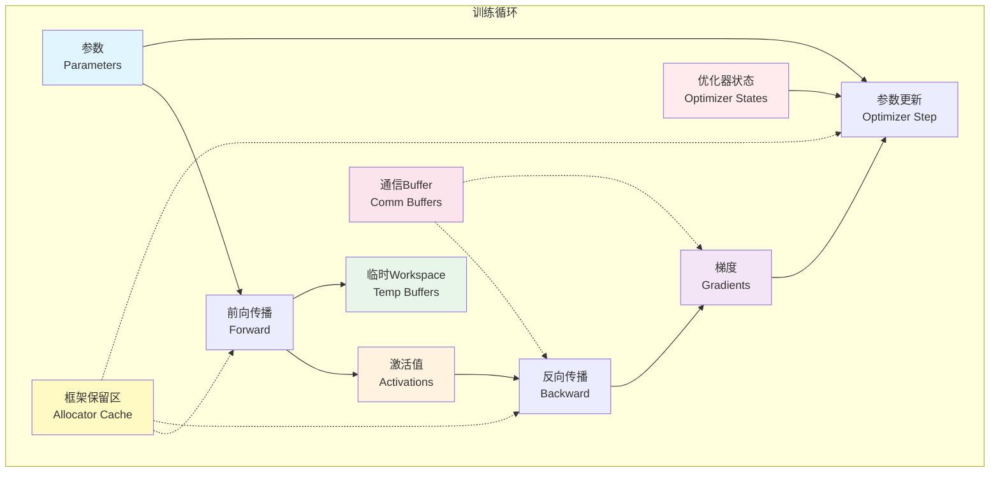
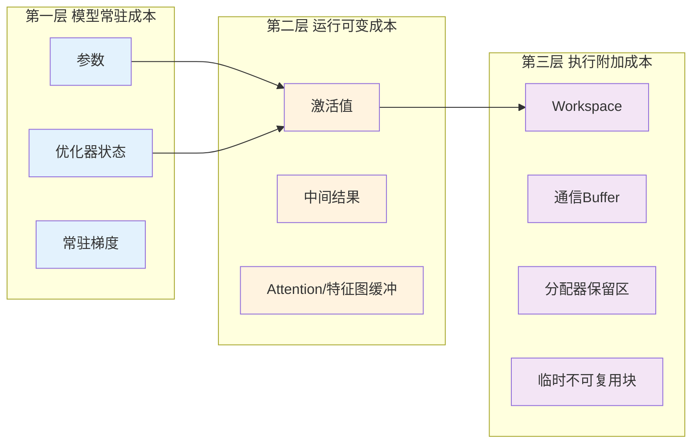

深度学习训练是GPU显存最典型的高负载场景之一，但"模型大所以显存大"这种直觉严重低估了问题的复杂性。训练时的显存占用并非单一对象，而是**参数、梯度、优化器状态、激活值、临时工作区、通信缓冲区和框架分配器保留区**七类对象叠加的结果。如果不把这些部分拆开来看，就很难解释为什么同一个模型在推理时轻松运行，训练时却频繁OOM；也无法理解为什么batch size仅增加一倍，显存占用却可能远远不止翻倍。本章将系统拆解训练显存的完整账单，建立可工程化的分析框架。

Sources: [gpu_memory_management_tutorial.md](gpu_memory_management_tutorial.md#L5177-L5207)

## 训练显存的七大组成部分

在深入每一类对象之前，先建立一张全局概念图。下图展示了训练流程中（前向传播、反向传播、参数更新）各显存组成部分的产生时机与相互关系。图中的箭头不代表数据流向，而是**生命周期依赖关系**：例如，反向传播阶段必须保留前向阶段产生的激活值，参数更新阶段需要读取梯度与优化器状态。

从图中可以看出，训练显存不是静态的"一块存储"，而是伴随计算阶段动态叠加的复合结构。**参数和优化器状态**更像是底座，贯穿整个训练生命周期；**激活值和梯度**则在前向与反向阶段交替成为占用主力；**临时Workspace和通信Buffer**常在特定算子或分布式同步瞬间抬高峰值；而**框架保留区**作为底层支撑，决定了外部工具看到的显存占用与框架内部实际活跃张量之间的差异。

Sources: [gpu_memory_management_tutorial.md](gpu_memory_management_tutorial.md#L5218-L5237)

## 参数与梯度：训练显存的基础账本

**模型参数**是训练显存中最直观的部分，即模型权重本身。其显存成本可通过"参数量 × 单个参数字节数"粗略估算：FP32占4字节，FP16/BF16占2字节。在混合精度训练中，框架可能同时维护主权重（FP32）和低精度副本（FP16/BF16），这会进一步增加参数相关占用。然而，参数仅仅是训练显存的"基础成本"，远非全部。

**梯度**是训练区别于推理的第一个核心增量。反向传播需要为每个可训练参数计算对应的梯度，因此梯度存储规模通常与参数规模同阶。这意味着，仅参数加梯度两项，训练显存就已经达到推理（通常只需权重）的两倍以上。梯度的实际占用还会受到数据类型、梯度累积策略和分布式训练方式的影响——例如梯度分片会将单卡上的梯度存储按比例削减，但通信缓冲区可能随之增加。

Sources: [gpu_memory_management_tutorial.md](gpu_memory_management_tutorial.md#L5249-L5310)

## 优化器状态：隐形的重量级选手

如果说梯度是"看得见"的训练成本，那么**优化器状态**就是最容易被低估的隐性开销。现代优化器（如Adam、AdamW）不仅保存动量，还维护一阶矩和二阶矩等统计量，这些状态的张量维度与参数一一对应。以Adam为例，其优化器状态的显存占用约为参数量的两倍（FP32格式下）。换句话说，Adam训练时的"参数相关显存"实际上是：参数（1x）+ 梯度（1x）+ 优化器状态（2x）= **4倍参数量**，这还未计入激活值和临时缓冲区。

初学者容易忽略这部分，因为在代码层面它只是一行不显眼的`optimizer.step()`。但在大模型训练中，优化器状态常常和激活值并列成为必须分片或offload的对象。如果你发现"模型参数量明明不大，显存却消耗惊人"，优先检查的应该是优化器类型及其状态规模。

Sources: [gpu_memory_management_tutorial.md](gpu_memory_management_tutorial.md#L5313-L5342)

## 激活值：最容易随输入规模爆炸的变量

**激活值**是前向传播各层产生的中间结果，反向传播时需要依赖它们计算梯度。与参数和优化器状态不同，激活值的显存占用与模型架构细节、输入尺寸和batch size高度相关。在Transformer或卷积网络中，激活值往往遵循如下规律：batch size翻倍，激活显存大致同比例增长；序列长度或特征图尺寸增加，激活显存可能按平方或线性关系扩张。

这正是训练峰值显存最常突破预算的环节。很多工程师在调整batch size时发现显存"突然"不够，本质上是激活值与临时workspace在某一计算阶段形成了叠加峰值。**训练中看到的OOM，很多时候不是参数放不下，而是激活值与临时buffer在某一时刻的总和超过了物理显存。**

Sources: [gpu_memory_management_tutorial.md](gpu_memory_management_tutorial.md#L5345-L5375)

## 临时Workspace与通信Buffer：峰值推手与多卡隐形成本

除了长期或半长期存在的张量外，训练过程中还会产生大量**临时工作区**。典型例子包括：cuDNN卷积算法选择的临时buffer、cuBLAS GEMM的workspace、Attention算子的中间存储、以及融合算子内部的暂存区。这些对象的特点是生命周期极短，但体积可能很大，且常在特定算子执行期间与激活值同时存在，从而瞬间抬高峰值显存。这也是为什么监控工具显示"平均显存占用很低"，但训练仍会在某一步OOM的原因。

在多GPU训练场景下，**通信Buffer**构成了额外的显存税。数据并行需要在反向后进行梯度聚合，模型并行和流水并行则需要跨卡交换激活或参数切片。这些缓冲区通常被排除在单卡直觉预算之外，但在分布式环境中不可忽视——它们可能在峰值阶段与本地激活或模型状态重叠，进一步压缩可用空间。

Sources: [gpu_memory_management_tutorial.md](gpu_memory_management_tutorial.md#L5379-L5430)

## 框架保留显存：分配器缓存的真相

最后一个组成部分并非模型语义数据，而是**框架分配器为性能保留的显存池**。训练过程张量生命周期极为密集：前向不断产生活跃张量，反向生成大量梯度与中间块，step之间又重复相似模式。这种工作负载非常适合缓存分配器进行复用，因此PyTorch、TensorFlow等框架通常会在内部维护一个较大的显存池，将"释放"后的块标记为可复用而非立即归还CUDA驱动。

这解释了为什么外部监控工具看到的显存占用往往高于"模型实际需要的理论值"。需要明确区分三个概念：**活跃张量**（当前计算真正需要的）、**临时对象**（已释放引用但仍在某执行流中使用）、以及**分配器空闲保留区**（框架持有但可立即复用的）。后两者共同构成了用户感知到的"额外占用"。关于缓存分配器如何工作、内部碎片与外部碎片的区别，可参考[内存池与缓存分配器原理](11-nei-cun-chi-yu-huan-cun-fen-pei-qi-yuan-li)中的系统讲解。

Sources: [gpu_memory_management_tutorial.md](gpu_memory_management_tutorial.md#L5433-L5457)  
Sources: [gpu_memory_management_tutorial.md](gpu_memory_management_tutorial.md#L4277-L4428)

## 训练与推理的显存结构差异

为了更清晰地定位训练场景的显存特点，下表对比了训练与推理在七大组成部分上的核心差异。这种结构差异决定了适用于推理的显存估算公式不能直接套用到训练场景。

| 显存组成部分 | 训练场景 | 推理场景 | 关键差异说明 |
|---|---|---|---|
| **模型参数** | 必须驻留，可能多精度副本共存 | 必须驻留，通常单精度或量化后 | 训练可能同时维护FP32主权重与FP16副本 |
| **梯度** | 必须存储，规模≈参数量 | **不需要** | 训练相对推理的核心增量之一 |
| **优化器状态** | 必须存储，Adam等可达2倍参数量 | **不需要** | 训练独有，常被低估 |
| **激活值** | 需保留反向所需中间结果 | 通常只需当前层，可流式释放 | 训练激活保存策略更激进，峰值更高 |
| **临时Workspace** | 高频出现，反向时叠加 | 相对较少，单次前向 | 训练反向算子常需额外工作区 |
| **通信Buffer** | 梯度聚合、参数同步需要 | 仅在多卡并行解码等场景需要 | 数据并行训练中的常规开销 |
| **框架保留区** | 张量生命周期密集，保留池大 | 相对静态，保留池较小 | 训练分配器缓存现象更明显 |

从上表可见，训练比推理更"吃"显存，根本原因不是"训练更复杂"这种模糊描述，而是训练在推理的基础上**强制增加了梯度、优化器状态和反向激活保留**这三类高成本对象。

Sources: [gpu_memory_management_tutorial.md](gpu_memory_management_tutorial.md#L5460-L5480)

## 三层心智模型：系统拆解训练显存

面对复杂的训练显存账单，一个实用的方法是将其归纳为三层结构。下图展示了这个分层模型，每一层对应不同的优化杠杆和排查方向。

**第一层是模型常驻成本**，包括参数、优化器状态和常驻梯度。这部分与输入数据无关，不随batch size变化，更像是显存占用的"底座"。如果你发现即使batch size调到1仍然OOM，问题通常出在这一层——模型本身或优化器状态已经超过了单卡容量。

**第二层是按batch和输入变化的运行成本**，以激活值为代表。这是训练显存中最敏感、最容易膨胀的部分。当你需要调整batch size、序列长度或输入分辨率时，主要影响的就是这一层。

**第三层是执行过程附加成本**，包括临时workspace、通信buffer、分配器保留区和碎片。这部分往往不体现在模型结构的理论计算中，却常常决定实际峰值和显存抖动。如果你遇到"理论上算得够，实际却OOM"的情况，应当优先排查这一层的瞬时叠加效应。

Sources: [gpu_memory_management_tutorial.md](gpu_memory_management_tutorial.md#L5541-L5587)

## 关键变量：Batch Size与计算图结构

在训练显存的所有外部变量中，**batch size**是最核心的调节旋钮。这是因为参数、梯度和优化器状态对batch size相对不敏感，而激活值、部分中间结果和某些workspace却与batch size呈近似线性甚至超线性关系。增大batch size时，常见的情况是底座成本几乎不变，运行成本快速膨胀，最终在某一点上与执行附加成本叠加形成突破物理极限的峰值。

另一个常被忽视的维度是**计算图结构**。静态图框架（如TensorFlow Graph Mode、部分编译后的TorchScript）能够在执行前完成全局依赖分析，从而将生命周期不重叠的buffer映射到同一块物理显存，实现激进的内存复用。动态图框架（如PyTorch Eager Mode）虽然开发体验更灵活，但运行时难以做最理想的全局规划，某些临时块更依赖实时分配器策略。这意味着在同等模型和batch size下，静态图通常能获得更低的理论峰值显存，而动态图则更依赖框架分配器的运行时优化。这一差异并非"静态图一定更好"，而是提醒我们：在分析显存占用时，必须将框架的内存规划能力纳入考量。

Sources: [gpu_memory_management_tutorial.md](gpu_memory_management_tutorial.md#L5484-L5538)

## 常见误区与排查直觉

在实际工程中，关于训练显存的误解往往导致错误的优化方向。以下四个误区最值得警惕：

| 误区 | 错误认知 | 实际情况 |
|---|---|---|
| **误区1** | "训练显存主要就是参数" | 激活值和优化器状态在很多场景下比参数本身更重 |
| **误区2** | "模型参数不大，显存肯定够" | 梯度、优化器状态、激活、workspace和缓存保留区尚未计入 |
| **误区3** | "batch size只影响训练速度和收敛" | batch size直接决定激活值等最容易膨胀的显存部分 |
| **误区4** | "OOM说明模型根本放不下" | 很多OOM发生在峰值阶段，是激活、临时buffer或碎片问题，而非常驻参数溢出 |

当你遇到训练OOM时，建议按照三层心智模型自上而下来排查：先确认第一层（常驻成本）是否在单卡容量内；再观察第二层（运行成本）随batch size的变化规律；最后检查第三层（峰值附加成本）是否在特定算子或分布式同步阶段出现瞬时突破。

Sources: [gpu_memory_management_tutorial.md](gpu_memory_management_tutorial.md#L5590-L5607)

## 本章小结与下一步

训练场景GPU内存构成的核心结论是：**显存账单由七类对象叠加而成，参数只是其中一部分，甚至往往不是最大头**。梯度与优化器状态构成了训练相对推理的刚性增量；激活值是随输入规模最敏感的可变项；临时workspace和通信buffer常在不经意间决定峰值；框架保留区则解释了理论值与实际监控值之间的系统性偏差。通过"常驻成本—运行成本—执行附加成本"的三层模型，可以快速定位显存瓶颈的来源。

理解"钱花在哪"是优化的前提。具体的降本方法——包括混合精度、激活重计算、梯度累积、ZeRO与FSDP等——将在[训练优化：混合精度、重计算与ZeRO](14-xun-lian-you-hua-hun-he-jing-du-zhong-ji-suan-yu-zero)中系统展开。如果你想进一步理解框架底层为何"不释放显存"，可回顾[内存池与缓存分配器原理](11-nei-cun-chi-yu-huan-cun-fen-pei-qi-yuan-li)；若需估算具体API层面的分配开销，可参考[CUDA内存API全景与选型](9-cudanei-cun-apiquan-jing-yu-xuan-xing)。