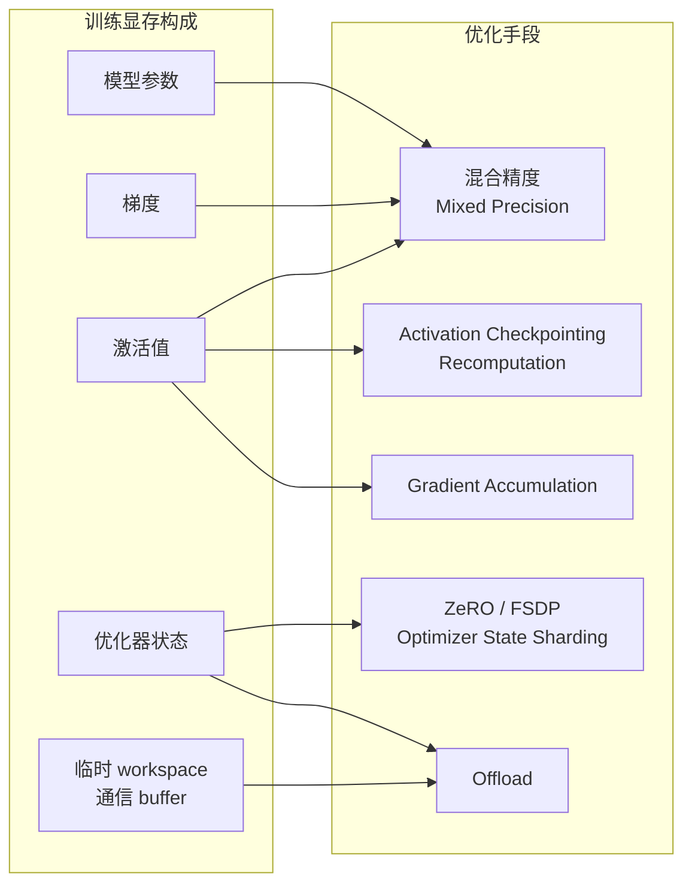
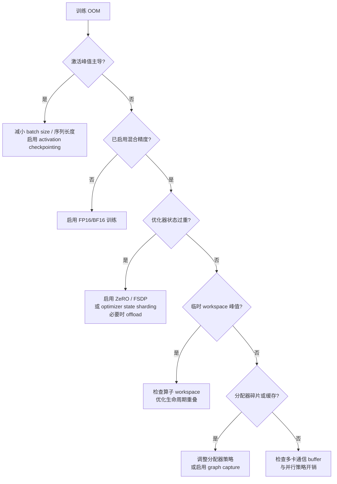

训练显存优化不是一堆零散技巧的堆砌，而是一项针对显存账单的系统工程。在理解了训练显存由参数、梯度、优化器状态、激活值与临时 workspace 共同叠加而成的前提下（详见[训练场景GPU内存构成分析](13-xun-lian-chang-jing-gpunei-cun-gou-cheng-fen-xi)），每一种优化方法都可以被精确归类到它作用的对象上，并清晰评估其交换代价。本文将围绕混合精度、activation checkpointing、gradient accumulation、ZeRO / FSDP 与 offload 五大核心手段，建立从"显存构成"到"工程决策"的完整映射，并提供一套可落地的训练 OOM 排查顺序。

---

## 核心框架：优化方法的四类作用对象

训练显存优化本质上只动了四类东西：**参数相关成本**、**梯度与优化器状态成本**、**激活值成本**、**峰值与临时额外成本**。任何听上去高深的技术名词，只要把它放回这个框架，立刻就能知道它究竟在解决什么问题、省的是哪一块显存。

下图展示了训练显存的五大构成与对应优化手段之间的映射关系：

混合精度同时压缩参数、梯度与激活的位宽；activation checkpointing 与 recomputation 直指激活值这一最容易爆炸的部分；gradient accumulation 通过拆分 micro-batch 降低单步激活峰值；ZeRO 与 FSDP 拆除多卡之间的训练状态冗余；offload 则将部分状态迁移到更慢但更充裕的存储层级。这个分类框架是后续所有工程决策的锚点。

Sources: [gpu_memory_management_tutorial.md](gpu_memory_management_tutorial.md#L5627-L5711)

---

## 混合精度训练：容量与带宽的双重收益

混合精度训练的核心并非"无脑把所有张量砍成 FP16"，而是在保证数值稳定性的前提下，让前向与反向中的大量计算和存储使用更低字节宽度的格式（如 FP16、BF16），同时保留关键部分（如优化器主权重、loss scaling 相关统计）以更高精度维护。这种策略最直接的效果是将参数、梯度与激活的字节数接近减半。例如，附录中的典型场景对照表显示，在 FP16/BF16 配合 Adam 优化器的配置下，模型参数与梯度的显存成本均为 `2 × params` 字节，而 FP32 下则为 `4 × params` 字节。

更重要的是，混合精度不只是容量优化。数据位宽减半意味着显存带宽压力下降、cache 与寄存器在承载同样元素数时效率更高，且分布式训练中的参数同步通信量也随之降低。因此，它往往同时改善容量、带宽与吞吐，是训练显存优化中性价比最高、最优先尝试的手段之一。当然，这种收益并非没有代价：FP16 的数值动态范围较窄，可能出现溢出或下溢，需要引入 loss scaling 等稳定策略；BF16 虽然动态范围与 FP32 相同，但在某些硬件上的支持程度与计算效率仍需评估。调试复杂度会因此略微上升，但相比其收益，这通常是可接受的工程代价。

Sources: [gpu_memory_management_tutorial.md](gpu_memory_management_tutorial.md#L5714-L5763)

| 组件 | FP32 显存成本 | FP16/BF16 + Adam 显存成本 | 备注 |
|---|---|---|---|
| 模型参数 | 4× params | 2× params | — |
| 梯度 | 4× params | 2× params | — |
| 优化器状态 | 8× params | 12× params | Adam 的 m/v 状态 |
| 激活值 | 可变 | 可变 | 与模型结构、序列长度相关 |
| 峰值临时块 | 可变 | 可变 | workspace、临时 buffer |
| 框架开销 | 1–2 GB | 1–2 GB | 缓存、调度等 |

Sources: [gpu_memory_management_tutorial.md](gpu_memory_management_tutorial.md#L8359-L8371)

---

## Activation Checkpointing：用计算换取激活显存

Activation checkpointing 的核心思想是**少存多算**：前向传播时不保存所有中间激活，仅在少数关键位置保留"检查点"；反向传播需要中间结果时，再从前向检查点重新计算。这种方法主要削减的是激活值显存，而对参数、梯度、优化器状态没有直接影响。

对于深层网络、大 batch size 或长序列任务，激活值常常是训练峰值显存的最大贡献者。Checkpointing 的有效性建立在 GPU 计算能力相对充裕、而显存容量成为硬瓶颈的前提下——重复执行一部分前向计算，往往比永久保存海量中间张量更"便宜"。这种"计算换内存"的折中思维是 GPU 工程中的常见原则，但在以 CPU 为中心的经验中并不总是直觉。

Recomputation 是比 checkpointing 更广义的概念。它不仅适用于标准的分段 checkpoint 策略，还可以体现在特定模块的局部重算、attention 中间量的按需重建，或编译器自动执行的内存-计算权衡中。判断一个优化方法是否属于 recomputation 范畴，只需问一句：它是否在"少存多算"？

Sources: [gpu_memory_management_tutorial.md](gpu_memory_management_tutorial.md#L5765-L5832)

---

## Gradient Accumulation：控制单步激活峰值

Gradient accumulation 并不减少参数、梯度或优化器状态的总规模，而是通过将逻辑上的大 batch 拆分为多个更小的 micro-batch，在每次 forward/backward 后先累积梯度、暂不更新参数，待达到目标步数后再执行一次 optimizer step。这种策略的核心价值在于**用更多步数换取更小的单步显存峰值**，因为激活值的大小通常与 micro-batch size 成正比。

工程实践中，很多训练任务真正卡住的不是"总 batch 太大"，而是"单步 micro-batch 放不下"。Gradient accumulation 使得在显存受限的设备上接近实现大 batch 训练效果成为可能。其代价包括训练节奏变化、优化超参可能需要重新调整，以及墙钟时间效率不一定提升。

Sources: [gpu_memory_management_tutorial.md](gpu_memory_management_tutorial.md#L5835-L5880)

---

## ZeRO 与 FSDP：拆除多卡冗余

在传统的数据并行训练中，每张 GPU 通常都持有完整的模型参数、梯度与优化器状态副本。这种冗余复制对于大模型训练极其不经济：以 Adam 优化器为例，优化器状态本身的显存开销可能达到参数规模的数倍，若每张卡都全量持有，单卡压力会迅速撞墙。

ZeRO（Zero Redundancy Optimizer）的直觉是**把"每卡都全存"改成"多卡协同分摊"**。它按阶段逐步覆盖优化器状态、梯度与参数本身，使单卡显存成本从"持有全量状态"降级为"持有分片状态"。FSDP（Fully Sharded Data Parallel）则可以视为一种更系统化的全分片数据并行思路，重点在于参数本身也不总是完整常驻于每张卡，而是在特定计算阶段按需聚合、计算后再释放或重新分散。

一个 175B 参数的模型用 FP16 精度时，纯数据并行下每卡参数即需 350GB，远超单卡容量；即便配合 Tensor Parallel，在 8 卡 A100 80GB 集群上仍需结合 ZeRO 或更细切分才能将每卡显存压入安全区间。这充分说明，大模型训练中的 ZeRO / FSDP 不是可选优化，而是必需的基础设施。

Sources: [gpu_memory_management_tutorial.md](gpu_memory_management_tutorial.md#L5883-L5993), [gpu_memory_management_tutorial.md](gpu_memory_management_tutorial.md#L7333-L7356)

---

## Offload：以慢存储换取 GPU 显存空间

Offload 的核心是将不一定要时刻驻留在 GPU 上的状态（典型如优化器状态、部分参数或梯度）临时迁移到 CPU 内存甚至 NVMe 存储，需要时再搬回 GPU。这种方法的直接代价是传输成本上升与延迟增加，因此更依赖流水线设计与计算-传输重叠来掩盖开销。

 offload 适合的场景非常明确：模型太大、单靠 GPU 显存放不下，且首要目标是"能训练起来"而非追求极致吞吐。它通常与 ZeRO / FSDP 配合使用，作为显存压力的最后一道防线。

Sources: [gpu_memory_management_tutorial.md](gpu_memory_management_tutorial.md#L5995-L6036)

---

## 统一视角：优化方法的交换矩阵

所有训练显存优化方法本质上都是一种交换。将常见手段汇总为一张交换矩阵，可以帮助你在面对具体瓶颈时快速定位最合适的策略，而不是被术语牵着走。

| 方法 | 主要节省 | 主要代价 | 适用瓶颈 |
|---|---|---|---|
| Mixed Precision | 参数、梯度、激活、带宽 | 数值稳定性管理 | 通用，优先尝试 |
| Activation Checkpointing | 激活值 | 额外前向计算 | 深层网络、大 batch、长序列 |
| Gradient Accumulation | 单步激活峰值 | 更多步数、吞吐变化 | batch size 导致的峰值 OOM |
| Optimizer State Sharding | 优化器状态 | 通信复杂度 | Adam 状态超重 |
| ZeRO / FSDP | 参数、梯度、状态冗余 | 通信与实现复杂度 | 大模型多卡训练必做 |
| Offload | GPU 显存 | 传输延迟、吞吐下降 | 模型超单卡容量 |
| Graph Capture / 静态规划 | 分配开销与峰值 | 图形态约束 | 动态图导致的碎片与峰值 |

记住这张表的工程含义是：当你遇到 OOM 时，先判断是哪一类显存在主导峰值，再从对应列中选择代价可接受的方法。

Sources: [gpu_memory_management_tutorial.md](gpu_memory_management_tutorial.md#L6116-L6130)

---

## 训练 OOM 排查：六步决策流

当训练任务触发 OOM 时，按以下顺序排查可以避免盲目调参。这个流程的设计逻辑与显存构成的优先级一致：先处理最容易膨胀且优化收益最高的部分，再逐步深入基础设施层。

第一步检查激活峰值，因为 batch size 与序列长度是最常见的显存放大器，且 checkpointing 的介入成本相对可控。第二步确认混合精度是否启用，这是性价比最高的全局优化。第三步审视优化器状态，大模型训练中 Adam 的 m/v 状态往往比参数本身更重，ZeRO / FSDP 在此阶段成为关键。第四步排查临时 workspace 峰值，某些算子（如大矩阵乘法或 attention）会在特定步骤产生巨大临时 buffer。第五步关注分配器碎片与缓存策略，因为"显存统计还有余量但大分配失败"是典型的碎片症状。最后一步才深入到多卡通信 buffer 与并行策略，避免过早怀疑基础设施而忽略更明显的模型层优化空间。

Sources: [gpu_memory_management_tutorial.md](gpu_memory_management_tutorial.md#L6075-L6113)

---

## 本章小结与下一步

训练显存优化的核心认知可以归纳为十条：第一，必须按作用对象分类——参数、梯度、优化器状态、激活、峰值临时块；第二，mixed precision 往往是最高优先级的优化，因为它同时影响容量与带宽；第三，activation checkpointing 的本质是用额外计算换更少激活显存；第四，recomputation 是更广义的"少存多算"思路；第五，gradient accumulation 主要降低单步激活峰值，而非消灭常驻成本；第六，ZeRO、FSDP 与 optimizer state sharding 的本质是把训练状态从"每卡全持有"改为"多卡分摊持有"；第七，offload 是用更慢层级存储换 GPU 显存空间；第八，graph capture 与静态内存规划有助于减少动态分配与峰值；第九，OOM 排查通常遵循"激活→精度→优化器状态→workspace→碎片→并行策略"的顺序；第十，每种方法本质上都是交换，不存在免费午餐。

如果你已经完成本章阅读，建议按照以下路径继续深入：若需要理解训练显存的原始构成与计算方式，回阅[训练场景GPU内存构成分析](13-xun-lian-chang-jing-gpunei-cun-gou-cheng-fen-xi)；若关注多卡环境下的通信与并行策略细节，继续阅读[多GPU、多进程与多租户环境](19-duo-gpu-duo-jin-cheng-yu-duo-zu-hu-huan-jing)；若希望将优化手段落地为可检查的实战清单，跳转至[实战优化清单](22-shi-zhan-you-hua-qing-dan)。